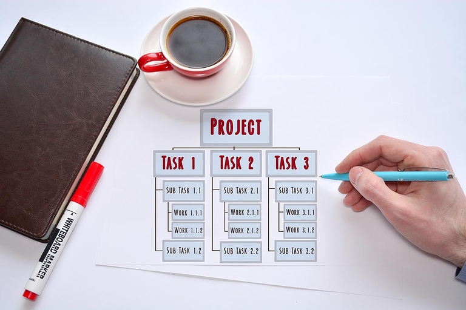
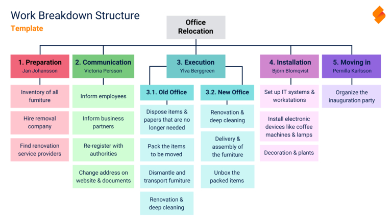

## L'organigramme de projet : Aborder les projets de manière structurée

Pour diviser un projet, au départ abstrait, en éléments planifiables, vous pouvez diviser votre démarche en **tâches partielles** et **paquets de travail** à l'aide d'un organigramme de projet. Dans cet article, vous découvrirez les avantages de la planification de la structure de projet avec un modèle. Utilisez nos conseils pour créer gratuitement un modèle d'organigramme technique de projet et trouvez le logiciel d'organigramme technique de projet adapté à votre entreprise !

## Qu'est-ce qu'un organigramme technique de projet (OTP) ?

Commençons par une **définition de l'organigramme de projet** : Un organigramme technique de projet, ou OTP, est un élément clé de la planification de projet et illustre les sous-projets, les interdépendances et les relations au sein de votre projet. L'élaboration d'un organigramme de projet se fait au début d'un projet et donne une vue d'ensemble à tous les participants. Voici comment structurer votre projet avec succès !

### Quels sont les différents types de représentation ?

Un exemple classique d'organigramme de projet est un **diagramme en arbre**. Il est également possible de le représenter sous forme de carte mentale, de liste ou de texte courant en retrait.

Dans toutes les formes de planification de la structure de projet selon un modèle, on procède à un **codage des éléments**. Cette étape tient compte de l'objectif selon lequel chaque tâche ne doit apparaître qu'une seule fois dans l'organigramme technique de projet. Un exemple de codage est un nombre pour le niveau, suivi de la numérotation séquentielle pour les éléments dépendant du niveau (par exemple 3.1 pour le premier élément du troisième niveau).

### Comment le plan de structure de projet est-il structuré ?

Dans une structure arborescente, vous commencez par l'**objectif supérieur du projet** comme nœud principal. A chaque niveau suivant suit une structure selon différentes fonctions, phases ou objets. Pour chaque niveau, vous devez choisir un principe de structuration.

- **Organigramme technique de projet orienté vers les fonctions** : Ce type de structure met l'accent sur les personnes ou les services responsables des tâches. Les organigrammes fonctionnels de deuxième niveau conviennent parfaitement si vous souhaitez que les responsables fassent régulièrement le point sur l'état d'avancement du projet au cours de celui-ci.
- **Arborescence de projet orientée sur les phases** : Placez toutes les tâches dans un ordre chronologique logique en les regroupant par phase du projet. Cela est particulièrement utile pour les projets de très longue durée. Dans ce cas, les éléments du deuxième niveau doivent marquer les étapes importantes de votre projet.
- **Organigramme de projet orienté objet** : Dans ce cas, vous classez les tâches en fonction des différentes parties du produit final ou des lieux où les activités ont lieu. Pour les projets de construction, par exemple, il peut être judicieux de diviser un organigramme technique de projet orienté objet en fonction des pièces, des groupes de construction ou des corps de métier (par exemple, gros œuvre, conduites, salles de bains, toit).

Au niveau le plus bas, on trouve ensuite les **paquets de travail** respectifs, y compris les ressources nécessaires telles que le budget, le temps et la main-d'œuvre. Plus vous serez détaillé, plus il sera facile d'estimer les dépenses. Si un paquet de travail est formulé de manière trop vague, il vaut la peine de le diviser davantage. Un lot de travaux devrait toujours dépendre d'une tâche partielle du deuxième niveau. Selon la complexité, d'autres niveaux peuvent être envisagés entre le deuxième et le troisième niveau.

## Pourquoi est-il utile d'établir un organigramme technique de projet ?

Un organigramme technique de projet peut servir de modèle pour tous les autres plans de votre projet. Si vous le souhaitez, il constitue le fondement de votre planification des ressources, des coûts et des délais ainsi que de la gestion des risques. C'est pourquoi ce plan de projet est souvent appelé "plan des plans".

### Quels sont les avantages d'un modèle d'OTP ?

L'organigramme technique de projet visualise l'ensemble d'un projet et peut ainsi vous donner un aperçu de base de toutes les tâches à effectuer. Il vous facilite l'estimation des efforts et la planification ultérieure du projet, car vous définissez dès le départ les tâches de manière claire et complète. Il est ainsi moins probable que vous vous trompiez complètement dans vos calculs et que vous preniez du retard. Au cours du projet, vous pouvez cocher les tâches accomplies et bien documenter les progrès.

## Comment créer un organigramme de projet en 6 étapes

Il s'agit maintenant de passer à la mise en œuvre concrète. Pour ce faire, nous prenons l'exemple d'un déménagement de bureau afin de créer un modèle d'organigramme de projet et de démontrer les avantages d'un modèle de structure de projet.

### 1\. Définir le(s) objectif(s) du projet

Lors d'un atelier de lancement avec toutes les personnes impliquées dans le projet, vous définissez les objectifs du projet selon les critères **SMART** (spécifiques, mesurables, attrayants, réalistes, datés). Soit il existe un objectif unique pour l'ensemble du projet, soit celui-ci doit être divisé en sous-projets. Dans notre cas, l'objectif global est de déménager de l'ancien bureau vers un nouveau dans les délais impartis.

### 2\. Définir les tâches partielles

Réfléchissez ensuite à la manière dont vous souhaitez atteindre votre objectif et aux tâches partielles nécessaires pour y parvenir. Une possibilité est de classer ce niveau par phases. Les phases typiques d'un projet sont par exemple la préparation, la planification, la réalisation, le contrôle, l'évaluation et la clôture. Vous trouverez plus d'informations sur la structure de l'OTP ci-dessus.

### 3\. Ficeler des paquets de travail

L'étape suivante consiste à définir les lots de travaux pour chacun de ces points de l'organigramme technique de projet. Par exemple, listez toutes les tâches et regroupez-les par thèmes.

### 4\. Affecter les paquets aux tâches partielles

Ensuite, vous affectez les paquets aux tâches partielles correspondantes (ici : phases de projet). A ce stade, vous avez également la possibilité de saisir les responsables des tâches. Vous ne définissez les dates de début et les délais que si vous ne choisissez pas un autre plan de projet pour la planification temporelle du projet en plus de l'OTP.

### 5\. Révision et adaptation

Lors de la première étape, vérifiez que votre modèle d'organigramme de projet est **complet**. Toutes les tâches dont vous avez besoin pour atteindre vos objectifs sont-elles répertoriées ? En règle générale, vous reconnaissez jusqu'à 90% de tous les lots de travaux dès la première ébauche de l'organigramme de projet. Relisez votre modèle d'organigramme de projet PSP avec toutes les personnes concernées.

Pour couvrir les éventuels aspects manquants du modèle d'organigramme technique de projet, vous pouvez ajouter d'autres points à l'OTP. Par la suite, il s'agit toutefois en priorité de vérifier **l'unicité de tous les éléments** : Toutes les tâches d'un même niveau sont-elles uniques et se distinguent-elles les unes des autres par leur contenu ? Ou bien pouvez-vous regrouper certains lots de travaux et supprimer les doublons ?

### 6\. Planification détaillée des lots de travaux

Pour finir, commencez la planification détaillée des lots de travaux. Vous définissez ici les tâches concrètes à effectuer. Tous les processus sont-ils cohérents et les lots de travaux sont-ils placés au bon endroit dans l'OTP ? L'objectif du projet est-il atteint dès que toutes les tâches définies ont été réalisées ? Si oui, votre organigramme technique de projet est prêt à être utilisé.

## Modèles et outils d'organigramme technique de projet

Bien sûr, vous pouvez créer un organigramme de projet sans modèles ni outils numériques. Au bureau, utilisez simplement des **cartes** et du ruban adhésif et collez les éléments au mur pendant une réunion. Cela fonctionne également avec un tableau noir et des aimants.

Ces méthodes sont toutefois liées à l'emplacement et très compliquées si le plan est ensuite nécessaire de manière décentralisée. Même si vous prenez des photos de votre travail, le plan de structure de projet est immuable pour les autres participants : pour plus de flexibilité, vous devriez créer le plan de structure de projet en ligne. C'est là que divers programmes et logiciels d'organigramme technique de projet entrent en jeu.

## Avec quel logiciel pouvez-vous créer un organigramme technique de projet ?

Ce n'est pas une bonne idée de vouloir créer un organigramme technique de projet avec **Excel**. Même si vous êtes familier avec le tableur Excel, il ne convient guère à la gestion de projet agile. Il en va de même si vous envisagez d'utiliser un modèle d'organigramme de projet de **Word**. Par rapport à d'autres programmes, les applications Microsoft Office bien connues sont uniquement conçues pour la saisie de texte et le calcul sur tableur - et non pour le travail de projet commun en temps réel, la visualisation de différents types de données ou l'adaptation et la structuration flexibles de projets.

Rendez-vous donc service et utilisez un logiciel adapté pour votre organigramme de projet. Selon le mode de représentation souhaité, vous pouvez choisir entre des outils de diagramme, de mindmapping ou de liste. Deux outils de diagramme connus, qui conviennent également à la création d'un organigramme de projet, sont **Gliffy** et **Lucidchart**. Ils permettent de représenter l'organigramme de projet sous forme d'un diagramme en arbre classique, par exemple.

S'il s'agit d'une carte mentale, **Miro** est le principal fournisseur. Mais il existe aussi une douzaine d'autres outils, comme **MindManager**, qui vous permettront d'obtenir des résultats comparables.

Si vous avez besoin d'une liste de tâches facile à traiter et plus structurée qu'une carte mentale, [SeaTable]() est fait pour vous. Cette plate-forme de gestion de projet et de collaboration vous permet d'attribuer facilement les lots de travaux aux responsables et aux sous-projets.

## Avantages du modèle d'organigramme de projet de SeaTable

SeaTable est une base de données **non-code** qui offre un **App-Builder** intégré et de nombreuses fonctions pour la collaboration en équipe. Grâce à de nombreux types de colonnes, vous pouvez en outre saisir des rendez-vous, des heures de travail, des lieux, des tâches à effectuer, des adresses e-mail, des fichiers et bien plus encore.

Un organigramme technique de projet est complexe, car il doit tout représenter en un coup d'œil. Grâce aux vues personnelles, vous pouvez définir des **filtres** pour masquer certains ensembles de tâches ou niveaux. Supposons que vous souhaitiez voir dans l'OTP une **liste de choses à faire** individuelle par collaborateur. Pas de problème : pour cela, il suffit de filtrer par responsable.

Tout est au même endroit et tout le monde est au même niveau : dans SeaTable, il n'y a pas de versions différentes de l'organigramme technique de projet, car les fichiers ne sont pas dispersés sur les ordinateurs des participants. Au lieu de cela, les participants au projet peuvent accéder de manière centralisée à l'organigramme technique de projet actuel et effectuer des modifications **en temps réel** qui sont immédiatement visibles pour tous. Les **commentaires** et les **notifications automatiques** sont également utiles pour le travail en commun sur les tâches. Ils permettent d'informer tous les participants dès que quelque chose est marqué comme terminé, commenté ou modifié.



Le plus grand avantage de SeaTable réside toutefois dans ses nombreuses possibilités de visualisation. Qu'il s'agisse de **calendriers**, de **timelines**, de **tableaux Kanban** ou de **organigrammes**, il y a tout ce que l'on peut désirer, et même plus : sur le **tableau blanc** séparé, vous pouvez esquisser librement votre organigramme de projet et créer des mindmaps similaires à celles de Miro. Vous pouvez également utiliser le tout nouveau **plugin Tree** pour afficher ou masquer à votre guise les différents niveaux de votre organigramme de projet.

Vous trouverez le modèle d'organigramme technique de projet [ici](https://seatable.io/vorlage/ijkegrn3q-ym8arpcq8qia/). Avant de pouvoir l'utiliser, vous devez vous inscrire gratuitement avec votre adresse e-mail.

## Créez maintenant votre organigramme technique de projet

Le concept autour de l'organigramme technique de projet semble simple - mais selon la taille de votre projet, il peut vite devenir complexe et difficile à gérer. Un modèle d'organigramme de projet dans un outil adapté vous aidera à mettre en œuvre votre projet de la manière la plus efficace et la plus fluide possible.

[Enregistrez-vous dès aujourd'hui](), lancez votre prochain projet et faites-le aboutir grâce au modèle de planification de structure de projet gratuit de SeaTable.

Vous avez encore besoin d'un plan de projet qui illustre la chronologie des phases ou des tâches du projet ? Alors découvrez ici [comment créer un plan de projet classique](https://seatable.io/vorlage/yio4sr0wrcwuv3-1m0zvkg/).
