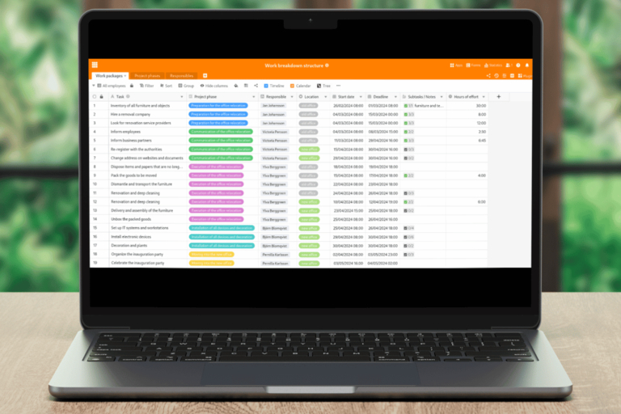

## Структура разбивки работ: Структурированный подход к проектам

Чтобы разбить изначально абстрактный проект на планируемые элементы, вы можете использовать структуру разбивки работ, которая разделит ваш подход на **задачи** и **рабочие пакеты**. В этой статье вы узнаете о преимуществах планирования структуры разбивки работ с помощью шаблона. Воспользуйтесь нашими советами, чтобы создать шаблон структуры разбивки работ бесплатно, и найдите подходящее программное обеспечение для структуры разбивки работ для вашей компании!

## Что такое структура разбивки работ (WBS)?

Давайте начнем с определения **структуры разбивки работ**: Структура разбивки работ, или сокращенно WBS, является основным элементом планирования проекта и иллюстрирует подпроекты, зависимости и взаимосвязи в рамках вашего проекта. Структура разбивки работ создается в начале проекта и дает всем участникам общее представление о нем. Как успешно структурировать проект!

### Какие существуют типы презентаций?

Классическим примером структуры разбивки работ является **деревянная диаграмма**. Она также может быть представлена в виде карты ума, списка или непрерывного текста с отступами.

Во всех формах планирования структуры проекта, основанных на шаблоне, элементы **кодируются**. Этот шаг учитывает, что каждая задача должна встречаться в структуре разбивки работ только один раз. Примером кодирования является номер уровня, за которым следует последовательная нумерация элементов, зависящих от уровня (например, 3.1 для первого элемента третьего уровня).

### Как устроена структура разбивки работ?

В древовидной структуре вы начинаете с **главной цели проекта** в качестве основного узла. Каждый последующий уровень организуется в соответствии с различными функциями, фазами или объектами. Вы должны выбрать принцип структурирования для каждого уровня.

- **Функционально-ориентированная структура разбивки работ**: В этом типе конспекта основное внимание уделяется людям или отделам, ответственным за выполнение задач. Функционально-ориентированные наброски второго уровня идеальны, если вы хотите, чтобы ответственные лица регулярно отчитывались о текущем состоянии дел по мере реализации проекта.
- **Фазово-ориентированная структура разбивки работ**: Расположите все задачи в логическом хронологическом порядке, сгруппировав их по фазам проекта. Это особенно полезно для очень длительных проектов. В этом случае элементы на втором уровне должны отмечать важные вехи проекта.
- **Объектно-ориентированная структура разбивки работ**: Здесь вы распределяете задачи по отдельным частям конечного продукта или по месту выполнения работ. Например, в строительных проектах имеет смысл разделить структуру разбивки работ на помещения, узлы или профессии (например, строительство оболочки, труб, ванных комнат, крыши) в объектно-ориентированном виде.

Далее на самом нижнем уровне следуют соответствующие **рабочие пакеты**, включая необходимые ресурсы, такие как бюджет, время и рабочая сила. Чем подробнее вы изложите все детали, тем легче будет оценить объем работ. Если пакет работ сформулирован слишком расплывчато, стоит разбить его на части. Рабочий пакет всегда должен зависеть от подзадачи второго уровня. В зависимости от сложности между вторым и третьим уровнями могут быть и другие уровни.

## Почему полезно создавать структуру разбивки работ?

Структура разбивки работ подходит в качестве шаблона для всех остальных планов вашего проекта. При желании она может стать основой для планирования ресурсов, затрат и сроков, а также для управления рисками. Вот почему этот план проекта часто называют "планом планов".

### Каковы преимущества шаблона WBS?

Структура разбивки работ визуализирует весь проект и, таким образом, дает вам базовый обзор всех предстоящих задач. С ее помощью вам будет проще оценить объем работы и спланировать оставшуюся часть проекта, поскольку вы с самого начала четко и полно определяете задачи. Это также снижает вероятность того, что вы полностью ошибетесь в расчетах и отстанете от графика. По мере выполнения проекта вы сможете отмечать выполненные задачи и документировать свой прогресс.

## Как создать структуру разбивки работ за 6 шагов

Теперь настало время для фактической реализации. На примере офисного переезда мы создадим шаблон структуры разбивки работ и продемонстрируем преимущества шаблона структуры разбивки работ.

### 1\. Определите цель(и) проекта

На стартовом семинаре со всеми участниками проекта вы определяете цели проекта в соответствии с критериями **SMART** (конкретные, измеримые, привлекательные, реалистичные, ограниченные по времени). Либо ставится единая цель для всего проекта, либо она должна быть разбита на подпроекты. В нашем случае главная цель - своевременный переезд из предыдущего офиса в новый.

.

### 2\. Определите подзадачи

Далее подумайте, как вы хотите достичь своей цели и какие подзадачи для этого необходимы. Один из вариантов - организовать этот уровень по фазам. Типичными фазами проекта являются, например, подготовка, планирование, реализация, мониторинг, оценка и завершение. Более подробную информацию о структуре WBS вы можете найти выше.

### 3\. Составление пакетов работ

На следующем этапе вы определяете пакеты работ для каждой из этих точек в структуре разбивки работ. Например, перечислите все задачи и сгруппируйте их по предметным областям.

### 4\. Назначьте пакеты подзадач

Далее назначьте пакеты соответствующим подзадачам (здесь: фазам проекта). На этом этапе у вас также есть возможность ввести ответственных за выполнение задач. Вы определяете даты начала и сроки только в том случае, если не выбрали для расписания проекта другой план проекта, помимо WBS.

### 5\. Обзор и корректировка

На первом этапе проверьте шаблон структуры разбивки работ на **полноту**. Включили ли вы в него все задачи, необходимые для достижения поставленных целей? Как правило, в первом варианте структуры разбивки работ можно распознать до 90 процентов всех рабочих пакетов. Повторно проанализируйте шаблон структуры разбивки работ PSP со всеми участниками процесса.

Чтобы покрыть все недостающие аспекты в шаблоне структуры разбивки работ, вы можете включить в WBS дополнительные пункты. Однако в дальнейшем речь идет прежде всего о проверке **уникальности всех элементов**: Все ли задачи на одном уровне уникальны и отличаются друг от друга по содержанию? Или вы можете объединить некоторые рабочие пакеты и исключить дублирование?

### 6\. Детальное планирование рабочих пакетов

Наконец, вы приступаете к детальному планированию рабочих пакетов. Здесь вы определяете конкретные задачи. Все ли процессы согласованы, и находятся ли рабочие пакеты в правильном месте в WBS? Достигнута ли цель проекта после завершения всех определенных задач? Если да, то ваша структура разбивки работ готова к использованию.

## Шаблоны и инструменты для создания структуры разбивки работ

Конечно, вы можете создать структуру разбивки работ без каких-либо цифровых шаблонов или инструментов. В офисе просто используйте **индексные карточки** и малярный скотч и наклейте элементы на стену во время совещания. Это также работает с доской и магнитами.

Однако эти методы привязаны к месту и очень громоздки, если план впоследствии понадобится децентрализованно. Даже если вы сфотографируете свою работу, структура разбивки работ останется неизменной для других участников: Для большей гибкости следует создавать структуру разбивки работ онлайн. Здесь на помощь приходят различные программы и программное обеспечение для создания структуры разбивки работ.

## Какое программное обеспечение можно использовать для создания структуры разбивки на части

Не стоит пытаться создать структуру разбивки работ с помощью **Excel**. Даже если вы знакомы с таблицей Excel, она вряд ли подойдет для управления agile-проектами. То же самое касается и шаблона структуры разбивки работ из **Word**. По сравнению с другими программами, известные приложения Microsoft Office предназначены только для чистого ввода текста и работы с электронными таблицами - но не для совместной работы над проектами в режиме реального времени, визуализации различных типов данных или гибкой адаптации и структурирования проектов.

Поэтому сделайте себе одолжение и используйте подходящее программное обеспечение для создания структуры разбиения работ. В зависимости от того, какой тип презентации вам нужен, вы можете выбрать инструменты для создания диаграмм, карт ума или списков. Два известных инструмента для создания диаграмм, которые также подходят для создания структуры разбивки работ, - это **Gliffy** и **Lucidchart**. С их помощью вы можете отобразить структуру разбивки работ, например, в виде классической древовидной диаграммы.

Если вам нужна карта ума, то ведущим поставщиком является **Miro**. Однако есть и десяток других инструментов, например **MindManager**, с помощью которых можно добиться сопоставимых результатов.

Если вам нужен удобный для работы список задач и более структурированный, чем карта ума, то [SeaTable]() - это то, что вам нужно. С помощью этой платформы для управления проектами и совместной работы вы можете легко распределять рабочие пакеты по ответственным лицам и подпроектам.

## Преимущества шаблона структуры разбивки работ от SeaTable

SeaTable - это **бескодовая база данных**, которая предлагает интегрированный **конструктор приложений** и множество функций для совместной работы команды. Благодаря многочисленным типам столбцов вы можете записывать встречи, рабочие часы, местоположение, задачи, адреса электронной почты, файлы и многое другое.

Структура разбивки работ сложна тем, что в ней все должно быть видно с первого взгляда. С помощью персональных представлений вы можете установить **фильтры**, чтобы скрыть определенные пакеты задач или уровни. Допустим, вы хотите видеть индивидуальный **список дел** для каждого сотрудника в WBS. Нет проблем: просто отфильтруйте его по ответственному лицу.

Все в одном месте и все на одной странице: В SeaTable нет разных версий структуры разбиения работ, поскольку файлы не разбросаны по компьютерам участников проекта. Вместо этого участники проекта могут централизованно получать доступ к текущей структуре разбивки работ и вносить изменения **в режиме реального времени**, которые сразу же становятся видны всем. Для совместной работы над задачами также полезны **комментарии** и автоматические **уведомления**, которые можно использовать для оповещения всех участников, как только что-то будет отмечено как завершенное, прокомментировано или изменено.



Однако самым большим преимуществом SeaTable является широкий спектр возможностей визуализации. Будь то **календари**, **временные рамки**, **доски Канбан** или **организационные диаграммы** - здесь есть все, что душа пожелает, и даже больше: На отдельной **белой доске** вы можете свободно набросать структуру разбивки работ и создать карты ума, подобные тем, что есть в Miro. Или вы можете использовать новый плагин **Tree**, чтобы показывать и скрывать различные уровни вашей структуры разбивки работ по своему усмотрению.

Шаблон структуры разбивки работ можно найти [здесь] (https://seatable.io/ru/vorlage/ijkegrn3q-ym8arpcq8qia/). Прежде чем использовать его, вам необходимо бесплатно зарегистрироваться, указав свой адрес электронной почты.

## Создайте свою структуру разбивки работ прямо сейчас

Концепция структуры разбивки работ звучит просто, но в зависимости от масштаба вашего проекта она может быстро стать сложной и запутанной. Шаблон структуры разбивки работ в подходящем инструменте поможет вам реализовать проект максимально эффективно и гладко.

[Зарегистрируйтесь сегодня](), начните свой следующий проект и сделайте его успешным с помощью бесплатного шаблона структуры разбивки работ от SeaTable.

Вам все еще нужен план проекта, который показывает хронологическую последовательность этапов или задач проекта? Тогда узнайте здесь [как создать классический план проекта](https://seatable.io/ru/vorlage/yio4sr0wrcwuv3-1m0zvkg/).
