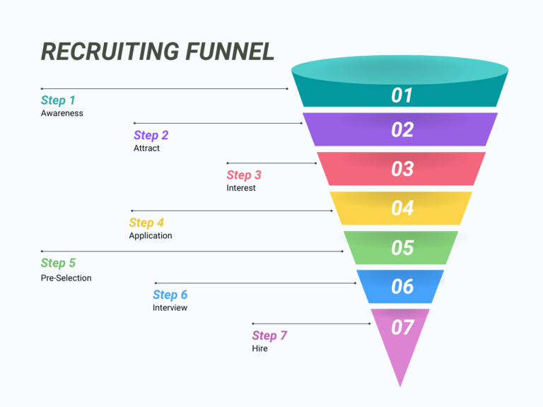
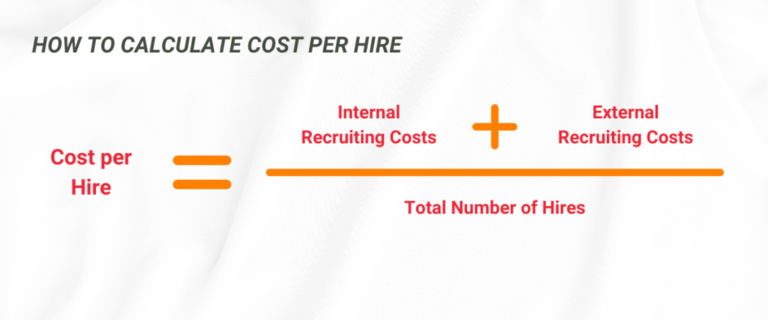

## Comment atteindre les meilleurs talents en ligne

Le recrutement n'est plus depuis longtemps un processus unilatéral dans lequel les entreprises dictent les règles. Les rapports de force sur le marché du travail ont évolué - et de manière significative. Selon une étude récente de [l'institut d'études de marché Bilendi](https://www.bilendi.de/), une personne sur deux est convaincue de pouvoir choisir son emploi. Les spécialistes se font de plus en plus rares, tandis que les départements des ressources humaines tentent désespérément de pourvoir les postes vacants. L'époque où les candidats devaient se battre pour obtenir un emploi est révolue dans de nombreux secteurs.

Aujourd'hui, les travailleurs sont souvent assis sur le plus long levier : ils posent des exigences, attendent des conditions de travail attrayantes et choisissent les employeurs qui correspondent le mieux à leurs attentes. Pour les recruteurs, cela signifie qu'ils doivent être intelligents et actifs lors du recrutement afin de ne pas perdre la course aux meilleurs talents. Mais ne vous inquiétez pas - dans cet article, vous apprendrez ce qui est important dans le recrutement, pourquoi le recrutement social est prometteur et quels outils peuvent vous aider de manière optimale dans la [gestion des candidats](https://seatable.com/tag/bewerber-talentmanagement/).

## Recrutement interne ou externe ?

Le recrutement englobe bien plus que la publication d'annonces d'emploi. Il existe de nombreuses approches pour attirer du personnel dans votre entreprise. On distingue principalement le recrutement interne et le recrutement externe, qui présentent chacun des méthodes spécifiques ainsi que des avantages et des inconvénients.

### Recrutement interne

Le recrutement interne consiste à recruter du nouveau personnel dans les rangs de l'entreprise. Les postes vacants sont par exemple publiés sur l'**intranet** de l'entreprise ou dans des **newsletters** régulières, de sorte que les collaborateurs existants puissent postuler aux postes vacants. Les **recommandations des collaborateurs** jouent également un rôle : les collaborateurs proposent des personnes adéquates de leur propre réseau, ce qui permet souvent de pourvoir un poste plus rapidement et de manière plus appropriée. Une autre stratégie de recrutement interne consiste à préparer son propre personnel à de nouveaux postes par **un développement et une promotion ciblés**.

Le recrutement interne présente l'avantage que les collaborateurs **sont déjà familiarisés avec les processus et les structures de votre entreprise**, ce qui permet à la fois une transition en douceur et une **période d'adaptation plus courte**. Cela permet non seulement de gagner du temps, mais aussi de réduire les dépenses liées à l'initiation. De plus, vos collaborateurs se sentent valorisés si vous leur offrez des possibilités de développement interne. Toutefois, le recrutement interne comporte également des défis. Les impulsions fraîches de l'extérieur font défaut, ce qui peut entraîner une stagnation de la culture d'entreprise. En outre, une sorte d'"aveuglement de l'entreprise" peut se produire, car aucune nouvelle perspective n'est apportée. La **visibilité de la marque employeur reste également limitée**, car la présence externe joue un rôle secondaire dans cette approche.

### Recrutement externe

Le recrutement externe a pour objectif d'attirer des talents en dehors de l'entreprise. Outre les **offres d'emploi classiques**, des méthodes modernes telles que le **recrutement social**, qui utilise des réseaux sociaux comme LinkedIn ou Instagram, jouent un rôle de plus en plus important. L' **Active Sourcing**, c'est-à-dire l'approche directe de candidats potentiels, ainsi que l' **établissement de partenariats avec des universités** ou la **participation à des salons de carrière** font également partie des mesures. En outre, les entreprises ont de plus en plus recours à des **approches créatives telles que le guerilla marketing** pour attirer l'attention. Ces stratégies actives sont complétées par des approches passives telles que l'utilisation de candidatures spontanées ou de pools de talents et l'entretien d'une marque employeur positive qui positionne l'entreprise comme un employeur attractif.

Le recrutement externe a l'avantage d'atteindre un **plus grand nombre de candidats potentiels**, ce qui augmente les chances de trouver des talents particulièrement qualifiés. Les nouveaux collaborateurs apportent en outre souvent des **idées et des perspectives fraîches** qui peuvent favoriser le développement de votre culture d'entreprise. Toutefois, ils ont également besoin d'une **période d'adaptation plus longue** et il existe une certaine incertitude quant à leur intégration à long terme dans l'équipe. De plus, les **processus sont souvent plus longs et plus coûteux** que pour le recrutement interne.

## Phases du recrutement

Même si de nombreuses entreprises ont leurs propres processus de recrutement, il existe des phases fondamentales qui sont indispensables. Chacune d'entre elles contribue non seulement à trouver les meilleurs talents, mais renforce également votre marque employeur. C'est pourquoi nous vous donnons de précieux conseils pour chaque phase.

- **Évaluer les besoins en personnel** : Il n'est pas toujours évident au premier coup d'œil de savoir où et dans quel domaine des renforts sont nécessaires. C'est pourquoi il vaut la peine de procéder régulièrement à une analyse précise des besoins. Misez sur des décisions basées sur des données et évaluez les domaines qui présentent le plus grand potentiel de croissance à long terme.
- **Rédiger une description de poste** : Une bonne description de poste est plus qu'une simple liste de tâches. Elle doit formuler les exigences, les compétences requises et les avantages de manière précise et attrayante. La clé ? L'authenticité ! Faites en sorte que les candidats sachent dès le départ ce qui les attend, du travail quotidien aux possibilités d'évolution. Utilisez des outils d'analyse des mots-clés pour vous assurer que votre offre d'emploi sera trouvée en ligne.
- **Sélectionner les candidats** : Toutes les candidatures ne répondent pas aux exigences minimales - et c'est tout à fait normal. Avec un système de gestion des candidatures efficace, vous pouvez rapidement séparer le bon grain de l'ivraie. Ne filtrez pas seulement en fonction des qualifications, mais aussi, si possible, en fonction de l'adéquation culturelle. Après tout, des valeurs similaires et un état d'esprit adapté contribuent autant au succès de l'équipe que des compétences avérées.
- **Réaliser des entretiens** : Les entretiens sont l'occasion idéale d'évaluer à la fois les compétences professionnelles et les compétences interpersonnelles d'un candidat. Utilisez des guides d'entretien structurés afin d'évaluer de manière équitable et comparable. Mais pensez aussi à aller au-delà des questions classiques. Pourquoi ne pas commencer par un défi créatif ou simuler un mini-projet ?
- **Prendre une décision** : Toutes les informations pertinentes doivent être centralisées et présentées de manière claire afin de pouvoir prendre une décision éclairée. Un système d'évaluation vous aide à comparer objectivement les candidats. Impliquez votre équipe à un stade précoce - ce sont souvent les collègues des départements concernés qui fournissent des informations importantes sur les candidats potentiels.
- **Signature du contrat** : Un contrat de travail est le premier pas vers une collaboration. Dès cette phase, montrez à vos nouveaux collaborateurs qu'ils sont les bienvenus. Un petit geste, comme un message personnalisé ou un premier aperçu de l'équipe, laisse une impression durable.

- **Onboarding** : Un onboarding réussi détermine la rapidité avec laquelle les nouveaux collaborateurs s'intègrent dans l'entreprise. Misez sur le preboarding pour établir un contact avant même le premier jour de travail et créez un plan d'intégration clair. Proposez des rencontres informelles ou des programmes de mentorat pour faciliter l'intégration.

## Outils et plates-formes de recrutement

La recherche des meilleurs talents est aujourd'hui plus passionnante que jamais - et pour réussir, il faut prendre le pouls de l'époque. Les tendances modernes en matière de recrutement, comme le recrutement en ligne, vous ouvrent de nouvelles possibilités créatives pour aborder les candidats potentiels exactement là où ils sont actifs aujourd'hui : dans le monde numérique et en réseau. Mais les mesures de recrutement éprouvées continuent d'offrir de précieuses chances de trouver les bons talents. Vous trouverez ici un aperçu des plates-formes et instruments les plus courants :

- **Bourse de l'emploi** : Des plateformes telles que StepStone ou Indeed offrent des possibilités ciblées de recrutement numérique, notamment pour les profils de compétences spécialisés. Veillez à choisir la région et le secteur qui vous conviennent le mieux et tenez compte de votre budget.
- **Salon de l'emploi** : Les salons sont un excellent moyen de se présenter comme un employeur attrayant et de mener des entretiens personnels - un grand avantage par rapport aux mesures purement numériques. Des actions interactives et créatives augmentent votre visibilité - que diriez-vous par exemple d'une borne de recharge pour smartphone qui inciterait les candidats potentiels à faible batterie à rester plus longtemps sur votre stand ?
- **Site web de carrière** : Votre première impression compte ! Utilisez donc votre site web de carrière comme point de contact central pour les candidats en recherche active. Les personnes intéressées doivent y trouver toutes les informations importantes sur votre entreprise et un processus de candidature clair. Veillez à ce que votre site soit toujours à jour et adapté aux mobiles.
- **Recrutement social** : Le recrutement sur les médias sociaux avec LinkedIn et Xing devient de plus en plus intéressant pour les entreprises. Les recruteurs et les chasseurs de têtes peuvent cibler des profils et placer des descriptions de poste sur ces réseaux. Construisez une marque d'employeur forte, visible sur les réseaux sociaux et garante d'un plus grand nombre de candidatures.
- **Hautes écoles/universités** : Il est possible de nouer des contacts avec les jeunes talents en coopérant avec des universités. Des mesures telles que des projets de recherche, des stages ou l'encadrement de mémoires de fin d'études sont particulièrement efficaces à cet égard. Utilisez les réseaux d'anciens élèves pour rester en contact à long terme avec les talents.
- **Guerilla-Recruiting** : La créativité est un atout ! Les campagnes humoristiques ou provocantes attirent l'attention. Pourquoi ne pas placer une annonce d'emploi dans un endroit inhabituel et ainsi rester dans les esprits grâce à l'effet de surprise ? Veillez à rester authentique afin de créer un véritable lien.
- **Pour le recrutement** : Des personnes extérieures telles que l'agence pour l'emploi ou des chasseurs de têtes peuvent vous aider à trouver des candidats. Faites appel à des recruteurs externes pour les recherches interrégionales ou les postes particulièrement difficiles.
- **Conseil en ressources humaines** : Si les mesures de recrutement classiques ne donnent pas les résultats escomptés, il vaut la peine de se tourner vers des cabinets de recrutement spécialisés. Ils apportent leur soutien dans la recherche de personnel qualifié et dans l'optimisation des stratégies actuelles.

## Pourquoi une stratégie de recrutement bien pensée est importante

Le recrutement est un domaine polyvalent qui offre aux entreprises un large éventail de scénarios et d'outils. De la recherche de talents hautement qualifiés à l'occupation rapide d'un poste dont le besoin est urgent, les raisons de combler les postes vacants sont nombreuses. Cette diversité rend d'autant plus important de réfléchir en amont à une stratégie appropriée, adaptée aux besoins individuels de l'entreprise.

Un aspect central est de faire la distinction entre différents objectifs. Ainsi, le **recrutement de spécialistes aux qualifications recherchées** requiert souvent d'autres approches que **le pourvoi le plus rapide possible de postes opérationnels**. Parallèlement, l'expérience du candidat joue un rôle crucial. Une expérience positive lors du processus de candidature renforce la marque employeur et augmente la probabilité d'attirer les meilleurs talents.

La dynamique du marché du travail oblige en outre les entreprises à repenser et à adapter régulièrement leurs stratégies. Les recrutements externes, par exemple par le biais de l'active sourcing ou du social recruiting, n'apportent pas seulement **un nouveau savoir-faire à l'entreprise**, mais **favorisent également le changement culturel et la capacité d'innovation**. Une campagne de recrutement bien pensée offre donc aux entreprises un avantage concurrentiel certain dans la lutte pour les meilleurs talents.

En outre, des objectifs clairs et des processus structurés garantissent que **les résultats du recrutement sont mesurables**. C'est la seule façon pour les entreprises d'analyser et d'optimiser leurs mesures de recrutement et d'en faire un succès à long terme. Une stratégie forte n'est donc pas seulement un outil de recrutement, mais aussi une clé pour garantir la compétitivité.

## Ce qui caractérise un bon processus de recrutement

Un processus de recrutement réussi pose la première pierre pour l'acquisition de talents qualifiés et laisse en même temps une impression positive aux candidats. Mais qu'est-ce qui fait exactement un bon processus ? C'est la combinaison réussie d'exigences claires, d'un traitement respectueux, d'efficacité et de transparence - toujours en accord avec la culture d'entreprise.

- Pour commencer, il faut **définir des exigences réalistes**. Vous devez décrire les compétences professionnelles de manière aussi précise que les aptitudes sociales qui sont importantes pour le poste en question. Des critères clairs vous aident non seulement à sélectionner les candidats adéquats, mais garantissent également une meilleure adéquation entre les nouveaux collaborateurs et votre entreprise.
- Un autre facteur décisif est la **Candidate Experience**. Les candidats doivent se sentir valorisés par vous dès le premier contact. Cela implique un contact respectueux, des procédures transparentes et une culture du feedback ouverte. En répondant clairement aux questions et en informant régulièrement sur l'état d'avancement du processus de candidature, vous inspirez confiance et laissez une impression positive, même à ceux qui ne vous ont pas choisi.
- La **rapidité du processus** joue également un rôle important. Les longues périodes d'attente ont un effet démotivant et peuvent vous faire perdre des talents prometteurs. Des processus efficaces et des décisions prises en temps réel sont donc indispensables.
- **La transparence** est une autre clé d'un processus de recrutement réussi. Des mises à jour régulières et des informations claires sur les prochaines étapes permettent à vos candidats de s'orienter et montrent que votre entreprise procède de manière structurée et professionnelle.
- Pour garantir l'équité et l'objectivité, vous devriez utiliser **des questions et des critères d'évaluation standardisés**. Cela minimise les influences subjectives et garantit que tous les candidats sont évalués selon les mêmes critères.
- Enfin, le processus de recrutement devrait **refléter votre culture d'entreprise**. Une attitude authentique montre ce que votre entreprise représente et vous aide à trouver des candidats qui vous conviennent bien, non seulement sur le plan professionnel, mais aussi en raison de leur personnalité.  

## Coûts engendrés par le recrutement

Le recrutement peut rapidement devenir une activité coûteuse pour votre entreprise. Il est donc indispensable de planifier soigneusement votre budget en amont. L'un des indicateurs les plus importants pour vous aider dans cette tâche est le **coût par embauche**. Cet indicateur vous permet d'évaluer vos mesures de manière ciblée, de mieux les planifier et de les optimiser en permanence.

Le calcul du cost-per-hire est simple : **il résulte de la somme des coûts internes et externes divisée par le nombre de nouvelles embauches sur une période donnée.** Vous obtenez ainsi un aperçu clair du coût moyen d'une embauche et pouvez mieux évaluer où se trouvent les potentiels d'économie ou les besoins d'investissement.

**Les coûts internes** comprennent toutes les dépenses qui ont lieu au sein de votre entreprise. Il s'agit par exemple du temps de travail des personnes impliquées dans le processus de recrutement, des investissements dans la formation et le perfectionnement de vos recruteurs ou des programmes internes. Vous devez également prendre en compte les dépenses supplémentaires telles que l'onboarding ou les mesures de team building. Il ne faut pas non plus oublier les coûts d'opportunité : le temps et les ressources consacrés à l'intégration pourraient être utilisés pour d'autres activités.

**Les coûts externes** se composent des dépenses pour des services et des mesures en dehors de votre entreprise. Il s'agit par exemple de factures pour des logiciels de recrutement, de coûts pour des annonces d'emploi, de votre budget pour la marque employeur ou d'honoraires pour des agences. De même, les frais de déplacement des candidats, les coûts des salons ou des centres d'évaluation font partie de cette catégorie.

**Le saviez-vous?** Selon la Society for Human Resource Management (SHRM), le coût moyen d'une nouvelle embauche aux États-Unis en 2016 se situait entre 3.000 et 5.000 dollars. Les valeurs exactes dépendaient de facteurs tels que la taille de l'entreprise, le secteur d'activité et le nombre d'embauches réalisées.

## SeaTable comme logiciel de recrutement gratuit

La recherche de nouveaux talents peut rapidement devenir un défi coûteux pour les entreprises. La question qui se pose alors est souvent la suivante : où peut-on économiser sans perdre en qualité ? Une réponse intelligente réside dans l'utilisation des bons outils. Dans le domaine du recrutement en particulier, il existe des solutions logicielles qui rendent les processus plus efficaces tout en ménageant votre budget - [SeaTable]() est une excellente option à cet égard.

Avec SeaTable, vous maîtrisez l'ensemble du processus de recrutement. De l'offre d'emploi à l'onboarding, tout peut être géré de manière centralisée et claire. Le modèle **gratuit pour le recrutement** vous permet de collecter les candidatures via un formulaire web, dans lequel toutes les **données et documents importants** sont directement saisis. Ils sont ensuite classés dans un tableau, ce qui vous permet de garder une vue d'ensemble.



La gestion des processus est également plus simple : grâce au **Kanban-Board** et au **calendrier** intégrés, vous organisez vos processus de manière claire et efficace. Les grands services du personnel en particulier profitent du **travail collaboratif** dans la base. Documentez le statut des tâches de recrutement, regroupez vos **To-dos** et trouvez ainsi plus rapidement les collaborateurs adéquats pour votre équipe.

Mais SeaTable ne vous aide pas seulement à recruter du personnel. Vous pouvez aussi facilement organiser des entretiens d'embauche et l'onboarding des nouveaux membres de l'équipe grâce à d'autres modèles gratuits. Tout ce dont vous avez besoin pour un recrutement moderne et efficace se trouve dans un seul outil.

Essayez SeaTable et découvrez à quel point le recrutement peut être simple. [Inscrivez-vous gratuitement dès aujourd'hui]() - et démarrez directement !

## Foire aux questions



Qu'est-ce que le recrutement et pourquoi est-il si important?|||

Le recrutement désigne le processus par lequel les entreprises attirent les talents adéquats pour les postes vacants. Dans un marché du travail très concurrentiel, un processus de recrutement bien pensé est déterminant pour le succès et la pérennité d'une entreprise.

---

Quelles sont les méthodes pour attirer de nouveaux talents?|||

Les entreprises peuvent choisir entre le recrutement interne et le recrutement externe. Le recrutement interne comprend des mesures telles que les recommandations des collaborateurs ou le recrutement au sein de l'entreprise. Le recrutement externe fait appel à des méthodes telles que les offres d'emploi, le recrutement social ou l'active sourcing.

---

Qu'est-ce qui fait le succès d'une stratégie de recrutement?|||

Une bonne stratégie de recrutement est authentique, efficace et adaptée au groupe cible. Elle tient compte des aspects suivants :

- des descriptions de poste claires et attrayantes
- des processus rapides et transparents
- focalisation sur l'expérience du candidat afin de fidéliser les talents à long terme
- utilisation d'outils modernes comme SeaTable pour une gestion structurée des candidatures

---

Comment trouver les meilleurs talents en ligne?|||

Le recrutement en ligne offre de multiples possibilités d'atteindre les talents :

- Utilisez les plateformes de médias sociaux comme LinkedIn ou Xing pour entrer directement en contact avec les candidats.
- Optimisez votre site web de carrière pour qu'il soit adapté aux mobiles et informatif.
- Passez des annonces ciblées sur des sites d'emploi comme StepStone ou Indeed.
- Misez sur des approches créatives comme le guerilla marketing pour attirer l'attention.

---

Quels sont les outils gratuits qui aident au recrutement?|||

Des outils comme SeaTable offrent des solutions complètes pour l'ensemble du processus de recrutement. Des modèles gratuits vous permettent de gérer les candidatures de manière centralisée, d'organiser les tâches et de planifier les entretiens d'embauche. Vous économisez ainsi du temps et de l'argent, sans pour autant renoncer à la qualité.


