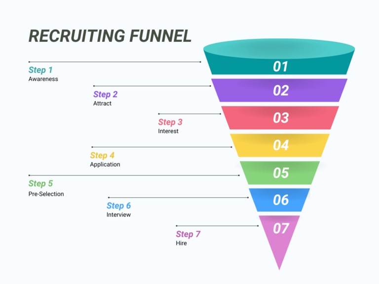

## Как привлечь лучшие таланты в интернете

Рекрутинг больше не является односторонним процессом, в котором правила диктуют компании. Баланс сил на рынке труда изменился - и значительно. Согласно недавнему исследованию [института рыночных исследований Bilendi](https://www.bilendi.de/), каждый второй человек убежден, что он может выбирать себе работу. Квалифицированных работников становится все меньше, а отделы кадров отчаянно пытаются заполнить вакансии. Времена, когда соискателям приходилось бегать в поисках работы, прошли во многих отраслях.

Сегодня сотрудники часто берут верх: они выдвигают требования, ожидают привлекательных условий труда и выбирают работодателей, которые в наибольшей степени соответствуют их ожиданиям. Для HR-менеджеров это означает, что они должны быть умными и проактивными в подборе персонала, чтобы не проиграть в гонке за лучшие умы. Но не волнуйтесь - в этой статье вы узнаете, что важно при подборе персонала, почему социальный рекрутинг является перспективным и какие инструменты могут помочь вам оптимально работать с [applicant management](https://seatable.com/ru/tag/bewerber-talentmanagement/).

## Внутренний или внешний рекрутинг?

Рекрутинг включает в себя гораздо больше, чем просто размещение объявлений о вакансиях. Существует множество подходов к подбору персонала для вашей компании. В основном различают внутренний и внешний рекрутинг, каждый из которых имеет свои методы, преимущества и недостатки.

### Внутренний рекрутинг

Внутренний рекрутинг предполагает привлечение новых сотрудников из числа сотрудников самой компании. Объявления о вакансиях размещаются, например, в **интранет** компании или в регулярных **бюллетенях**, чтобы существующие сотрудники могли претендовать на вакантные должности. Не последнюю роль играют и рекомендации сотрудников**: работники предлагают подходящих людей из своего окружения, что часто позволяет быстрее найти подходящую кандидатуру. Еще одна стратегия внутреннего рекрутинга - подготовка собственных сотрудников к новым должностям посредством **целевого развития и продвижения**.

Преимущество внутреннего найма заключается в том, что сотрудники **уже знакомы с процессами и структурами вашей компании**, что обеспечивает плавный переход и **короткий вводный период**. Это не только экономит время, но и сокращает усилия, необходимые для введения в должность. Кроме того, ваши сотрудники будут чувствовать себя ценными, если вы предложите им возможности внутреннего развития. Однако внутренний рекрутинг также сопряжен с определенными трудностями. Отсутствие свежего импульса извне может привести к застою в корпоративной культуре. Это также может привести к своеобразной "слепоте компании", поскольку новые взгляды не привносятся. **Видимость бренда работодателя также остается ограниченной**, поскольку внешнее присутствие при таком подходе играет второстепенную роль.

### Внешний рекрутинг

Внешний рекрутинг направлен на привлечение талантов за пределами компании. Помимо **классических объявлений о вакансиях**, все более важную роль играют такие современные методы, как **социальный рекрутинг**, при котором используются социальные сети, такие как LinkedIn или Instagram. Активный поиск**, то есть обращение к потенциальным кандидатам напрямую, а также **установление партнерских отношений с университетами** или **участие в ярмарках вакансий** также входят в число мер. Кроме того, компании все чаще используют **креативные подходы, **такие как партизанский маркетинг**, для привлечения внимания. Эти активные стратегии дополняются пассивными подходами, такими как использование незапрошенных заявок или кадровых резервов, а также поддержание позитивного брендинга работодателя, который позиционирует компанию как привлекательного работодателя.

Преимущество внешнего рекрутинга заключается в том, что вы охватываете **большое количество потенциальных кандидатов**, что повышает шансы найти особенно квалифицированных специалистов. Новые сотрудники также часто приносят **свежие идеи и взгляды**, что может способствовать дальнейшему развитию вашей корпоративной культуры. Однако им также требуется **более длительный период вхождения в должность**, и существует некоторая неуверенность в том, что они впишутся в коллектив в долгосрочной перспективе. Кроме того, **процесс зачастую более трудоемкий и дорогостоящий**, чем внутренний рекрутинг.

## Этапы рекрутинга

Несмотря на то что у многих компаний есть свои собственные процессы рекрутинга, существуют основные этапы, которые являются обязательными. Каждый из них не только помогает найти лучших талантов, но и укрепляет ваш брендинг. Поэтому мы даем вам ценные советы по каждому этапу.

- **Oпределите потребности в персонале**: Не всегда с первого взгляда понятно, где и в какой области требуется усиление. Поэтому стоит регулярно проводить точный анализ потребностей. Опирайтесь на решения, основанные на данных, и оценивайте, какие области имеют наибольший потенциал для роста в долгосрочной перспективе.
- **Создайте описание должности**: Хорошее описание должности - это не просто список задач. В нем должны быть точно и привлекательно сформулированы требования, необходимые навыки и преимущества. Ключевой момент? Аутентичность! С самого начала дайте соискателям понять, чего они могут ожидать - от повседневной работы до возможностей развития. Используйте инструменты анализа ключевых слов, чтобы убедиться, что ваше объявление о работе можно найти в Интернете.
- **Отбирайте кандидатов**: Не все соискатели отвечают минимальным требованиям - и это совершенно нормально. С помощью эффективной системы управления соискателями вы сможете быстро отделить пшеницу от плевел. Отбирайте кандидатов не только по квалификации, но и по культурным особенностям, если это возможно. В конце концов, схожие ценности и одинаковый менталитет способствуют успеху команды не меньше, чем подтвержденные навыки.
- **Проведите собеседования**: Собеседования - это прекрасная возможность оценить как технические, так и межличностные навыки кандидата. Используйте структурированные рекомендации по проведению собеседований, чтобы оценивать справедливо и сопоставимо. Но не ограничивайтесь традиционными вопросами. Почему бы не начать с творческого задания или смоделировать мини-проект?
- **Примите решение**: Для принятия обоснованного решения необходимо централизованно собрать всю необходимую информацию и представить ее в ясном виде. Система оценки поможет вам объективно сравнить кандидатов. Привлеките свою команду на ранней стадии - часто именно коллеги из соответствующих отделов дают важные сведения о потенциальных кандидатах.
- **Подписание контракта**: Трудовой договор - это первый шаг к совместной работе. На этом этапе покажите новым сотрудникам, что им рады. Небольшой жест, например, личное сообщение или первое знакомство с коллективом, произведет неизгладимое впечатление.
- **Ввод в должность**: Успешное введение в должность определяет, насколько быстро новые сотрудники освоятся в компании. Положитесь на предварительную подготовку, чтобы установить контакт до первого рабочего дня и составить четкий план введения в должность. Предложите неформальные встречи или программы наставничества, чтобы облегчить начало работы.

## Инструменты и платформы для рекрутинга

Поиск лучших талантов сегодня увлекателен как никогда - и чтобы добиться успеха, нужно чувствовать пульс времени. Современные тенденции в рекрутинге, такие как онлайн-рекрутинг, открывают новые творческие возможности для обращения к потенциальным кандидатам именно там, где они сегодня активны: в цифровом и сетевом мире. Однако и проверенные рекрутинговые меры по-прежнему предоставляют ценные возможности для поиска нужных талантов. Обзор наиболее распространенных платформ и инструментов вы найдете здесь:

- **Job Exchange**: Платформы, такие как StepStone или Indeed, предлагают целевые возможности для цифрового рекрутинга, особенно для специализированных профилей. Убедитесь, что вы выбрали нужный регион и сектор, а также учли свой бюджет.
- **Ярмарки вакансий**: Ярмарки - отличный инструмент для презентации себя как привлекательного работодателя и проведения личных собеседований, что является большим преимуществом перед чисто цифровыми мероприятиями. Интерактивные и креативные кампании повышают вашу узнаваемость - как насчет станции для зарядки смартфона, например, которая побуждает потенциальных кандидатов с разряженной батареей подольше задержаться у вашего стенда?
- **Карьерный сайт**: Первое впечатление имеет значение! Поэтому используйте свой карьерный сайт как центральную точку контакта для активно ищущих кандидатов. Заинтересованные лица должны найти здесь всю важную информацию о вашей компании и понятный процесс подачи заявки. Убедитесь, что ваш сайт всегда актуален и удобен для мобильных устройств.
- **Социальный рекрутинг**: Рекрутинг в социальных сетях с помощью LinkedIn и Xing становится все более интересным для компаний. Рекрутеры и хедхантеры могут таргетировать профили и размещать описания вакансий в сетях. Создайте сильный бренд работодателя, который будет заметен в социальных сетях и привлечет больше заявок.
- **Колледжи/университеты**: Контакты с молодыми талантами могут быть установлены благодаря сотрудничеству с университетами. Для этого особенно эффективны такие меры, как исследовательские проекты, стажировки или руководство дипломными работами. Используйте сети выпускников, чтобы поддерживать связь с талантами в долгосрочной перспективе.
- **Партизанский рекрутинг**: Креатив - это ключ! Юмористические или провокационные кампании привлекают внимание. Почему бы не разместить объявление о работе в необычном месте и не использовать эффект неожиданности, чтобы не потеряться в памяти людей? Убедитесь, что вы сохраняете аутентичность, чтобы создать подлинную связь.
- **Агентство по трудоустройству**: В поиске кандидатов вам могут помочь сторонние организации, такие как агентство по трудоустройству или хедхантеры. Используйте внешних рекрутеров для поиска кандидатов в масштабах страны или на особо сложные позиции.
- **Консультации по подбору персонала**: Если традиционные меры по подбору персонала не приводят к желаемому успеху, стоит обратиться к специализированным кадровым консультациям. Они оказывают поддержку в поиске специалистов и оптимизации существующих стратегий.

## Почему важна продуманная стратегия рекрутинга

Рекрутинг - это многогранная сфера, которая предлагает компаниям широкий спектр сценариев и инструментов. Существует множество причин для заполнения вакансий - от поиска высококвалифицированных специалистов до быстрого заполнения срочно требуемой должности. Такое разнообразие делает еще более важным заранее продумать подходящую стратегию, учитывающую индивидуальные потребности компании.

Ключевым моментом здесь является разграничение различных целей. Например, **набор специалистов с востребованной квалификацией** часто требует иного подхода, чем **быстрое заполнение оперативных позиций**. В то же время опыт соискателя играет решающую роль. Положительный опыт в процессе подачи заявки укрепляет бренд работодателя и повышает вероятность привлечения лучших талантов.

Динамичный характер рынка труда также заставляет компании регулярно переосмысливать и адаптировать свои стратегии. Внешние назначения, например, с помощью активного поиска или социального рекрутинга, не только приносят **новый опыт в компанию**, но и **продвигают культурные изменения и способность к инновациям**. Поэтому хорошо продуманная кампания по набору персонала дает компаниям явное конкурентное преимущество в борьбе за лучшие кадры.

Кроме того, четкие цели и структурированные процессы гарантируют, что **результаты подбора персонала поддаются измерению**. Только так компании могут проанализировать и оптимизировать свои рекрутинговые мероприятия и сделать их успешными в долгосрочной перспективе. Таким образом, сильная стратегия - это не только инструмент для подбора персонала, но и ключ к обеспечению конкурентоспособности.

## Вот что характеризует хороший процесс рекрутинга

Успешный процесс рекрутинга закладывает основу для привлечения квалифицированных кадров, а также оставляет положительное впечатление у соискателей. Но что именно делает процесс хорошим? Это удачное сочетание четких требований, уважительного взаимодействия, эффективности и прозрачности - всегда в гармонии с корпоративной культурой.

- Первый шаг - это **определение реалистичных требований**. Вы должны описать технические навыки так же точно, как и социальные, которые важны для данной должности. Четкие критерии не только помогут вам выбрать подходящих кандидатов, но и обеспечат лучшее соответствие между новыми сотрудниками и вашей компанией.
- Еще одним решающим фактором является **опыт работы с кандидатами**. Соискатели должны почувствовать, что вы цените их с самого первого контакта. Это включает в себя уважительное взаимодействие, прозрачные процессы и открытую культуру обратной связи. Если вы четко отвечаете на вопросы и регулярно информируете о ходе процесса рассмотрения заявок, вы вызовете доверие и оставите положительное впечатление даже у тех, кто вас не выбрал.
- **Скорость процесса** также играет важную роль. Длительное ожидание оказывает демотивирующее воздействие и может привести к отсеву перспективных талантов. Поэтому эффективные процессы и быстрые решения имеют большое значение.
- **Прозрачность** - еще один ключ к успешному процессу рекрутинга. Регулярные обновления и четкая информация о дальнейших шагах помогут соискателям сориентироваться и покажут, что ваша компания действует структурированно и профессионально.
- Чтобы обеспечить справедливость и объективность, следует использовать **стандартизированные вопросы и критерии оценки**. Это минимизирует субъективное влияние и гарантирует, что все кандидаты будут оцениваться по единым стандартам.
- Наконец, процесс подбора персонала должен **отражать вашу корпоративную культуру**. Аутентичный внешний вид показывает, за что выступает ваша компания, и помогает найти кандидатов, которые подходят вам не только с профессиональной точки зрения, но и с точки зрения их личности.  

## Затраты на рекрутинг

Рекрутинг может быстро стать затратным делом для вашей компании. Поэтому очень важно заранее тщательно спланировать бюджет. Одним из важнейших ключевых показателей, который поможет вам в этом, является **затраты на одного сотрудника**. С помощью этого показателя вы сможете целенаправленно оценивать свои мероприятия, лучше планировать их и постоянно оптимизировать.

Расчет стоимости найма прост: **Это сумма внутренних и внешних затрат, деленная на количество новых сотрудников за определенный период.** Это дает вам четкое представление о том, сколько в среднем стоит один сотрудник, и позволяет лучше оценить, где есть потенциал для экономии или необходимость в инвестициях.

**Внутренние затраты** включают все расходы, понесенные внутри вашей компании. Сюда входит, например, рабочее время тех, кто участвует в процессе рассмотрения заявок, инвестиции в обучение и повышение квалификации ваших рекрутеров или внутренние программы. Также следует учитывать дополнительные расходы, например, на обучение или командообразование. Не стоит забывать и об альтернативных издержках - время и ресурсы, потраченные на введение в должность, можно было бы использовать для другой деятельности.

**Внешние затраты** - это расходы на услуги и мероприятия за пределами вашей компании. К ним относятся, например, счета за программное обеспечение для рекрутинга, расходы на объявления о вакансиях, бюджет на брендинг работодателя или оплата услуг агентств. В эту категорию также входят расходы на проезд соискателей, расходы на ярмарки или центры оценки.

**Знаете ли вы?** По данным Общества управления человеческими ресурсами (SHRM), средняя стоимость нового сотрудника в США в 2016 году составляла от 3 000 до 5 000 долларов. Точные цифры зависели от таких факторов, как размер компании, отрасль и количество принятых на работу сотрудников.

## SeaTable как бесплатное программное обеспечение для рекрутинга

Поиск новых талантов может быстро превратиться в дорогостоящую задачу для компаний. В связи с этим часто возникает вопрос: Где можно сэкономить, не жертвуя качеством? Разумный ответ - использовать правильные инструменты. Особенно в области рекрутинга существуют программные решения, которые делают процессы более эффективными и одновременно экономят ваш бюджет - отличным вариантом для этого является [SeaTable](https://seatable.com/ru/).

С помощью SeaTable вы контролируете весь процесс подачи заявок. Начиная с объявления о вакансии и заканчивая приемом на работу, все можно контролировать централизованно и четко. Бесплатный шаблон для подбора персонала** позволяет собирать заявки через веб-форму, в которую напрямую заносятся все важные **данные и документы**. Затем они упорядочиваются и четко оформляются в виде таблицы, чтобы у вас всегда был обзор.



Управление процессами также стало проще: благодаря интегрированным **доске Канбан** и **календарю** вы можете организовать свои процессы четко и эффективно. Крупные HR-отделы особенно выигрывают от **коллаборативной работы** в Base. Документируйте статус задач по подбору персонала, группируйте свои **задачи** и быстрее находите нужных сотрудников для своей команды.

Но SeaTable помогает не только в подборе персонала. С помощью дополнительных бесплатных шаблонов вы также можете легко организовать собеседования и прием новых членов команды. В одном инструменте вы найдете все, что нужно для современного и эффективного рекрутинга.

Попробуйте SeaTable и убедитесь, насколько простым может быть рекрутинг. [Зарегистрируйтесь бесплатно сегодня]() - и приступайте к работе прямо сейчас!

## Часто задаваемые вопросы



Что такое рекрутинг и почему он так важен?|||

Рекрутинг - это процесс, с помощью которого компании привлекают подходящих специалистов на открытые вакансии. В условиях жесткой конкуренции на рынке труда хорошо продуманный процесс рекрутинга определяет успех и будущую жизнеспособность компании.

---

Какие существуют методы привлечения новых талантов?|||

Компании могут выбирать между внутренним и внешним рекрутингом. Внутренний рекрутинг включает в себя такие меры, как привлечение сотрудников по рекомендациям или наем изнутри компании. Внешний рекрутинг использует такие методы, как объявления о вакансиях, социальный рекрутинг или активный поиск.

---

Из чего складывается успешная стратегия рекрутинга?|||

Хорошая стратегия рекрутинга аутентична, эффективна и адаптирована к целевой группе. Она учитывает следующие аспекты:

- четкие и привлекательные описания должностей
- быстрые и прозрачные процессы
- фокус на опыте кандидата для удержания талантов в долгосрочной перспективе
- использование современных инструментов, таких как SeaTable, для структурированного управления кандидатами

---

Как мне найти лучших специалистов в Интернете?|||

Онлайн-рекрутинг предлагает широкий спектр возможностей для поиска талантливых людей:

- Используйте платформы социальных сетей, такие как LinkedIn или Xing, чтобы напрямую связаться с кандидатами.
- Оптимизируйте свой карьерный сайт, чтобы сделать его удобным для мобильных устройств и информативным.
- Разместите целевые объявления на досках объявлений о работе, таких как StepStone или Indeed.
- Используйте креативные подходы, такие как партизанский маркетинг, чтобы привлечь внимание.

---

Какие бесплатные инструменты помогают в рекрутинге?|||

Такие инструменты, как SeaTable, предлагают комплексные решения для всего процесса рекрутинга. С помощью бесплатных шаблонов вы можете централизованно управлять заявками, организовывать задачи и планировать собеседования. Это экономит ваше время и деньги без ущерба для качества.


