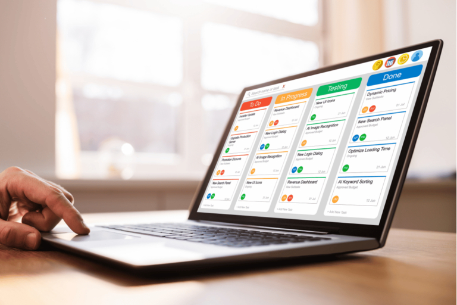
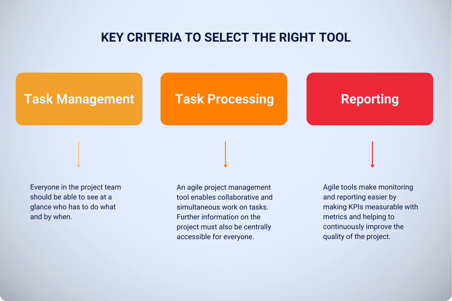

## ¿Por qué gestión ágil de proyectos?

Los equipos deben ser capaces de **reaccionar con flexibilidad y rapidez a los cambios en un proyecto** para lograr el mejor resultado posible para el cliente dadas las circunstancias. La gestión ágil de proyectos fomenta precisamente esta adaptabilidad y garantiza que los comentarios y **los deseos de los clientes se incorporen al desarrollo en una fase temprana**.

Los métodos ágiles permiten desarrollar, probar y presentar rápidamente los resultados iniciales. De este modo, se crea paso a paso un producto adaptado con precisión a las necesidades de su cliente.

Diversas herramientas ágiles le ayudarán a implantar con éxito la gestión ágil de proyectos en su empresa. Lea más sobre **métodos como Scrum o Kanban** y descubra cómo las herramientas de gestión ágil de proyectos pueden ayudar a su equipo a organizar los proyectos de forma más flexible y eficiente.

## ¿Cómo funciona la gestión ágil de proyectos?

La gestión ágil de proyectos divide los procesos complejos en secciones manejables y asigna funciones específicas, como las de Product Owner y Scrum Master. Esto permite a su equipo trabajar conjuntamente de forma estructurada y flexible. En lugar de perseguir un objetivo final rígido, la gestión ágil de proyectos se centra en maximizar el **beneficio para el cliente y reaccionar con rapidez a los requisitos cambiantes**.

El **proyecto se divide en sprints**, cada uno de los cuales representa fases de trabajo cortas y claras en las que se persiguen tareas y objetivos definidos. **Los planes se ponen a prueba continuamente** y pueden adaptarse con tanta rapidez que su equipo puede responder con flexibilidad a los nuevos acontecimientos. **Las reuniones periódicas** permiten una comunicación eficaz y los resultados provisionales se presentan de forma continua para recabar opiniones y garantizar que el proyecto satisface las necesidades.

## ¿Para qué proyectos es adecuada la gestión ágil de proyectos?

La gestión ágil de proyectos es especialmente adecuada para proyectos caracterizados por un alto grado de dinamismo y cambios rápidos. Esto incluye no sólo el desarrollo de software y productos, sino también campañas de marketing, proyectos de investigación o proyectos de innovación en los que la retroalimentación periódica y los ajustes rápidos son cruciales.

Las herramientas y métodos ágiles son ideales cuando **los requisitos aún no están claramente definidos** o es probable que cambien a lo largo del proyecto. La gestión ágil de proyectos también demuestra sus puntos fuertes en proyectos que requieren una estrecha **colaboración** con los clientes o las distintas partes interesadas. Los métodos de trabajo iterativos y flexibles permiten desarrollar soluciones innovadoras y orientadas al cliente.

## ¿Hay algún método de gestión ágil de proyectos que debería conocer?

Existen varios métodos de gestión ágil de proyectos que puede adaptar con flexibilidad a los requisitos de los distintos proyectos. Los más conocidos son **Scrum y Kanban**, cada uno de los cuales ofrece enfoques específicos para estructurar y optimizar los procesos de trabajo. Veamos en qué se diferencian Scrum y Kanban.

### Scrum - el clásico de la gestión ágil de proyectos

Cuando se utiliza Scrum, se definen claramente tanto los **papeles de los participantes en el proyecto** como los resultados y eventos previstos. Los resultados parciales se desarrollan en breves **impresiones** - en el desarrollo de productos, por ejemplo, podría tratarse de una nueva versión del producto o de una función específica. Estos resultados provisionales se presentan al cliente para obtener su opinión y hacer ajustes en una fase temprana.

### Trabajo ágil con Kanban

Es posible que ya conozca el tablero Kanban como una importante herramienta de gestión ágil de proyectos. En él, **las tareas se registran en tarjetas digitales sobre un tablero**, gestionadas y organizadas en varias columnas, como "Por hacer", "En curso" y "Hecho". De este modo se puede seguir visualmente el progreso de cada tarea, el equipo puede reconocer los cuellos de botella en una fase temprana y gestionar el flujo de trabajo con eficacia. Esta estructura ayuda a mejorar continuamente el estado actual y a hacer avanzar los proyectos a través de muchos pasos pequeños y rápidamente realizables.

## ¿Por qué son tan importantes las herramientas para la gestión ágil de proyectos?

La herramienta adecuada ayuda a llevar la gestión ágil de proyectos de la teoría a la práctica. Los recursos se distribuyen eficazmente, la comunicación dentro del equipo se simplifica y se introduce una gestión clara de las tareas. Las herramientas adecuadas también permiten una mayor transparencia: **Los miembros del equipo pueden ver el progreso de todas las tareas** y los jefes de proyecto pueden reconocer los cuellos de botella o los retrasos en una fase temprana.

Las herramientas de gestión ágil de proyectos también ofrecen valiosas **perspectivas sobre varios indicadores clave de rendimiento (KPI)** que muestran el éxito del proyecto hasta el momento y dónde puede ser necesario realizar ajustes. Esto mantiene informados en todo momento a todos los implicados y les permite reaccionar con flexibilidad a los cambios para garantizar el éxito del proyecto.

## Criterios para seleccionar la herramienta adecuada

Para encontrar herramientas para su gestión ágil de proyectos, debe obtener una **visión general de los programas y aplicaciones** disponibles en el mercado. A continuación, prueba varios programas y determina si cumplen tus requisitos.

¿Cuántos beneficios obtiene por el precio y pueden hacer más otras herramientas de gestión ágil de proyectos? ¿Pueden sus empleados manejar la interfaz de usuario y están satisfechos? ¿Y las funciones? Las herramientas de trabajo ágil siempre deben cubrir las tres áreas siguientes:

- **Gestión de tareas:** Todo el mundo debe poder ver de un vistazo quién tiene que hacer qué y cuándo.

- **Colaboración en equipo:** Una herramienta de gestión ágil de proyectos permite procesar las tareas de forma conjunta y simultánea. Además, todo el mundo debe poder acceder de forma centralizada a información adicional sobre el proyecto.

- **Informes:** Las partes interesadas pueden esperar un informe de progreso después de cada sprint. Las herramientas ágiles te facilitan esta tarea haciendo que los KPI se puedan medir con métricas y ayudando a mejorar continuamente la calidad del proyecto.

## ¿Qué herramientas existen para la gestión ágil de proyectos?

Antes de invertir en herramientas para la gestión ágil de proyectos, merece la pena hacer una comparación. En los siguientes 10 programas y [soluciones en la nube](), echamos un vistazo a la gama de funciones, facilidad de uso, opciones de colaboración, alojamiento, protección de datos y costes. Así se descubren diferencias interesantes y herramientas menos conocidas que compiten con las mejores y se convierten en una alternativa a Jira o Trello, por ejemplo.

### Asana

Asana es una de las herramientas más populares para la gestión de tareas y proyectos y cuenta con una **interfaz fácil de usar y un funcionamiento intuitivo**. Puedes asignar diferentes categorías con colores para las notas. Puedes visualizar tus datos en un diagrama de Gantt, así como en listas o en un tablero Kanban. La colaboración en equipo es posible gracias a las áreas "Equipos", "Bandeja de entrada" y "Debates". Aunque los informes en [Asana](https://asana.com/fr) se limitan a simples estadísticas, la herramienta impresiona por su **cumplimiento de la GDPR gracias a la ubicación de los servidores en Europa**. Algunos detalles, como las funciones de filtro para tareas que están disponibles en otras [herramientas de gestión de proyectos ágiles](), faltan en Asana. Sin embargo, la visualización simplificada permite a los participantes en el proyecto centrarse en lo esencial. La empresa con sede en San Francisco ofrece una solución puramente en la nube que se puede utilizar fácilmente y sin infraestructura adicional, aunque esto elimina la opción de autoalojamiento. Empezar es gratis, mientras que las suscripciones de pago empiezan en 10,99 € por usuario/mes.

### monday.com

monday.com es una alternativa que destaca por sus flujos de trabajo personalizables y sus diferentes vistas de proyecto. Esto da a cada equipo la libertad de adaptar la herramienta de gestión ágil de proyectos a sus propias necesidades. Con una **potente automatización y colaboración en tiempo real**, facilita la organización de procesos de trabajo complejos. Aunque su uso es relativamente complicado y **requiere cierta familiarización inicial**, monday.com ofrece **completos cuadros de mando y funciones de información** para la elaboración de informes. La empresa israelí ha diseñado su software como una herramienta completamente basada en la nube, por lo que no ofrece ninguna opción de funcionamiento local. En términos de protección de datos, no puede alojar el software usted mismo, pero al menos puede operarlo en cumplimiento con el GDPR, ya que **hay servidores en la UE** disponibles. Las suscripciones de pago comienzan en 9 euros por usuario/mes, lo que convierte a monday.com en una solución escalable que, al igual que Asana, se encarece rápidamente.

### Jira

Jira, un producto de la empresa australiana Atlassian, es conocido por sus amplias funciones de gestión ágil de proyectos, dirigidas en particular a métodos ágiles como Scrum, Kanban y Extreme Programming. Los [flujos de trabajo flexibles y personalizables]() permiten gestionar **proyectos complejos de forma estructurada**. Sin embargo, debido a sus diversas opciones e integraciones -especialmente con otros productos de Atlassian-, Jira requiere muchos conocimientos previos y una **larga familiarización**. La **solución se diseñó originalmente para equipos de desarrollo** e incluso ellos tienen a veces problemas para seguir la pista de las complejas funciones. Con sus **completas opciones de generación de informes y análisis**, Jira Software es especialmente adecuado para equipos que necesitan información y estadísticas detalladas. En función de sus necesidades, puede utilizar Jira como versión en la nube a través de AWS o alojarlo en su propio hardware. Las ubicaciones de los servidores en Dublín y Fráncfort del Meno prometen el cumplimiento de la GDPR. Existe una versión gratuita **para pequeños equipos de hasta 10 usuarios**, mientras que las suscripciones de pago empiezan en 7,90 euros por usuario/mes. Como no es fácil exportar proyectos de Jira a otras herramientas ágiles de gestión de proyectos, conviene pensárselo bien antes de utilizarlo. Naturalmente, Atlassian quiere evitar que cambies a corto plazo a una alternativa de Jira.

### Trello

Como herramienta ágil de gestión de proyectos y colaboración, Trello es la alternativa interna de Atlassian a Jira. Está **basada en tableros Kanban** y se utiliza para organizar proyectos y tareas con tarjetas para equipos e individuos. Aunque las **funciones de elaboración de informes son escasas** en comparación con otras herramientas, Trello se puede personalizar con los llamados power-ups. Con comentarios, menciones y una sencilla colaboración en equipo, Trello permite una colaboración eficaz sin resultar recargado. Trello es una herramienta intuitiva que impresiona por su diseño sencillo. La **interfaz de usuario es sencilla y clara**, lo que facilita la gestión de tareas y proyectos. En comparación, sin embargo, Trello ofrece una gama bastante **pequeña de funciones**, por lo que es una alternativa Trello de pleno derecho a casi todas las herramientas ágiles. Trello se ejecuta exclusivamente a través de la nube y no está diseñado para instalaciones locales. La propia Atlassian afirma respetar el GDPR, aunque la sede y los servidores de Trello se encuentran en Estados Unidos. La herramienta está disponible en una versión básica gratuita y las suscripciones de pago comienzan en 5 USD por usuario/mes.

### ClickUp

Otro producto procedente de Estados Unidos es ClickUp. Este software impresiona por su **completa funcionalidad**, que abarca desde versátiles funciones de gestión ágil de proyectos, vistas y flujos de trabajo personalizables hasta **documentación y pizarras integradas**. Esta variedad permite a los equipos personalizar la herramienta a sus necesidades exactas, aunque esto requiere un **periodo de formación**. Las amplias opciones de comunicación y las herramientas de equipo facilitan la coordinación. Con funciones de informe y cuadros de mando, ClickUp proporciona **una visión detallada del progreso y el rendimiento del equipo**. La herramienta para la gestión ágil de proyectos solo está disponible como solución en la nube y no se puede instalar localmente. El cumplimiento del GDPR y la opción de seleccionar servidores europeos de AWS para el almacenamiento de datos deberían garantizar una protección de datos segura. La versión básica es gratuita, mientras que las suscripciones de pago empiezan en 7 USD por usuario/mes.

### MeisterTask

MeisterTask tiene una interfaz clara y fácil de usar y un diseño atractivo que hace que la gestión de tareas y proyectos sea un juego de niños. Como alternativa a Trello **la herramienta se basa en el enfoque Kanban** y permite el seguimiento del tiempo y la automatización, además de la gestión de tareas. Los tableros Kanban permiten mover las tareas fácilmente y en función del estado de procesamiento actual. La sencilla colaboración con comentarios y menciones hace que MeisterTask sea fácil de usar y fomenta un trabajo en equipo transparente. Aunque los informes siguen siendo sencillos, son suficientes para muchos equipos. El software de la empresa alemana MeisterLabs sólo está disponible en la nube, por lo que ofrece una solución sencilla y escalable para equipos, pero no autoalojable. La protección de datos sigue siendo una prioridad: MeisterTask cumple con la GDPR y los servidores en la nube se encuentran en Alemania. Hay disponible una versión básica gratuita, mientras que las suscripciones de pago empiezan en 13,50 euros por usuario/mes.

### awork

Tableros kanban, líneas de tiempo, listas: awork es ideal para la gestión ágil de proyectos. La alternativa de ClickUp se basa en una interfaz de usuario clara con la que **los proyectos pueden configurarse, planificarse y ejecutarse individualmente**. Además, las **tareas pueden moverse fácilmente arrastrándolas y soltándolas** y una función en vivo garantiza la **actualización automática** de la ventana del navegador. Esto significa que cada cambio se muestra de forma transparente y que todos los miembros del equipo disponen siempre de la misma información actualizada. La herramienta ofrece numerosas opciones de análisis para la elaboración de informes, que pueden resumirse en claros cuadros de mando con sólo unos clics. Gracias a la flexible **colaboración en equipo mediante comentarios en tiempo real**, menciones y compartición de archivos, la comunicación dentro del equipo funciona a la perfección. La empresa tiene su sede en Hamburgo, awork cumple con la GDPR y está alojada en Alemania, lo que garantiza un alto nivel de seguridad de los datos. La herramienta de gestión ágil de proyectos solo está disponible como software como servicio y no puede alojarse en sus propios servidores. Gracias a su API Rest abierta, la herramienta puede conectarse a numerosas aplicaciones. Los costes comienzan en 8 euros por usuario/mes, lo que convierte a awork en una alternativa alemana más barata a MeisterTask.

### Wrike

Wrike, por su parte, tiene sus orígenes en EE.UU. y es una herramienta ágil de gestión de proyectos que puede ser tanto una alternativa a ClickUp como a awork. Ya se trate de calendarios totalmente vinculados, tableros Kanban personalizados o tareas flexiblemente priorizables, **ofrece mucho en términos de funcionalidad**. Como herramienta de gestión de proyectos, Wrike también se **centra en la colaboración en tiempo real** dentro del equipo, **los informes entre proyectos** y los feeds de noticias al minuto. **Los informes y las estadísticas son uno de los puntos fuertes de Wrike**: Los datos detallados y las perspectivas del proyecto se pueden obtener a través de paneles interactivos. Wrike permite la utilización completa de la API, pero se basa en la nube y sólo se ofrece como una opción SaaS. Por lo tanto, no es posible el autoalojamiento, pero según la empresa, la protección de datos está garantizada mediante el cumplimiento del GDPR y las ubicaciones europeas de los servidores. Además de una versión básica gratuita, Wrike ofrece cuatro suscripciones de pago a partir de 10 USD por usuario/mes, lo que hace que la herramienta sea adecuada para equipos en crecimiento.

### Redmine

Redmine es un **software de código abierto** para la gestión ágil de proyectos que es gratuito y extremadamente **compatible con otras soluciones**. Como alternativa a Jira, Redmine también incluye **gestión detallada de tickets y errores**, así como diagramas de Gantt para la planificación de proyectos. Sin embargo, Redmine sólo es **apto para equipos con experiencia técnica**, ya que su instalación y configuración requieren profundos conocimientos informáticos. Aunque el software puede ampliarse con plugins y temas, es menos fácil de usar que otras herramientas porque es más **difícil familiarizarse con Redmine** y la anticuada interfaz de usuario es visualmente poco atractiva. Las funciones de elaboración de informes son versátiles y también pueden ampliarse mediante plugins. Como alternativa a Jira, Redmine permite básicamente la colaboración en equipo, pero sin funciones avanzadas para evitar conflictos en el contexto de la sincronización en tiempo real. Como Redmine puede ser autoalojado, la soberanía de los datos permanece completamente en manos del usuario, lo que permite los más altos estándares de seguridad.

### SeaTable

SeaTable es una herramienta ágil de gestión de proyectos que **se adapta con flexibilidad a los requisitos de su empresa o proyecto**. El software cuenta con una impresionante gama de funciones que van mucho más allá de la gestión ágil de proyectos y abarcan también otros procesos empresariales. Gracias a numerosos formatos de visualización, como tableros Kanban, diagramas de Gantt y listas, **podrá planificar y organizar exhaustivamente todas sus tareas**. La intuitiva interfaz de usuario y las flexibles opciones de personalización hacen que la herramienta sea **comprensible y fácil de usar** incluso para usuarios sin experiencia.

Si busca un software ágil de gestión de proyectos que facilite la colaboración en equipo mediante **sincronización en tiempo real, comentarios y gestión de archivos compartidos**, SeaTable es la opción adecuada. Esta herramienta mantiene al día a todos los miembros de su equipo y el estado del proyecto es transparente. Las opciones de análisis incluyen **paneles y estadísticas personalizables** que le permiten revisar el progreso del proyecto a intervalos regulares y tomar decisiones informadas.

SeaTable le ofrece **máxima flexibilidad** en su elección de alojamiento: tiene la opción de alojar el software usted mismo e instalar [SeaTable On-Premises]() en sus propios servidores, o puede utilizar la **cómoda y escalable versión en la nube** manteniendo los más altos estándares de seguridad. SeaTable es una empresa alemana que almacena **todos los datos en servidores alemanes** en cumplimiento de la GDPR. En la **versión básica gratuita** tiene a su disposición numerosas funciones básicas. Para requisitos más avanzados, [SeaTable]() ofrece suscripciones a precios atractivos a partir de 7 euros por usuario/mes.

En nuestra biblioteca encontrará [plantillas de gestión de proyectos](), que podrá utilizar inmediatamente en la versión básica gratuita.

### Mejores resultados gracias a la gestión ágil de proyectos

La gestión ágil de proyectos garantiza el mayor valor añadido posible para usted y sus clientes, independientemente de si son clientes externos o partes interesadas internas. Las herramientas ágiles garantizan que **los proyectos puedan reaccionar con flexibilidad y eficacia a los cambios**, al tiempo que **la calidad y la velocidad del trabajo del proyecto se mantienen altas**. Dado que la gestión ágil de proyectos ya está firmemente establecida en muchas empresas, existe una amplia gama de potentes herramientas disponibles que respaldan sus métodos de trabajo y pueden personalizarse según los requisitos de cada proyecto.

Las herramientas presentadas pueden parecer bastante similares a primera vista, pero difieren mucho en cuanto a qué funciones son gratuitas, si ofrecen soluciones de autoalojamiento o puramente en la nube, cómo y dónde se almacenan los datos y cuánto tiempo de familiarización necesitan los usuarios. Trello y SeaTable, por ejemplo, son las herramientas más baratas, aunque Trello sólo está disponible en servidores en la nube estadounidenses y ofrece una gama de funciones significativamente menor. Con funciones Kanban comparables, casi todas las demás herramientas ofrecen una alternativa completa a Trello. Por otro lado, SeaTable y Trello, con su diseño sencillo, son mucho más intuitivas que monday, Jira o Redmine, que pueden abrumar inicialmente a los usuarios por su complejidad.

Compare a fondo y elija la herramienta adecuada para sus necesidades. Si buscas un software de gestión ágil de proyectos que prometa la máxima flexibilidad y rentabilidad, SeaTable es probablemente la mejor opción. Pruébelo y regístrese gratis con su dirección de correo electrónico hoy mismo.



Regístrese en nuestro boletín y manténgase al día sobre todo lo relacionado con la gestión de proyectos.


