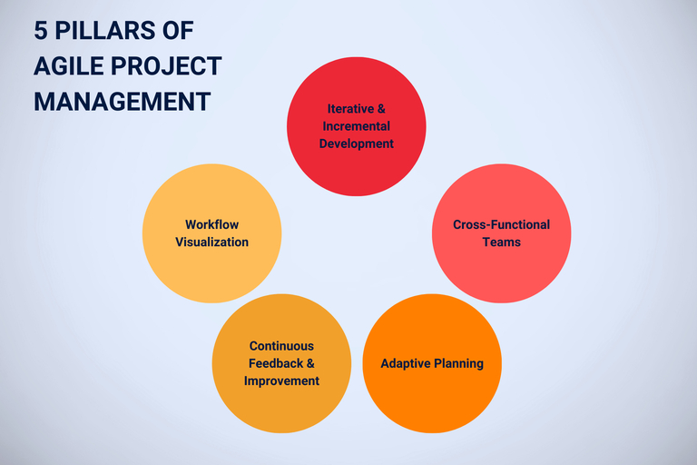

## Pourquoi la gestion de projet agile ?

Les équipes doivent être en mesure de **réagir de manière flexible et rapide aux changements dans un projet** afin d'obtenir le meilleur résultat possible pour le client en fonction des circonstances. La gestion de projet agile favorise précisément cette capacité d'adaptation et garantit que le feed-back et les **demandes du client sont intégrés très tôt dans le développement**.

Les méthodes agiles permettent de développer, de tester et de présenter rapidement les premiers résultats. C'est ainsi que naît, étape par étape, un produit qui répond exactement aux besoins de votre client.

Différents outils agiles vous aident à mettre en œuvre avec succès la gestion de projet agile dans votre entreprise. Lisez-en plus sur les **méthodes telles que Scrum ou Kanban** et découvrez comment les outils de gestion de projet agile peuvent aider votre équipe à concevoir des projets de manière plus flexible et efficace.

## Comment fonctionne la gestion de projet agile ?

La gestion de projet agile divise les processus complexes en sections gérables et attribue des rôles spécifiques, comme ceux de Product Owner et de Scrum Master. De cette manière, votre équipe peut collaborer de manière structurée et flexible. Au lieu de poursuivre un objectif final rigide, la gestion de projet agile se concentre sur **la maximisation de la valeur pour le client et sur la réaction rapide à l'évolution des exigences**.

Le **projet est divisé en sprints**, qui représentent chacun des phases de travail courtes et claires au cours desquelles vous poursuivez des tâches et des objectifs définis. Les **plans sont continuellement mis à l'épreuve** et peuvent être adaptés si rapidement que votre équipe peut réagir de manière flexible aux nouveaux développements. **Des réunions régulières** permettent une communication efficace et les résultats intermédiaires sont présentés en continu afin de recueillir des informations et de garantir que le projet répond aux besoins.

## Pour quels projets la gestion de projet agile est-elle adaptée ?

La gestion de projet agile est particulièrement adaptée aux projets qui se caractérisent par une dynamique élevée et une capacité de changement rapide. Il ne s'agit pas seulement du développement de logiciels et de produits, mais aussi de campagnes de marketing, de projets de recherche ou de projets d'innovation, pour lesquels un feedback régulier et des adaptations rapides sont décisifs.

Les outils et méthodes agiles sont idéalement utilisés lorsque **les exigences ne sont pas encore clairement définies** ou qu'elles sont susceptibles d'évoluer au cours du projet. La gestion de projet agile fait également valoir ses atouts dans les projets qui nécessitent une **collaboration étroite** avec vos clients ou différentes parties prenantes. Ainsi, des méthodes de travail itératives et flexibles permettent de développer des solutions innovantes et orientées vers le client.

## Existe-t-il des méthodes à connaître pour la gestion de projet agile ?

Dans la gestion de projet agile, il existe toute une série de méthodes que vous pouvez adapter de manière flexible aux exigences de différents projets. Les plus connues sont **Scrum et Kanban**, qui proposent chacune des approches spécifiques pour structurer et optimiser les processus de travail. Regardons de plus près Scrum et Kanban pour voir en quoi ces deux approches diffèrent.

### Scrum - le classique de la gestion de projet agile

Lorsque vous utilisez Scrum, vous définissez clairement les **rôles des personnes impliquées dans le projet** ainsi que les résultats et événements prévus. Des résultats partiels sont élaborés dans de courts **sprints** - dans le cas du développement de produits, il pourrait s'agir par exemple d'une nouvelle version du produit ou d'une fonction spécifique. Ces résultats intermédiaires sont présentés au client afin d'obtenir un feedback précoce et de procéder à des ajustements.

### Travail agile avec Kanban

Vous connaissez peut-être déjà le tableau Kanban en tant qu'outil de gestion de projet agile important. Ici, les **tâches sont consignées dans des cartes numériques sur un tableau**, gérées et organisées en différentes colonnes - comme "À faire", "En cours" et "Terminé". Cela permet de suivre visuellement l'avancement de chaque tâche, l'équipe peut identifier les goulots d'étranglement à un stade précoce et gérer efficacement le flux de travail. Cette structure aide à améliorer continuellement l'état actuel et à faire progresser les projets de manière constante grâce à de nombreuses petites étapes rapidement réalisables.

## Pourquoi les outils sont-ils si importants pour la gestion de projet agile ?

Le bon outil vous aide à faire passer votre gestion de projet agile de la théorie à la pratique. Les ressources sont réparties efficacement, la communication au sein de l'équipe est simplifiée et une gestion claire des tâches est introduite. De plus, des outils adaptés permettent une plus grande transparence : **les membres de l'équipe voient l'avancement de toutes les tâches** et les chefs de projet peuvent identifier à temps les goulots d'étranglement ou les retards.

Les outils de gestion de projet agile fournissent en outre de précieuses **informations sur différents indicateurs de performance clés (KPI)**, qui montrent dans quelle mesure le projet s'est déroulé avec succès jusqu'à présent et à quel endroit des ajustements pourraient être nécessaires. Ainsi, toutes les personnes concernées restent informées en permanence et peuvent réagir de manière flexible aux changements afin d'assurer la réussite du projet.

## Critères de sélection de l'outil approprié

Pour trouver des outils de gestion de projet agile, vous devez avoir une **vue d'ensemble des logiciels et des applications disponibles sur le marché**. Ensuite, testez plusieurs programmes et déterminez s'ils répondent à vos besoins.

Quel est le rapport qualité/prix et les autres outils de gestion de projet agile sont-ils plus performants ? Vos collaborateurs sont-ils à l'aise avec l'interface utilisateur et sont-ils satisfaits ? Qu'en est-il des fonctionnalités ? Dans tous les cas, les outils de travail agile doivent couvrir les trois domaines suivants :

- **Gestion des tâches:** Tout le monde devrait pouvoir voir en un coup d'œil qui a quoi à faire et jusqu'à quand.

- **Collaboration en équipe:** Un outil de gestion de projet agile permet de travailler ensemble et simultanément sur les tâches. D'autres informations concernant le projet doivent également être accessibles à tous de manière centralisée.

- **Rapports:** Il se peut que les parties prenantes attendent un rapport sur l'avancement après chaque sprint. Les outils agiles vous facilitent la tâche en rendant les indicateurs de performance clés (KPI) mesurables à l'aide de métriques et en vous aidant à améliorer constamment la qualité du projet.

## Quels sont les outils disponibles pour la gestion de projet agile ?

Avant d'investir dans des outils pour votre gestion de projet agile, il vaut la peine de faire une comparaison. Pour les 10 programmes et [solutions cloud] suivants (), nous examinons respectivement l'étendue des fonctions, la convivialité, les possibilités de collaboration, l'hébergement, la protection des données et les coûts. Ce faisant, nous mettons en évidence des différences intéressantes et des outils moins connus qui concurrencent les grands noms et marquent des points, par exemple comme alternative à Jira ou Trello.

### Asana

Asana fait partie des outils les plus populaires pour la gestion des tâches et des projets et brille par son **interface conviviale et son utilisation intuitive**. Pour les notes, vous pouvez attribuer différentes catégories avec des couleurs. Vous pouvez représenter vos données aussi bien dans un diagramme de Gantt que dans des listes ou un tableau Kanban. La collaboration en équipe est facilitée par les sections "Équipes", "Boîte de réception" et "Discussions". Même si les rapports dans [Asana](https://asana.com/de) se limitent à de simples statistiques, l'outil convainc par sa **conformité au RGPD grâce à des sites de serveurs en Europe**. Certains détails, comme les fonctions de filtrage des tâches, qui existent dans d'autres [outils de gestion de projet]() agiles, manquent chez Asana. Grâce à la représentation simplifiée, les participants au projet peuvent toutefois se concentrer sur l'essentiel. L'entreprise basée à San Francisco propose une solution purement cloud que vous pouvez utiliser facilement et sans infrastructure supplémentaire, ce qui vous prive toutefois de l'option d'auto-hébergement. L'accès est gratuit, tandis que les abonnements payants commencent à 10,99 euros par utilisateur/mois.

### monday.com

monday.com est une alternative qui marque des points grâce à ses flux de travail personnalisables et ses différentes vues de projets. Celles-ci donnent à chaque équipe la liberté d'adapter l'outil de gestion de projet agile de manière optimale à ses propres besoins. Avec **des automatisations puissantes et une collaboration en temps réel**, il facilite l'organisation de processus de travail complexes. Alors que l'utilisation est relativement compliquée et nécessite d'abord une **certaine familiarisation**, monday.com propose des **tableaux de bord et des fonctions de reporting complets** pour les rapports. L'entreprise israélienne a conçu son logiciel comme un outil entièrement basé sur le cloud et n'offre donc aucune possibilité d'exploitation locale. En ce qui concerne la protection des données, vous ne pouvez certes pas héberger vous-même le logiciel, mais vous pouvez au moins l'exploiter en conformité avec le RGPD, car **des serveurs sont disponibles dans l'UE**. Les abonnements payants commencent à 9 euros par utilisateur/mois, ce qui fait de monday.com une solution évolutive, mais qui, tout comme Asana, devient rapidement coûteuse.

### Jira

Jira, un produit de la société australienne Atlassian, est connu pour ses fonctions étendues de gestion de projet agile, qui visent notamment les méthodes agiles telles que Scrum, Kanban et Extreme Programming. Des [workflows]() adaptables de manière flexible permettent de **gérer des projets complexes de manière structurée**. En raison de ses nombreuses options et intégrations - en particulier avec d'autres produits Atlassian - Jira nécessite toutefois beaucoup de connaissances préalables et une **longue période d'apprentissage**. À l'origine, la **solution a été conçue pour les équipes de développeurs** et même ces derniers ont parfois du mal à garder une vue d'ensemble des fonctions complexes. Avec **des possibilités complètes de reporting et d'analyse**, le logiciel Jira convient particulièrement aux équipes qui ont besoin d'une vue détaillée et de statistiques. Selon vos besoins, vous pouvez utiliser Jira en version cloud via AWS ou l'héberger sur votre propre matériel. Les serveurs sont situés à Dublin et à Francfort-sur-le-Main, ce qui garantit la conformité avec le RGPD. Pour les petites **équipes comptant jusqu'à 10 utilisateurs, il existe une version gratuite**, tandis que les abonnements payants commencent à 7,90 euros par utilisateur/mois. Comme il n'est pas possible d'exporter facilement des projets de Jira vers d'autres outils de gestion de projets agiles, il est préférable de bien réfléchir avant de les utiliser. Ainsi, Atlassian souhaite naturellement éviter que vous ne passiez à court terme à une alternative à Jira.

### Trello

En tant qu'outil de gestion de projet et de collaboration agile, Trello est l'alternative Jira d'Atlassian. Il **est basé sur les tableaux Kanban** et sert à organiser les projets et les tâches avec des cartes pour les équipes et les individus. Bien que les **fonctions de rapport soient peu nombreuses par rapport à d'autres outils**, Trello peut être étendu individuellement grâce à des "power-ups". Avec des commentaires, des mentions et une collaboration d'équipe simple, Trello permet une collaboration efficace sans paraître surchargé. Trello est un outil intuitif qui enthousiasme particulièrement par son design simple. L'interface utilisateur **est sobre et claire**, ce qui facilite la gestion des tâches et des projets. En comparaison, Trello offre toutefois un **ensemble de fonctions assez restreint**, ce qui fait que presque tous les outils Agile constituent une alternative Trello à part entière. Trello fonctionne exclusivement via le cloud et n'est pas conçu pour des installations sur site. Atlassian lui-même affirme respecter le RGPD, bien que le siège social et les serveurs de Trello soient situés aux États-Unis. L'outil est disponible dans une version de base gratuite et les abonnements payants commencent à 5 dollars US par utilisateur/mois.

### ClickUp

ClickUp est un autre produit venu des États-Unis. Ce logiciel se distingue par ses **fonctionnalités complètes**, qui vont des fonctions polyvalentes de gestion de projet agile aux vues et flux de travail personnalisables, en passant par la **documentation intégrée et les tableaux blancs**. Cette diversité permet aux équipes d'adapter l'outil à leurs besoins précis, ce qui nécessite toutefois une **certaine période d'apprentissage**. Des possibilités de communication étendues et des outils d'équipe facilitent la concertation. Grâce aux fonctions de rapport et aux tableaux de bord, ClickUp **offre un aperçu détaillé des progrès et des performances de l'équipe**. L'outil de gestion de projet agile est exclusivement disponible en tant que solution cloud et ne peut pas être installé localement. Le respect du RGPD et la possibilité de choisir des serveurs européens d'AWS pour le stockage des données doivent assurer une protection sûre des données. La version de base est gratuite, les abonnements payants commencent à 7 dollars US par utilisateur/mois.

### MeisterTask

MeisterTask mise sur une interface claire et conviviale et un design attrayant qui font de la gestion des tâches et des projets un jeu d'enfant. En tant qu'alternative à Trello, cet outil **est basé sur l'approche Kanban** et permet non seulement la gestion des tâches, mais aussi la saisie du temps et l'automatisation. Les tableaux Kanban permettent de déplacer les tâches de manière simple et en fonction de l'état de traitement actuel. La collaboration simple avec des commentaires et des mentions rend MeisterTask facile à utiliser et favorise un travail d'équipe transparent. Bien que les rapports restent simples, ils sont suffisants pour de nombreuses équipes. Le logiciel de l'entreprise allemande MeisterLabs n'est disponible que dans le cloud et offre donc une solution simple et évolutive pour les équipes, mais pas d'auto-hébergement. La protection des données est néanmoins une priorité : MeisterTask est conforme au RGPD et les serveurs cloud sont situés en Allemagne. Une version de base est disponible gratuitement, tandis que les abonnements payants commencent à 13,50 euros par utilisateur/mois.

### awork

Tableaux Kanban, timelines, listes - awork convient parfaitement à la gestion de projet agile. L'alternative ClickUp mise sur une interface utilisateur claire qui permet de **configurer, planifier et réaliser des projets de manière individuelle**. De plus, les **tâches peuvent être déplacées très facilement par glisser-déposer** et une fonction en direct assure une **actualisation automatique** de la fenêtre du navigateur. Chaque modification est ainsi représentée de manière transparente et tous les membres de l'équipe sont toujours au même niveau d'information actualisé. Pour les rapports, l'outil offre de nombreuses possibilités d'analyse qui peuvent être résumées en quelques clics dans des tableaux de bord clairs. Grâce à une **collaboration d'équipe flexible par des commentaires en temps réel**, des mentions et des partages de fichiers, la communication au sein de l'équipe fonctionne sans problème. L'entreprise est originaire de Hambourg, awork est considéré comme conforme au RGPD et est hébergé en Allemagne, ce qui assure une grande sécurité des données. L'outil de gestion de projet agile n'existe qu'en tant que Software-as-a-Service et ne peut pas être hébergé sur place sur ses propres serveurs. Grâce à son API ouverte, l'outil peut être relié à de nombreuses applications. Les coûts commencent à 8 euros par utilisateur/mois, ce qui fait d'awork une alternative allemande moins chère à MeisterTask.

### Wrike

Wrike, quant à lui, est originaire des États-Unis et est un outil de gestion de projet agile qui peut être à la fois une alternative ClickUp et une alternative awork. Qu'il s'agisse de calendriers entièrement reliés, de tableaux Kanban personnalisés ou de tâches à prioriser de manière flexible, **de nombreuses fonctionnalités sont proposées**. En outre, Wrike, en tant qu'outil de gestion de projet, mise sur la collaboration en temps réel** au sein de l'équipe, sur le **rapport interprojets** et sur les flux d'informations les plus récents. **Les rapports et les statistiques sont un point fort de Wrike\*\* : Des tableaux de bord interactifs permettent d'obtenir des données détaillées et des aperçus de projets. Wrike permet une utilisation complète de l'API, mais est hébergé dans le cloud et proposé exclusivement en option SaaS. L'auto-hébergement n'est donc pas possible, mais la protection des données est garantie, selon l'entreprise, par le respect du RGPD et des sites de serveurs européens. Outre une version de base gratuite, Wrike propose pas moins de quatre abonnements payants à partir de 10 dollars US par utilisateur/mois, ce qui fait que l'outil est également adapté aux équipes en pleine croissance.

### Redmine

Redmine est un **logiciel open source** pour la gestion de projet agile, qui est gratuit et extrêmement **compatible avec d'autres solutions**. En tant qu'alternative à Jira, Redmine comprend également une **gestion détaillée des tickets et des bugs** ainsi que des diagrammes de Gantt pour la planification des projets. Toutefois, Redmine ne convient qu'aux équipes techniquement expérimentées, car l'installation et la configuration nécessitent des connaissances informatiques approfondies. Même si le logiciel peut être complété par des plug-ins et des thèmes, la convivialité est moindre que celle d'autres outils, car la **formation à Redmine est plus difficile** et l'interface utilisateur vieillotte n'est pas très agréable à l'œil. Les fonctions de reporting sont variées et peuvent encore être étendues par des plugins. En tant qu'alternative à Jira, Redmine permet en principe la collaboration en équipe, mais sans fonctions avancées de prévention des conflits dans le cadre de la synchronisation en temps réel. Comme Redmine peut être auto-hébergé, l'utilisateur reste entièrement maître de ses données, ce qui permet de respecter les normes de sécurité les plus élevées.

### SeaTable

SeaTable est un outil de gestion de projet agile qui **s'adapte de manière flexible aux exigences de votre entreprise ou de votre projet**. Le logiciel convainc par une palette impressionnante de fonctionnalités qui vont bien au-delà de la gestion de projet agile et couvrent également d'autres processus d'entreprise. Grâce à de nombreuses formes de représentation telles que les tableaux Kanban, les diagrammes de Gantt et les listes, vous pouvez **planifier et organiser toutes vos tâches de manière exhaustive**. Grâce à l'interface utilisateur intuitive et aux possibilités de personnalisation flexibles, l'outil est **compréhensible et facile à utiliser**, même pour les utilisateurs inexpérimentés.

Si vous recherchez pour votre gestion de projet agile un logiciel qui favorise une collaboration fluide au sein de l'équipe grâce à la **synchronisation en temps réel, aux commentaires et à la gestion commune des fichiers**, SeaTable est le bon choix. Grâce à cet outil, tous les membres de votre équipe restent informés en permanence et l'état d'avancement du projet est transparent. Les possibilités d'analyse comprennent des **tableaux de bord personnalisables et des statistiques** qui permettent d'examiner à intervalles réguliers l'avancement du projet et de prendre des décisions en connaissance de cause.

SeaTable vous offre **une flexibilité maximale** dans le choix de l'hébergement : vous avez l'option d'héberger vous-même le logiciel et d'installer [SeaTable On-Premises]() sur vos propres serveurs, ou vous pouvez utiliser la version **confortable et évolutive en nuage**, tout en conservant les normes de sécurité les plus élevées. SeaTable est une entreprise allemande qui **stocke toutes les données sur des serveurs allemands, conformément au RGPD**. Dans la **version de base gratuite**, vous disposez de nombreuses fonctions de base. Pour des exigences plus poussées, [SeaTable]() propose des abonnements à prix attractifs à partir de 7 euros par utilisateur/mois.

Dans notre bibliothèque, vous trouverez [Modèles de gestion de projet](), que vous pouvez utiliser immédiatement dans la version de base gratuite.

### De meilleurs résultats grâce à la gestion de projet agile

La gestion de projet agile assure la plus grande valeur ajoutée possible pour vous et vos clients, qu'il s'agisse de donneurs d'ordre externes ou de parties prenantes internes. Les outils agiles permettent aux **projets de réagir de manière flexible et efficace aux changements**, tout en maintenant la **qualité et le rythme du travail de projet**. La gestion de projet agile étant désormais bien établie dans de nombreuses entreprises, il existe un grand nombre d'outils puissants qui soutiennent votre méthode de travail et qui peuvent être adaptés aux exigences individuelles des projets.

Les outils présentés peuvent sembler assez similaires au premier abord, mais ils se distinguent fortement en fonction des fonctionnalités gratuites, de l'auto-hébergement ou des solutions purement cloud, de la manière dont vos données sont stockées et de l'endroit où elles le sont, ainsi que du temps de formation nécessaire aux utilisateurs. Trello et SeaTable sont par exemple les outils les moins chers, Trello n'étant disponible que sur des serveurs cloud américains et offrant un éventail de fonctionnalités nettement plus restreint. Avec des fonctions Kanban comparables, presque tous les autres outils offrent une alternative complète à Trello. D'autre part, SeaTable et Trello, avec leur design épuré, sont bien plus intuitifs que monday, Jira ou Redmine, qui peuvent au début submerger les utilisateurs par leur complexité.

Comparez minutieusement et choisissez l'outil le mieux adapté à vos besoins. Si vous recherchez pour votre gestion de projet agile un logiciel qui promet un maximum de flexibilité et de rentabilité, SeaTable est probablement le meilleur choix. Essayez-le et inscrivez-vous gratuitement dès aujourd'hui avec votre adresse e-mail.



Inscrivez-vous à notre newsletter et restez au courant de tout ce qui concerne la gestion de projet !


