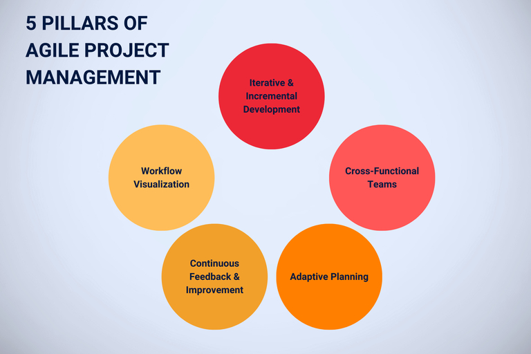
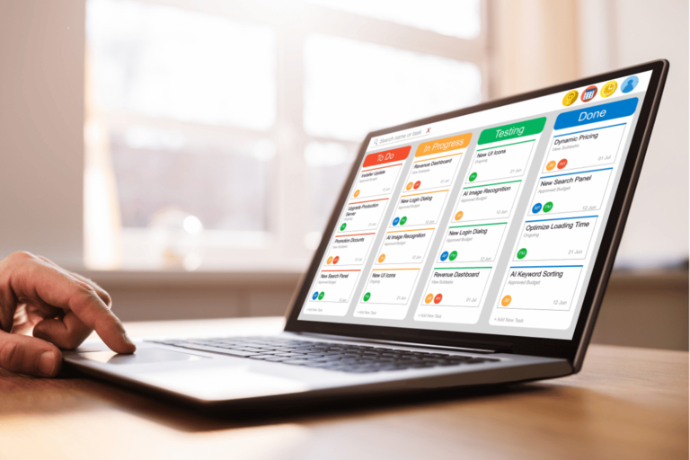
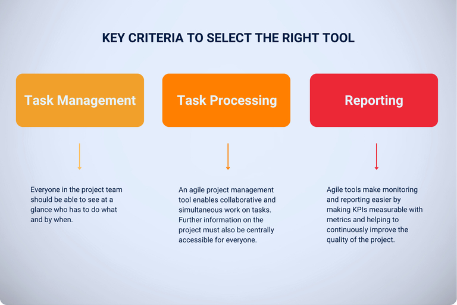

## Почему именно agile-управление проектами?

Команды должны уметь **гибко и быстро реагировать на изменения в проекте**, чтобы достичь наилучшего результата для клиента с учетом обстоятельств. Agile-управление проектами способствует именно такой адаптации и гарантирует, что обратная связь и **пожелания заказчика будут учтены в разработке на ранней стадии**.

Agile-методы позволяют быстро разрабатывать, тестировать и представлять первые результаты. Таким образом, шаг за шагом создается продукт, который точно соответствует потребностям вашего клиента.

Различные agile-инструменты помогут вам успешно внедрить agile-управление проектами в вашей компании. Узнайте больше о **методах, таких как Scrum или Kanban**, и узнайте, как инструменты agile-управления проектами могут помочь вашей команде сделать проекты более гибкими и эффективными.

## Как работает agile-управление проектами?

Agile-управление проектами делит сложные процессы на управляемые части и назначает определенные роли, такие как владелец продукта и Scrum-мастер. Это позволяет вашей команде работать вместе структурированно и гибко. Вместо того чтобы стремиться к жесткой конечной цели, agile-управление проектами фокусируется на максимизации **ценности для клиента и быстром реагировании на меняющиеся требования**.

Проект делится на спринты**, каждый из которых представляет собой короткую и четкую фазу работы, в ходе которой вы решаете определенные задачи и достигаете поставленных целей. Планы постоянно проверяются на практике** и могут быть адаптированы настолько быстро, что ваша команда может гибко реагировать на новые события. **Регулярные встречи** обеспечивают эффективную коммуникацию, а промежуточные результаты представляются на постоянной основе, чтобы собрать обратную связь и убедиться, что проект отвечает потребностям.

## Для каких проектов подходит agile-управление проектами?

Agile-управление проектами особенно подходит для проектов, которые характеризуются высокой степенью динамичности и быстрой изменчивости. Сюда относятся не только разработка программного обеспечения и продуктов, но и маркетинговые кампании, исследовательские или инновационные проекты, где важна регулярная обратная связь и быстрая корректировка.

Инструменты и методы Agile идеально подходят для использования в тех случаях, когда **требования еще четко не определены** или могут меняться в ходе проекта. Agile-управление проектами также демонстрирует свои сильные стороны в проектах, требующих тесного **сотрудничества** с вашими клиентами или различными заинтересованными сторонами. Ориентированные на клиента и инновационные решения могут быть разработаны с помощью итеративных и гибких методов работы.

## Существуют ли методы agile-управления проектами, которые вы должны знать?

В agile-управлении проектами существует ряд методов, которые вы можете гибко адаптировать к требованиям различных проектов. Наиболее известными являются **Scrum и Kanban**, каждый из которых предлагает особые подходы к структурированию и оптимизации рабочих процессов. Давайте подробнее рассмотрим Scrum и Kanban, чтобы понять, чем отличаются эти два подхода.

### Scrum - классика agile-управления проектами

Когда вы используете Scrum, вы четко определяете **роли участников проекта**, а также планируемые результаты и события. Частичные результаты оформляются в короткие **спринты** - в разработке продукта, например, это может быть новая версия продукта или конкретная функция. Эти промежуточные результаты представляются заказчику, чтобы получить обратную связь и внести коррективы на ранней стадии.

### Agile работа с Kanban

Возможно, вы уже знакомы с доской Канбан как важным инструментом управления agile-проектами. Здесь **задачи записываются в виде цифровых карточек на доске**, управляются и организуются в различные колонки - такие как "Выполнить", "В работе" и "Выполнено". Таким образом, прогресс каждой задачи визуально отслеживается, команда может выявлять узкие места на ранней стадии и эффективно управлять рабочим процессом. Такая структура помогает постоянно улучшать текущий статус и неуклонно продвигать проекты за счет множества небольших, быстро реализуемых шагов.

## Почему инструменты так важны для управления agile-проектами?

Правильно подобранный инструмент поможет вам перевести управление agile-проектами из теории в практику. Эффективно распределяются ресурсы, упрощается коммуникация внутри команды и появляется четкое управление задачами. Правильные инструменты также обеспечивают большую прозрачность: **Члены команды могут видеть ход выполнения всех задач**, а руководители проектов - выявлять узкие места или задержки на ранних стадиях.

Инструменты управления Agile-проектами также позволяют получить ценную информацию **о различных ключевых показателях эффективности (KPI)**, которые показывают, насколько успешным был проект на данный момент и где могут потребоваться корректировки. Это позволяет постоянно информировать всех участников проекта и гибко реагировать на изменения, чтобы обеспечить успех проекта.

## Критерии выбора подходящего инструмента

Чтобы найти инструменты для управления agile-проектами, вам следует ознакомиться с **обзором программного обеспечения и приложений**, доступных на рынке. Затем протестируйте несколько программ и определите, отвечают ли они вашим требованиям.

Сколько преимуществ вы получаете по цене и могут ли другие инструменты управления проектами сделать больше? Могут ли ваши сотрудники работать с пользовательским интерфейсом и довольны ли они им? Что касается функций? Agile-инструменты всегда должны охватывать следующие три области:

- **Управление задачами:** Каждый должен иметь возможность сразу видеть, кто и когда что должен сделать.
- **Сотрудничество в команде:** Инструмент управления проектами agile позволяет выполнять задачи совместно и одновременно. Дополнительная информация о проекте также должна быть централизованно доступна для всех.
- **Отчетность:** Заинтересованные стороны могут ожидать отчета о проделанной работе после каждого спринта. Agile-инструменты облегчают эту задачу, делая KPI измеримыми с помощью метрик и помогая постоянно улучшать качество проекта.

## Какие инструменты существуют для agile-управления проектами?

Прежде чем инвестировать в инструменты для управления agile-проектами, стоит провести сравнение. В следующих 10 программах и [облачных решениях]({{ relref "seatable-cloud" }}) мы рассмотрим набор функций, удобство использования, возможности совместной работы, хостинг, защиту данных и стоимость. Это позволяет выявить интересные различия и менее известные инструменты, которые конкурируют с ведущими и набирают очки, например, как альтернатива Jira или Trello.

### Asana

Asana - один из самых популярных инструментов для управления задачами и проектами, который может похвастаться удобным интерфейсом и интуитивно понятным управлением**. Вы можете назначать различные категории и цвета для заметок. Данные можно отображать как в виде диаграммы Ганта, так и в виде списков или доски Канбан. Командная работа поддерживается областями "Команды", "Входящие" и "Обсуждения". Несмотря на то, что отчетность в [Asana](https://asana.com/de) ограничивается простой статистикой, инструмент впечатляет своим **GDPR соответствием благодаря расположению серверов в Европе\*\*. Некоторые детали, такие как функции фильтрации задач, доступные в других agile [инструментах управления проектами](), в Asana отсутствуют. Однако упрощенная презентация позволяет участникам проекта сосредоточиться на главном. Компания из Сан-Франциско предлагает чисто облачное решение, которое можно использовать легко и без дополнительной инфраструктуры, хотя это лишает возможности самостоятельного хостинга. Начать работу можно бесплатно, а платные подписки начинаются от 10,99 евро за пользователя/месяц.

### monday.com

monday.com - это альтернатива, которая привлекает внимание своими настраиваемыми рабочими процессами и различными видами проектов. Это дает возможность каждой команде адаптировать инструмент управления проектами к своим потребностям. Благодаря мощной автоматизации и совместной работе в режиме реального времени**, он облегчает организацию сложных рабочих процессов. Несмотря на то, что monday.com относительно сложен в использовании и требует некоторого первоначального обучения**, он предлагает **полные панели инструментов и функции отчетности** для составления отчетов. Израильская компания разработала свое программное обеспечение как полностью облачный инструмент и поэтому не предлагает возможности для локальной работы. С точки зрения защиты данных, вы не можете разместить программное обеспечение у себя, но вы можете, по крайней мере, работать с ним в соответствии с GDPR, так как **серверы в ЕС** доступны. Стоимость платной подписки начинается от 9 евро за пользователя в месяц, что делает monday.com масштабируемым решением, которое, как и Asana, быстро приносит прибыль.

### Jira

Jira, продукт австралийской компании Atlassian, известен своими широкими функциями управления проектами, ориентированными, в частности, на такие agile-методы, как Scrum, Kanban и Extreme Programming. Гибко настраиваемые [рабочие процессы]() позволяют структурированно управлять **сложными проектами**. Однако из-за многообразия опций и интеграций - особенно с другими продуктами Atlassian - Jira требует много предварительных знаний и **длительного ознакомления**. Это **решение изначально предназначалось для команд разработчиков**, и даже им иногда трудно уследить за сложными функциями. Благодаря **всеобъемлющим возможностям отчетности и анализа**, Jira Software особенно подходит для команд, которым нужны подробные сведения и статистика. В зависимости от ваших потребностей вы можете использовать Jira как облачную версию через AWS или разместить ее на собственном оборудовании. Серверы, расположенные в Дублине и Франкфурте-на-Майне, гарантируют соответствие GDPR. Бесплатная версия** доступна для небольших **команд до 10 пользователей, а платная подписка начинается от 7,90 евро за пользователя в месяц. Поскольку экспортировать проекты из Jira в другие инструменты управления проектами agile не так-то просто, вам следует хорошо подумать, прежде чем использовать ее. Компания Atlassian, естественно, хочет предотвратить переход на альтернативу Jira в кратчайшие сроки.

### Trello

Как инструмент управления проектами и совместной работы Trello - это внутренняя альтернатива Jira от Atlassian. Он **основан на досках Kanban** и используется для организации проектов и задач с помощью карточек для команд и отдельных пользователей. Хотя функции **отчетности скудны** по сравнению с другими инструментами, Trello можно индивидуально расширять с помощью так называемых бонусов. Благодаря комментариям, упоминаниям и удобному командному взаимодействию Trello обеспечивает эффективную совместную работу, не загромождая пространство. Trello - это интуитивно понятный инструмент, который впечатляет своим простым дизайном. Интерфейс **пользователя прост и понятен**, что облегчает управление задачами и проектами. Однако в сравнении с ним Trello предлагает довольно **малый набор функций**, что делает почти все agile-инструменты полноценной альтернативой Trello. Trello работает исключительно через облако и не предназначен для локальных установок. Сама компания Atlassian утверждает, что соблюдает GDPR, хотя штаб-квартира и серверы Trello находятся в США. Инструмент доступен в бесплатной базовой версии, а платные подписки начинаются от 5 долларов США за пользователя в месяц.

### ClickUp

Еще один продукт из США - ClickUp. Это программное обеспечение впечатляет своей **обширной функциональностью**, которая варьируется от универсальных функций управления проектами, настраиваемых представлений и рабочих процессов до **интегрированной документации и белых досок**. Такое разнообразие позволяет командам настраивать инструмент под свои нужды, хотя это и требует **некоторого периода обучения**. Широкие возможности коммуникации и командные инструменты облегчают координацию. Благодаря функциям отчетности и инструментальным панелям ClickUp предоставляет **подробную информацию о прогрессе и эффективности работы команды**. Инструмент для управления проектами доступен только в виде облачного решения и не может быть установлен локально. Соответствие GDPR и возможность выбора европейских серверов AWS для хранения данных должны обеспечить надежную защиту информации. Базовая версия бесплатна, а платная подписка начинается от 7 долларов США за пользователя в месяц.

### MeisterTask

MeisterTask опирается на понятный, удобный интерфейс и привлекательный дизайн, благодаря которым управление задачами и проектами становится простым делом. Являясь альтернативой Trello, инструмент **основан на подходе Kanban** и позволяет отслеживать и автоматизировать время в дополнение к управлению задачами. Доски Канбан позволяют легко перемещать задачи в соответствии с текущим статусом обработки. Простая совместная работа с комментариями и упоминаниями делает MeisterTask простым в использовании и способствует прозрачной командной работе. Хотя отчетность остается простой, ее вполне достаточно для многих команд. Программное обеспечение от немецкой компании MeisterLabs доступно только в облаке, поэтому оно представляет собой простое, масштабируемое решение для команд, но не для самостоятельного использования. Защита данных по-прежнему остается главным приоритетом: MeisterTask соответствует GDPR, а облачные серверы расположены в Германии. Базовая версия доступна бесплатно, а платная подписка начинается от 13,50 евро за пользователя в месяц.

### awork

Канбан-доски, таймлайны, списки - awork идеально подходит для agile-управления проектами. Альтернатива ClickUp опирается на понятный пользовательский интерфейс, с помощью которого **проекты можно индивидуально настраивать, планировать и выполнять**. Кроме того, **задачи можно легко перемещать с помощью drag-and-drop**, а функция live обеспечивает **автоматическое обновление** окна браузера. Это означает, что каждое изменение отображается прозрачно, и все члены команды всегда имеют одну и ту же актуальную информацию. Инструмент предлагает множество вариантов анализа для составления отчетов, которые можно обобщить в виде наглядных информационных панелей всего несколькими щелчками мыши. Благодаря гибкой системе **сотрудничества с помощью комментариев**, упоминаний и обмена файлами в режиме реального времени, коммуникация внутри команды проходит гладко. Компания базируется в Гамбурге, awork соответствует требованиям GDPR и размещается в Германии, что обеспечивает высокий уровень безопасности данных. Инструмент управления проектами доступен только как программное обеспечение как услуга и не может быть размещен локально на собственных серверах. Благодаря открытому Rest API инструмент может быть подключен к многочисленным приложениям. Стоимость начинается от 8 евро за пользователя в месяц, что делает awork более дешевой немецкой альтернативой MeisterTask.

### Wrike

Wrike, с другой стороны, родом из США и является инструментом управления проектами, который может быть как альтернативой ClickUp, так и альтернативой awork. Будь то полностью связанные календари, персонализированные доски Kanban или гибко устанавливаемые приоритеты задач - он предлагает множество возможностей. Как инструмент управления проектами, Wrike также фокусируется на совместной работе** внутри команды в режиме реального времени, межпроектной отчетности** и актуальных новостных лентах. **Отчеты и статистика - одна из сильных сторон Wrike**: Интерактивные информационные панели позволяют получить подробные данные и сведения о проекте. Wrike позволяет полностью использовать API, но базируется в облаке и предлагается только в виде SaaS. Поэтому самостоятельное размещение невозможно, но, по словам компании, защита данных гарантируется соответствием GDPR и европейским расположением серверов. Помимо бесплатной базовой версии, Wrike предлагает четыре платные подписки по цене от 10 долларов США за пользователя в месяц, что делает инструмент подходящим для растущих команд.

### Redmine

Redmine - это **открытое программное обеспечение** для управления проектами, которое является бесплатным и чрезвычайно **совместимым с другими решениями**. Как альтернатива Jira, Redmine включает в себя **подробное управление тикетами и ошибками**, а также диаграммы Ганта для планирования проектов. Однако Redmine подходит только для **подготовленных команд**, поскольку установка и настройка требуют глубоких знаний в области ИТ. Хотя программу можно расширить с помощью плагинов и тем, она менее удобна для пользователей, чем другие инструменты, поскольку с Redmine\*\* сложнее ознакомиться, а устаревший пользовательский интерфейс визуально непривлекателен. Функции отчетности универсальны и могут быть расширены с помощью плагинов. Как альтернатива Jira, Redmine в основном обеспечивает совместную работу команды, но без расширенных функций для предотвращения конфликтов в контексте синхронизации в реальном времени. Поскольку Redmine может быть размещен на собственном хостинге, суверенитет данных полностью остается за пользователем, что обеспечивает высочайшие стандарты безопасности.

### SeaTable

SeaTable - это инструмент управления проектами, который **гибко адаптируется** к требованиям вашей компании или проекта. Программное обеспечение обладает впечатляющим набором функций, которые выходят далеко за рамки гибкого управления проектами и охватывают другие бизнес-процессы. Благодаря многочисленным форматам отображения, таким как доски Канбан, диаграммы Ганта и списки, вы сможете всесторонне спланировать и организовать все свои задачи**. Интуитивно понятный пользовательский интерфейс и гибкие возможности настройки делают инструмент **понятным и простым в использовании\*\* даже для неопытных пользователей.

Если вы ищете программное обеспечение для управления проектами, которое поддерживает бесперебойную совместную работу команды благодаря **синхронизации в реальном времени, комментариям и управлению общими файлами**, SeaTable - это то, что вам нужно. Благодаря этому инструменту все члены вашей команды будут в курсе событий, а статус проекта будет прозрачным. Возможности анализа включают **настраиваемые панели и статистику**, которые позволяют регулярно проверять ход проекта и принимать обоснованные решения.

SeaTable предлагает вам **максимальную гибкость** в выборе хостинга: вы можете самостоятельно разместить программное обеспечение и установить [SeaTable On-Premises](https://seatable.com/ru/on-premises/) на своих собственных серверах, или использовать **удобную и масштабируемую облачную версию**, сохраняя при этом высочайшие стандарты безопасности. SeaTable - немецкая компания, которая хранит **все данные в соответствии с GDPR на немецких серверах**. В **бесплатной базовой версии** в вашем распоряжении множество основных функций. Для более продвинутых требований [SeaTable](https://seatable.com/ru/) предлагает привлекательные подписки по цене от 7 евро за пользователя/месяц.

В нашей библиотеке вы найдете [шаблоны управления проектами](https://seatable.io/ru/vorlagen/projekte/), которые вы можете использовать сразу же в бесплатной базовой версии.

### Лучшие результаты благодаря гибкому управлению проектами

Agile-управление проектами обеспечивает максимально возможную добавленную стоимость для вас и ваших клиентов - независимо от того, являются ли они внешними клиентами или внутренними заинтересованными сторонами. Инструменты Agile гарантируют, что **проекты могут гибко и эффективно реагировать на изменения**, и в то же время **качество и скорость работы над проектом остаются высокими**. Поскольку agile-управление проектами уже прочно вошло в жизнь многих компаний, для поддержки вашего способа работы существует широкий спектр мощных инструментов, которые могут быть адаптированы к индивидуальным требованиям проекта.

На первый взгляд представленные инструменты могут показаться довольно похожими, однако они сильно отличаются друг от друга тем, какие функции предоставляются бесплатно, предлагают ли они самостоятельное размещение или чисто облачные решения, как и где хранятся ваши данные и сколько времени требуется на обучение пользователей. Например, Trello и SeaTable - самые дешевые инструменты, хотя Trello доступен только на американских облачных серверах и предлагает значительно меньший набор функций. Почти все остальные инструменты, обладающие сопоставимыми функциями Kanban, предлагают полноценную альтернативу Trello. С другой стороны, SeaTable и Trello с их простым дизайном гораздо более интуитивны, чем monday, Jira или Redmine, которые поначалу могут ошеломить пользователей своей сложностью.

Тщательно сравнивайте и выбирайте инструмент, соответствующий вашим потребностям. Если вы ищете гибкое программное обеспечение для управления проектами, которое обещает максимальную гибкость и экономическую эффективность, SeaTable - это, вероятно, лучший выбор. Попробуйте его и зарегистрируйтесь бесплатно, указав свой адрес электронной почты, уже сегодня.



Регистрируйтесь на нашу рассылку и будьте в курсе всех событий, связанных с управлением проектами!


