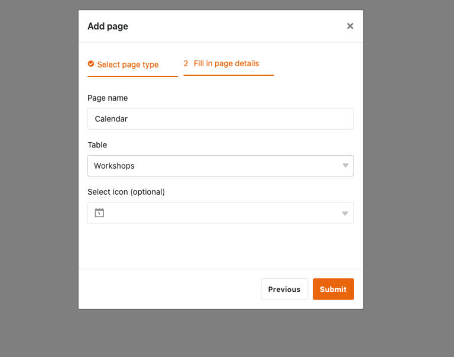

## Wie Sie ohne Programmierkenntnisse eine eigene App erstellen können

Haben Sie eine brillante App-Idee im Kopf, aber kein Budget für teure Entwickler? Oder vielleicht fehlt Ihnen die Zeit und das technische Know-how, um eigene Apps zu programmieren? Damit sind Sie nicht allein! Für viele Startups und kleine Unternehmen kann die Entwicklung einer maßgeschneiderten App zu einer kostspieligen und zeitraubenden Herausforderung werden. Doch die gute Nachricht ist: Es gibt einen Weg, wie Sie Ihre eigene App erstellen können – ohne Programmierkenntnisse und ohne ein Vermögen auszugeben.

In diesem Artikel zeigen wir Ihnen Schritt für Schritt, wie Sie eine **eigene App kostenlos erstellen**. Erfahren Sie, welches Tool sich am besten eignet und wie Sie Ihre App erfolgreich umsetzen.

## Was ein No-Code App Builder ist

Die Zeiten, in denen man programmieren musste, um eine eigene App zu erstellen, sind längst vorbei. Moderne Tools ermöglichen es auch Laien, in kürzester Zeit eine App zu erstellen – ganz **ohne Programmierkenntnisse**. Aber wie erstellt man eine App, ohne zu programmieren? Die Antwort liegt in der Nutzung von No-Code App Buildern.

Solche App Builder bieten Ihnen die Möglichkeit, Apps zu programmieren - kostenlos und ohne komplexe Hürden. Sie vereinfachen Ihre Prozesse und erstellen maßgeschneiderte Lösungen, die genau **auf Ihre Bedürfnisse zugeschnitten** sind. So lassen sich innovative Ideen schnell umsetzen, die Effizienz steigern und der Workflow optimieren.

## Wo Sie App Builder anwenden können

In Unternehmen aller Branchen gibt es vielfältige Workflows, die oft komplex und zeitaufwendig sind. Doch mit der richtigen App können Sie diese Abläufe effizienter und benutzerfreundlicher gestalten – egal, ob es dabei um interne Prozesse, die Verbesserung der Teamarbeit oder die Optimierung des Kundenerlebnisses geht.

- **Marketing:** Organisieren Sie Ihre Kampagnen, verfolgen Sie Ihre Erfolge und halten Sie Ihr Team auf Kurs. Mit einer personalisierten Marketing-App behalten Sie den Überblick – und sorgen dafür, dass Ihnen nichts mehr durch die Lappen geht.
- **Projektmanagement:** Schluss mit dem Papierchaos und den endlosen E-Mail-Verläufen! Erstellen Sie Apps, die Ihnen helfen Aufgaben und Deadlines im Blick zu behalten. Gestalten Sie Teamarbeit übersichtlich und ressourcenschonend.
- **HR:** Mit einer cleveren HR-App bringen Sie Ordnung in alle [HR-Prozesse](). Von Urlaubsanträgen über Arbeitszeiten bis hin zu Lohnabrechnungen – alles digital an einem Ort. So sparen Sie Ressourcen, reduzieren Fehler und haben mehr Zeit für das Wesentliche: Ihr Team.
- **Vertrieb:** Ob unterwegs oder im Büro – haben Sie Ihre Kundendaten immer griffbereit. Im Vertrieb kann eine App dabei helfen, Kundenkontakte zu pflegen, Verkaufszahlen zu überwachen und Angebote zu erstellen – und das alles mit wenigen Klicks. So verkürzen Sie Verkaufszyklen, verbessern die Kundenbindung und steigern Ihren Umsatz.
- **Softwareentwicklung:** Selbst Entwickler profitieren davon, eine eigene App zu erstellen: testen Sie User-Interfaces vor dem Programmieren, tracken Sie Bugs effizient und planen Sie Ihre Produkteinführungen präzise im Vorfeld. Das Ergebnis? Eine flexiblere [Softwareentwicklung]() und wertvolle Zeitersparnis im gesamten Entwicklungsprozess.

Und das ist nur der Anfang – die Möglichkeiten sind vielfältig und individuell anpassbar. 

## Vorteile von App Buildern im Vergleich zu herkömmlichen Entwicklungsmethoden

App Builder bieten im Vergleich zu klassischen Entwicklungsmethoden zahlreiche Vorteile, die bei näherer Betrachtung deutlich werden. Wo früher spezialisierte Entwicklerteams und hohe Budgets erforderlich waren, eröffnet der Einsatz von App Buildern völlig neue Möglichkeiten.

- **Einfach:** Fehlende Programmierkenntnisse stellen mit App Buildern kein Hindernis dar. Diese intuitiven Tools ermöglichen es Ihnen, eigene Apps zu erstellen, gestalten und zu veröffentlichen – ganz ohne technisches Fachwissen.
- **Schnell:** Im Vergleich zur traditionellen Entwicklung, die oft Monate beansprucht, spart Ihnen ein App Builder wertvolle Zeit. Das aufwendige Programmieren entfällt, wodurch die App binnen weniger Stunden startklar ist.
- **Günstig:** Individuell entwickelte Apps können schnell hohe Kosten verursachen, oft im Bereich von mehreren Tausend Euro. App Builder hingegen sind häufig deutlich günstiger, was sie besonders für kleinere Budgets attraktiv macht.
- **Unabhängig:** Die Verwendung eines App Builders bietet Ihnen die Möglichkeit, die App selbstständig und flexibel zu verwalten. Änderungen können jederzeit vorgenommen werden, ohne auf externe Entwickler angewiesen zu sein.
- **Risikoarm:** Durch die geringe finanzielle Investition wird das Risiko für Sie deutlich reduziert. Zudem sind App Builder ausgereifte, vielfach getestete Systeme, die potenzielle Fehlerquellen minimieren, die in einer individuell programmierten App auftreten könnten.

## Wie eine No-Code App funktioniert

App Builder arbeiten mit vordefinierten Modulen, die Sie individuell und benutzerfreundlich zusammenfügen können, um die gewünschte App zu realisieren. Dadurch lassen sich innerhalb kurzer Zeit erste Prototypen erstellen, mit denen Sie neue Workflows testen können. Durch die schnelle App-Erstellung können Sie auch rasch Erkenntnisse gewinnen. So zum Beispiel, ob der Prozess überhaupt benötigt wird oder etwa optimiert werden kann. Auf diese Weise können Sie jederzeit Anpassungen vornehmen, ohne fremde Hilfe zu benötigen.

**Hinweis**

Es gibt zwei Arten von Apps – native Apps und Web-Apps. **Native Apps** sind speziell für ein bestimmtes Betriebssystem entwickelt und werden direkt auf dem Gerät installiert, meist über einen App Store. **Web-Apps** hingegen werden über den Browser aufgerufen und erfordern keinen Download, da sie über eine Webadresse zugänglich sind.

## App Builder im Vergleich

Eine eigene App zu erstellen, muss heute keine komplizierte Aufgabe mehr sein. Dank moderner App Builder können Sie auch ohne Programmierkenntnisse Ihre Ideen schnell und effizient umsetzen. Doch der Markt ist groß und verschiedene Tools bieten verschiedene Vor- und Nachteile. In diesem Abschnitt werden drei dieser Tools vorgestellt: Bubble, Adalo und Glide. Jedes dieser Tools bietet spezifische Funktionen, die wir im Detail beleuchten.

### Bubble

Bubble ist ein leistungsstarker, visuell orientierter App Creator, der sich vor allem an Nutzer richtet, die anspruchsvolle Webanwendungen erstellen möchten. Mit seinem Drag-and-Drop-Editor ermöglicht Bubble die Gestaltung von Benutzeroberflächen und die Integration von Datenbanken und Workflows, ohne dass dafür Programmierkenntnisse erforderlich sind. Besonders attraktiv ist die Flexibilität, die Bubble bei der Erstellung von Web-Apps bietet. Nutzer können umfangreiche Logiken, Workflows und Datenstrukturen implementieren, die in vielen Fällen auch für den Aufbau komplexer Systeme ausreichen.

#### Vorteile

- Umfangreiche Design- und Anpassungsmöglichkeiten Ideal für komplexere Webanwendungen

#### Nachteile

- Begrenzte Flexibilität bei individuellen Anpassungen, da der vorgefertigte Code nicht vollständig anpassbar ist
- Zusätzliche Kosten für komplexere Funktionen oder Plugins

### Adalo

Wenn es um die schnelle und einfache Erstellung von mobilen Apps geht, ist Adalo eine gute Adresse. Der App Maker richtet sich vor allem an Nutzer, die iOS- und Android-Apps erstellen wollen, ohne sich in die Tiefen der Programmierung einarbeiten zu müssen. Dank einer benutzerfreundlichen Oberfläche und vorgefertigten Komponenten wie Listen, Buttons und Formularen können Anwendungen in kurzer Zeit erstellt werden. Besonders attraktiv ist, dass Apps einmalig entwickelt und mit minimalem Aufwand in verschiedenen App Stores veröffentlicht werden können.

#### Vorteile

- Intuitive Oberfläche mit einfacher Handhabung Vorlagen und Komponenten beschleunigen den Entwicklungsprozess
- Einfaches Publishing in den App Stores

#### Nachteile

- Eingeschränkt bei der Erstellung sehr komplexer Apps
- Kosten können bei größeren Projekten oder erweiterten Funktionen schnell steigen

### Glide

Glide verfolgt einen etwas anderen Ansatz als viele andere App Builder: Es setzt auf vorhandene Datenstrukturen. Besonders in Kombination mit Google Sheets zeigt Glide seine Stärken, denn aus bereits existierenden Daten können mit wenigen Klicks Apps erstellt werden. Durch die Drag-and-Drop-Oberfläche lassen sich diese Daten in ansprechende Benutzeroberflächen umwandeln. Glide eignet sich ideal für Anwendungen, die schnell einsatzbereit sein müssen – wie zum Beispiel interne Tools, Tracking-Apps oder mobile Apps für einfache Anwendungsfälle.

#### Vorteile

- Nutzt vorhandene Datenquellen wie Google Sheets
- Schnell und einfach zu bedienen
- Ideal für einfache bis mittlere App-Projekte

#### Nachteile

- Begrenzte Funktionen bei sehr komplexen Anwendungen
- Stark auf bestehende Datenquellen angewiesen

## In 3 Schritten zur eigenen App mit SeaTable

Wenn Sie nun eine eigene App erstellen wollen, aber bisher vor komplexem Programmiercode zurückgeschreckt sind, bietet SeaTable die ideale Lösung. Dieses leistungsstarke Tool gehört zu den modernen No Code App Buildern und ermöglicht es Ihnen, webbasierte Apps zu erstellen – kostenlos und ohne auch nur eine Zeile Code schreiben zu müssen. Dabei bilden Ihre Datenbanken in SeaTable ein Backend, auf das die Benutzer über eine App zugreifen können. So können Sie genau steuern, wer welche Daten sehen kann und wie diese visualisiert werden.

Stellen Sie sich also nicht länger die Frage: "Wie kann ich eine App erstellen?" – hier ist die Antwort! Die folgende Anleitung zeigt Schritt für Schritt, wie Sie im Handumdrehen mit SeaTable Ihre eigene App entwickeln können.

### Schritt 1: Eine Base erstellen

[Registrieren Sie sich zunächst kostenlos]() bei SeaTable. Nach dem Login gelangen Sie zu einer übersichtlichen Benutzeroberfläche, auf der Sie Ihre erste Base anlegen können. Es empfiehlt sich, im Vorfeld zu überlegen, wie Ihre App strukturiert sein soll – sei es eine Projektmanagement-App, ein Inventarsystem oder eine To-do-Liste. SeaTable bietet dafür verschiedene Vorlagen, die Sie nach Bedarf anpassen können.

Um eine vorgefertigte Vorlage zu nutzen, klicken Sie im Bereich „Meine Bases“ auf das Plus-Symbol und wählen die Option „Base von Vorlage erstellen“. In diesem Beispiel verwenden wir das Template für Workshops, das bereits mit Beispieldaten gefüllt ist. Das Ziel ist es, eine eigene App zu erstellen, die den Coaches eine zentrale Plattform bietet, auf der sie alle wichtigen Kursinformationen abrufen können.

### Schritt 2: Universelle App hinzufügen

Oben rechts können Sie nun über den App-Button eine Universelle App hinzufügen. Nachdem Sie der App einen Namen gegeben haben, öffnet sich eine neue Oberfläche. Diese ist noch leer, aber kann jetzt individuell an Ihre Bedürfnisse angepasst werden.

### Schritt 3: Seiten hinzufügen und konfigurieren

Zuallererst fügen Sie über die Schaltfläche links eine neue Seite hinzu. Hierbei können Sie unterschiedliche Seitentypen in der App erstellen, wie beispielsweise ein Kanban-Board, ein Webformular oder eine individuelle Seite.

#### Kalender

Um die Übersicht über alle Termine zu wahren, eignet sich ein Kalender, den Sie in der App erstellen. Wählen Sie diesen Seitentyp aus und vergeben Sie einen Seitennamen. Anschließend müssen Sie die entsprechende Tabelle auswählen, aus der die Daten gezogen werden. In diesem Fall ist das die Tabelle "Workshop". Optional können Sie anschließend ein passendes Icon auswählen.

Aktuell sind noch keine Datumsinformationen im App Builder vorhanden. Um dies zu ändern, klicken Sie auf das Zahnrad-Symbol und öffnen so die Seiteneinstellungen. Hier können Sie bei Start- und Enddatum die Spalte Datum auswählen, anschließend erscheinen die Termine im Kalender. Um die Workshops besser unterscheiden zu können, können Sie anschließend die Farbe der Kalendereinträge nach Sektor unterscheiden lassen.

#### Teilnehmerliste

Damit die Coaches der Kurse direkt sehen können, welche Teilnehmer sich bereits angemeldet haben, erstellen wir im App Builder eine praktische Teilnehmerliste. Dazu einfach eine neue Seite hinzufügen, den Seitentyp "Tabelle" wählen und "Teilnehmer" als Datenquelle festlegen. Schon sind alle Anmeldungen sichtbar. Für mehr Struktur lassen sich die Teilnehmer über den Reiter "Gruppieren" bequem nach Workshops sortieren.

#### Individuelle Seite

Ein besonders spannender Seitentyp ist die individuelle Seite. Mit dieser Ansicht lassen sich benutzerfreundliche Dashboards in der App erstellen, die alle wichtigen Informationen kompakt bündeln. Sobald die Seite erstellt ist, können Sie per Drag-and-Drop Elemente wie Bilder, Statistiken, Container oder Karten hinzufügen – ganz nach Ihren Bedürfnissen.

Fangen wir mit einer Statistik an: Fügen Sie im App Builder ein neues Feld ein, das Sie per Klick konfigurieren können. Wir entscheiden uns für ein einfaches Säulendiagramm und wählen die Feedback-Tabelle aus. Jetzt geht’s an die Datenauswahl: Wir wollen sehen, wie die Workshops bewertet wurden. Für die x-Achse wählen Sie "Workshops", für die y-Achse "Feld zusammenfassen", wodurch weitere Optionen erscheinen. Als Summenfeld nehmen Sie das Rating der Workshops und lassen die Auswertung auf "Summe" eingestellt. So erhalten wir einen klaren Überblick darüber, welche Kurse die besten Bewertungen bekommen haben.

Im nächsten Schritt möchten wir von der individuellen Seite aus auf den Kalender und die Teilnehmerliste zugreifen. Dafür fügen Sie zwei Karten hinzu, die sich bequem per Maus vergrößern, verkleinern oder an eine andere Stelle verschieben lassen. Damit die Karten auch funktionieren, verlinken wir sie – eine zum Kalender, die andere zur Teilnehmerliste. Zum Schluss können Sie noch passende Bilder einfügen, und voilà, Ihr Dashboard ist einsatzbereit! Um es noch einfacher zu erreichen, können Sie die Seite in der linken Leiste nach oben verschieben, damit sie als Startseite dient.

Nun, da Sie die Grundlagen der Universal App beherrschen, probieren Sie doch mal selbst einige Seitentypen aus! Wie wäre es zum Beispiel mit einer Seite, auf der Coaches ihr Feedback detaillierter sehen können? Oder ein Webformular, über das sich beispielsweise neue Termine für Kurse einreichen lassen?

**Tipp**:

Wenn Sie noch ein wenig stöbern und weitere Funktionen der Apps entdecken möchten, werfen Sie doch einen Blick auf die Vorlagen [Arbeitszeiterfassung]() oder [Reiseplaner](). Diese enthalten bereits vollständig ausgearbeitete Apps, die Sie sofort nutzen und anpassen können.

### Fazit

No Code App Builder wie SeaTable eröffnen Ihnen ganz neue Möglichkeiten, eigene Apps zu erstellen – kostenlos und ohne technisches Wissen. Sie bieten Ihnen nicht nur Flexibilität und schnelle Ergebnisse, sondern auch die Freiheit, Ideen eigenständig umzusetzen. Egal ob für Marketing, Projektmanagement oder Vertrieb – mit den richtigen Tools können Sie Ihre Arbeitsprozesse effizienter gestalten und Ihr Unternehmen auf das nächste Level bringen. Warum also warten? Probieren Sie es kostenlos aus und entdecken Sie, wie einfach App-Entwicklung heute sein kann.



## Häufig gestellte Fragen beim App erstellen


Ein App Builder ist ein Tool, das ermöglicht, Apps ohne Programmierkenntnisse zu erstellen. Mit visuellen Drag-and-Drop-Editoren und vorgefertigten Modulen können Sie eigene Apps erstellen, ohne sich mit technischen Aspekten auseinandersetzen zu müssen.


App Builder sind ideal für Unternehmen, Freiberufler und Startups, die individuelle Lösungen benötigen, aber weder die Zeit noch das Budget für die traditionelle App-Entwicklung aufbringen können. Auch Entwickler können von diesen Tools profitieren, um Prototypen zu testen oder User-Interfaces zu gestalten.


Um eine eigene App zu erstellen, wählen Sie einen No Code App Builder wie SeaTable. In wenigen einfachen Schritten erstellen Sie so eine App: Base anlegen, Universelle App hinzufügen, Seiten konfigurieren und Elemente wie Kalender, Formulare oder Tabellen integrieren.


