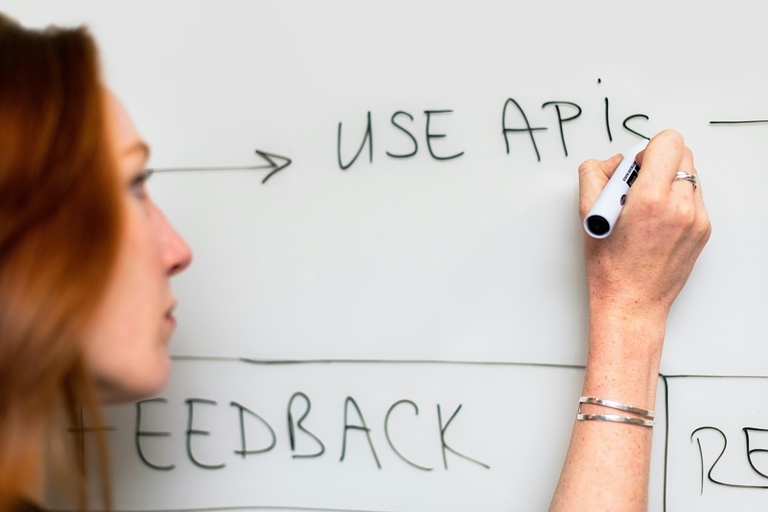
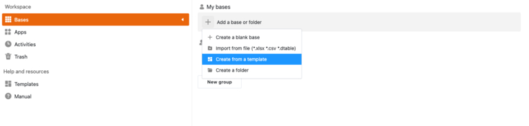
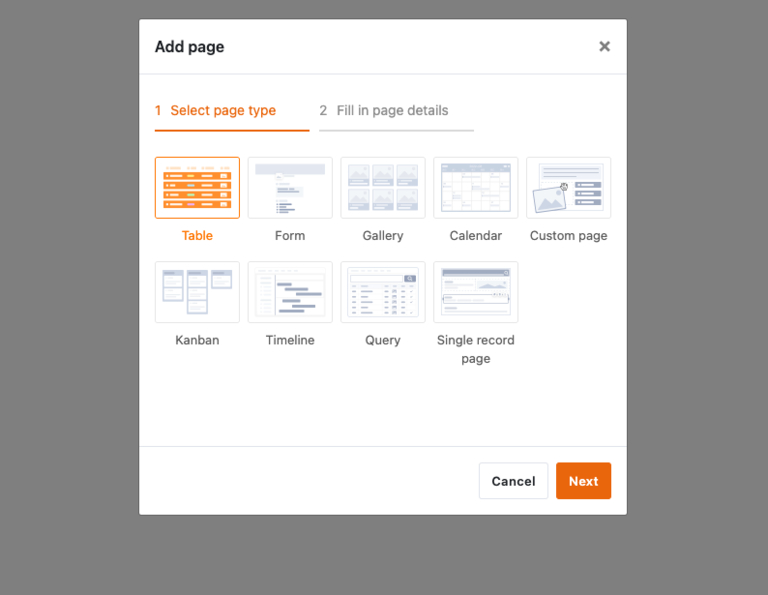
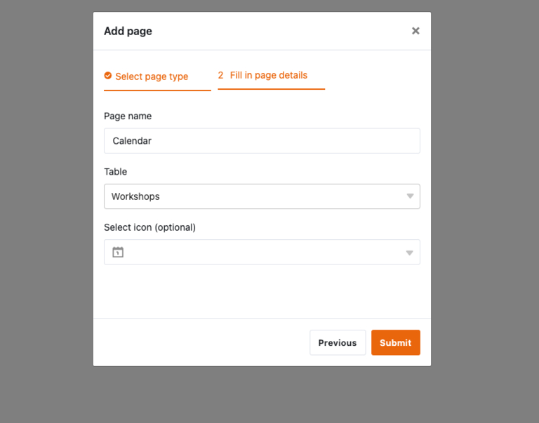
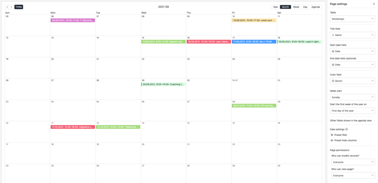
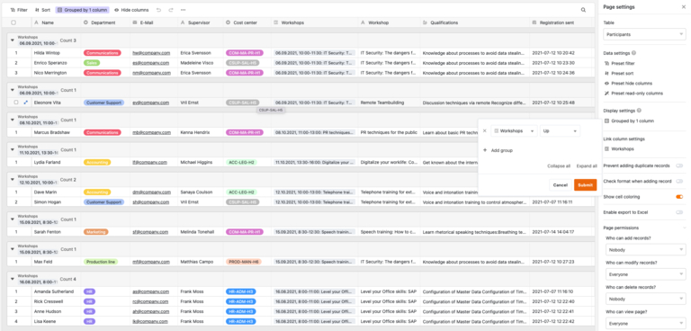
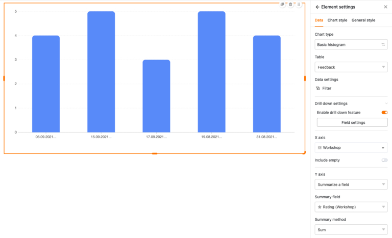
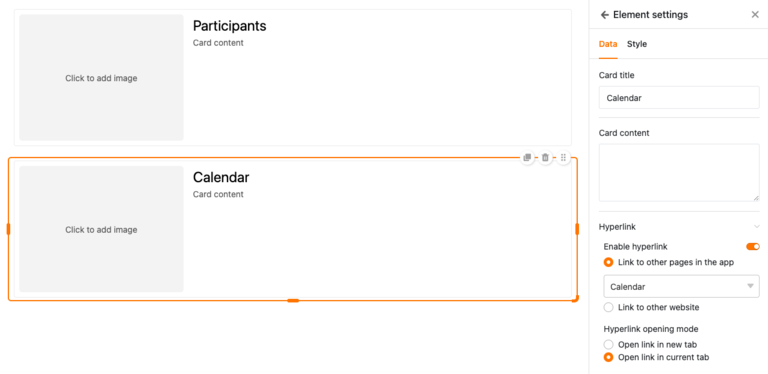
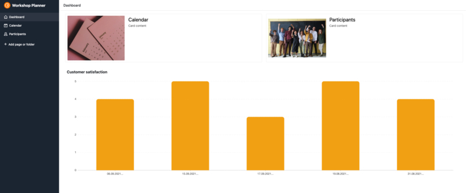

## How to create your own app without programming knowledge

Do you have a brilliant app idea in mind, but no budget for expensive developers? Or maybe you lack the time and technical know-how to program your own apps? You're not alone! For many startups and small businesses, developing a customized app can be a costly and time-consuming challenge. But the good news is: there is a way you can create a free app - without coding skills and without spending a fortune.

In this article, we'll show you step by step how to create your **own app for free**. Find out which tool is best suited and how to successfully implement your app.

## What a no-code app builder is

The days when you had to program to create your own app are long gone. Modern tools make it possible for even non-experts to create an app in no time at all - without any programming knowledge at all. But how do you create an app without programming? The answer lies in the use of no-code app builders.

Such app builders offer you the opportunity to program apps - free of charge and without complex hurdles. They simplify your processes and create customized solutions that are precisely **tailored to your needs**. This allows you to quickly implement innovative ideas, increase efficiency and optimize your workflow.

## Where you can use App Builder

Companies in all industries have diverse workflows that are often complex and time-consuming. But with the right app, you can make these workflows more efficient and user-friendly - whether it's internal processes, improving teamwork or optimizing the customer experience.

- **Marketing:** Organize your campaigns, track your successes and keep your team on track. With a personalized marketing app, you can stay on top of things - and make sure nothing slips through the cracks.
- **Project management:** Put an end to paper chaos and endless emails! Create apps that help you keep track of tasks and deadlines. Organize teamwork clearly and save resources.
- **HR:** With a clever HR app, you can bring order to all [HR processes](). From vacation requests to working hours and payroll accounting - everything is in one digital place. This saves resources, reduces errors and gives you more time for what really matters: Your team.
- **Sales:** Whether you're on the road or in the office - always have your customer data to hand. In sales, an app can help you maintain customer contacts, monitor sales figures and create quotes - all with just a few clicks. This shortens sales cycles, improves customer loyalty and increases your turnover.
- **Software development:** Even developers benefit from creating their own app: test user interfaces before programming, track bugs efficiently and plan your product launches precisely in advance. The result? More flexible [software development]() and valuable time savings throughout the entire development process.

And that's just the beginning - the possibilities are diverse and customizable.

## Advantages of app builders compared to conventional development methods

App builders offer numerous advantages over traditional development methods, which become clear on closer inspection. Where previously specialized development teams and high budgets were required, the use of free app builders opens up completely new possibilities.

- **Simple:** Lack of programming knowledge is no obstacle with app builders. These intuitive tools allow you to create, design and publish your own apps - without any technical expertise.
- **Fast:** Compared to traditional development, which often takes months, an free app builder saves you valuable time. There is no need for time-consuming programming, so the app is ready for launch within a few hours.
- **Affordable:** Individually developed apps can quickly incur high costs, often in the region of several thousand euros. App builders, on the other hand, are often significantly cheaper, which makes them particularly attractive for smaller budgets.
- **Independent:** Using an free app builder allows you to manage the app independently and flexibly. Changes can be made at any time without having to rely on external developers.
- **Low-risk:** The low financial investment significantly reduces the risk for you. In addition, App Builders are mature, well-tested systems that minimize potential sources of error that could occur in an individually programmed app.

## How a no-code app works

App builders work with predefined modules that you can put together individually and in a user-friendly way to realize the desired app. This allows you to create initial prototypes in a short space of time, which you can use to test new workflows. Rapid app creation also allows you to quickly gain insights. For example, whether the process is needed at all or can be optimized. In this way, you can make adjustments at any time without the need for external help.

**Note**

There are two types of apps - native apps and web apps. **Native apps** are specially developed for a specific operating system and are installed directly on the device, usually via an app store. **Web apps**, on the other hand, are accessed via the browser and do not require a download as they are accessible via a web address.

## App Builder in comparison

Creating your own app no longer has to be a complicated task. Thanks to modern free app builders, you can implement your ideas quickly and efficiently even without programming knowledge. However, the market is large and different tools offer different advantages and disadvantages. Three of these tools are presented in this section: Bubble, Adalo and Glide. Each of these tools offers specific functions, which we will examine in detail.

### Bubble

Bubble is a powerful, visually-oriented app creator aimed primarily at users who want to create sophisticated web applications. With its drag-and-drop editor, Bubble enables the design of user interfaces and the integration of databases and workflows without the need for programming skills. The flexibility that Bubble offers when creating web apps is particularly attractive. Users can implement extensive logics, workflows and data structures, which in many cases are sufficient for building complex systems.

#### Advantages

- Extensive design and customization options Ideal for more complex web applications

#### Disadvantages

- Limited flexibility for customization as the pre-built code is not fully customizable
- Additional costs for more complex functions or plugins

### Adalo

When it comes to the quick and easy creation of mobile apps, Adalo is a good address. The app maker is primarily aimed at users who want to create iOS and Android apps without having to delve into the depths of programming. Thanks to a user-friendly interface and ready-made components such as lists, buttons and forms, applications can be created in a short space of time. A particularly attractive feature is that apps can be developed once and published in various app stores with minimal effort.

#### Advantages

- Intuitive interface with simple handling Templates and components speed up the development process
- Simple publishing in the app stores

#### Disadvantages

- Limited when creating very complex apps
- Costs can rise quickly for larger projects or extended functions

### Glide

Glide takes a slightly different approach to many other app builders: It relies on existing data structures. Glide shows its strengths particularly in combination with Google Sheets, as apps can be created from existing data with just a few clicks. The drag-and-drop interface allows this data to be transformed into appealing user interfaces. Glide is ideal for applications that need to be ready for use quickly - such as internal tools, tracking apps or mobile apps for simple use cases.

#### Advantages

- Uses existing data sources such as Google Sheets
- Quick and easy to use
- Ideal for simple to medium-sized app projects

#### Disadvantages

- Limited functions for very complex applications
- Heavily dependent on existing data sources

## 3 steps to your own app with SeaTable

If you want to create your own app but have previously shied away from complex programming code, SeaTable offers the ideal solution. This powerful tool is one of the modern no-code app builders and allows you to create web-based apps - free of charge and without having to write a single line of code. Your databases in SeaTable form a backend that users can access via an app. This allows you to control exactly who can see which data and how it is visualized.

So no longer ask yourself the question: "How can I create an app?" - here is the answer! The following step-by-step guide will show you how to develop your own app with SeaTable in no time at all.

### Step 1: Create a base

[First register for free]() with SeaTable. After logging in, you will be taken to a clear user interface where you can create your first base. It is advisable to consider in advance how your app should be structured - be it a project management app, an inventory system or a to-do list. SeaTable offers various templates for this, which you can customize as required.

To use a ready-made template, click on the plus symbol in the "My bases" area and select the "Create base from template" option. In this example, we are using the template for workshops, which is already filled with sample data. The goal is to create a custom app that provides coaches with a central platform where they can access all important course information.

### Step 2: Add universal app

You can now add a universal app via the app button at the top right. After you have given the app a name, a new interface opens. This is still empty, but can now be customized to your needs.

### Step 3: Add and configure pages

First of all, add a new page using the button on the left. You can create different types of pages in the app, such as a Kanban board, a web form or an individual page.

#### Calendar

To keep track of all appointments, you can create a calendar in the app. Select this page type and assign a page name. You must then select the corresponding table from which the data is to be taken. In this case, this is the "Workshop" table. Optionally, you can then select a suitable icon.

There is currently no date information in the App Builder. To change this, click on the gear icon to open the page settings. Here you can select the Date column for the start and end date, after which the dates will appear in the calendar. To make it easier to distinguish the workshops, you can then differentiate the color of the calendar entries by sector.

#### List of participants

So that the coaches of the courses can see directly which participants have already registered, we create a practical list of participants in the App Builder. To do this, simply add a new page, select the page type "Table" and specify "Participants" as the data source. All registrations are now visible. For more structure, the participants can be conveniently sorted by workshop using the "Group" tab.

#### Individual page

A particularly exciting page type is the individual page. With this view, you can create user-friendly dashboards in the app that bundle all important information in a compact form. Once the page has been created, you can add elements such as images, statistics, containers or maps using drag-and-drop - just as you need them.

Let's start with statistics: Add a new field in the App Builder, which you can configure with a click. We opt for a simple bar chart and select the feedback table. Now it's time to select the data: We want to see how the workshops were rated. Select "Workshops" for the x-axis and "Summarize field" for the y-axis, which will display further options. For the summary field, take the rating of the workshops and leave the evaluation set to "Sum". This gives us a clear overview of which courses have received the best ratings.

In the next step, we want to access the calendar and the participant list from the individual page. To do this, add two cards that can be easily enlarged, reduced or moved to another location using the mouse. To make the cards work, we link them - one to the calendar, the other to the list of participants. Finally, you can add suitable images and voilà, your dashboard is ready to use! To make it even easier to access, you can move the page in the left-hand bar to the top so that it serves as the start page.

Now that you have mastered the basics of the Universal App, why not try out some page types yourself? For example, how about a page where coaches can see their feedback in more detail? Or a web form that can be used to submit new dates for courses, for example?

**Tip**:

If you would like to browse a little more and discover additional app functions, take a look at the [Time tracking](https://seatable.io/vorlage/fyp0x2y-s-ut3m-wcbpzbq/) or [Travel planner](https://seatable.io/vorlage/axq_85kkrjsriagmqpxehw/) templates. These already contain fully developed apps that you can use and customize immediately.

### Conclusion

No code app builders such as SeaTable open up completely new possibilities for you to create your own apps - free of charge and without any technical knowledge. They not only offer you flexibility and fast results, but also the freedom to implement ideas independently. Whether for marketing, project management or sales - with the right tools, you can make your work processes more efficient and take your company to the next level. So why wait? Try it out for free and discover how easy app development can be today.



## Frequently asked questions when creating an app



What is an app builder?|||
An app builder is a tool that allows you to create apps without programming knowledge. With visual drag-and-drop editors and ready-made modules, you can create your own apps without having to deal with technical aspects.

---

Who is an App Builder suitable for?|||
App builders are ideal for companies, freelancers and startups who need customized solutions but don't have the time or budget for traditional app development. Developers can also benefit from these tools to test prototypes or design user interfaces.

---

How do I create my own app?|||
To create your own app, choose a free no-code app builder like SeaTable. You can create an app in just a few simple steps: create a base, add a universal app, configure pages and integrate elements such as calendars, forms or tables.

