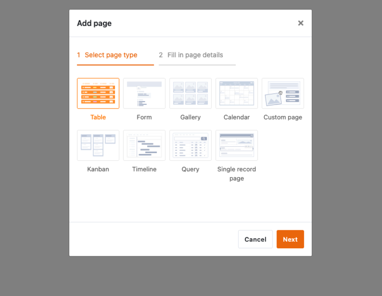
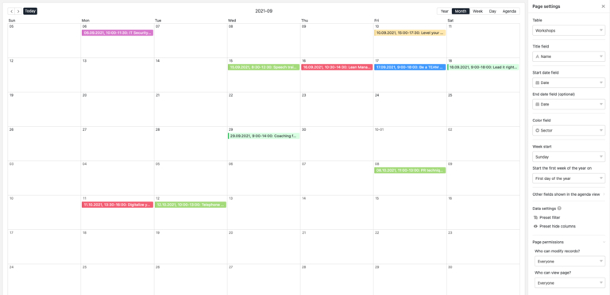

## Cómo crear tu propia app sin conocimientos de programación

¿Tienes en mente una idea brillante para una aplicación, pero no tienes presupuesto para desarrolladores caros? ¿O quizá no tienes tiempo ni conocimientos técnicos para programar tus propias aplicaciones? No es el único. Para muchas empresas de nueva creación y pequeñas empresas, desarrollar una aplicación personalizada puede ser un reto costoso y lento. Pero la buena noticia es que hay una forma de crear tu propia aplicación, sin conocimientos de programación y sin gastarte una fortuna.

En este artículo, te mostraremos paso a paso cómo crear tu **propia aplicación de forma gratuita**. Descubre qué herramienta es la más adecuada y cómo poner en marcha tu app con éxito.

## Qué es un creador de aplicaciones sin código

Los días en los que tenías que programar para crear tu propia app han quedado atrás. Las herramientas modernas permiten incluso a los no expertos crear una aplicación en un abrir y cerrar de ojos, **sin ningún conocimiento de programación**. Pero, ¿cómo se crea una aplicación sin programar? La respuesta está en el uso de creadores de aplicaciones sin código.

Estos creadores de aplicaciones te ofrecen la oportunidad de programar aplicaciones de forma gratuita y sin complejos obstáculos. Simplifican sus procesos y crean soluciones **personalizadas que se adaptan exactamente a sus necesidades**. Esto le permite aplicar rápidamente ideas innovadoras, aumentar la eficiencia y optimizar su flujo de trabajo.

## Dónde puedes usar App Builder

Las empresas de todos los sectores tienen diversos flujos de trabajo que a menudo son complejos y requieren mucho tiempo. Pero con la aplicación adecuada, puede hacer que estos flujos de trabajo sean más eficientes y fáciles de usar, ya se trate de procesos internos, de mejorar el trabajo en equipo o de optimizar la experiencia del cliente.

- **Marketing:** Organice sus campañas, controle sus éxitos y mantenga a su equipo al día. Con una aplicación de marketing personalizada, puede hacer un seguimiento de todo y asegurarse de que no se le escapa nada.
- **Gestión de proyectos:** ¡Acabe con el caos del papel y los correos electrónicos interminables! Cree aplicaciones que le ayuden a controlar las tareas y los plazos. Organiza claramente el trabajo en equipo y ahorra recursos.
- **RRHH:** Con una aplicación inteligente de RRHH, puedes poner orden en todos los procesos de RRHH. Desde las solicitudes de vacaciones y las horas de trabajo hasta las nóminas, todo en un único lugar digital. Esto ahorra recursos, reduce errores y te deja más tiempo para lo que realmente importa: Su equipo.
- **Ventas:** Tanto si estás de viaje como en la oficina, ten siempre a mano los datos de tus clientes. En ventas, una aplicación puede ayudarle a mantener los contactos con los clientes, controlar las cifras de ventas y crear presupuestos, todo ello con unos pocos clics. Esto acorta los ciclos de venta, mejora la fidelidad de los clientes y aumenta el volumen de negocio.
- **Desarrollo de software:** Incluso los desarrolladores se benefician de la creación de su propia aplicación: prueban las interfaces de usuario antes de programar, controlan los errores de forma eficaz y planifican el lanzamiento de sus productos con antelación. ¿El resultado? Un desarrollo de software más flexible y un valioso ahorro de tiempo a lo largo de todo el proceso de desarrollo.

Y eso es sólo el principio: las posibilidades son diversas y personalizables.

## Ventajas de los app builders frente a los métodos de desarrollo convencionales

En comparación con los métodos de desarrollo tradicionales, los creadores de aplicaciones ofrecen numerosas ventajas que se hacen evidentes al examinarlas más de cerca. Donde antes se necesitaban equipos de desarrollo especializados y presupuestos elevados, el uso de creadores de aplicaciones abre posibilidades completamente nuevas.

- **Sencillez:** La falta de conocimientos de programación no es un obstáculo con los creadores de aplicaciones. Estas herramientas intuitivas le permiten crear, diseñar y publicar sus propias aplicaciones sin necesidad de conocimientos técnicos.
- **Rápido:** En comparación con el desarrollo tradicional, que a menudo lleva meses, un creador de aplicaciones le ahorra un tiempo muy valioso. No hay necesidad de programación, por lo que la aplicación está lista para su lanzamiento en unas pocas horas.
- **Asequible:** Las aplicaciones desarrolladas individualmente pueden tener rápidamente un coste elevado, a menudo de varios miles de euros. En cambio, los creadores de aplicaciones suelen ser bastante más baratos, lo que los hace especialmente atractivos para los presupuestos más reducidos.
- **Independiente:** Utilizar un creador de aplicaciones le permite gestionar la aplicación de forma independiente y flexible. Se pueden hacer cambios en cualquier momento sin tener que depender de desarrolladores externos.
- **Bajo riesgo:** La baja inversión financiera reduce significativamente el riesgo para usted. Además, los App Builders son sistemas maduros y bien probados que minimizan las posibles fuentes de error que podrían producirse en una aplicación programada individualmente.

## Cómo funciona una aplicación sin código

Los constructores de aplicaciones funcionan con módulos predefinidos que puedes unir individualmente y de forma sencilla para realizar la aplicación deseada. Esto le permite crear prototipos iniciales en un breve espacio de tiempo, que puede utilizar para probar nuevos flujos de trabajo. La creación rápida de aplicaciones también permite obtener información rápidamente. Por ejemplo, si el proceso es necesario o puede optimizarse. De este modo, puede realizar ajustes en cualquier momento sin necesidad de ayuda externa.

**Nota**

Existen dos tipos de aplicaciones: aplicaciones nativas y aplicaciones web. **Las aplicaciones nativas** están especialmente desarrolladas para un sistema operativo específico y se instalan directamente en el dispositivo, normalmente a través de una tienda de aplicaciones. **Las aplicaciones web**, por el contrario, son accesibles a través del navegador y no requieren descarga, ya que son accesibles a través de una dirección web.

## App Builder en comparación

Crear tu propia aplicación ya no tiene por qué ser una tarea complicada. Gracias a los modernos creadores de aplicaciones, puedes hacer realidad tus ideas de forma rápida y eficaz incluso sin conocimientos de programación. Sin embargo, el mercado es amplio y las distintas herramientas ofrecen diferentes ventajas y desventajas. En esta sección presentamos tres de estas herramientas: Bubble, Adalo y Glide. Cada una de estas herramientas ofrece funciones específicas, que examinaremos en detalle.

### Bubble

Bubble es un potente creador de aplicaciones de orientación visual que se dirige principalmente a los usuarios que desean crear aplicaciones web sofisticadas. Con su editor de arrastrar y soltar, Bubble permite diseñar interfaces de usuario e integrar bases de datos y flujos de trabajo sin necesidad de conocimientos de programación. La flexibilidad que ofrece Bubble a la hora de crear aplicaciones web es especialmente atractiva. Los usuarios pueden implementar extensas lógicas, flujos de trabajo y estructuras de datos, que en muchos casos son suficientes para construir sistemas complejos.

#### Ventajas

- Amplias opciones de diseño y personalización Ideal para aplicaciones web más complejas

#### Desventajas

- Flexibilidad limitada para la personalización, ya que el código prediseñado no es totalmente personalizable.
- Costes adicionales para funciones o plugins más complejos

### Adalo

Cuando se trata de la creación rápida y sencilla de aplicaciones móviles, Adalo es una buena dirección. El creador de aplicaciones está dirigido principalmente a usuarios que quieren crear aplicaciones para iOS y Android sin tener que familiarizarse con las profundidades de la programación. Gracias a una interfaz fácil de usar y a componentes ya preparados como listas, botones y formularios, se pueden crear aplicaciones en poco tiempo. Una característica especialmente atractiva es que las aplicaciones pueden desarrollarse una sola vez y publicarse en varias tiendas de aplicaciones con el mínimo esfuerzo.

#### Ventajas

- Interfaz intuitiva con un manejo sencillo Las plantillas y los componentes aceleran el proceso de desarrollo
- Publicación sencilla en las tiendas de aplicaciones

#### Desventajas

- Limitado a la hora de crear aplicaciones muy complejas
- Los costes pueden aumentar rápidamente para proyectos más grandes o funciones ampliadas

### Glide

Glide adopta un enfoque ligeramente diferente al de muchos otros creadores de aplicaciones: Se basa en las estructuras de datos existentes. Glide muestra sus puntos fuertes especialmente en combinación con Google Sheets, ya que se pueden crear aplicaciones a partir de datos existentes con sólo unos clics. La interfaz de arrastrar y soltar permite transformar estos datos en atractivas interfaces de usuario. Glide es ideal para aplicaciones que deben estar listas para su uso rápidamente, como herramientas internas, aplicaciones de seguimiento o aplicaciones móviles para casos de uso sencillos.

#### Ventajas

- Utiliza fuentes de datos existentes como Google Sheets
- Rápido y fácil de usar
- Ideal para proyectos de aplicaciones sencillas y medianas

#### Desventajas

- Funciones limitadas para aplicaciones muy complejas
- Gran dependencia de las fuentes de datos existentes

## 3 pasos para su propia aplicación con SeaTable

Si desea crear su propia aplicación, pero hasta ahora ha evitado el código de programación complejo, SeaTable le ofrece la solución ideal. Esta potente herramienta es uno de los modernos creadores de aplicaciones sin código y le permite crear aplicaciones basadas en web, de forma gratuita y sin tener que escribir una sola línea de código. Sus bases de datos en SeaTable forman un backend al que los usuarios pueden acceder a través de una aplicación. Esto le permite controlar exactamente quién puede ver qué datos y cómo se visualizan.

Así que no te hagas más la pregunta: "¿Cómo puedo crear una app?". - ¡aquí está la respuesta! La siguiente guía paso a paso le mostrará cómo desarrollar su propia aplicación con SeaTable en un abrir y cerrar de ojos.

### Paso 1: Crear una base

[Primer registro gratuito]() con SeaTable. Tras iniciar sesión, accederás a una interfaz de usuario clara en la que podrás crear tu primera base. Es aconsejable considerar de antemano cómo debe estructurarse su aplicación, ya sea una aplicación de gestión de proyectos, un sistema de inventario o una lista de tareas. SeaTable ofrece varias plantillas para ello, que puedes personalizar según tus necesidades.

Para utilizar una plantilla ya preparada, haga clic en el símbolo más del área "Mis bases" y seleccione la opción "Crear base a partir de plantilla". En este ejemplo, utilizaremos la plantilla para talleres, que ya contiene datos de muestra. El objetivo es crear una aplicación personalizada que proporcione a los entrenadores una plataforma central en la que puedan acceder a toda la información importante del curso.

### Paso 2: Añadir aplicación universal

Ahora puede añadir una aplicación universal a través del botón de aplicación en la parte superior derecha. Después de haber dado un nombre a la aplicación, se abre una nueva interfaz. Aún está vacía, pero ahora puede personalizarla según sus necesidades.

### Paso 3: Añadir y configurar páginas

En primer lugar, añada una nueva página utilizando el botón de la izquierda. Puede crear diferentes tipos de páginas en la aplicación, como un tablero Kanban, un formulario web o una página personalizada.

#### Calendario

Un calendario que se crea en la aplicación es adecuado para mantener un registro de todas las citas. Seleccione este tipo de página y asígnele un nombre. A continuación, debe seleccionar la tabla correspondiente de la que se van a tomar los datos. En este caso, se trata de la tabla "Taller". A continuación, puede seleccionar opcionalmente un icono adecuado.

Actualmente no hay información de fecha en el App Builder. Para cambiar esto, haga clic en el icono de la rueda dentada para abrir la configuración de la página. Aquí puede seleccionar la columna Fecha para la fecha de inicio y fin, después de lo cual las fechas aparecerán en el calendario. Para facilitar la distinción de los talleres, puede diferenciar el color de las entradas del calendario por sectores.

#### Lista de participantes

Para que los entrenadores de los cursos puedan ver directamente qué participantes se han inscrito ya, creamos una práctica lista de participantes en el App Builder. Para ello, basta con añadir una nueva página, seleccionar el tipo de página "Tabla" y especificar "Participantes" como fuente de datos. Todas las inscripciones son ahora visibles. Para una mayor estructuración, los participantes pueden ordenarse cómodamente por taller mediante la pestaña "Grupo".

#### Página personalizada

Un tipo de página especialmente interesante es la página personalizada. Esta vista le permite crear cuadros de mando fáciles de usar en la aplicación que resumen toda la información importante en un formato compacto. Una vez creada la página, puedes añadir elementos como imágenes, estadísticas, contenedores o mapas mediante arrastrar y soltar, tal y como los necesites.

Empecemos por las estadísticas: Añade un nuevo campo en el App Builder, que podrás configurar con un clic. Optemos por un simple gráfico de barras y seleccionemos la tabla de comentarios. Ahora es el momento de seleccionar los datos: Queremos ver cómo se han valorado los talleres. Seleccione "Talleres" para el eje x y "Campo de resumen" para el eje y, que mostrará más opciones. Para el campo de resumen, tome la valoración de los talleres y deje la evaluación en "Suma". Esto nos da una visión clara de qué cursos han recibido las mejores valoraciones.

En el siguiente paso, queremos acceder al calendario y a la lista de participantes desde la página individual. Para ello, añadimos dos tarjetas que se pueden ampliar, reducir o mover a otro lugar fácilmente con el ratón. Para que las tarjetas funcionen, las vinculamos: una al calendario, la otra a la lista de participantes. Por último, puedes añadir imágenes adecuadas y voilà, ¡tu tablero está listo para usar! Para facilitar aún más el acceso, puedes mover la página de la barra de la izquierda a la parte superior para que sirva de página de inicio.

Ahora que ya domina los conceptos básicos de Universal App, ¿por qué no prueba usted mismo algunos tipos de página? Por ejemplo, ¿qué tal una página donde los entrenadores puedan ver sus comentarios con más detalle? ¿O un formulario web que pueda utilizarse para enviar nuevas fechas de cursos, por ejemplo?

**Consejo**:

Si desea explorar un poco más y descubrir otras funciones de la aplicación, eche un vistazo a las plantillas [Time tracking]() o [Travel planner](). Éstas ya contienen aplicaciones completamente desarrolladas que puedes utilizar y personalizar inmediatamente.

### Conclusión

Los creadores de aplicaciones sin código como SeaTable te abren posibilidades completamente nuevas para crear tus propias aplicaciones, de forma gratuita y sin ningún conocimiento técnico. No sólo le ofrecen flexibilidad y resultados rápidos, sino también la libertad de realizar ideas de forma independiente. Ya sea para marketing, gestión de proyectos o ventas, con las herramientas adecuadas puede hacer que sus procesos de trabajo sean más eficientes y llevar a su empresa al siguiente nivel. ¿A qué espera? Pruébelo gratis y descubra lo fácil que puede ser desarrollar una aplicación hoy mismo.



## Preguntas frecuentes al crear una app


Un creador de aplicaciones es una herramienta que te permite crear aplicaciones sin conocimientos de programación. Con editores visuales de arrastrar y soltar y módulos ya creados, puedes crear tus propias aplicaciones sin tener que ocuparte de aspectos técnicos.


Los creadores de aplicaciones son ideales para empresas, autónomos y start-ups que necesitan soluciones personalizadas pero no tienen tiempo o presupuesto para el desarrollo tradicional de aplicaciones. Los desarrolladores también pueden beneficiarse de estas herramientas para probar prototipos o diseñar interfaces de usuario.


Para crear tu propia aplicación, elige un creador de aplicaciones sin código como SeaTable. Puedes crear una app en unos sencillos pasos: crear una base, añadir una app universal, configurar páginas e integrar elementos como calendarios, formularios o tablas.


