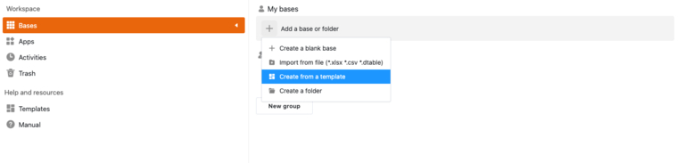

## Comment créer sa propre application sans connaissances en programmation

Vous avez une idée d'app brillante en tête, mais pas de budget pour des développeurs coûteux ? Ou peut-être manquez-vous de temps et de savoir-faire technique pour programmer vos propres apps ? Vous n'êtes pas seul dans ce cas ! Pour de nombreuses start-ups et petites entreprises, le développement d'une application sur mesure peut s'avérer être un défi coûteux et chronophage. Mais la bonne nouvelle, c'est qu'il existe un moyen de créer votre propre app - sans connaissances en programmation et sans dépenser une fortune.

Dans cet article, nous vous montrons étape par étape comment créer gratuitement une **application personnelle**. Découvrez quel outil est le plus adapté et comment réussir votre app.

## Ce qu'est un No-Code App Builder

L'époque où il fallait programmer pour créer sa propre app est révolue depuis longtemps. Les outils modernes permettent même aux non-initiés de créer une app en très peu de temps - tout à fait **sans connaissances en programmation**. Mais comment créer une app sans programmer ? La réponse se trouve dans l'utilisation de No-Code App Builders.

De tels app builders vous offrent la possibilité de programmer des apps - gratuitement et sans obstacles complexes. Ils simplifient vos processus et créent des solutions sur mesure qui sont exactement **adaptées à vos besoins**. Il est ainsi possible de mettre rapidement en œuvre des idées innovantes, d'augmenter l'efficacité et d'optimiser le flux de travail.

## Où utiliser App Builder

Dans les entreprises de tous les secteurs, les flux de travail sont variés et souvent complexes et chronophages. Mais avec la bonne app, vous pouvez rendre ces processus plus efficaces et plus conviviaux, qu'il s'agisse de processus internes, d'améliorer le travail d'équipe ou d'optimiser l'expérience client.

- **Marketing:** Organisez vos campagnes, suivez vos succès et maintenez votre équipe sur la bonne voie. Avec une application marketing personnalisée, vous gardez une vue d'ensemble - et veillez à ce que rien ne vous échappe.
- **Gestion de projet:** Fini le chaos de papier et les historiques d'e-mails interminables ! Créez des applications qui vous aident à garder un œil sur les tâches et les délais. Organisez le travail d'équipe de manière claire et en économisant les ressources.
- **HR:** Avec une app RH intelligente, mettez de l'ordre dans tous les [processus RH](). Des demandes de congés aux fiches de paie en passant par les horaires de travail, tout est numériquement regroupé en un seul endroit. Vous économisez ainsi des ressources, réduisez les erreurs et avez plus de temps pour l'essentiel : Votre équipe.
- **Vente:** Que vous soyez en déplacement ou au bureau, ayez toujours vos données clients à portée de main. Dans le domaine de la vente, une application peut vous aider à gérer les contacts avec les clients, à surveiller les chiffres de vente et à créer des offres, le tout en quelques clics. Vous réduisez ainsi les cycles de vente, améliorez la fidélisation des clients et augmentez votre chiffre d'affaires.
- **Développement de logiciels:** Même les développeurs tirent profit de la création de leur propre app : testez les interfaces utilisateur avant de les programmer, suivez efficacement les bugs et planifiez précisément vos lancements de produits à l'avance. Le résultat ? Un [développement logiciel]() plus flexible et un gain de temps précieux tout au long du processus de développement.

Et ce n'est qu'un début - les possibilités sont multiples et personnalisables.

## Avantages des app builders par rapport aux méthodes de développement traditionnelles

Les app builders offrent de nombreux avantages par rapport aux méthodes de développement classiques, qui apparaissent clairement lorsqu'on y regarde de plus près. Là où il fallait auparavant des équipes de développeurs spécialisés et des budgets élevés, l'utilisation d'App Builders ouvre de toutes nouvelles possibilités.

- **Simple:** Le manque de connaissances en programmation ne constitue pas un obstacle avec les App Builders. Ces outils intuitifs vous permettent de créer, de concevoir et de publier vos propres apps, sans aucune connaissance technique.
- **Rapide:** Par rapport au développement traditionnel, qui prend souvent des mois, un App Builder vous fait gagner un temps précieux. La programmation fastidieuse n'est plus nécessaire, ce qui permet de lancer l'application en quelques heures seulement.
- Bon marché:\*\* Les apps développées individuellement peuvent rapidement entraîner des coûts élevés, souvent de l'ordre de plusieurs milliers d'euros. En revanche, les app builders sont souvent nettement moins chers, ce qui les rend particulièrement attrayants pour les petits budgets.
- **Indépendant:** L'utilisation d'un App Builder vous offre la possibilité de gérer l'application de manière autonome et flexible. Des modifications peuvent être apportées à tout moment, sans dépendre de développeurs externes.
- **Peu de risques:** Grâce au faible investissement financier, le risque pour vous est considérablement réduit. De plus, les App Builders sont des systèmes sophistiqués, testés à maintes reprises, qui minimisent les sources d'erreurs potentielles qui pourraient survenir dans une application programmée individuellement.

## Comment fonctionne une No-Code App

Les App Builders fonctionnent avec des modules prédéfinis que vous pouvez assembler de manière individuelle et conviviale pour réaliser l'app souhaitée. Cela permet de créer en peu de temps des premiers prototypes avec lesquels vous pouvez tester de nouveaux workflows. La création rapide d'une app vous permet également d'acquérir rapidement des connaissances. Par exemple, si le processus est nécessaire ou s'il peut être optimisé. De cette manière, vous pouvez à tout moment procéder à des adaptations sans avoir besoin d'une aide extérieure.

**Remarque**

Il existe deux types d'apps : les apps natives et les apps web. Les **apps natives** sont spécialement conçues pour un système d'exploitation donné et sont installées directement sur l'appareil, généralement via un App Store. Les **Web-Apps**, en revanche, sont appelées via le navigateur et ne nécessitent pas de téléchargement, car elles sont accessibles via une adresse web.

## App Builder en comparaison

Aujourd'hui, créer sa propre application ne doit plus être une tâche compliquée. Grâce aux App Builders modernes, vous pouvez mettre en œuvre vos idées rapidement et efficacement, même sans connaissances en programmation. Mais le marché est vaste et différents outils offrent différents avantages et inconvénients. Cette section présente trois de ces outils : Bubble, Adalo et Glide. Chacun de ces outils offre des fonctions spécifiques que nous examinerons en détail.

### Bubble

Bubble est un créateur d'applications puissant, axé sur le visuel, qui s'adresse avant tout aux utilisateurs souhaitant créer des applications web sophistiquées. Grâce à son éditeur drag-and-drop, Bubble permet de concevoir des interfaces utilisateur et d'intégrer des bases de données et des flux de travail sans avoir besoin de connaissances en programmation. La flexibilité offerte par Bubble pour la création d'applications web est particulièrement attrayante. Les utilisateurs peuvent mettre en œuvre des logiques, des flux de travail et des structures de données étendues qui, dans de nombreux cas, suffisent également à la construction de systèmes complexes.

#### Avantages

- Vastes possibilités de conception et de personnalisation Idéal pour les applications web plus complexes

#### Inconvénients

- Flexibilité limitée pour les adaptations individuelles, car le code prédéfini n'est pas entièrement personnalisable.
- Coûts supplémentaires pour des fonctions ou des plugins plus complexes

### Adalo

Lorsqu'il s'agit de créer rapidement et facilement des applications mobiles, Adalo est une bonne adresse. L'App Maker s'adresse avant tout aux utilisateurs qui souhaitent créer des applications iOS et Android sans devoir se plonger dans les profondeurs de la programmation. Grâce à une interface conviviale et à des composants prédéfinis tels que des listes, des boutons et des formulaires, les applications peuvent être créées en peu de temps. Ce qui est particulièrement intéressant, c'est que les applications peuvent être développées une seule fois et publiées dans différents app stores avec un minimum d'efforts.

#### Avantages

- Interface intuitive avec une manipulation simple Les modèles et les composants accélèrent le processus de développement.
- Publication simple dans les App Stores

#### Inconvénients

- Limité pour la création d'apps très complexes
- Les coûts peuvent rapidement augmenter pour les projets de grande envergure ou les fonctionnalités avancées

### Glide

Glide adopte une approche légèrement différente de celle de nombreux autres app builders : Il s'appuie sur des structures de données existantes. C'est surtout en combinaison avec Google Sheets que Glide montre ses points forts, car il est possible de créer des apps en quelques clics à partir de données déjà existantes. Grâce à l'interface drag-and-drop, ces données peuvent être transformées en interfaces utilisateur attrayantes. Glide est idéal pour les applications qui doivent être rapidement opérationnelles - comme les outils internes, les applications de suivi ou les applications mobiles pour des cas d'utilisation simples.

#### Avantages

- Utilise des sources de données existantes comme Google Sheets
- Rapide et facile à utiliser
- Idéal pour les projets d'apps simples à moyens

#### Inconvénients

- Fonctions limitées pour les applications très complexes
- Fortement dépendant des sources de données existantes

## En 3 étapes vers votre propre application avec SeaTable

Si vous souhaitez maintenant créer votre propre application, mais que vous avez jusqu'ici reculé devant la complexité du code de programmation, SeaTable vous offre la solution idéale. Cet outil performant fait partie des constructeurs modernes d'applications sans code et vous permet de créer des applications basées sur le web - gratuitement et sans avoir à écrire une seule ligne de code. Vos bases de données constituent dans SeaTable un backend auquel les utilisateurs peuvent accéder via une application. Vous pouvez ainsi contrôler précisément qui peut voir quelles données et comment celles-ci sont visualisées.

Ne vous posez donc plus la question : "Comment puis-je créer une application ? - voici la réponse ! Le guide suivant vous montre, étape par étape, comment développer votre propre application en un rien de temps avec SeaTable.

### Étape 1 : créer une base

[Inscrivez-vous d'abord gratuitement]() sur SeaTable. Après vous être connecté, vous accédez à une interface utilisateur claire sur laquelle vous pouvez créer votre première base. Il est recommandé de réfléchir au préalable à la manière dont votre application doit être structurée - qu'il s'agisse d'une application de gestion de projet, d'un système d'inventaire ou d'une liste de choses à faire. SeaTable propose pour cela différents modèles que vous pouvez adapter selon vos besoins.

Pour utiliser un modèle prédéfini, cliquez sur l'icône plus dans la section "Mes bases" et sélectionnez l'option "Créer une base à partir d'un modèle". Dans cet exemple, nous utilisons le modèle pour les ateliers, qui est déjà rempli d'exemples de données. L'objectif est de créer une application personnalisée qui offre aux coachs une plateforme centrale sur laquelle ils peuvent consulter toutes les informations importantes relatives aux cours.

### Étape 2 : Ajouter une app universelle

En haut à droite, vous pouvez maintenant ajouter une app universelle en cliquant sur le bouton App. Après avoir donné un nom à l'app, une nouvelle interface s'ouvre. Celle-ci est encore vide, mais vous pouvez maintenant l'adapter individuellement à vos besoins.

### Étape 3 : Ajouter des pages et les configurer

Tout d'abord, ajoutez une nouvelle page en cliquant sur le bouton à gauche. Pour cela, vous pouvez créer différents types de pages dans l'app, comme un tableau Kanban, un formulaire web ou une page individuelle.

#### Calendrier

Pour garder une vue d'ensemble de tous les rendez-vous, un calendrier que vous créez dans l'application est idéal. Sélectionnez ce type de page et attribuez un nom à la page. Vous devez ensuite sélectionner le tableau correspondant à partir duquel les données seront extraites. Dans ce cas, il s'agit du tableau "Atelier". En option, vous pouvez ensuite choisir une icône appropriée.

Actuellement, aucune information sur la date n'est disponible dans l'App Builder. Pour y remédier, cliquez sur l'icône en forme d'engrenage pour ouvrir les paramètres de la page. Ici, vous pouvez sélectionner la colonne Date pour les dates de début et de fin, les rendez-vous apparaissent ensuite dans le calendrier. Pour mieux distinguer les ateliers, vous pouvez ensuite différencier la couleur des entrées du calendrier par secteur.

#### Liste des participants

Pour que les coachs des cours puissent voir directement quels participants se sont déjà inscrits, nous créons une liste pratique des participants dans l'App Builder. Pour cela, il suffit d'ajouter une nouvelle page, de sélectionner le type de page "Tableau" et de définir "Participants" comme source de données. Toutes les inscriptions sont déjà visibles. Pour plus de structure, les participants peuvent être facilement triés par atelier grâce à l'onglet "Regrouper".

#### Page individuelle

La page individuelle est un type de page particulièrement intéressant. Elle permet de créer des tableaux de bord conviviaux dans l'application, qui regroupent toutes les informations importantes de manière compacte. Une fois la page créée, vous pouvez ajouter des éléments tels que des images, des statistiques, des conteneurs ou des cartes par simple glisser-déposer, selon vos besoins.

Commençons par une statistique : Dans l'App Builder, insérez un nouveau champ que vous pouvez configurer en un clic. Nous optons pour un simple diagramme à colonnes et sélectionnons le tableau de feedback. Passons maintenant à la sélection des données : Nous voulons voir comment les ateliers ont été évalués. Pour l'axe x, vous sélectionnez "Ateliers", pour l'axe y "Résumer le champ", ce qui fait apparaître d'autres options. Comme champ de totalisation, prenez la notation des ateliers et laissez l'évaluation réglée sur "Somme". Nous obtenons ainsi une vue d'ensemble claire des cours qui ont reçu les meilleures évaluations.

Dans l'étape suivante, nous souhaitons accéder au calendrier et à la liste des participants à partir de la page individuelle. Pour cela, ajoutez deux cartes qui peuvent être facilement agrandies, réduites ou déplacées à l'aide de la souris. Pour que les cartes fonctionnent, nous les relions - l'une au calendrier, l'autre à la liste des participants. Pour finir, vous pouvez encore insérer des images appropriées, et voilà, votre tableau de bord est prêt à l'emploi ! Pour y accéder encore plus facilement, vous pouvez déplacer la page de la barre de gauche vers le haut pour qu'elle serve de page d'accueil.

Maintenant que vous maîtrisez les bases de l'application universelle, essayez vous-même quelques types de pages ! Que diriez-vous, par exemple, d'une page sur laquelle les coachs peuvent voir leur feedback de manière plus détaillée ? Ou un formulaire web permettant par exemple de soumettre de nouvelles dates de cours ?

**Tip** :

Si vous souhaitez fouiller encore un peu et découvrir d'autres fonctions des apps, jetez donc un coup d'œil aux modèles [Saisie du temps de travail](https://seatable.io/vorlage/fyp0x2y-s-ut3m-wcbpzbq/) ou [Planificateur de voyage](https://seatable.io/vorlage/axq_85kkrjsriagmqpxehw/). Ceux-ci contiennent des apps déjà entièrement élaborées que vous pouvez utiliser et adapter immédiatement.

### Conclusion

Les No Code App Builders comme SeaTable vous ouvrent de toutes nouvelles possibilités pour créer vos propres apps - gratuitement et sans connaissances techniques. Ils vous offrent non seulement la flexibilité et des résultats rapides, mais aussi la liberté de mettre en œuvre des idées de manière autonome. Que ce soit pour le marketing, la gestion de projet ou les ventes, les bons outils vous permettent de rendre vos processus de travail plus efficaces et de faire passer votre entreprise au niveau supérieur. Alors pourquoi attendre ? Essayez-le gratuitement et découvrez à quel point le développement d'applications peut être simple aujourd'hui.



## Foire aux questions sur la création d'apps


Un App Builder est un outil qui permet de créer des applications sans connaissances en programmation. Grâce à des éditeurs visuels de type "glisser-déposer" et à des modules prédéfinis, vous pouvez créer vos propres apps sans avoir à vous préoccuper des aspects techniques.


Les app builders sont idéaux pour les entreprises, les indépendants et les start-ups qui ont besoin de solutions personnalisées, mais qui n'ont ni le temps ni le budget pour développer des apps de manière traditionnelle. Les développeurs peuvent également profiter de ces outils pour tester des prototypes ou concevoir des interfaces utilisateur.


Pour créer votre propre app, choisissez un No Code App Builder comme SeaTable. Vous créez ainsi une app en quelques étapes simples : créer une base, ajouter une app universelle, configurer des pages et intégrer des éléments tels que des calendriers, des formulaires ou des tableaux.


