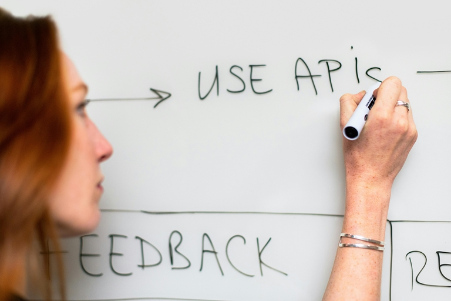
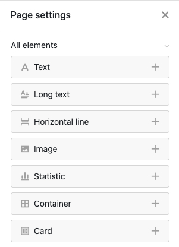

## Como criar a sua própria aplicação sem conhecimentos de programação

Tem uma ideia brilhante de aplicação em mente, mas não tem orçamento para programadores caros? Ou talvez lhe falte tempo e conhecimentos técnicos para programar as suas próprias aplicações? Não é o único! Para muitas startups e pequenas empresas, desenvolver uma aplicação personalizada pode ser um desafio dispendioso e moroso. Mas a boa notícia é que existe uma forma de criar a sua própria aplicação - sem conhecimentos de programação e sem gastar uma fortuna.

Neste artigo, vamos mostrar-lhe passo a passo como criar a sua **própria aplicação gratuitamente**. Descubra qual a ferramenta mais adequada e como implementar a sua aplicação com sucesso.

## O que é um criador de aplicações sem código

Os dias em que era necessário programar para criar a sua própria aplicação já lá vão. As ferramentas modernas permitem que mesmo os não especialistas criem uma aplicação num instante - sem qualquer conhecimento de programação. Mas como é que se cria uma aplicação sem programação? A resposta está na utilização de criadores de aplicações sem código.

Estes criadores de aplicações oferecem-lhe a oportunidade de programar aplicações - gratuitamente e sem obstáculos complexos. Simplificam os seus processos e criam soluções personalizadas que são precisamente **adaptadas às suas necessidades**. Isto permite-lhe implementar rapidamente ideias inovadoras, aumentar a eficiência e otimizar o seu fluxo de trabalho.

## Onde pode utilizar o App Builder

As empresas de todos os sectores têm diversos fluxos de trabalho que são frequentemente complexos e demorados. Mas com a aplicação certa, pode tornar estes fluxos de trabalho mais eficientes e fáceis de utilizar - quer se trate de processos internos, de melhorar o trabalho em equipa ou de otimizar a experiência do cliente.

- **Marketing:** Organize as suas campanhas, acompanhe os seus sucessos e mantenha a sua equipa no caminho certo. Com uma aplicação de marketing personalizada, pode manter-se a par de tudo - e certificar-se de que nada passa despercebido.
- **Gestão de projectos:** Acabe com o caos dos papéis e dos e-mails intermináveis! Crie aplicações que o ajudem a controlar as tarefas e os prazos. Organize o trabalho em equipa de forma clara e poupe recursos.
- **RH:** Com uma aplicação de RH inteligente, pode pôr ordem em todos os [processos de RH](). Desde os pedidos de férias ao horário de trabalho e à contabilização dos salários, tudo está num único local digital. Isto poupa recursos, reduz os erros e dá-lhe mais tempo para o que realmente importa: A sua equipa.
- **Vendas:** Quer esteja na estrada ou no escritório - tenha sempre à mão os dados dos seus clientes. Nas vendas, uma aplicação pode ajudá-lo a manter os contactos dos clientes, monitorizar os números das vendas e criar orçamentos - tudo com apenas alguns cliques. Isto encurta os ciclos de vendas, melhora a fidelização dos clientes e aumenta o seu volume de negócios.
- **Desenvolvimento de software:** Até os programadores beneficiam com a criação da sua própria aplicação: testam as interfaces de utilizador antes de programar, controlam os bugs de forma eficiente e planeiam o lançamento dos seus produtos com precisão e antecedência. O resultado? Um [desenvolvimento de software]() mais flexível e uma poupança de tempo preciosa ao longo de todo o processo de desenvolvimento.

E isso é apenas o começo - as possibilidades são diversas e personalizáveis.

## Vantagens dos criadores de aplicações em comparação com os métodos de desenvolvimento convencionais

Os criadores de aplicações oferecem inúmeras vantagens em relação aos métodos de desenvolvimento tradicionais, que se tornam claras numa inspeção mais atenta. Onde anteriormente eram necessárias equipas de desenvolvimento especializadas e orçamentos elevados, a utilização de construtores de aplicações abre possibilidades completamente novas.

- **Simples:** A falta de conhecimentos de programação não é um obstáculo com os construtores de aplicações. Estas ferramentas intuitivas permitem-lhe criar, conceber e publicar as suas próprias aplicações - sem quaisquer conhecimentos técnicos.
- **Rápido:** Em comparação com o desenvolvimento tradicional, que muitas vezes demora meses, um construtor de aplicações poupa-lhe tempo valioso. Não há necessidade de programação demorada, pelo que a aplicação está pronta para ser lançada em poucas horas.
- **Acessível:** As aplicações desenvolvidas individualmente podem rapidamente incorrer em custos elevados, muitas vezes na ordem dos vários milhares de euros. Os construtores de aplicações, por outro lado, são muitas vezes significativamente mais baratos, o que os torna particularmente atractivos para orçamentos mais pequenos.
- **Independente:** A utilização de um construtor de aplicações permite-lhe gerir a aplicação de forma independente e flexível. As alterações podem ser feitas em qualquer altura sem ter de recorrer a programadores externos.
- **Baixo risco:** O baixo investimento financeiro reduz significativamente o risco para si. Além disso, os App Builders são sistemas maduros e bem testados que minimizam as potenciais fontes de erro que poderiam ocorrer numa aplicação programada individualmente.

## Como funciona uma aplicação sem código

Os construtores de aplicações funcionam com módulos predefinidos que pode juntar individualmente e de uma forma fácil de utilizar para realizar a aplicação desejada. Isto permite-lhe criar protótipos iniciais num curto espaço de tempo, que pode utilizar para testar novos fluxos de trabalho. A criação rápida de aplicações também permite obter rapidamente informações. Por exemplo, se o processo é mesmo necessário ou se pode ser optimizado. Desta forma, pode fazer ajustes em qualquer altura sem necessitar de ajuda externa.

**Nota**

Existem dois tipos de aplicações - aplicações nativas e aplicações Web. As **aplicações nativas** são especialmente desenvolvidas para um sistema operativo específico e são instaladas diretamente no dispositivo, normalmente através de uma loja de aplicações. As **aplicações Web**, por outro lado, são acedidas através do browser e não necessitam de ser descarregadas, uma vez que são acessíveis através de um endereço Web.

## App Builder em comparação

Criar a sua própria aplicação já não tem de ser uma tarefa complicada. Graças aos modernos construtores de aplicações, pode implementar as suas ideias de forma rápida e eficiente, mesmo sem conhecimentos de programação. No entanto, o mercado é vasto e as diferentes ferramentas oferecem diferentes vantagens e desvantagens. Três dessas ferramentas são apresentadas nesta secção: Bubble, Adalo e Glide. Cada uma destas ferramentas oferece funções específicas, que iremos analisar em pormenor.

### Bubble

O Bubble é um criador de aplicações poderoso e visualmente orientado, destinado principalmente a utilizadores que pretendem criar aplicações Web sofisticadas. Com o seu editor de arrastar e largar, o Bubble permite a conceção de interfaces de utilizador e a integração de bases de dados e fluxos de trabalho sem a necessidade de conhecimentos de programação. A flexibilidade que o Bubble oferece na criação de aplicações Web é particularmente atractiva. Os utilizadores podem implementar lógicas, fluxos de trabalho e estruturas de dados abrangentes, que em muitos casos são suficientes para criar sistemas complexos.

#### Vantagens

- Extensas opções de design e personalização Ideal para aplicações Web mais complexas

#### Desvantagens

- Flexibilidade limitada para personalização, uma vez que o código pré-construído não é totalmente personalizável
- Custos adicionais para funções ou plug-ins mais complexos

### Adalo

Quando se trata da criação rápida e fácil de aplicativos móveis, o Adalo é um bom endereço. O criador de aplicativos é voltado principalmente para usuários que desejam criar aplicativos iOS e Android sem ter que mergulhar nas profundezas da programação. Graças a uma interface de fácil utilização e a componentes prontos a usar, como listas, botões e formulários, as aplicações podem ser criadas num curto espaço de tempo. Uma caraterística particularmente atractiva é que as aplicações podem ser desenvolvidas uma vez e publicadas em várias lojas de aplicações com um esforço mínimo.

#### Vantagens

- Interface intuitiva com manuseamento simples Os modelos e componentes aceleram o processo de desenvolvimento
- Publicação simples nas lojas de aplicações

#### Desvantagens

- Limitado na criação de aplicações muito complexas
- Os custos podem aumentar rapidamente para projectos maiores ou funções alargadas

### Glide

O Glide tem uma abordagem ligeiramente diferente de muitos outros criadores de aplicações: Baseia-se em estruturas de dados existentes. O Glide mostra os seus pontos fortes particularmente em combinação com o Google Sheets, uma vez que as aplicações podem ser criadas a partir de dados existentes com apenas alguns cliques. A interface de arrastar e largar permite que estes dados sejam transformados em interfaces de utilizador apelativas. Glide é ideal para aplicações que precisam de estar prontas a utilizar rapidamente - como ferramentas internas, aplicações de acompanhamento ou aplicações móveis para casos de utilização simples.

#### Vantagens

- Utiliza fontes de dados existentes, como o Google Sheets
- Rápido e fácil de utilizar
- Ideal para projectos de aplicações simples a médias

#### Desvantagens

- Funções limitadas para aplicações muito complexas
- Muito dependente das fontes de dados existentes

## 3 passos para a sua própria aplicação com SeaTable

Se pretende criar a sua própria aplicação, mas não tem medo de códigos de programação complexos, o SeaTable oferece a solução ideal. Esta poderosa ferramenta é um dos modernos construtores de aplicações sem código e permite-lhe criar aplicações baseadas na Web - gratuitamente e sem ter de escrever uma única linha de código. As suas bases de dados no SeaTable formam um backend a que os utilizadores podem aceder através de uma aplicação. Isto permite-lhe controlar exatamente quem pode ver que dados e como são visualizados.

Por isso, não se pergunte mais: "Como posso criar uma aplicação?" - aqui está a resposta! O seguinte guia passo-a-passo irá mostrar-lhe como desenvolver a sua própria aplicação com o SeaTable num instante.

### Passo 1: Criar uma base

[Primeiro, registe-se gratuitamente]() no SeaTable. Depois de iniciar sessão, será conduzido a uma interface de utilizador clara onde poderá criar a sua primeira base. É aconselhável considerar antecipadamente como a sua aplicação deve ser estruturada - seja uma aplicação de gestão de projectos, um sistema de inventário ou uma lista de tarefas. O SeaTable oferece vários modelos para este efeito, que pode personalizar conforme necessário.

Para utilizar um modelo pronto, clique no símbolo de mais na área "As minhas bases" e selecione a opção "Criar base a partir de modelo". Neste exemplo, estamos a utilizar o modelo para workshops, que já está preenchido com dados de amostra. O objetivo é criar uma aplicação personalizada que forneça aos formadores uma plataforma central onde possam aceder a todas as informações importantes do curso.

### Passo 2: Adicionar a aplicação universal

Pode agora adicionar uma aplicação universal através do botão de aplicação no canto superior direito. Depois de ter dado um nome à aplicação, abre-se uma nova interface. Esta ainda está vazia, mas pode agora ser personalizada de acordo com as suas necessidades.

### Passo 3: Adicionar e configurar páginas

Em primeiro lugar, adicione uma nova página utilizando o botão à esquerda. Pode criar diferentes tipos de páginas na aplicação, tais como um quadro Kanban, um formulário Web ou uma página individual.

#### Calendário

Para manter um registo de todos os compromissos, pode criar um calendário na aplicação. Selecione este tipo de página e atribua um nome à página. Em seguida, deve selecionar a tabela correspondente da qual os dados devem ser retirados. Neste caso, trata-se da tabela "Workshop". Opcionalmente, pode selecionar um ícone adequado.

Atualmente, não existem informações sobre datas no App Builder. Para alterar esta situação, clique no ícone de engrenagem para abrir as definições da página. Aqui pode selecionar a coluna Data para a data de início e de fim, após o que as datas aparecerão no calendário. Para facilitar a distinção dos workshops, pode então diferenciar a cor das entradas do calendário por sector.

)

#### Lista de participantes

Para que os treinadores dos cursos possam ver diretamente quais os participantes já registados, criamos uma lista prática de participantes no App Builder. Para isso, basta adicionar uma nova página, selecionar o tipo de página "Tabela" e especificar "Participantes" como fonte de dados. Todos os registos estão agora visíveis. Para uma maior estruturação, os participantes podem ser convenientemente ordenados por workshop utilizando o separador "Grupo".

#### Página individual

Um tipo de página particularmente interessante é a página individual. Com esta vista, pode criar painéis de fácil utilização na aplicação que reúnem todas as informações importantes de uma forma compacta. Uma vez criada a página, pode adicionar elementos como imagens, estatísticas, contentores ou mapas, arrastando e largando - tal como precisa deles.

Vamos começar com as estatísticas: Adicione um novo campo no App Builder, que pode configurar com um clique. Optamos por um simples gráfico de barras e seleccionamos a tabela de feedback. Agora é altura de selecionar os dados: Queremos ver como é que os workshops foram avaliados. Selecione "Workshops" para o eixo x e "Summarize field" para o eixo y, o que lhe mostrará outras opções. Para o campo de resumo, selecione a classificação dos workshops e deixe a avaliação definida como "Soma". Isto dá-nos uma visão clara dos cursos que obtiveram as melhores classificações.

No passo seguinte, queremos aceder ao calendário e à lista de participantes a partir da página individual. Para tal, adicione dois cartões que podem ser facilmente ampliados, reduzidos ou movidos para outro local com o rato. Para que os cartões funcionem, ligamo-los - um ao calendário e o outro à lista de participantes. Por fim, pode adicionar imagens adequadas e voilà, o seu painel de controlo está pronto a ser utilizado! Para facilitar ainda mais o acesso, pode mover a página da barra da esquerda para o topo, de modo a que sirva de página inicial.

Agora que já domina as noções básicas da aplicação universal, porque não experimentar alguns tipos de páginas? Por exemplo, que tal uma página onde os treinadores possam ver o seu feedback com mais pormenor? Ou um formulário Web que possa ser utilizado para apresentar novas datas para cursos, por exemplo?

**Dica**:

Se quiser navegar um pouco mais e descobrir funções adicionais da aplicação, consulte os modelos [Controlo de tempo]() ou [Planeador de viagens](). Estes já contêm aplicações totalmente desenvolvidas que pode utilizar e personalizar imediatamente.

### Conclusão

Os criadores de aplicações sem código, como o SeaTable, abrem possibilidades completamente novas para criar as suas próprias aplicações - gratuitamente e sem quaisquer conhecimentos técnicos. Eles não só oferecem flexibilidade e resultados rápidos, mas também a liberdade de implementar ideias de forma independente. Quer seja para marketing, gestão de projectos ou vendas - com as ferramentas certas, pode tornar os seus processos de trabalho mais eficientes e levar a sua empresa para o próximo nível. Então, porquê esperar? Experimente gratuitamente e descubra como o desenvolvimento de aplicações pode ser fácil hoje.



## Perguntas frequentes ao criar uma aplicação


Um construtor de aplicações é uma ferramenta que lhe permite criar aplicações sem conhecimentos de programação. Com editores visuais de arrastar e largar e módulos prontos a usar, pode criar as suas próprias aplicações sem ter de lidar com aspectos técnicos.


Os construtores de aplicações são ideais para empresas, freelancers e startups que precisam de soluções personalizadas, mas não têm tempo ou orçamento para o desenvolvimento tradicional de aplicações. Os programadores também podem beneficiar destas ferramentas para testar protótipos ou conceber interfaces de utilizador.


Para criar a sua própria aplicação, escolha um criador de aplicações sem código como o SeaTable. Pode criar uma aplicação em apenas alguns passos simples: criar uma base, adicionar uma aplicação universal, configurar páginas e integrar elementos como calendários, formulários ou tabelas.


