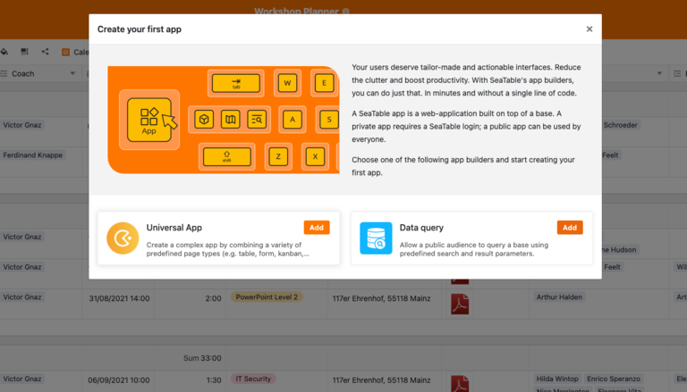
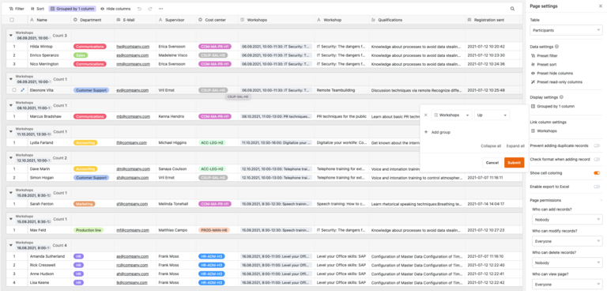
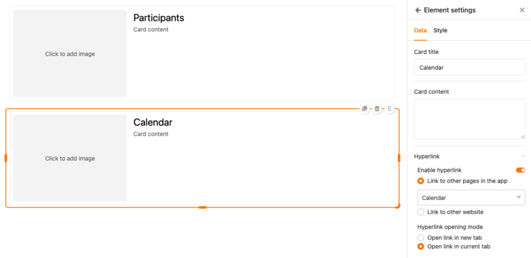
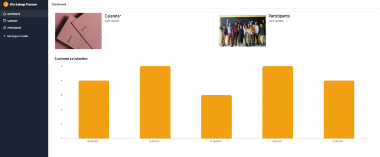

## Как создать собственное приложение без знаний программирования

У вас в голове есть блестящая идея приложения, но нет бюджета на дорогих разработчиков? А может быть, у вас нет времени и технических знаний, чтобы программировать собственные приложения? Вы не одиноки! Для многих стартапов и малых предприятий разработка специализированного приложения может стать дорогостоящей и трудоемкой задачей. Но есть и хорошая новость: есть способ создать собственное приложение - без навыков программирования и не тратя на это целое состояние.

В этой статье мы шаг за шагом покажем вам, как создать свое **собственное приложение бесплатно**. Узнайте, какой инструмент лучше всего подходит для этого и как успешно реализовать свое приложение.

## Что такое no-code app builder

Времена, когда для создания собственного приложения нужно было программировать, давно прошли. Современные инструменты позволяют даже неспециалистам создать приложение в кратчайшие сроки - без каких-либо знаний в области программирования. Но как создать приложение без программирования? Ответ кроется в использовании конструкторов приложений без кода.

Такие конструкторы приложений предлагают вам возможность программировать приложения - бесплатно и без сложных препятствий. Они упрощают ваши процессы и создают индивидуальные решения, которые точно **соответствуют вашим потребностям**. Это позволит вам быстро реализовать инновационные идеи, повысить эффективность и оптимизировать рабочий процесс.

## Где вы можете использовать App Builder

Компании всех отраслей имеют разнообразные рабочие процессы, которые зачастую сложны и отнимают много времени. Но с помощью правильного приложения вы можете сделать эти рабочие процессы более эффективными и удобными - будь то внутренние процессы, улучшение работы команды или оптимизация обслуживания клиентов.

- **Маркетинг:** Организуйте свои кампании, отслеживайте свои успехи и держите свою команду в курсе событий. С помощью персонализированного маркетингового приложения вы сможете быть в курсе всех событий и быть уверенным, что ничего не ускользнет от внимания.
- **Управление проектами:** Положите конец бумажному хаосу и бесконечной электронной почте! Создайте приложения, которые помогут вам следить за задачами и сроками их выполнения. Четко организуйте работу команды и экономьте ресурсы.
- ** HR:** С помощью умного приложения для HR вы сможете навести порядок во всех [HR-процессах](). От заявок на отпуск до рабочего времени и расчета зарплаты - все в одном цифровом месте. Это экономит ресурсы, сокращает количество ошибок и дает вам больше времени для того, что действительно важно: Вашей команде.
- **Продажи:** Где бы вы ни находились - в дороге или в офисе - данные о клиентах всегда будут у вас под рукой. В сфере продаж приложение может помочь вам поддерживать контакты с клиентами, отслеживать показатели продаж и создавать предложения - и все это всего за несколько кликов. Это сокращает цикл продаж, повышает лояльность клиентов и увеличивает ваш оборот.
- **Разработка программного обеспечения:** Создание собственного приложения выгодно даже разработчикам: тестируйте пользовательские интерфейсы перед программированием, эффективно отслеживайте ошибки и точно планируйте запуск продукта. Результат? Более гибкая [разработка программного обеспечения]() и ценная экономия времени на протяжении всего процесса разработки.

И это только начало - возможности разнообразны и настраиваемы.

## Преимущества конструкторов приложений по сравнению с традиционными методами разработки

Конструкторы приложений имеют множество преимуществ перед традиционными методами разработки, которые становятся очевидными при ближайшем рассмотрении. Там, где раньше требовались специализированные команды разработчиков и большие бюджеты, использование конструкторов приложений открывает совершенно новые возможности.

- **Простота:** Отсутствие знаний в области программирования не является препятствием при использовании конструкторов приложений. Эти интуитивно понятные инструменты позволяют создавать, разрабатывать и публиковать собственные приложения - без каких-либо технических знаний.
- Быстрота:\*\* По сравнению с традиционной разработкой, которая часто занимает месяцы, конструктор приложений экономит ваше драгоценное время. Нет необходимости в трудоемком программировании, поэтому приложение готово к запуску уже через несколько часов.
- **Доступность:** Индивидуальная разработка приложений может быстро привести к высоким затратам, зачастую составляющим несколько тысяч евро. С другой стороны, сборщики приложений зачастую обходятся значительно дешевле, что делает их особенно привлекательными для небольших бюджетов.
- Независимость:\*\* Использование конструктора приложений позволяет вам управлять приложением независимо и гибко. Изменения можно вносить в любое время, не прибегая к услугам сторонних разработчиков.
- **Низкий риск:** Небольшие финансовые вложения значительно снижают риск для вас. Кроме того, конструкторы приложений - это зрелые, хорошо протестированные системы, которые сводят к минимуму потенциальные источники ошибок, которые могут возникнуть в индивидуально запрограммированном приложении.

## Как работает приложение без кода

Конструкторы приложений работают с предопределенными модулями, которые вы можете собрать по отдельности и удобным для пользователя способом, чтобы реализовать желаемое приложение. Это позволяет в короткие сроки создать первые прототипы, которые можно использовать для тестирования новых рабочих процессов. Быстрое создание приложений также позволяет быстро получить информацию. Например, о том, нужен ли данный процесс вообще или его можно оптимизировать. Таким образом, вы можете вносить коррективы в любое время, не прибегая к посторонней помощи.

**Примечание**

Существует два типа приложений - нативные и веб-приложения. **Нативные приложения** разрабатываются специально для конкретной операционной системы и устанавливаются непосредственно на устройство, обычно через магазин приложений. **Веб-приложения**, с другой стороны, доступны через браузер и не требуют загрузки, так как доступны через веб-адрес.

## App Builder в сравнении

Создание собственного приложения больше не должно быть сложной задачей. Благодаря современным конструкторам приложений вы можете быстро и эффективно реализовать свои идеи даже без знаний программирования. Однако рынок велик, и разные инструменты предлагают различные преимущества и недостатки. Три из них представлены в этом разделе: Bubble, Adalo и Glide. Каждый из этих инструментов предлагает определенные функции, которые мы подробно рассмотрим.

### Bubble

Bubble - это мощный, визуально ориентированный создатель приложений, предназначенный в первую очередь для пользователей, которые хотят создавать сложные веб-приложения. Благодаря редактору drag-and-drop Bubble позволяет разрабатывать пользовательские интерфейсы, интегрировать базы данных и рабочие процессы без необходимости иметь навыки программирования. Гибкость, которую предлагает Bubble при создании веб-приложений, особенно привлекательна. Пользователи могут реализовать обширную логику, рабочие процессы и структуры данных, которых во многих случаях достаточно для создания сложных систем.

#### Преимущества

- Широкие возможности проектирования и настройки Идеально подходит для создания более сложных веб-приложений

#### Недостатки

- Ограниченная гибкость в настройке, так как готовый код не является полностью настраиваемым
- Дополнительные расходы на более сложные функции или плагины

### Adalo

Когда речь идет о быстром и легком создании мобильных приложений, Adalo - это хороший адрес. Этот производитель приложений в первую очередь ориентирован на пользователей, которые хотят создавать приложения для iOS и Android, не погружаясь в глубины программирования. Благодаря удобному интерфейсу и готовым компонентам, таким как списки, кнопки и формы, приложения можно создавать в кратчайшие сроки. Особенно привлекательно то, что приложения можно разработать один раз и опубликовать в различных магазинах приложений с минимальными усилиями.

#### Преимущества

- Интуитивно понятный интерфейс с простым управлением Шаблоны и компоненты ускоряют процесс разработки
- Простая публикация в магазинах приложений

#### Недостатки

- Ограниченность при создании очень сложных приложений
- Затраты могут быстро возрасти для крупных проектов или расширенных функций

### Glide

Glide использует несколько иной подход, чем многие другие конструкторы приложений: Он опирается на существующие структуры данных. Glide особенно ярко проявляет свои преимущества в сочетании с Google Sheets, поскольку приложения можно создавать на основе существующих данных всего несколькими щелчками мыши. Интерфейс drag-and-drop позволяет превратить эти данные в привлекательные пользовательские интерфейсы. Glide идеально подходит для приложений, которые должны быть быстро готовы к использованию - например, внутренних инструментов, приложений для отслеживания или мобильных приложений для простых случаев использования.

#### Преимущества

- Использует существующие источники данных, такие как Google Sheets
- Быстрота и простота использования
- Идеально подходит для простых и средних проектов приложений

#### Недостатки

- Ограниченные функции для очень сложных приложений
- Сильно зависит от существующих источников данных

## 3 шага к собственному приложению с SeaTable

Если вы хотите создать свое собственное приложение, но раньше избегали сложного программного кода, SeaTable предлагает идеальное решение. Этот мощный инструмент является одним из современных конструкторов приложений без кода и позволяет создавать веб-приложения - бесплатно и без необходимости писать одну строчку кода. Ваши базы данных в SeaTable образуют бэкэнд, к которому пользователи могут получить доступ через приложение. Это позволяет вам контролировать, кто именно может видеть данные и как они визуализируются.

Поэтому больше не задавайте себе вопрос: "Как мне создать приложение?" - вот ответ! Следующее пошаговое руководство покажет вам, как разработать собственное приложение с помощью SeaTable в кратчайшие сроки.

### Шаг 1: Создайте базу

[Сначала бесплатно зарегистрируйтесь в SeaTable. После входа в систему вы попадете в понятный пользовательский интерфейс, где сможете создать свою первую базу. Рекомендуется заранее продумать, как должно быть устроено ваше приложение - будет ли это приложение для управления проектами, система инвентаризации или список дел. SeaTable предлагает для этого различные шаблоны, которые вы можете настроить по своему усмотрению.

Чтобы воспользоваться готовым шаблоном, нажмите на символ плюса в области "Мои базы" и выберите опцию "Создать базу из шаблона". В этом примере мы используем шаблон для мастерских, который уже заполнен образцами данных. Цель - создать собственное приложение, которое предоставит тренерам центральную платформу, где они смогут получить доступ ко всей важной информации о курсе.

### Шаг 2: Добавление универсального приложения

Теперь вы можете добавить универсальное приложение с помощью кнопки "Приложение" в правом верхнем углу. После того как вы дадите приложению имя, откроется новый интерфейс. Он по-прежнему пуст, но теперь его можно настроить под свои нужды.

### Шаг 3: Добавление и настройка страниц

Прежде всего, добавьте новую страницу с помощью кнопки слева. В приложении можно создавать различные типы страниц, например, Kanban-доску, веб-форму или отдельную страницу.

#### Календарь

Чтобы отслеживать все встречи, вы можете создать календарь в приложении. Выберите этот тип страницы и присвойте ей имя. Затем необходимо выбрать соответствующую таблицу, из которой будут браться данные. В данном случае это таблица "Мастерская". По желанию можно выбрать подходящий значок.

В настоящее время в конструкторе приложений нет информации о дате. Чтобы изменить это, нажмите на значок шестеренки, чтобы открыть настройки страницы. Здесь вы можете выбрать колонку Дата для начальной и конечной даты, после чего даты появятся в календаре. Чтобы было проще различать семинары, можно выделить цветом записи календаря по секторам.

#### Список участников

Чтобы тренеры курсов могли непосредственно видеть, кто из участников уже зарегистрировался, мы создаем практический список участников в App Builder. Для этого просто добавьте новую страницу, выберите тип страницы "Таблица" и укажите "Участники" в качестве источника данных. Теперь все регистрации видны. Для большей структурированности участников можно удобно отсортировать по семинарам с помощью вкладки "Группа".

#### Индивидуальная страница

Особенно интересным типом страницы является индивидуальная страница. С ее помощью вы можете создавать в приложении удобные панели, которые объединяют всю важную информацию в компактном виде. После создания страницы вы можете добавлять такие элементы, как изображения, статистику, контейнеры или карты, с помощью перетаскивания - только так, как вам нужно.

Начнем со статистики: Добавьте новое поле в App Builder, которое можно настроить одним щелчком мыши. Мы выбираем простую гистограмму и таблицу отзывов. Теперь пришло время выбрать данные: Мы хотим увидеть, как были оценены семинары. Выберите "Семинары" для оси x и "Поле для подведения итогов" для оси y, в результате чего появятся дополнительные опции. Для поля обобщения возьмите рейтинг семинаров и оставьте для оценки значение "Сумма". Это даст нам четкое представление о том, какие курсы получили наилучшие оценки.

На следующем этапе мы хотим получить доступ к календарю и списку участников с отдельной страницы. Для этого добавим две карточки, которые можно легко увеличить, уменьшить или переместить в другое место с помощью мыши. Чтобы карточки работали, свяжем их - одну с календарем, другую со списком участников. Наконец, вы можете добавить подходящие изображения, и вуаля, ваша панель готова к использованию! Чтобы сделать ее еще более удобной, вы можете переместить страницу в левом баре наверх, чтобы она служила стартовой.

Теперь, когда вы освоили основы работы с универсальным приложением, почему бы вам самим не попробовать несколько типов страниц? Например, как насчет страницы, на которой тренеры могут более подробно ознакомиться с отзывами? Или, например, веб-форму, с помощью которой можно вводить новые даты для курсов?

**Совет**:

Если вы хотите узнать больше и открыть для себя дополнительные функции приложения, обратите внимание на шаблоны [Time tracking]() или [Travel planner](). Они уже содержат полностью готовые приложения, которые вы можете сразу же использовать и настраивать.

### Заключение

Такие конструкторы приложений без кода, как SeaTable, открывают перед вами совершенно новые возможности для создания собственных приложений - бесплатно и без каких-либо технических знаний. Они предлагают вам не только гибкость и быстрый результат, но и свободу самостоятельной реализации идей. Будь то маркетинг, управление проектами или продажи - с помощью правильных инструментов вы сможете сделать свои рабочие процессы более эффективными и вывести компанию на новый уровень. Так зачем ждать? Попробуйте бесплатно и узнайте, насколько простой может быть разработка приложений уже сегодня.



## Часто задаваемые вопросы при создании приложения


Конструктор приложений - это инструмент, который позволяет создавать приложения без знания программирования. С помощью визуальных редакторов drag-and-drop и готовых модулей вы можете создавать собственные приложения без необходимости разбираться с техническими аспектами.


Конструкторы приложений идеально подходят для компаний, фрилансеров и стартапов, которым нужны индивидуальные решения, но у которых нет времени или бюджета на традиционную разработку приложений. Разработчики также могут воспользоваться этими инструментами для тестирования прототипов или проектирования пользовательских интерфейсов.


Чтобы создать собственное приложение, воспользуйтесь конструктором приложений без кода, например SeaTable. Вы можете создать приложение всего за несколько простых шагов: создать базу, добавить универсальное приложение, настроить страницы и интегрировать такие элементы, как календари, формы или таблицы.


