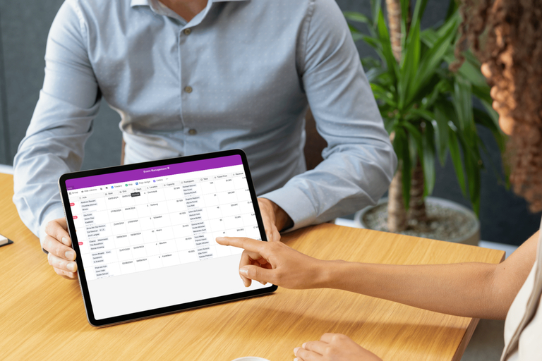

## Un système moderne pour un processus efficace

La société Red Dot GmbH & Co. KG à Essen est devenue incontournable dans le monde international du design de marques, de produits et de communication. Avec le Red Dot Design Award, l'entreprise organise l'un des concours de design les plus renommés au niveau international et gère en outre les trois musées Red Dot Design à Essen, Singapour et Xiamen (Chine), qui comptent parmi les plus importants musées de design contemporain. Les cérémonies de remise des prix de deux des trois concours de design sont désormais présentées via SeaTable, l'équipe n'étant plus en mesure de représenter les processus complexes avec les solutions existantes. Louisa Mücher, Digital Business Manager chez Red Dot Design Award, explique pourquoi Red Dot est passé à SeaTable et ce que cela a changé.

Avant l'introduction de SeaTable, l'outil principal était un [tableur de bureau](). Cette solution n'était plus adaptée, notamment pour la gestion des données. La collaboration au sein de l'équipe constituait un véritable défi, car il n'était pas possible de travailler en mode collaboratif. Le processus existant s'est avéré particulièrement problématique lors de l'organisation de la remise des prix pour le Red Dot Award : Product Design, un grand événement international. Pour une organisation sans faille et des changements de dernière minute, le manque de possibilités de travail collaboratif s'est avéré difficile.

## SeaTable répond parfaitement aux exigences

Pour Red Dot, il était clair qu'un autre outil était nécessaire, qui devait également offrir une collaboration en temps réel dans les données. Une [solution cloud]() évidente a cependant été écartée en raison des règles strictes de protection des données de l'entreprise. Il fallait donc une solution qui prenne en charge le travail collaboratif, réponde à des exigences strictes en matière de protection des données et puisse être hébergée sur site. À ce moment-là, Red Dot utilisait déjà Seafile comme outil de partage de fichiers, un produit frère de SeaTable. Louisa Mücher a donc reçu de son fournisseur de services informatiques la recommandation de jeter un coup d'œil à SeaTable.

La convivialité, la protection élevée des données et la possibilité de travailler ensemble dans un fichier ont immédiatement convaincu. Le processus de mise en œuvre s'est également déroulé sans problème. Avec le soutien du prestataire de services informatiques, SeaTable a été rapidement déployé dans différents secteurs de l'entreprise. Comme les premiers processus ont pu être représentés avec des modèles standard et que le système est très convivial et intuitif, l'équipe a été très bien acceptée.

## Outil de gestion polyvalent

Aujourd'hui, SeaTable est utilisé comme outil de gestion polyvalent. Le principal cas d'utilisation est toujours l'[organisation d'événements](). Les listes d'invités et le plan d'occupation des salles, la planification du personnel lors de l'événement et même le déroulement du gala planifié à la seconde près sont représentés dans SeaTable. La possibilité de charger des fichiers audio directement dans une base s'est avérée particulièrement utile. La régie a ainsi accès à tout moment à des enregistrements sonores, par exemple de la prononciation des noms des lauréats.

Grâce à l'API, la gestion des commandes et l'envoi des annuaires Red Dot Design sont désormais également organisés via SeaTable. Enfin, SeaTable est également utilisé comme CRM et [outil de gestion de projet]().

## La gestion des processus à un nouveau niveau

Red Dot profite de la possibilité de travailler de manière collaborative et de représenter des processus allégés de manière transparente. Les collaborateurs ont maîtrisé la prise en main et les premiers pas dans SeaTable de manière intuitive et ont été immédiatement convaincus par les avantages. "Une meilleure communication, un travail collaboratif et efficace, une gestion des données globalement plus fiable et transparente, une grande convivialité et un haut niveau de protection des données : grâce à SeaTable, Red Dot a réussi à faire passer ses processus internes au niveau supérieur". Siegfried Schneider, CMO, Red Dot GmbH & Co. KG
