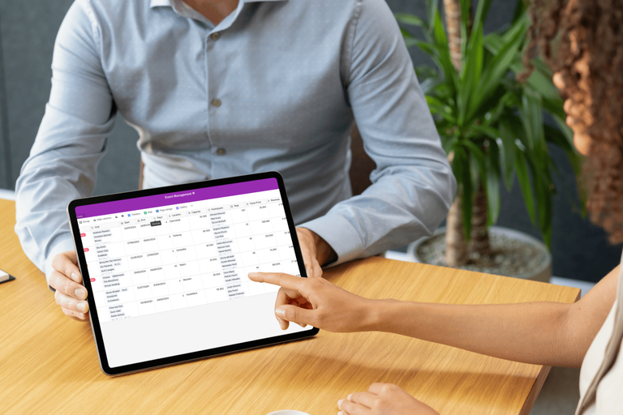

## Современная система для эффективного процесса

Компания Red Dot GmbH & Co. KG в Эссене является неотъемлемой частью международного мира дизайна брендов, продуктов и коммуникаций. Благодаря Red Dot Design Award компания организует один из самых известных в мире конкурсов дизайна, а также управляет тремя музеями дизайна Red Dot в Эссене, Сингапуре и Сямыне (Китай), которые являются одними из самых важных музеев современного дизайна. Церемонии награждения двух из трех конкурсов дизайна теперь проводятся с помощью SeaTable после того, как команда перестала справляться со сложными процессами с помощью существующих решений. Луиза Мюхер, менеджер по цифровому бизнесу Red Dot Design Award, объясняет, почему Red Dot перешла на SeaTable и что изменилось в результате.

До появления SeaTable самым важным инструментом была [настольная программа электронных таблиц](https://seatable.com/ru/excel-alternative/). Это решение было устаревшим, особенно когда речь шла об управлении данными. Сотрудничество внутри команды было настоящей проблемой, поскольку совместная работа была невозможна. Существующий процесс оказался особенно проблематичным при организации церемонии награждения Red Dot Award: Product Design, крупного международного мероприятия. Отсутствие возможностей для совместной работы затрудняло организацию и внесение изменений в последний момент.

## SeaTable идеально отвечает требованиям

Для Red Dot было очевидно, что необходим другой инструмент, который также обеспечивал бы совместную работу с данными в режиме реального времени. Однако очевидное [облачное решение](https://seatable.com/ru/cloud/) было исключено из-за строгих требований компании к защите данных. Поэтому требовалось решение, поддерживающее совместную работу, отвечающее строгим требованиям по защите данных и размещаемое в локальной сети. В то время Red Dot уже использовала Seafile, родственный продукт SeaTable, в качестве инструмента для обмена файлами. Поэтому Луиза Мюхер получила рекомендацию от своего поставщика ИТ-услуг обратить внимание на SeaTable.

Удобство использования, высокий уровень защиты данных и беспроблемная возможность совместной работы в одном файле сразу же убедили ее. Процесс внедрения также прошел гладко. При поддержке поставщика ИТ-услуг SeaTable был быстро внедрен в различных подразделениях компании. Поскольку первоначальные процессы можно было отобразить с помощью стандартных шаблонов, а сама система очень удобна и интуитивно понятна, ее приняли в коллективе.

## Универсальный инструмент управления

Сегодня SeaTable используется как универсальный инструмент управления. Основной сферой применения по-прежнему является [организация мероприятий](https://seatable.io/vorlage/fewxqfzbsxocskxl7hikqq/). Списки гостей и планы распределения помещений, планирование персонала на мероприятиях и даже расписание гала-концерта, спланированное до секунды, отображаются в SeaTable. Особенно полезной здесь оказалась возможность загрузки аудиофайлов непосредственно в базу. Это позволяет директору в любой момент получить доступ к аудиозаписям, например, произношения имен лауреатов премии.

Благодаря API управление заказами и отправка ежегодников Red Dot Design теперь также организованы через SeaTable. Наконец, SeaTable также используется в качестве CRM и [инструмента управления проектами]().

## Управление процессами на новом уровне

Red Dot выигрывает от возможности совместной работы и прозрачного отображения бережливых процессов. Сотрудники компании интуитивно справились с внедрением и первыми шагами в SeaTable и сразу же убедились в преимуществах. "Улучшение коммуникации, совместная и эффективная работа, более надежное и прозрачное управление данными в целом, высокий уровень удобства для пользователей и высокий стандарт защиты данных: с помощью SeaTable компания Red Dot смогла успешно вывести внутренние процессы на новый уровень". Зигфрид Шнайдер, CMO, Red Dot GmbH & Co. KG
