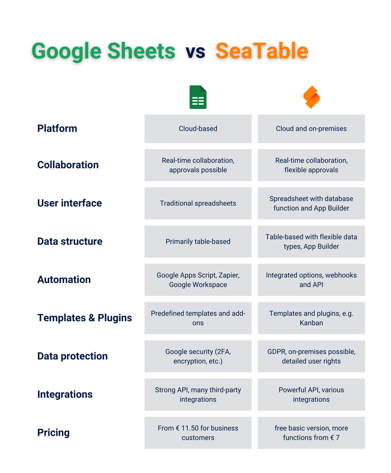

## Überwinden Sie die Grenzen von Excel

Tabellen sind aus dem Arbeitsalltag vieler Menschen nicht mehr wegzudenken. Egal, ob Sie erfolgreich eine Personalabteilung führen, ein trendiges Modelabel gegründet haben, eine kreative Marketingagentur leiten oder als selbständiger Softwareentwickler durchstarten – Spreadsheets sind die perfekte Lösung, wenn Sie Ihre Daten einfach und übersichtlich festhalten möchten. 

Doch je größer Ihr Unternehmen wird, desto mehr Daten und Dokumente müssen Sie zum Beispiel von Mitarbeitern, Kunden, Produkten oder Projekten erfassen. Die wachsende Nachfrage nach einem benutzerfreundlichen und zugleich leistungsstarken Tool macht es deutlich: Klassische Tools wie Excel oder Google Sheets stoßen zunehmend an ihre Grenzen. Welche **kostenlose Google Spreadsheet Alternative** wirklich herausragt und wie Sie diese perfekt auf Ihre Anforderungen zuschneiden können, erfahren Sie in diesem Artikel. 

## Warum Online-Tabellen wie Google Spreadsheet der neue Standard sind

Die Zeiten, in denen Excel in Sachen Tabellenkalkulation unangefochten an erster Stelle stand, sind vorbei. Heute mischen **Online--Tabellenkalkulationen wie Google Sheets** die Szene auf und bieten allerlei Funktionen, die über das hinausgehen, was klassische Desktop-Versionen bieten. Diese browserbasierten Tools machen nicht nur die Datenauswertung und -visualisierung einfach, sondern setzen auch neue Maßstäbe in Sachen Benutzerfreundlichkeit und Echtzeit-Kollaboration.

Wer nicht nur Formeln und Diagramme, sondern auch **Datenbankfunktionen oder Web-Formulare nutzen** möchte, sollte auf Online-Spreadsheets setzen. In der neuen Generation von Google Spreadsheet Alternativen sind erweiterte Datenformate und unterschiedliche Anwendungsansichten gegeben. Der Siegeszug der Online-Spreadsheets kommt also nicht von ungefähr – sie bieten Funktionen, auf die Sie zukünftig nicht mehr verzichten möchten.

**Was ist ein Spreadsheet?**   
Ein Spreadsheet ist eine digitale Tabelle, die zur **Organisation, Analyse und Bearbeitung von Daten** in einem Raster aus Zeilen und Spalten dient. Der Begriff stammt aus dem Englischen und setzt sich aus "spread" (verbreiten) und "sheet" (Blatt) zusammen. Er wird häufig synonym zu Tabellenkalkulation verwendet.

## Google Spreadsheet: ein kurzer Überblick

Google Sheets ist ein **cloudbasiertes Tool**, das vielen Nutzern als erste Wahl dient, wenn es um Tabellenkalkulationen geht. Ein wesentlicher Grund dafür ist, dass es kostenlos ist und lediglich einen Google-Account erfordert – ein Konto, das die meisten Menschen ohnehin bereits nutzen. Darüber hinaus bietet ein Google Spreadsheet die Vorteile einer modernen Online-Anwendung: von der **Zusammenarbeit in Echtzeit bis hin zur automatischen Speicherung**.

Ein weiterer Vorteil, wenn Sie mithilfe von Google ein Spreadsheet erstellen, ist die **nahtlose Integration mit anderen Google-Diensten** wie Google Docs, Google Drive und Google Analytics. Diese enge Verzahnung ermöglicht es Ihnen, beispielsweise zwischen Google Docs und einem Google Spreadsheet Daten und Inhalte auszutauschen. In Google Docs eine Tabelle zu erstellen ist nur in begrenztem Maß möglich, da es vor allem für Textdokumente entwickelt wurde.

Google Sheets hingegen bietet eine deutlich erweiterte Funktionalität für die Erstellung und Bearbeitung von Tabellen – ähnlich wie Microsoft Excel. Die Möglichkeit, komplexe Datenanalysen durchzuführen, Formeln zu nutzen und Diagramme zu erstellen, macht Google Spreadsheets zu einem unverzichtbaren Werkzeug für viele Unternehmen.

## Vor- und Nachteile von Google Spreadsheet

Sowohl Einzelpersonen als auch Unternehmen rund um die Welt nutzen täglich Google, um eine Tabelle zu erstellen. Einige Funktionen machen es zu einer attraktiven Option für Nutzer, die auf der Suche nach einer [Excel Alternative](https://seatable.com/excel-alternative/) sind, die **flexibel und cloudbasiert** ist. Auf der anderen Seite gibt es auch ein paar Stolpersteine, die Sie nicht unterschätzen sollten. Letztlich lohnt es sich, einen genaueren Blick auf die Vor- und Nachteile zu werfen.

### Vorteile

Einer der größten Vorteile von Google Sheets ist die einfache Bedienung. Die **benutzerfreundliche Oberfläche** ermöglicht es auch unerfahrenen Anwendern, sich schnell zurechtzufinden und produktiv zu arbeiten. Ein weiteres Highlight ist die **nahtlose Integration mit anderen Google-Apps**. Durch die Verbindung mit Google Drive, Gmail und anderen Google-Diensten können Daten und Dateien mühelos synchronisiert und in Echtzeit geteilt werden. Dies führt direkt zu einem weiteren Pluspunkt: der Möglichkeit der Zusammenarbeit.

Da Google Tabellen online verfügbar sind, können **mehrere Nutzer gleichzeitig an einer Tabelle arbeiten und Änderungen werden sofort für alle sichtbar** – ideal für Teams, die an Projekten von verschiedenen Standorten aus arbeiten. Darüber hinaus bietet Google Sheets eine breite Verfügbarkeit von Add-ons, die zusätzliche Funktionen und Anpassungsmöglichkeiten bieten, sowie die Zugänglichkeit auf verschiedenen Geräten. Egal, ob am Computer, Tablet oder Smartphone – **Google Sheets ist von überall aus verfügbar**, was besonders in einer mobilen Arbeitswelt ein unschätzbarer Vorteil ist.

### Nachteile

Trotz dieser zahlreichen Vorteile gibt es auch einige Herausforderungen, die Sie bei der Nutzung von Google Sheets berücksichtigen sollten. Begrenzte Funktionalität kann ein Problem darstellen, wenn es um die **Verwaltung sehr großer Datensätze oder komplexer Workflows** geht. Für datenintensive Anwendungen oder anspruchsvolle Geschäftsprozesse könnte ein Google Spreadsheet daher nicht ausreichen. Ein weiteres, oft diskutiertes Thema sind **Datenschutzbedenken**. Da alle Daten auf Google-Servern gespeichert werden, könnten sensible Informationen potenziell gefährdet sein.

Zudem gibt es **Schwierigkeiten bei der Anpassung und Erweiterung der Funktionalitäten**, insbesondere wenn Sie spezielle Anforderungen an das Tool stellen. **Google Spreadsheets stoßen oft an ihre Grenzen, wenn es um komplexe Anwendungen wie die Verwaltung relationaler Datenbanken, das automatisierte Workflow-Management oder die Integration mit großen Unternehmenssystemen geht.**

### Fazit

Zusammenfassend lässt sich sagen, dass Google Sheets eine **gute Lösung für grundlegende bis mittlere Anforderungen** ist, insbesondere für Nutzer, die Wert auf Benutzerfreundlichkeit und Kollaboration legen. Doch für fortgeschrittene Nutzer oder Unternehmen mit komplexeren Anforderungen könnte Google Sheets an seine Grenzen stoßen. 

## SeaTable vs. Google Spreadsheet

In der Welt der Tabellenkalkulationen ist Google Sheets zweifellos ein bekanntes Schwergewicht. Vor allem bei der Zusammenarbeit in Teams hat es sich als unverzichtbares Tool etabliert. Mit Echtzeitbearbeitung, unkomplizierten Freigabefunktionen und nahtloser Integration in das Google-Ökosystem ist es oft die erste Wahl. Doch wie steht die Anwendung im Vergleich zu anderen Lösungen da?

## Gibt es Google Spreadsheet Alternativen, die noch mehr zu bieten haben?

Mit vielen Programmen können Sie eine Tabelle erstellen – kostenlos und benutzerfreundlich sogar. Am Spreadsheet-Himmel leuchtet ein Stern, der den Vergleich mit Google Sheets und anderen Tools nicht scheuen muss: **SeaTable**. Dieses Tool geht weit über die Funktionen herkömmlicher Tabellenkalkulationen hinaus. Wo Google Sheets punktet, zeigt SeaTable, dass es noch mehr zu bieten hat. Es **kombiniert die Benutzerfreundlichkeit und Flexibilität von Spreadsheets mit allen Vorteilen einer No-Code-Datenbank**, wodurch es zur perfekten Lösung für moderne Teams wird.

SeaTable hebt sich besonders durch seine Eigenschaft als [No-Code-Plattform](https://seatable.com/) und App-Builder hervor. Damit können Sie nicht nur Tabellen erstellen und verwalten, sondern auch **maßgeschneiderte Anwendungen bauen, die genau auf ihre Bedürfnisse zugeschnitten** sind. Diese Möglichkeit eröffnet völlig neue Wege in der Datenverwaltung und Prozessoptimierung, die Google Spreadsheets in dieser Form nicht bieten können.

Die Vorteile von SeaTable liegen auf der Hand: Es ist flexibel, leistungsstark und ermöglicht eine **transparente Zusammenarbeit** – und das alles in einer einzigen, intuitiven Plattform. Wenn Sie also nach einer Lösung suchen, die mehr kann als herkömmliche Tabellenkalkulationen und dabei Ihre individuellen Anforderungen erfüllt, dann ist SeaTable die ideale Wahl.

In der Gegenüberstellung zeigt sich klar: SeaTable ist nicht nur eine Google Spreadsheet Alternative – es ist die **nächste Stufe in der Evolution der Tabellenkalkulationen**. Mit seiner einzigartigen **Kombination aus Kollaboration, Flexibilität und App-Building-Funktionen** hebt es sich deutlich ab und bietet Ihnen die Freiheit, Ihre Daten so zu verwalten und zu nutzen, wie es Ihre Arbeitsweise erfordert.

## Tipps zur Auswahl des richtigen Tools

Damit Ihr Spreadsheet-Tool all Ihre Anforderungen erfüllt und Sie keinen Fehlgriff bei der Auswahl machen, ist es essenziell, im Vorfeld die **Funktionen des Tools genau unter die Lupe zu nehmen**. Dabei sollten Sie verschiedene Kriterien berücksichtigen, um sicherzustellen, dass das Tool optimal zu Ihren Bedürfnissen passt.

Stellen Sie sich zum Beispiel die Fragen: Benötigen Sie eine möglichst einfache und intuitive Anwendung oder bevorzugen Sie ein **Tool, das auch komplexe Aufgaben bewältigen** kann? Arbeiten Sie ausschließlich offline oder ist Ihnen die Möglichkeit wichtig, in Echtzeit mit anderen zusammenzuarbeiten?

Darüber hinaus ist es entscheidend, ob das Tool nur grundlegende Funktionen wie das Berechnen von Formeln beherrschen muss oder ob Sie auch die Fähigkeit zur Erstellung von Grafiken, das **Speichern von Dateien und das Verknüpfen von Datensätzen** erwarten. Gibt es spezielle Erweiterungen, die Sie benötigen und die nicht bei jedem Anbieter verfügbar sind? Haben Sie Bedenken hinsichtlich des Datenschutzes und bevorzugen daher ein Tool mit Serverstandort in einem bestimmten Land oder ist Ihnen dieser Aspekt weniger wichtig?

Nur wenn Sie diese Fragen für sich geklärt haben, können Sie beruhigt die Auswahl des passenden Tools treffen.

## 5 Fragen, die Sie sich beim Anlegen eines Spreadsheets stellen sollten

Bevor Sie nun Ihre Tabellen kostenlos erstellen, sollten Sie sich die folgenden fünf Fragen stellen, um sicherzugehen, dass Ihr Spreadsheet nicht nur gut aussieht, sondern auch effizient arbeitet:

1. **Welche Information soll erfasst werden?** Klarheit ist der Schlüssel! Definieren Sie genau, welche Daten in Ihrem Spreadsheet landen sollen. Das spart Zeit und verhindert Chaos.
1. **Wer braucht einen Zugang zu welchem Spreadsheet?** Nicht jeder muss alles sehen. Überlegen Sie, wer Zugriff auf welche Tabelle benötigt, und stellen Sie die Freigabe gezielt ein.
1. **Können Sie Prozesse vereinfachen oder automatisieren?** Wenn Ihre Daten lebendig sind und ständig aktualisiert werden, sollten Sie sich überlegen, wie Sie diese Prozesse vereinfachen oder automatisieren können.
1. **Wie verfolge ich alle Entwicklungen der Spreadsheets?** Behalten Sie den Überblick! Versionierung und Änderungsverfolgung sind essenziell, um immer auf dem neuesten Stand zu bleiben.
1. **Gibt es bereits ein Template, das für mein Vorhaben von Nutzen ist?** Warum das Rad neu erfinden? Nutzen Sie frei verfügbare Templates, um schnell und effizient durchzustarten.

## Warum SeaTable die beste Google Spreadsheet Alternative ist

Wenn Sie auf der Suche nach einem leistungsstarken Tabellenkalkulationstool sind, das über die klassischen Funktionen von Google Spreadsheets hinausgeht, ist SeaTable die perfekte Wahl. Es bietet eine Reihe von **erweiterten Funktionen, die speziell für Nutzer entwickelt wurden**, die mehr Flexibilität und Kontrolle über ihre Daten benötigen.

### Erweiterte Spaltentypen

Mit SeaTable können Sie weit mehr als nur Zahlen und Text in Ihre Tabellen einfügen. Grundsätzlich **weisen Sie jeder Spalte vorab einen festen Datentyp zu, wodurch Sie Eingaben validieren und Fehler minimieren** können. Das Tool ermöglicht es Ihnen außerdem, Bilder oder Dateien direkt in den Zellen abzulegen. Darüber hinaus stehen Ihnen Spaltentypen zur Verknüpfung von Datensätzen und zu deren Kategorisierung mithilfe von Einfach- und Mehrfachauswahlen zur Verfügung. So behalten Sie auch bei komplexen Datenstrukturen den Überblick.

### Anwendungsorientierte Ansichten

SeaTable ermöglicht nicht nur die Erfassung, sondern auch die **umfassende Auswertung und Visualisierung quantitativer Daten**. Dafür stehen Filter, Sortierungen und Gruppierungen in der Tabelle, aber auch ein Dashboard mit diversen Statistiken bereit. Ein Bild sagt mehr als tausend Worte – und die Plugins (z. B. Kalender, Kanban, Galerie oder Organigramm) machen es Ihnen leicht, Ihre Daten grafisch darzustellen, auch wenn es sich nicht um numerische Informationen handelt. So überwinden Sie die Hürden herkömmlicher Tabellenkalkulationen und gewinnen wertvolle Erkenntnisse aus Ihren Daten. Wie Sie mit SeaTable sogar eigene Apps erstellen können, erfahren Sie hier.

### Datenbankfunktion

Eine der herausragendsten Funktionen von SeaTable ist die Datenbankintegration. Zellverweise für Formeln sind überall gegeben, aber mit SeaTable können Sie jetzt auch Zellverweise auf **ganze Datensätze in anderen Tabellen erstellen** – eine Revolution für die Auswertung über Tabellengrenzen hinweg. Diese Funktion bietet Ihnen die Möglichkeit, Daten zu verknüpfen, miteinander in Beziehung zu setzen und so umfassend zu analysieren, wie es sonst nur in relationalen Datenbanken möglich ist.

SeaTable ist nicht nur eine Google Spreadsheet Alternative, sondern eine leistungsstarke No-Code-Plattform, die Ihre Arbeitsweise mit Tabellen auf ein neues Level heben wird. Probieren Sie es aus, [registrieren Sie sich kostenlos]() und entdecken Sie, wie einfach und effektiv Datenmanagement sein kann.

## Häufig gestellte Fragen



Welche Vorteile bieten Online-Tabellen im Vergleich zu klassischen Desktop-Tabellen? |||

Online-Tabellen ermöglichen Echtzeit-Kollaboration, automatische Speicherung und den Zugriff von verschiedenen Geräten. Sie sind zudem meist einfacher zu bedienen und bieten häufig Plugins oder Add-ons zur Anpassung und Erweiterung der Funktionalitäten. 

---

Was sind die Hauptunterschiede zwischen Google Sheets und SeaTable? |||

Während Google Sheets eine einfache Bedienung, Echtzeit-Kollaboration und nahtlose Integration ins Google-Ökosystem liefert, bietet SeaTable zusätzlich erweiterte Spaltentypen, anwendungsorientierte Ansichten und eine voll integrierte Datenbankfunktion. Damit ist SeaTable besonders für komplexere Anforderungen geeignet.

---

Ist SeaTable auch für kleine Unternehmen oder Einzelanwender geeignet? |||

Ja, SeaTable ist dank seiner kostenlosen Version und einfachen Bedienung sowohl für Einzelpersonen als auch für kleine Unternehmen geeignet. Gleichzeitig bietet es skalierbare Funktionen, die mit wachsenden Anforderungen Schritt halten.

