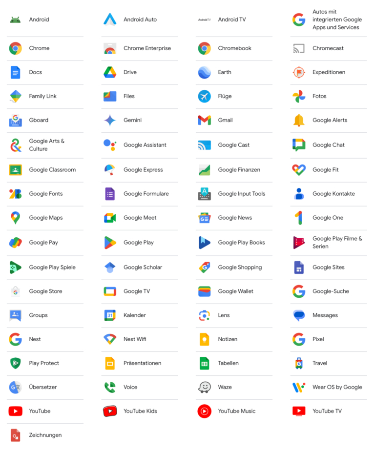
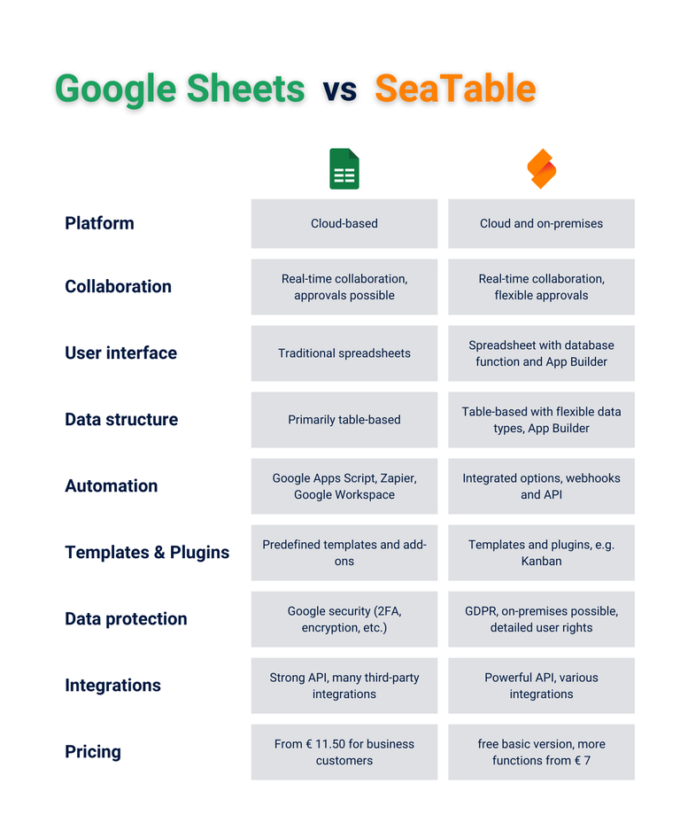
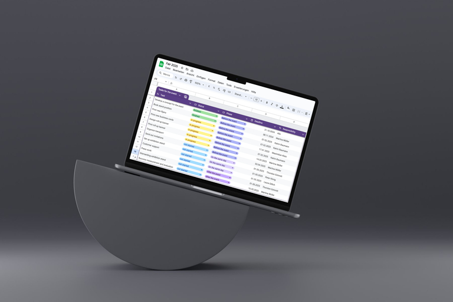
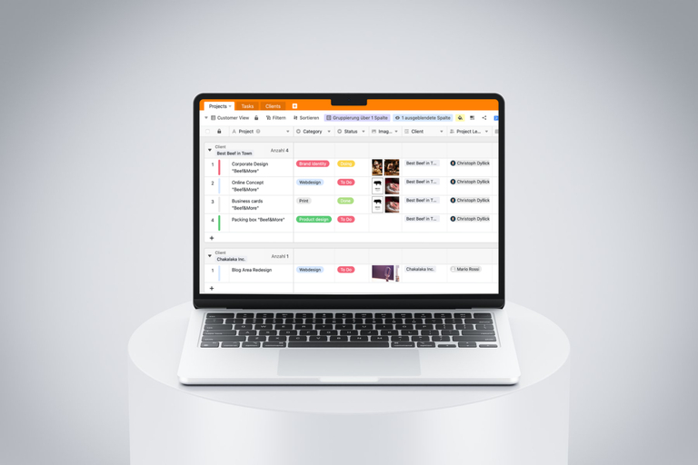

## Supera los límites de Excel

Las hojas de cálculo se han convertido en una parte integral de la vida laboral cotidiana de muchas personas. Tanto si diriges un exitoso departamento de recursos humanos como si has fundado una marca de moda, diriges una agencia de marketing creativo o estás empezando como desarrollador de software autónomo, las hojas de cálculo son la solución perfecta si quieres registrar tus datos de forma sencilla y clara.

Sin embargo, cuanto mayor es su empresa, más datos y documentos necesita registrar, por ejemplo de empleados, clientes, productos o proyectos. La creciente demanda de una herramienta fácil de usar pero potente lo deja claro: las herramientas tradicionales como Excel o Google Sheets están llegando cada vez más a sus límites. En este artículo descubrirá qué **alternativa gratuita a Google Spreadsheet** destaca realmente y cómo puede adaptarla perfectamente a sus necesidades.

## Por qué las hojas de cálculo en línea como Google Spreadsheet son el nuevo estándar

Los días en los que Excel era el líder indiscutible en hojas de cálculo se han acabado. Hoy en día, **hojas de cálculo en línea como Google Sheets** están sacudiendo la escena, ofreciendo todo tipo de características que van más allá de lo que ofrecen las versiones clásicas de escritorio. Estas herramientas basadas en navegadores no sólo facilitan el análisis y la visualización de datos, sino que también establecen nuevos estándares en términos de facilidad de uso y colaboración en tiempo real.

Si quieres utilizar no sólo fórmulas y diagramas, sino también **funciones de bases de datos o formularios web**, debes confiar en las hojas de cálculo en línea. La nueva generación de alternativas a Google Spreadsheet ofrece formatos de datos ampliados y diferentes vistas de la aplicación. Por lo tanto, el triunfo de las hojas de cálculo en línea no es casual: ofrecen funciones de las que no querrás prescindir en el futuro.

**¿Qué es una hoja de cálculo?**
Una hoja de cálculo es una tabla digital que sirve para **organizar, analizar y procesar datos** en una cuadrícula de filas y columnas. El término procede de las palabras inglesas "spread" y "sheet". A menudo se utiliza como sinónimo de hoja de cálculo.

## Hoja de cálculo de Google: breve description:

Google Sheets es una **herramienta basada en la nube** que es la primera opción de muchos usuarios cuando se trata de hojas de cálculo. Una de las razones principales es que es gratuita y sólo requiere una cuenta de Google, una cuenta que la mayoría de la gente ya utiliza de todos modos. Además, una hoja de cálculo de Google ofrece las ventajas de una aplicación en línea moderna: desde **la colaboración en tiempo real hasta el guardado automático**.

Otra ventaja de crear una hoja de cálculo con Google es la **integración perfecta con otros servicios de Google** como Google Docs, Google Drive y Google Analytics. Esta estrecha integración te permite intercambiar datos y contenidos entre Google Docs y una hoja de cálculo de Google, por ejemplo. Crear una hoja de cálculo en Google Docs sólo es posible hasta cierto punto, ya que se desarrolló principalmente para documentos de texto.

Google Sheets, en cambio, ofrece una funcionalidad significativamente mejorada para crear y editar tablas, similar a la de Microsoft Excel. La posibilidad de realizar análisis de datos complejos, utilizar fórmulas y crear gráficos convierte a Google Spreadsheets en una herramienta indispensable para muchas empresas.

## Ventajas y desventajas de Google Spreadsheet

Tanto particulares como organizaciones de todo el mundo utilizan Google a diario para crear una hoja de cálculo. Algunas de sus características la convierten en una opción atractiva para los usuarios que buscan una [alternativa a Excel](https://seatable.com/es/excel-alternative/) que sea **flexible y esté basada en la nube**. Por otro lado, también existen algunos escollos que no debes subestimar. En definitiva, merece la pena analizar los pros y los contras.

### Ventajas

Una de las mayores ventajas de Google Sheets es su facilidad de uso. Su **interfaz de fácil manejo** permite incluso a los usuarios sin experiencia orientarse rápidamente y trabajar de forma productiva. Otro aspecto destacado es la **integración perfecta con otras aplicaciones de Google**. Al conectarse a Google Drive, Gmail y otros servicios de Google, los datos y archivos pueden sincronizarse y compartirse fácilmente en tiempo real. Esto nos lleva directamente a otro punto a favor: la posibilidad de colaborar.

Dado que Google Sheets está disponible en línea, **múltiples usuarios pueden trabajar en una hoja de cálculo al mismo tiempo y los cambios son inmediatamente visibles para todos**, lo que resulta ideal para equipos que trabajan en proyectos desde distintas ubicaciones. Además, Google Sheets ofrece una amplia disponibilidad de complementos que proporcionan funciones adicionales y opciones de personalización, así como accesibilidad en distintos dispositivos. Ya sea en un ordenador, una tableta o un smartphone, **Google Sheets está disponible desde cualquier lugar**, lo que supone una ventaja inestimable, especialmente en un entorno de trabajo móvil.

### Desventajas

A pesar de estas numerosas ventajas, también existen algunos inconvenientes que debes tener en cuenta a la hora de utilizar Google Sheets. La funcionalidad limitada puede ser un problema cuando se trata de **gestionar conjuntos de datos muy grandes o flujos de trabajo complejos**. Para aplicaciones con muchos datos o procesos empresariales exigentes, una hoja de cálculo de Google puede no ser suficiente. Otro tema que se debate con **frecuencia es el de la privacidad**. Dado que todos los datos se almacenan en los servidores de Google, la información confidencial podría estar en peligro.

También hay **dificultades para personalizar y ampliar las funcionalidades**, sobre todo si tienes requisitos específicos para la herramienta. **Las hojas de cálculo de Google suelen alcanzar sus límites cuando se trata de aplicaciones complejas, como la gestión de bases de datos relacionales, la gestión automatizada de flujos de trabajo o la integración con grandes sistemas empresariales.**

### Conclusión

En resumen, Google Spreadsheets es una **buena solución para necesidades básicas e intermedias**, especialmente para usuarios que valoran la facilidad de uso y la colaboración. Sin embargo, para usuarios avanzados u organizaciones con requisitos más complejos, Google Sheets puede llegar a sus límites.

## SeaTable vs Google Spreadsheet

En el mundo de las hojas de cálculo, Google Sheets es sin duda un peso pesado reconocido. Se ha consolidado como una herramienta indispensable, especialmente para la colaboración en equipo. Gracias a su edición en tiempo real, sus sencillas funciones para compartir y su perfecta integración en el ecosistema de Google, suele ser la primera opción. Pero, ¿cómo se compara esta aplicación con otras soluciones?

## ¿Existen alternativas a Google Spreadsheet que ofrezcan más?

Puedes crear una hoja de cálculo con muchos programas, gratuitos e incluso fáciles de usar. Hay una estrella brillante en el firmamento de las hojas de cálculo que no tiene por qué rehuir la comparación con Google Sheets y otras herramientas: **SeaTable**. Esta herramienta va mucho más allá de las funciones de las hojas de cálculo convencionales. Donde Google Sheets tiene una puntuación alta, SeaTable demuestra que tiene aún más que ofrecer. **Combina la facilidad de uso y la flexibilidad de las hojas de cálculo con todas las ventajas de una base de datos sin código**, lo que la convierte en la solución perfecta para los equipos modernos.

SeaTable destaca como [Plataforma sin código]() y creador de aplicaciones. No sólo permite crear y gestionar tablas, sino también construir **aplicaciones personalizadas adaptadas a sus necesidades**. Esta posibilidad abre vías completamente nuevas de gestión de datos y optimización de procesos que Google Spreadsheets no puede ofrecer de esta forma.

Las ventajas de SeaTable son claras: es flexible, potente y permite **una colaboración transparente**, todo ello en una única plataforma intuitiva. Así que si busca una solución que pueda hacer más que las hojas de cálculo tradicionales y satisfacer sus necesidades individuales, SeaTable es la opción ideal.

La comparación muestra claramente que SeaTable no es sólo una alternativa a Google Spreadsheet, es el **siguiente paso en la evolución de las hojas de cálculo**. Con su exclusiva **combinación de funciones de colaboración, flexibilidad y creación de aplicaciones**, destaca claramente y le ofrece la libertad de gestionar y utilizar sus datos de la forma que mejor se adapte a su forma de trabajar.

## Consejos para elegir la herramienta adecuada

Para asegurarte de que tu herramienta de hoja de cálculo cumple todos tus requisitos y de que no te equivocas al seleccionarla, es esencial que estudies detenidamente las **características de la herramienta** de antemano. Debes tener en cuenta varios criterios para asegurarte de que la herramienta se adapta de forma óptima a tus necesidades.

Por ejemplo, hágase las siguientes preguntas: ¿Necesita una aplicación lo más sencilla e intuitiva posible o prefiere una **herramienta que también pueda realizar tareas complejas**? ¿Sólo trabaja fuera de línea o es importante para usted la posibilidad de colaborar con otras personas en tiempo real?

También es crucial si la herramienta sólo tiene que ser capaz de realizar funciones básicas como calcular fórmulas o si también espera poder crear gráficos, **guardar archivos y vincular conjuntos de datos**. ¿Necesita extensiones especiales que no estén disponibles en todos los proveedores? ¿Le preocupa la protección de datos y, por tanto, prefiere una herramienta con un servidor ubicado en un país concreto o este aspecto es menos importante para usted?

Sólo cuando haya aclarado estas cuestiones podrá elegir la herramienta adecuada con confianza.

## 5 preguntas que debes hacerte al crear una hoja de cálculo

Antes de crear tus hojas de cálculo gratis, deberías hacerte las siguientes cinco preguntas para asegurarte de que tu hoja de cálculo no sólo tiene buen aspecto, sino que también funciona de forma eficiente:

1. **Qué información debe capturarse** ¡La claridad es la clave! Define exactamente qué datos deben ir a parar a tu hoja de cálculo. Esto ahorra tiempo y evita el caos.
1. **¿Quién necesita acceder a qué hoja de cálculo?** No todo el mundo necesita verlo todo. Piensa en quién necesita acceder a qué hoja de cálculo y establece la liberación de forma específica.
1. **¿Puedes simplificar o automatizar procesos?** Si tus datos están vivos y se actualizan constantemente, piensa en cómo puedes simplificar o automatizar estos procesos.
1. **¿Cómo puedo hacer un seguimiento de todos los desarrollos de las hojas de cálculo?** El control de versiones y cambios es esencial para mantenerse al día.
1. **¿Existe ya alguna plantilla útil para mi proyecto?** ¿Por qué reinventar la rueda? Utiliza plantillas gratuitas para empezar de forma rápida y eficaz.

## Por qué SeaTable es la mejor alternativa a Google Spreadsheet

Si buscas una potente herramienta de hoja de cálculo que vaya más allá de las funciones clásicas de Google Spreadsheets, SeaTable es la elección perfecta. Ofrece una serie de **características avanzadas diseñadas específicamente para usuarios** que necesitan más flexibilidad y control sobre sus datos.

### Tipos de columna avanzados

SeaTable le permite añadir mucho más que números y texto a sus tablas. Básicamente **asigna un tipo de datos fijo a cada columna por adelantado, lo que le permite validar las entradas y minimizar los errores**. La herramienta también permite almacenar imágenes o archivos directamente en las celdas. También dispone de tipos de columna para vincular registros de datos y categorizarlos mediante selecciones simples y múltiples. Esto permite mantener una visión de conjunto incluso con estructuras de datos complejas.

### Vistas orientadas a la aplicación

SeaTable permite no sólo la recopilación, sino también la **evaluación y visualización exhaustiva de datos cuantitativos**. Para ello se dispone de filtros, clasificación y agrupación en la tabla, así como de un cuadro de mando con diversas estadísticas. Una imagen vale más que mil palabras - y los plugins (por ejemplo, calendario, Kanban, galería u organigrama) le facilitan la visualización gráfica de sus datos, aunque no se trate de información numérica. Esto le permite superar los obstáculos de las hojas de cálculo convencionales y obtener información valiosa de sus datos. Descubra cómo puede incluso crear sus propias aplicaciones con SeaTable aquí.

### Función de base de datos

Una de las características más destacadas de SeaTable es su integración con bases de datos. Las referencias de celdas para fórmulas están en todas partes, pero con SeaTable ahora también puede crear referencias de celdas a **conjuntos de datos enteros en otras tablas** - una revolución para analizar a través de los límites de las tablas. Esta función le permite vincular datos, relacionarlos entre sí y analizarlos de forma tan exhaustiva como sólo es posible en bases de datos relacionales.

SeaTable no es sólo una alternativa a Google Spreadsheet, sino una potente plataforma sin código que llevará su forma de trabajar con tablas al siguiente nivel. Pruébela, ['regístrese gratuitamente']() y descubra lo fácil y eficaz que puede ser la gestión de datos.

## Preguntas más frecuentes

Las hojas de cálculo en línea permiten la colaboración en tiempo real, el almacenamiento automático y el acceso desde distintos dispositivos. También suelen ser más fáciles de usar y a menudo ofrecen plug-ins o complementos para personalizarlas y ampliar sus funcionalidades.


Mientras que Google Sheets proporciona facilidad de uso, colaboración en tiempo real y una integración perfecta en el ecosistema de Google, SeaTable ofrece tipos de columnas avanzadas adicionales, vistas orientadas a aplicaciones y una función de base de datos totalmente integrada. Esto hace que SeaTable sea especialmente adecuado para requisitos más complejos.


Sí, SeaTable es adecuado tanto para particulares como para pequeñas empresas gracias a su versión gratuita y a su facilidad de uso. Al mismo tiempo, ofrece funciones escalables que se adaptan a las necesidades crecientes.

