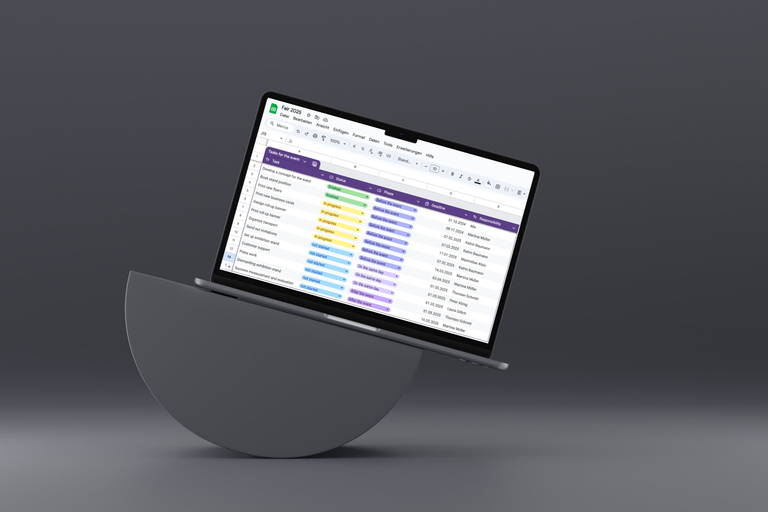
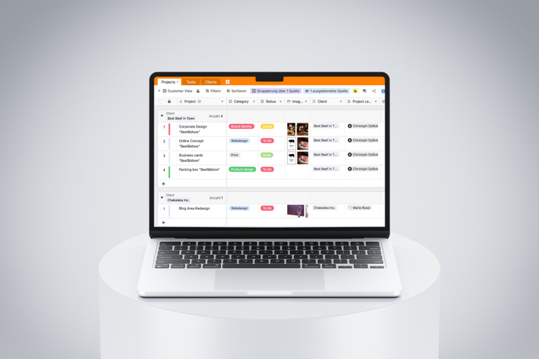

## Ultrapassar os limites do Excel

As folhas de cálculo tornaram-se parte integrante do quotidiano profissional de muitas pessoas. Quer tenha um departamento de RH bem sucedido, fundado uma marca de moda, gerido uma agência de marketing criativa ou esteja a iniciar-se como programador de software freelancer - as folhas de cálculo são a solução perfeita para registar os seus dados de forma simples e clara.

No entanto, quanto maior for a sua empresa, maior será o número de dados e documentos a registar, por exemplo, de empregados, clientes, produtos ou projectos. A crescente procura de uma ferramenta fácil de utilizar, mas poderosa, torna claro: as ferramentas tradicionais como o Excel ou o Google Sheets estão cada vez mais a atingir os seus limites. Neste artigo, pode descobrir qual a **alternativa gratuita ao Google Spreadsheet** que realmente se destaca e como pode adaptá-la perfeitamente às suas necessidades.

## Porque é que as folhas de cálculo online, como a folha de cálculo do Google, são o novo padrão

Os dias em que o Excel era o líder indiscutível das folhas de cálculo acabaram. Atualmente, as **folhas de cálculo online como o Google Sheets** estão a abanar o cenário, oferecendo todo o tipo de funcionalidades que vão além do que as versões clássicas para computador oferecem. Estas ferramentas baseadas no browser não só facilitam a análise e visualização de dados, como também estabelecem novos padrões em termos de facilidade de utilização e colaboração em tempo real.

Se pretende utilizar não só fórmulas e diagramas, mas também **funções de base de dados ou formulários Web**, deve recorrer a folhas de cálculo online. A nova geração de alternativas à folha de cálculo do Google oferece formatos de dados alargados e diferentes visualizações de aplicações. O triunfo das folhas de cálculo online não é, portanto, uma coincidência - elas oferecem funções que não vai querer dispensar no futuro.

**O que é uma folha de cálculo?**
Uma folha de cálculo é uma tabela digital que é utilizada para \*\*organizar, analisar e processar dados\*\* numa grelha de linhas e colunas. O termo deriva das palavras inglesas "spread" e "sheet". É frequentemente utilizado como sinónimo de folha de cálculo.

## Folha de cálculo do Google: uma breve descrição

O Google Sheets é uma **ferramenta baseada na nuvem** que é a primeira escolha de muitos utilizadores quando se trata de folhas de cálculo. Uma das principais razões para isso é o facto de ser gratuita e necessitar apenas de uma conta Google - uma conta que a maioria das pessoas já utiliza de qualquer forma. Além disso, uma folha de cálculo do Google oferece as vantagens de uma aplicação online moderna: desde a **colaboração em tempo real até à gravação automática**.

Outra vantagem de criar uma folha de cálculo com o Google é a **integração perfeita com outros serviços Google**, como o Google Docs, o Google Drive e o Google Analytics. Esta estreita integração permite-lhe trocar dados e conteúdos entre o Google Docs e uma folha de cálculo do Google, por exemplo. A criação de uma folha de cálculo no Google Docs só é possível até certo ponto, uma vez que foi desenvolvido principalmente para documentos de texto.

O Google Sheets, por outro lado, oferece uma funcionalidade significativamente melhorada para criar e editar tabelas - semelhante ao Microsoft Excel. A capacidade de efetuar análises de dados complexas, utilizar fórmulas e criar gráficos torna as folhas de cálculo do Google uma ferramenta indispensável para muitas empresas.

## Vantagens e desvantagens da folha de cálculo do Google

Tanto os indivíduos como as organizações de todo o mundo utilizam o Google todos os dias para criar uma folha de cálculo. Algumas caraterísticas tornam-no uma opção atractiva para os utilizadores que procuram uma [alternativa ao Excel]() que seja **flexível e baseada na nuvem**. Por outro lado, existem também alguns obstáculos que não deve subestimar. Em última análise, vale a pena analisar mais detalhadamente os prós e os contras.

### Vantagens

Uma das maiores vantagens do Google Sheets é a sua facilidade de utilização. A **interface amigável** permite que mesmo os utilizadores inexperientes se orientem rapidamente e trabalhem de forma produtiva. Outro destaque é a **integração perfeita com outras aplicações Google**. Ao ligar-se ao Google Drive, ao Gmail e a outros serviços Google, os dados e ficheiros podem ser facilmente sincronizados e partilhados em tempo real. Isto conduz diretamente a outro ponto positivo: a possibilidade de colaboração.

Uma vez que as Folhas de cálculo do Google estão disponíveis online, **múltiplos utilizadores podem trabalhar numa folha de cálculo ao mesmo tempo e as alterações são imediatamente visíveis para todos** - ideal para equipas que trabalham em projectos a partir de diferentes locais. Além disso, as folhas de cálculo do Google oferecem uma vasta disponibilidade de suplementos que proporcionam funcionalidades adicionais e opções de personalização, bem como acessibilidade em diferentes dispositivos. Quer seja num computador, tablet ou smartphone, o **Google Sheets está disponível em qualquer lugar**, o que é uma vantagem inestimável, especialmente num ambiente de trabalho móvel.

### Desvantagens

Apesar destas numerosas vantagens, existem também alguns desafios a que deve estar atento quando utiliza o Google Sheets. A funcionalidade limitada pode ser um problema quando se trata de **gerir conjuntos de dados muito grandes ou fluxos de trabalho complexos**. Para aplicações com grande volume de dados ou processos empresariais exigentes, uma folha de cálculo do Google pode não ser suficiente. Outro tópico frequentemente discutido são as **preocupações com a privacidade**. Uma vez que todos os dados são armazenados nos servidores da Google, as informações sensíveis podem estar potencialmente em risco.

Existem também **dificuldades em personalizar e alargar as funcionalidades**, especialmente se tiver requisitos específicos para a ferramenta. **As folhas de cálculo do Google atingem frequentemente os seus limites quando se trata de aplicações complexas, como a gestão de bases de dados relacionais, a gestão automatizada do fluxo de trabalho ou a integração com sistemas de grandes empresas.**

### Conclusão

Em suma, o Google Sheets é uma **boa solução para as necessidades básicas e intermédias**, especialmente para os utilizadores que valorizam a facilidade de utilização e a colaboração. No entanto, para utilizadores avançados ou organizações com requisitos mais complexos, o Google Sheets pode atingir os seus limites.

## SeaTable vs. Google Spreadsheet

No mundo das folhas de cálculo, o Google Sheets é, sem dúvida, um peso pesado reconhecido. Estabeleceu-se como uma ferramenta indispensável, especialmente para a colaboração em equipa. Com edição em tempo real, funções de partilha simples e uma integração perfeita no ecossistema Google, é frequentemente a primeira escolha. Mas como é que a aplicação se compara com outras soluções?

## Existem alternativas ao Google Spreadsheet que têm mais para oferecer?

É possível criar uma folha de cálculo com muitos programas - gratuitos e até fáceis de utilizar. Há uma estrela brilhante no firmamento das folhas de cálculo que não precisa de se furtar à comparação com o Google Sheets e outras ferramentas: **SeaTable**. Esta ferramenta vai muito além das funções das folhas de cálculo convencionais. Se o Google Sheets tem uma boa pontuação, o SeaTable mostra que tem ainda mais para oferecer. **Combina a facilidade de utilização e a flexibilidade das folhas de cálculo com todas as vantagens de uma base de dados sem código**, o que faz dela a solução perfeita para as equipas modernas.

O SeaTable destaca-se como uma [plataforma sem código]() e criador de aplicações. Permite não só criar e gerir tabelas, mas também construir **aplicações personalizadas adaptadas às suas necessidades**. Esta possibilidade abre formas completamente novas de gestão de dados e otimização de processos que as folhas de cálculo do Google não podem oferecer nesta forma.

As vantagens do SeaTable são claras: é flexível, potente e permite uma **colaboração transparente** - tudo numa plataforma única e intuitiva. Por isso, se procura uma solução que pode fazer mais do que as folhas de cálculo tradicionais e satisfazer as suas necessidades individuais, o SeaTable é a escolha ideal.

A comparação mostra claramente que o SeaTable não é apenas uma alternativa ao Google Spreadsheet - é o **próximo passo na evolução das folhas de cálculo**. Com a sua **combinação única de colaboração, flexibilidade e funcionalidades de criação de aplicações**, destaca-se claramente e dá-lhe a liberdade de gerir e utilizar os seus dados da forma mais adequada à sua forma de trabalhar.

## Dicas para escolher a ferramenta correta

Para garantir que a sua ferramenta de folha de cálculo satisfaz todos os seus requisitos e que não comete um erro ao escolhê-la, é essencial analisar antecipadamente as **caraterísticas da ferramenta**. Deve ter em conta vários critérios para garantir que a ferramenta é a mais adequada às suas necessidades.

Por exemplo, faça a si próprio as seguintes perguntas: Precisa de uma aplicação tão simples e intuitiva quanto possível ou prefere uma **ferramenta que também possa lidar com tarefas complexas**? Trabalha apenas offline ou a capacidade de colaborar com outras pessoas em tempo real é importante para si?

Também é crucial saber se a ferramenta só precisa de ser capaz de executar funções básicas, como calcular fórmulas, ou se também espera ter a capacidade de criar gráficos, **guardar ficheiros e ligar conjuntos de dados**. Necessita de alguma extensão especial que não esteja disponível em todos os fornecedores? Tem preocupações com a proteção de dados e, por isso, prefere uma ferramenta com um servidor localizado num país específico ou este aspeto é menos importante para si?

Só quando tiver esclarecido estas questões é que pode escolher a ferramenta certa com confiança.

## 5 perguntas que deve fazer a si próprio ao criar uma folha de cálculo

Antes de criar as suas folhas de cálculo gratuitamente, deve colocar a si próprio as cinco perguntas seguintes para se certificar de que a sua folha de cálculo não só tem bom aspeto, como também funciona de forma eficiente:

1. **Que informação deve ser capturada** A clareza é fundamental! Defina exatamente quais os dados que devem constar da sua folha de cálculo. Isto poupa tempo e evita o caos.
1. **Quem precisa de ter acesso a que folha de cálculo?** Nem toda a gente precisa de ver tudo. Pense em quem precisa de ter acesso a cada folha de cálculo e defina especificamente a autorização.
1. **Pode simplificar ou automatizar processos?** Se os seus dados estão em tempo real e são constantemente actualizados, pense em como pode simplificar ou automatizar estes processos.
1. **Como posso acompanhar a evolução de todas as folhas de cálculo?** O controlo de versões e de alterações é essencial para se manter atualizado.
1. **Já existe um modelo que seja útil para o meu projeto?** Porquê reinventar a roda? Utilize modelos disponíveis gratuitamente para começar a trabalhar de forma rápida e eficiente.

## Porque é que o SeaTable é a melhor alternativa ao Google Spreadsheet

Se procura uma ferramenta de folha de cálculo poderosa que vá além das funcionalidades clássicas do Google Spreadsheets, o SeaTable é a escolha perfeita. Oferece uma gama de **funções avançadas concebidas especificamente para utilizadores** que necessitam de mais flexibilidade e controlo sobre os seus dados.

### Tipos de colunas avançados

O SeaTable permite-lhe adicionar muito mais do que apenas números e texto às suas tabelas. Basicamente, **atribui antecipadamente um tipo de dados fixo a cada coluna, permitindo-lhe validar as entradas e minimizar os erros**. A ferramenta também lhe permite armazenar imagens ou ficheiros diretamente nas células. Os tipos de coluna também estão disponíveis para ligar registos de dados e categorizá-los através de selecções simples e múltiplas. Isto permite-lhe manter uma visão geral mesmo com estruturas de dados complexas.

### Vistas orientadas para a aplicação

O SeaTable permite não só a recolha, mas também a **avaliação abrangente e a visualização de dados quantitativos**. Para este efeito, estão disponíveis filtros, ordenação e agrupamento na tabela, bem como um painel de controlo com várias estatísticas. Uma imagem vale mais do que mil palavras - e os plugins (por exemplo, calendário, Kanban, galeria ou organograma) facilitam a apresentação gráfica dos seus dados, mesmo que não se trate de informação numérica. Isto permite-lhe ultrapassar os obstáculos das folhas de cálculo convencionais e obter informações valiosas a partir dos seus dados. Descubra como pode até criar as suas próprias aplicações com o SeaTable aqui.

### Função de base de dados

Uma das caraterísticas mais notáveis do SeaTable é a sua integração com a base de dados. As referências de células para fórmulas estão em todo o lado, mas com o SeaTable pode agora também criar referências de células para **conjuntos de dados inteiros noutras tabelas** - uma revolução para a análise para além dos limites da tabela. Esta função permite-lhe ligar dados, relacioná-los entre si e analisá-los de forma tão abrangente como só é possível em bases de dados relacionais.

O SeaTable não é apenas uma alternativa ao Google Spreadsheet, mas uma poderosa plataforma sem código que levará a forma como trabalha com tabelas para o próximo nível. Experimente, [registe-se gratuitamente]() e descubra como a gestão de dados pode ser fácil e eficaz.

## Perguntas frequentes

As folhas de cálculo online permitem a colaboração em tempo real, o armazenamento automático e o acesso a partir de diferentes dispositivos. Além disso, são geralmente mais fáceis de utilizar e oferecem frequentemente plug-ins ou suplementos para personalizar e expandir as funcionalidades.

Enquanto o Google Sheets oferece facilidade de utilização, colaboração em tempo real e uma integração perfeita no ecossistema Google, o SeaTable oferece tipos de colunas avançadas adicionais, vistas orientadas para aplicações e uma função de base de dados totalmente integrada. Isto torna o SeaTable particularmente adequado para requisitos mais complexos.

Sim, o SeaTable é adequado tanto para particulares como para pequenas empresas, graças à sua versão gratuita e à facilidade de utilização. Ao mesmo tempo, oferece funções escaláveis que acompanham as necessidades crescentes.


