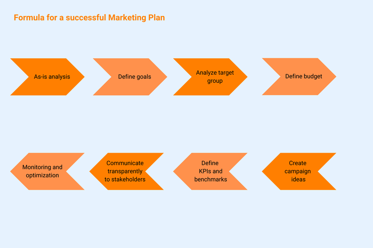

## Crear un plan de marketing en 6 pasos

El marketing es una tarea fundamental para toda empresa: fomenta el **conocimiento de la marca y del producto**, transmite información importante al cliente y promueve así el éxito empresarial. Redactar un plan de marketing es la clave del éxito del marketing. Es la **base de todas las actividades de marketing de éxito**. Sin embargo, las pequeñas y medianas empresas, en particular, a menudo carecen de los recursos necesarios en su día a día para crear un plan cuidadosamente elaborado.

Pero, ¿qué es exactamente un plan de marketing? ¿Cómo se elabora? ¿Qué contenidos debe incluir el plan de marketing? Hemos creado un plan de 6 pasos con más consejos sobre cómo pasar del plan a la ejecución.

## ¿Qué es un plan de marketing?

Un plan de marketing es la base de cualquier campaña de marketing eficaz. Imagine una hoja de ruta que describa todas las medidas necesarias para dirigirse a los grupos de clientes definidos y alcanzar sus objetivos. Su plan debe servir como documento central que contenga las actividades de marketing actuales y futuras en un periodo de tiempo definido, como una importante **guía de acción para su departamento de marketing** y también para toda la empresa. Esto proporciona a sus equipos una guía para priorizar, planificar y aplicar medidas de forma estructurada\*\* y comunicarlas de forma coherente al mundo exterior. En función del objetivo definido y de la estrategia global, los planes de marketing pueden incluir actividades en varios canales o sólo en uno. Algunos ejemplos de planes de marketing son

- Plan de redes sociales
- Plan de marketing de producto
- Plan de marketing online
- Plan de búsqueda de pago
- Plan de marketing de influencers
- Plan de marketing de contenidos
- Plan de marketing digital

### Plan de marketing, estrategia de marketing, concepto de marketing: ¿Qué significa qué?

Antes de profundizar en la mejor manera de crear un plan de marketing, deberíamos aclarar brevemente la terminología. Y es que concepto de marketing, estrategia de marketing y plan de marketing se suelen agrupar indistintamente. Sin embargo, estos términos se refieren a cosas diferentes que son igualmente relevantes e interdependientes. La secuencia es: desarrollar el concepto de marketing - elaborar la estrategia - redactar el plan de marketing.

- Un **concepto de marketing** crea un marco estratégico y operativo para sus actividades. Al igual que en un plan de marketing, puede haber otros conceptos para subáreas individuales además del concepto general de marketing, por ejemplo, para el marketing online o el marketing en redes sociales. Antes de pensar en ideas concretas, debería crear un concepto de marketing.
- La **estrategia de marketing** formula los objetivos a largo plazo y los elementos del concepto de marketing en términos concretos. De este modo, se formula un camino básico desde el estado actual hasta el estado objetivo previsto. Una vez definida la estrategia, se puede derivar de ella un plan coherente.
- El **plan de marketing** sirve en última instancia para aplicar su estrategia de forma operativa. Por lo tanto, primero necesita una estrategia, que a su vez va precedida de la creación de un concepto de marketing, antes de poder redactar un plan de marketing. Sólo entonces podrá definir medidas concretas, determinar presupuestos para canales individuales y definir objetivos específicos y periodos de tiempo para las medidas.

## ¿Por qué hay que elaborar un plan de marketing?

Con un plan de marketing bien pensado, creará la base para el éxito del trabajo de su equipo. Sin un plan claro, sus medidas no podrán entrelazarse, sino que flotarán una al lado de la otra como pompas de jabón y se separarán. Además de campañas concretas y medidas individuales, las empresas también obtienen otras perspectivas importantes:

**Análisis de la competencia:** Antes de crear un plan de marketing, hay que examinar más de cerca el mercado. ¿Quiénes son sus competidores? ¿Cómo y dónde se posicionan? Esto le permitirá comprender mejor el entorno en el que opera con su oferta.

**Análisis de riesgos:** Conocer el entorno de su mercado y analizar a sus competidores le permitirá identificar mejor los riesgos y reconocerlos en una fase temprana. Esto le permitirá gestionar los riesgos con eficacia.

**Evitar decisiones equivocadas:** Una visión clara de los posibles riesgos, unos objetivos claramente formulados y unas medidas bien pensadas le ayudarán a evitar (costosas) decisiones equivocadas.

**Estructuras claras:** Un plan de acción de marketing le ayuda a aclarar y definir las estructuras y procesos necesarios. Esto aumentará la productividad y la satisfacción de los empleados de su equipo.

Si trabaja con un buen plan, también tendrá la oportunidad de definir exactamente las opciones de acción adecuadas para el objetivo y el canal respectivos y, a continuación, adaptarlas a las necesidades de su grupo objetivo.

## Cómo crear un plan de marketing profesional

Toda medida de marketing consiste en **alcanzar un objetivo específico** en un periodo de tiempo determinado. Es necesario planificar, aplicar, analizar y documentar muchos pasos diferentes. Para asegurarse de que su equipo de marketing no pierde el hilo, tiene sentido trabajar con una plantilla de plan de marketing digital. Esto le ayudará a comunicarse de forma transparente, estructurar los procesos, priorizar las tareas de forma eficaz y tener una visión general actualizada de sus proyectos en todo momento.

Al redactar un plan de marketing, es importante orientarse a las necesidades e ideas de su empresa. Sin embargo, hay contenidos del plan de marketing que sin duda deben incluirse para obtener realmente los mejores resultados de sus medidas. Debería considerar estos cinco puntos como componentes de su plan de marketing.

### 1\. Analizar la situación actual y definir una estrategia

Antes de definir las medidas adecuadas para sus proyectos de marketing, es importante analizar su situación actual y la de su empresa. Obtenga una **visión general del statu quo** de su departamento de marketing: ¿Cuáles son los **fuerzos** y dónde están los **debilidades**? ¿Qué **oportunidades** ofrece el mercado y cuáles son los posibles **riesgos**? ¿Qué **propuesta única de venta** (USP) tiene su producto o servicio en comparación con la competencia? ¿Cómo está organizado el departamento de marketing (personal, recursos, capacidades)? ¿Dónde está ahora y dónde quiere llegar? ¿Cuál es su visión? En este punto, piense también en sus competidores.

Una vez definida la situación actual, el siguiente paso es determinar qué objetivos le gustaría alcanzar en un futuro próximo, medio y lejano.

### 2\. Formule su visión y sus objetivos

Ya sabe en qué punto se encuentra su departamento de marketing. Ahora es el momento de averiguar qué dirección deben tomar sus medidas de marketing: ¿Cuál es su objetivo? La mejor manera de hacerlo es utilizar el método SMART y elegir metas que sean específicas, medibles, alcanzables, relevantes para los objetivos de la empresa y con un plazo determinado. En este punto de la creación del plan de marketing, recuerde también definir métricas y puntos de referencia o metas para su posterior análisis. Una vez que haya definido todo con claridad, podrá determinar los puntos inicial y final de su plan de marketing.

### 3\. Eche un vistazo a su grupo objetivo

Antes de empezar a planificar los pasos concretos necesarios para alcanzar su objetivo, debe saber quién es su grupo objetivo. Planificar actividades de marketing específicas sin saber para quién puede funcionar, pero suele ir asociado a un importante despilfarro. Por lo tanto, es muy recomendable realizar un análisis minucioso del grupo objetivo: ¿A quién quiere dirigirse con sus actividades? ¿Cuáles son las características de su grupo objetivo? ¿Qué canales puede utilizar para llegar a ellos? ¿Cómo atraer y mantener el interés de su grupo objetivo (también a largo plazo)? A partir de esta información, puede desarrollar personalidades de usuario ideales, los llamados buyer personas, a los que adaptar sus medidas cuando planifique actividades de marketing.

Dedique algo más de tiempo a este paso y registre detalladamente toda la información sobre su grupo objetivo y sus personajes. Una plantilla de plan de marketing le ayudará a estructurar los datos con claridad. Al fin y al cabo, el grupo objetivo es el factor decisivo para determinar si una campaña es un éxito o un fracaso.

### 4\. Determine su presupuesto

Ya conoce sus objetivos, sus grupos objetivo y sus competidores. El siguiente paso es determinar el presupuesto que desea utilizar para alcanzar sus objetivos de marketing. Defina presupuestos para cada canal de marketing e incluya siempre una reserva. En este punto, es importante tener una idea realista de sus posibilidades, tanto en términos de los recursos que puede invertir como de los resultados que puede conseguir.

Sin embargo, la cuantía del presupuesto no dice nada sobre el éxito esperado de las campañas. Es cierto que, por lo general, obtendrá un mayor éxito con un presupuesto más elevado. Sin embargo, esto sólo es así si su campaña está realmente adaptada a las necesidades del grupo objetivo y les resulta atractiva, ya que no existe una correlación inevitable entre el tamaño del presupuesto y el éxito. Lo más importante en este caso es haber trabajado adecuadamente en el tercer paso y haber desarrollado ideas creativas. Si lo ha hecho, puede conseguir buenos resultados incluso con presupuestos bajos; sin embargo, si no tiene un grupo objetivo claro, difícilmente tendrá éxito incluso con inversiones elevadas.

### 5\. Rellene el plan de marketing con sus ideas y medidas

Una vez analizado el grupo objetivo y determinado el presupuesto, empieza lo realmente divertido: puede crear su plan de marketing y llenarlo de vida. Ya conoces tus objetivos, tu USP y tus clientes potenciales. Ahora es el momento de desarrollar ideas y poner en marcha campañas. Si aún no lo ha hecho, piense qué canales de comunicación y herramientas de marketing de la combinación de canales identificada son realmente relevantes. Determine objetivos intermedios y divida sus campañas en fases individuales. Asegúrese de tener una combinación equilibrada de canales y medidas en su plan de acción de marketing. Tenga cuidado de no considerar sus medidas como proyectos individuales y separados. Combine diferentes canales y actividades en un viaje coherente del cliente para crear una experiencia de marca consistente, por ejemplo, correo electrónico, SEO, anuncios, eventos, su sitio web, etc. También es una buena idea utilizar ejemplos y plantillas de planes de marketing existentes para este paso.

### 6\. Controlar y analizar el éxito

Un buen plan de acción de marketing no sólo incluye una visión general de todas las actividades de la campaña, sino también documentación sobre el progreso de la misma. Esto consolida un enfoque estructurado y también permite vigilar en todo momento el progreso y la rentabilidad de una campaña. Puede ver inmediatamente si una medida va en la dirección equivocada y puede tomar contramedidas en una fase temprana. Cuando elabore un plan de marketing, debería pensar en el seguimiento y la medición del rendimiento como muy tarde en este punto. Las cifras clave, también conocidas como métricas, pueden proporcionar conclusiones sobre el éxito de sus actividades y el potencial de optimización. En el moderno marketing de resultados basado en datos, no faltan las cifras, independientemente del canal. Sin embargo, no todas las métricas son igualmente adecuadas para hacer una declaración fiable sobre el éxito o el fracaso de una campaña. Una vez más, el factor decisivo es el objetivo que se persigue. Responda usted mismo a las siguientes preguntas:

- ¿Qué ratios puede utilizar para controlar y optimizar las medidas?
- ¿Qué métricas clave, los KPI (indicadores clave de rendimiento), puede utilizar para evaluar el éxito de una medida?
- ¿Necesita herramientas de análisis adicionales?
- ¿Con qué periodicidad debe evaluar las medidas?
- ¿De qué forma y con qué periodicidad debe informar de los resultados? ¿A quién?

Los instrumentos de marketing y las herramientas de análisis forman parte de todo plan de marketing. Esto le permite ver en blanco y negro qué medidas han tenido éxito y cuáles no tanto. Esta experiencia puede ser muy valiosa para proyectos posteriores.

## Del querer al hacer: Realización de las campañas

Su planificación de marketing ya está completa, pero aún queda la parte más importante: la realización. Este consejo puede sonar banal, pero nunca se insistirá lo suficiente en él. Al fin y al cabo, es probable que ya haya experimentado cómo ideas creativas se esfumaban, bien porque nadie se sentía responsable, bien porque las tareas simplemente se pasaban por alto en procesos poco transparentes y confusos. Sin embargo, la creación de un plan de marketing es un proceso complejo que requiere mucho tiempo y que, por lo general, no puede ser gestionado por una sola persona. Se trata de una inversión en el éxito futuro de su empresa. Por lo tanto, es importante asegurarse de que estos recursos no se malgastan.

### Procesos claros y comunicación transparente

Cuando se crea un plan de marketing y se planifican campañas, es inevitable tener en cuenta los procesos de trabajo. Establezca procesos y responsabilidades claros. Comunique su plan dentro de la empresa y consiga la participación de todos los departamentos afectados. La mejor campaña de captación de clientes potenciales no producirá resultados útiles si su departamento de ventas no está al tanto y no hay diálogo antes y durante la campaña. Haga que su plan y su comunicación sean transparentes para que los miembros del equipo y las partes interesadas conozcan el estado actual en todo momento. Esto evitará consultas innecesarias o decisiones basadas en información obsoleta.

### Planificación de marketing con herramientas digitales

Crear un plan de marketing como una plantilla en papel es una opción, pero no necesariamente la más eficaz. ¿O se imagina a todos los miembros del equipo de marketing trabajando con un solo papel en el que anotan todos los datos del proyecto, hacen correcciones, los tachan, etc.? Las herramientas digitales para la planificación del marketing son mucho menos complicadas, más rápidas y más transparentes. Ya sea Hubspot, SeaTable o Asana, estas herramientas digitales de marketing te ayudan a recopilar toda la información, controlar los plazos y el contenido y presentar todo de forma clara para todos los implicados.

### Medir, medir, medir: La optimización nunca se detiene

Ya sabe que es importante tener en cuenta el análisis y la optimización de sus campañas a la hora de crear su plan de marketing. Tenga en cuenta que se trata de un proceso continuo. Es probable que amplíe los intervalos a lo largo del tiempo. Sin embargo, debe supervisar sus medidas con regularidad hasta el final de la campaña y optimizarlas si es necesario, o interrumpir medidas individuales. Importante: actúe basándose en los datos en lugar de atenerse a suposiciones preconcebidas. Es igualmente importante examinar y adaptar periódicamente sus propios procesos. ¿No están claras las responsabilidades? ¿Están los procesos estructurados de forma que se haya pensado en todo? ¿Se entrelazan los flujos de trabajo? ¿Existen cuellos de botella en el equipo que pongan en peligro los calendarios de las campañas? Puede crear la transparencia necesaria con un plan de marketing online. Lo mejor es utilizar una herramienta que permita el trabajo colaborativo en tiempo real para que los miembros de su equipo estén siempre al mismo nivel de información.

## Conclusión: Crear un plan de marketing

Un plan cuidadosamente elaborado es la base del éxito de sus campañas. Aporta claridad sobre los objetivos, los canales, las medidas y los empleados implicados, define las responsabilidades y mejora la organización y los flujos de trabajo dentro del equipo. Si se establece en consecuencia, usted y su equipo serán más eficientes y ganarán un tiempo valioso para lo que realmente impulsa sus campañas: el trabajo creativo. Y garantiza la transparencia y la consulta necesarias dentro de la empresa. Utilice nuestros seis pasos para que su próximo plan de acción de marketing alcance sus objetivos. Y si aún le preocupa que la redacción de un plan de marketing le quite un tiempo valioso que preferiría dedicar a otra cosa: Con nuestra plantilla gratuita de plan de marketing, estará un gran paso más cerca de un plan creado con eficacia.

### Empiece ahora mismo con su plantilla de plan de marketing personalizada

Ya sea [campaña de marketing](), plan editorial o de redes sociales, análisis de la competencia, comentarios de los clientes o cuestionario NPS: SeaTable dispone de plantillas listas para cada plan de marketing que contienen todos los aspectos importantes y que, al mismo tiempo, se pueden adaptar de forma flexible a sus necesidades. Esto significa que puede empezar a planificar su marketing de inmediato. Una plantilla digital le permite simplificar sus procesos de trabajo y reducir su carga de trabajo. Con una herramienta digital como SeaTable, puede utilizar su plan de marketing para optimizar procesos, por ejemplo, y permitir que todo su equipo trabaje de forma más eficaz y creativa. Y estas no son las únicas ventajas:

- Como herramienta digital, SeaTable permite automatizar actividades recurrentes en todas las fases del proyecto. Esto ahorra un tiempo muy valioso.
- Gracias a una planificación clara y detallada, la herramienta ayuda a organizar los proyectos de forma transparente y a gestionarlos en términos de tiempo y contenido.
- Como sistema centralizado que contiene toda la información, SeaTable garantiza que todos los miembros del equipo conozcan los objetivos, las medidas y los plazos de un proyecto y, por tanto, puedan organizar su trabajo de forma eficaz.
- Ya sean textos, imágenes o valores de fecha, SeaTable puede trabajar con cualquier tipo de información. También tiene la opción de integrar otras aplicaciones y herramientas en SeaTable para su plantilla de plan de marketing: todo claramente organizado en un solo lugar.

## FAQ - Plan de marketing

Un plan de marketing es un documento en el que se registran las actividades de marketing previstas de una empresa con los grupos destinatarios y la duración de la campaña.

A la hora de crear un plan de marketing, hay una serie de puntos que hay que tener en cuenta, independientemente de los objetivos y productos de la empresa:

- Control y análisis de resultados
- Análisis real de los recursos propios
- Definición de objetivos
- Definición del grupo objetivo
- Presupuesto
- Idea y plan de acción
  
  Utilizar una herramienta en la nube como SeaTables ofrece varias ventajas. En primer lugar, estas herramientas permiten un trabajo en equipo más rápido, eficaz y transparente, lo que evita malentendidos. En segundo lugar, es más fácil gestionar el calendario y el contenido de todas las tareas cuando la información está centralizada y se puede acceder a ella en cualquier momento.


