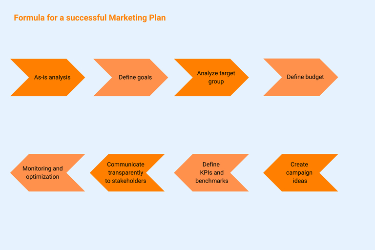

## Criar um plano de marketing em 6 passos

O marketing é uma tarefa central para todas as empresas: promove o **conhecimento da marca e do produto**, transmite informações importantes ao cliente e, assim, promove o sucesso do negócio. Escrever um plano de marketing está no centro de um marketing bem sucedido. É a **base de todas as actividades de marketing bem sucedidas**. No entanto, as pequenas e médias empresas, em particular, carecem frequentemente de recursos na sua atividade diária para criar um plano cuidadosamente pensado.

Mas o que é exatamente um plano de marketing? Como é que se faz? Que conteúdos do plano de marketing devem ser abordados? Criámos um plano de 6 passos com mais dicas sobre como passar do plano à implementação.

## O que é um plano de marketing?

Um plano de marketing é a base de qualquer campanha de marketing eficaz. Pense nele como um roteiro que descreve todas as medidas necessárias para abordar os seus grupos de clientes definidos e atingir os seus objectivos. O seu plano deve servir como um documento central que contém as actividades de marketing actuais e futuras dentro de um período de tempo definido, como um importante **guia de ação para o seu departamento de marketing** e também para toda a empresa. Isto fornece às suas equipas uma ferramenta para definir **prioridades, planear e implementar medidas de forma estruturada** e para as comunicar de forma consistente ao mundo exterior. Dependendo do objetivo definido e da estratégia global, os planos de marketing podem incluir actividades em vários canais ou apenas num canal. São exemplos de planos de marketing

- Plano para as redes sociais
- Plano de marketing de produtos
- Plano de marketing em linha
- Plano de pesquisa paga
- Plano de marketing de influenciadores
- Plano de marketing de conteúdo
- Plano de marketing digital

### Plano de marketing, estratégia de marketing, conceito de marketing: o que é que significa?

Antes de nos aprofundarmos na melhor forma de criar um plano de marketing, devemos esclarecer brevemente a terminologia. Isto porque o conceito de marketing, a estratégia de marketing e o plano de marketing são muitas vezes confundidos indiscriminadamente. No entanto, estes termos referem-se a coisas diferentes que são igualmente relevantes e interdependentes. A sequência é: desenvolver o conceito de marketing - elaborar a estratégia - redigir o plano de marketing.

- Um **conceito de marketing** cria um quadro estratégico e operacional para as suas actividades. À semelhança de um plano de marketing, pode haver outros conceitos para subáreas individuais, para além do conceito geral de marketing, por exemplo, para o marketing em linha ou para o marketing nas redes sociais. Antes mesmo de pensar em ideias concretas, deve definitivamente criar um conceito de marketing.
- A **estratégia de marketing** formula os objectivos a longo prazo e os elementos do conceito de marketing em termos concretos. Desta forma, formula-se um caminho básico desde o estado atual até ao estado alvo planeado. Depois de ter definido a sua estratégia, pode derivar um plano coerente a partir dela.
- O **plano de marketing** serve, em última análise, para implementar a sua estratégia a nível operacional. Por conseguinte, primeiro é necessária uma estratégia, que, por sua vez, é precedida pela criação de um conceito de marketing, antes de se poder elaborar um plano de marketing. Só então é possível definir medidas concretas, determinar orçamentos para canais individuais e definir objectivos específicos e períodos de tempo para as medidas.

## Porque é que se deve desenvolver um plano de marketing?

Com um plano de marketing bem pensado, cria-se a base para o trabalho bem sucedido da sua equipa. Sem um plano claro, as suas medidas não serão capazes de se interligar, mas irão flutuar lado a lado como bolhas de sabão e afastar-se. Para além de campanhas concretas e medidas individuais, as empresas também obtêm outros conhecimentos importantes:

**Análise da concorrência:** Antes de poder criar um plano de marketing, precisa de olhar mais de perto para o seu mercado. Quem são os seus concorrentes? Como e onde é que eles se posicionam? Isto dar-lhe-á uma melhor compreensão do ambiente em que opera com a sua oferta.

**Análise de risco:** Ao conhecer o seu ambiente de mercado e analisar os seus concorrentes, pode identificar melhor os riscos e reconhecê-los numa fase inicial. Isto permite-lhe gerir os riscos de forma eficaz.

**Evitar decisões erradas:** Uma visão clara dos possíveis riscos, objectivos claramente formulados e medidas bem pensadas ajudam-no a evitar decisões erradas (dispendiosas).

**Estruturas claras:** Um plano de ação de marketing ajuda-o a clarificar e a definir as estruturas e os processos necessários. Isto aumentará a produtividade e a satisfação dos trabalhadores da sua equipa.

Se trabalhar com um bom plano, também tem a oportunidade de definir exatamente as opções de ação certas para o respetivo alvo e o respetivo canal e, em seguida, adaptá-las às necessidades do seu grupo-alvo.

## Como criar um plano de marketing profissional

Cada medida de marketing consiste em **alcançar um objetivo específico** dentro de um período de tempo específico. É necessário planear, implementar, analisar e documentar muitas etapas diferentes e necessárias. Para garantir que a sua equipa de marketing não perde o rumo, faz sentido trabalhar com um modelo de plano de marketing digital. Isto ajuda-o a comunicar de forma transparente, a estruturar processos, a dar prioridade às tarefas de forma eficaz e a ter uma visão geral actualizada dos seus projectos em qualquer altura.

Ao escrever um plano de marketing, é importante orientar-se para os requisitos e ideias da sua empresa. No entanto, há conteúdos do plano de marketing que devem definitivamente ser incluídos para obter os melhores resultados das suas medidas. Deve considerar estes cinco pontos como componentes do seu plano de marketing.

### 1\. Analisar a situação atual e definir uma estratégia

Antes de poder definir as medidas adequadas para os seus projectos de marketing, é importante analisar a sua situação atual e a da sua empresa. Obtenha uma **visão geral do status quo** do seu departamento de marketing: Quais são os **pontos fortes** e onde estão os **pontos fracos**? Quais são as **oportunidades** que o mercado oferece e quais são os possíveis **riscos**? Que **proposta única de venda** (USP) tem o seu produto ou serviço em relação à concorrência? Como é que o departamento de marketing está organizado (pessoal, recursos, capacidades)? Onde está agora e para onde quer ir - qual é a sua visão? Nesta altura, dê também uma vista de olhos aos seus concorrentes.

Uma vez definida a situação atual, o passo seguinte é determinar os objectivos que gostaria de alcançar num futuro próximo, médio e distante.

### 2\. Formule sua visão e objetivos

Agora já sabe qual é a situação do seu departamento de marketing. Agora é hora de descobrir a direção que as suas medidas de marketing devem tomar: Qual é o seu objetivo? O melhor é utilizar o método SMART como guia e escolher metas que sejam específicas, mensuráveis, realizáveis, relevantes para os objectivos da empresa e com prazos definidos. Neste ponto da criação do plano de marketing, lembre-se também de definir métricas e pontos de referência ou objectivos para análise posterior. Depois de ter tudo claramente definido, pode determinar os pontos de partida e de chegada do seu plano de marketing.

### 3\. Dê uma olhadela ao seu grupo-alvo

Antes de começar a planejar as etapas específicas necessárias para atingir seu objetivo, você deve saber quem é seu grupo-alvo. Planear actividades de marketing específicas sem saber para quem pode funcionar, mas está normalmente associado a um desperdício significativo. Por conseguinte, recomenda-se vivamente uma análise cuidadosa do grupo-alvo: a quem pretende dirigir-se com as suas actividades? Quais são as caraterísticas do seu grupo-alvo? Que canais podem ser utilizados para os atingir? Como atrair e manter o interesse do seu grupo-alvo (também a longo prazo)? Com base nestas informações, pode então desenvolver personalidades de utilizadores ideais e típicos, as chamadas buyer personas, às quais as suas medidas são adaptadas quando planeia actividades de marketing.

Dedique um pouco mais de tempo a esta etapa e registe todas as informações sobre o seu grupo-alvo e as suas personas em pormenor. Um modelo de plano de marketing ajudá-lo-á a estruturar os seus dados de forma clara. Afinal de contas, o grupo-alvo é o fator decisivo para determinar se uma campanha tem um bom desempenho ou é um fracasso.

### 4\. Determine o seu orçamento

Agora você conhece seus objetivos, seus grupos-alvo e seus concorrentes. O próximo passo é determinar o orçamento que pretende utilizar para atingir os seus objectivos de marketing. Defina orçamentos para cada canal de marketing e inclua sempre uma reserva. Nesta altura, é importante ter uma visão realista das suas próprias possibilidades, tanto em termos dos recursos que pode investir como dos resultados que podem ser alcançados.

No entanto, a dimensão do orçamento não diz nada sobre o sucesso esperado das campanhas. É verdade que, em geral, se obtém maior sucesso com um orçamento maior. No entanto, isto só acontece se a sua campanha for realmente adaptada às necessidades do grupo-alvo e lhe for apelativa, uma vez que não existe uma correlação inevitável entre a dimensão do orçamento e o sucesso. O que importa aqui é que tenha trabalhado corretamente na terceira etapa e desenvolvido ideias criativas. Se o tiver feito, pode obter bons resultados mesmo com orçamentos baixos; no entanto, se não tiver um grupo-alvo claro, dificilmente será bem sucedido, mesmo com investimentos elevados.

### 5\. Preencher o plano de marketing com as suas ideias e medidas

Uma vez que o grupo-alvo tenha sido analisado e o orçamento determinado, a verdadeira diversão começa e você pode criar seu plano de marketing e enchê-lo de vida. Já conhece os seus objectivos, o seu USP e os seus potenciais clientes. Agora é altura de desenvolver ideias e criar campanhas. Se ainda não o fez, pense nos canais de comunicação e nas ferramentas de marketing do mix de canais identificados que são realmente relevantes. Determine objectivos intermédios e divida as suas campanhas em fases individuais. Certifique-se de que tem uma combinação equilibrada de canais e medidas no seu plano de ação de marketing. Tenha cuidado para não ver as suas medidas como projectos individuais e separados. Combine diferentes canais e actividades num percurso coerente do cliente para criar uma experiência de marca consistente, por exemplo, correio eletrónico, SEO, anúncios, eventos, o seu sítio Web, etc. É também uma boa ideia utilizar exemplos e modelos de planos de marketing existentes para esta etapa.

### 6\. Controlo e análise do sucesso

Um bom plano de ação de marketing não inclui apenas uma visão geral de todas as actividades da campanha, mas também a documentação do progresso da campanha. Isto consolida uma abordagem estruturada e também torna possível manter um olho no progresso e na rentabilidade de uma campanha em todos os momentos. Pode ver imediatamente se uma medida está a ir na direção errada e pode tomar contramedidas numa fase inicial. Quando cria um plano de marketing, deve pensar no seu controlo e na medição do desempenho o mais tardar nesta altura. Os índices, também conhecidos como métricas, podem fornecer conclusões sobre o sucesso das suas actividades e o potencial de otimização. No marketing de desempenho moderno baseado em dados, não há falta de números, independentemente do canal. No entanto, nem todas as métricas são igualmente adequadas para fazer uma declaração fiável sobre o sucesso ou o fracasso de uma campanha. Mais uma vez, o fator decisivo aqui é o objetivo que se pretende atingir. Responda às seguintes perguntas:

- Que índices pode utilizar para monitorizar e otimizar as medidas?
- Que indicadores-chave, os KPIs (Key Performance Indicators), pode utilizar para avaliar o sucesso de uma medida?
- Necessita de ferramentas de análise adicionais?
- Com que periodicidade se devem avaliar as acções?
- De que forma e com que periodicidade deve comunicar os resultados? A quem?

Os instrumentos de marketing e as ferramentas de análise fazem parte de qualquer plano de marketing. Isto permite-lhe ver a preto e branco que medidas foram bem sucedidas e quais foram menos bem sucedidas. Esta experiência pode ser muito valiosa para projectos posteriores.

## Do querer ao fazer: Realização das campanhas

O seu plano de marketing está agora completo, mas a parte mais importante ainda está para vir: a implementação. Esta dica pode parecer banal, mas nunca é demais enfatizá-la. Afinal de contas, já deve ter passado pela experiência de ideias criativas que simplesmente fracassaram - ou porque ninguém se sentiu responsável ou porque as tarefas foram simplesmente ignoradas em processos pouco transparentes e confusos. No entanto, a criação de um plano de marketing é um processo complexo que requer muito tempo e que, normalmente, não pode ser gerido apenas por uma pessoa. Trata-se de um investimento no sucesso futuro da sua empresa. Por isso, é importante garantir que esses recursos não sejam desperdiçados.

### Processos claros e comunicação transparente

Quando se cria um plano de marketing e se planeiam campanhas, os processos de trabalho são inevitavelmente considerados. Estabeleça processos e responsabilidades claros. Comunique o seu plano dentro da empresa e faça com que todos os departamentos afectados participem. A melhor campanha de geração de contactos não produzirá resultados úteis se o departamento de vendas não tiver conhecimento da mesma e se não houver diálogo antes e durante a campanha. Torne o seu plano e a sua comunicação transparentes para que os membros da equipa e as partes interessadas envolvidas estejam sempre a par do estado atual. Isto evitará pedidos de informação desnecessários ou decisões baseadas em informações desactualizadas.

### Planeamento de marketing com ferramentas digitais

Criar um plano de marketing como um modelo em papel é uma opção - mas não necessariamente a mais eficaz. Ou consegue imaginar todos os membros da equipa de marketing a trabalhar com apenas uma folha de papel onde escrevem todos os dados do projeto, fazem correcções, riscam-nos, etc.? As ferramentas digitais para o planeamento de marketing são muito menos complicadas, mais rápidas e mais transparentes. Quer se trate do Hubspot, do SeaTable ou do Asana - [ferramentas de marketing] digitais () como estas ajudam-no a reunir toda a informação, a controlar o tempo e o conteúdo e a apresentar tudo de forma clara para todos os envolvidos.

### Medir, medir, medir: A otimização nunca pára

Já sabe que é importante considerar a análise e a otimização das suas campanhas ao criar o seu plano de marketing. Esteja ciente de que este é um processo contínuo. Provavelmente, irá alargar os intervalos ao longo do tempo. No entanto, deve monitorizar as suas medidas regularmente até ao final da campanha e optimizá-las, se necessário - ou descontinuar medidas individuais. Importante: actue com base nos dados em vez de se ater a suposições preconcebidas. É igualmente importante examinar regularmente e adaptar os seus próprios processos. As responsabilidades não são claras? Os processos estão estruturados de forma a que tudo tenha sido pensado? Os fluxos de trabalho estão interligados? Existem estrangulamentos na equipa que põem em risco os calendários das campanhas? Pode criar a transparência necessária com um plano de marketing em linha. O melhor é utilizar uma ferramenta que permita o trabalho colaborativo em tempo real, para que os membros da sua equipa estejam sempre ao mesmo nível de informação.   

## Conclusão: Criar um plano de marketing

Um plano cuidadosamente criado é a base para o sucesso das suas campanhas. Cria clareza sobre os objectivos, os canais, as medidas e os funcionários envolvidos, define responsabilidades e melhora a organização e os fluxos de trabalho dentro da equipa. Se for estabelecido em conformidade, você e a sua equipa tornar-se-ão mais eficientes e ganharão tempo valioso para aquilo que realmente faz avançar as suas campanhas: o trabalho criativo. E garante a transparência e a consulta necessárias dentro da empresa. Utilize os nossos seis passos para o seu próximo plano de ação de marketing para atingir os seus objectivos. E se ainda estiver preocupado com o facto de a redação de um plano de marketing ocupar um tempo valioso que preferia gastar noutro lado: Com o nosso modelo de plano de marketing gratuito, está um grande passo mais perto de um plano criado de forma eficiente.

### Comece já com o seu modelo de plano de marketing personalizado

Quer se trate de [campanha de marketing](https://seatable.io/vorlage/to2pxzc9q0ww0ciwhfyosa/), redes sociais ou plano editorial, análise da concorrência, feedback do cliente ou questionário NPS - a SeaTable tem modelos prontos para cada plano de marketing que contêm todos os aspectos importantes e podem ser adaptados de forma flexível às suas necessidades ao mesmo tempo. Isto significa que pode começar imediatamente com o seu planeamento de marketing. Um modelo digital assegura que pode simplificar os seus processos de trabalho e reduzir a sua carga de trabalho. Com uma ferramenta digital como o SeaTable, pode utilizar o seu plano de marketing para otimizar os processos, por exemplo, e permitir que toda a sua equipa trabalhe de forma mais eficiente e criativa. E estas não são as únicas vantagens:

- Como ferramenta digital, o SeaTable torna possível automatizar actividades recorrentes em todas as fases do projeto. Isto poupa tempo valioso.
- Graças a um planeamento claro e detalhado, a ferramenta ajuda a organizar os projectos de forma transparente e a geri-los em termos de tempo e conteúdo.
- Enquanto sistema centralizado que contém todas as informações, o SeaTable garante que cada membro da equipa conhece os objectivos, as medidas e os prazos de um projeto, podendo assim organizar o seu trabalho de forma eficiente
- Quer sejam textos, imagens ou valores de datas - o SeaTable pode trabalhar com qualquer tipo de informação. Também tem a opção de integrar outras aplicações e ferramentas no SeaTable para o seu modelo de plano de marketing - tudo claramente organizado num único local.

## FAQ - Plano de marketing



O que é um plano de marketing? |||

Um plano de marketing é um documento no qual as actividades de marketing planeadas de uma empresa são registadas com grupos-alvo e duração da campanha.

---

O que deve ser considerado ao criar um plano de marketing? |||

Ao criar um plano de marketing, há uma série de pontos que devem ser considerados, independentemente dos objectivos e produtos da empresa:

- Controlo e análise de resultados
- Análise real dos seus próprios recursos
- Definição de objectivos
- Definição do grupo-alvo
- Orçamento
- Ideia e plano de ação

---

Porque é que deve utilizar uma solução na nuvem como o SeaTable para criar um plano de marketing? |||

A utilização de uma ferramenta na nuvem, como o SeaTables, oferece várias vantagens. Em primeiro lugar, estas ferramentas permitem um trabalho de equipa mais rápido, mais eficiente e mais transparente, o que evita mal-entendidos. Em segundo lugar, é mais fácil gerir o tempo e o conteúdo de todas as tarefas quando a informação está centralizada e pode ser acedida a qualquer momento.


