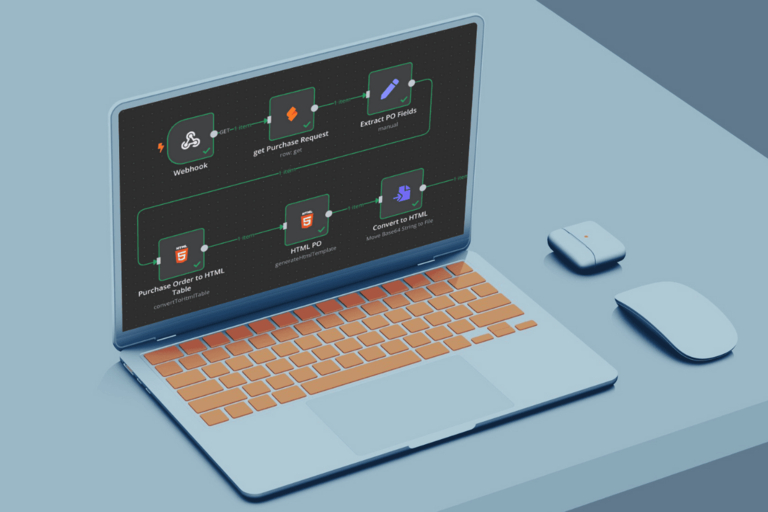

## Fondo: Falta una interfaz de base de datos para usuarios no técnicos

Cloudvox SRL, con oficinas en Austria y Rumanía, ayuda a las empresas a identificar el potencial de automatización del flujo de trabajo y a ponerlo en práctica. Su fundador, Cristian Livadaru, buscaba una forma de visualizar datos complejos de manera comprensible para usuarios sin formación técnica. Con SeaTable, no sólo encontró una solución a este problema, sino que descubrió otras muchas aplicaciones posibles que cambiaron radicalmente su trabajo.

Como desarrollador informático, Livadaru podía crear fácilmente sus propias herramientas de tratamiento de datos para sus clientes. Lo que le faltaba, sin embargo, era una interfaz fácil de usar que permitiera a personas sin conocimientos de bases de datos o programación acceder a los datos de forma rápida y sencilla. Cuando trabajó en un proyecto para un cliente con este tipo de usuarios, para los que el acceso directo al backend no era una alternativa sensata, quedó claro que necesitaba una solución diferente al problema.

## SeaTable: interfaz de usuario, API y versión local convincentes

Cloudvox confió inicialmente en AirTable, pero cambió a la alternativa NocoDB tras repetidos ajustes de precio y limitaciones con la API. Sin embargo, también en este caso la API no cumplía los requisitos y, finalmente, tras mucha frustración, Livadaru se topó con SeaTable, y ya no puede imaginar trabajar sin esta solución sin código.

La decisión a favor de SeaTable se basó en varios factores clave:

- Una interfaz de usuario intuitiva
- La posibilidad de utilizar SQL para las consultas a la API
- Variante local
- Compatibilidad con webhooks y scripts
- Integración sencilla de n8n

La implementación de la [variante on-premises]() de SeaTable también fue como la seda, o en palabras de Cristian Livadaru: "SeaTable + Docker = amor instantáneo". Un criterio decisivo para el empresario unipersonal.

## Un todoterreno indispensable

Hoy en día, SeaTable se utiliza en Cloudvox en varias áreas, incluyendo el :

1. gestión de facturas entrantes con extracción automatizada de datos mediante IA
1. seguimiento de tareas periódicas
1. creación y gestión de formularios de feedback
1. procesamiento automático de extractos de cuenta XML para contabilidad
1. desarrollo rápido de prototipos de aplicaciones para clientes e iteración en combinación con n8n

Este uso versátil aportó mejoras cuantificables. Livadaru ya no tiene que preocuparse de la interfaz de usuario ni de la salida de datos, ya que puede editarlos y transformarlos fácilmente en SeaTable en cualquier momento. Esto ha reducido significativamente su propia carga de trabajo para programar nuevas herramientas.

## SeaTable ahorra tiempo y aumenta la eficiencia - y es divertido de usar

Sin embargo, además del ahorro de tiempo, para él también es importante destacar un aspecto cualitativo del trabajo con SeaTable: "La diversión. No hay nada más frustrante que tener un volcado de cientos o miles de líneas en la consola y tener que clasificarlas de alguna manera. Ahora puedo hacerlo en SeaTable".

Su notable éxito hasta ahora: para un cliente, había que combinar datos de la base de datos de clientes con datos de otras dos fuentes y varios archivos de Excel. Una tarea para la que antes tenía que programar algo él mismo. Con SeaTable, sin embargo, la migración se realizó sin problemas y sin una sola línea de código adicional.

## Procesos optimizados para Cloudvox y sus clientes

Cristian Livadaru está tan contento con su elección que ahora está reclutando activamente nuevos usuarios de SeaTable. También ve potencial en su empresa y planea construir su propio CRM basado en una de las plantillas de SeaTable. Aunque hace un uso intensivo de scripts, consultas SQL, la API y [integración de terceros]() con n8n, entre otros, aún no ha probado las posibilidades del Universal App Builder para su empresa.

Además de optimizar y acelerar sus propios procesos, la introducción de SeaTable también supuso un salto cualitativo decisivo en la colaboración con sus clientes. Al utilizar una herramienta de gestión de datos bien pensada y estable con una interfaz de usuario fácil de entender, pudo salvar la distancia entre las posibilidades técnicas del procesamiento de datos y una presentación fácil de usar, con lo que también avanzó en la transformación digital en el lado del cliente.
