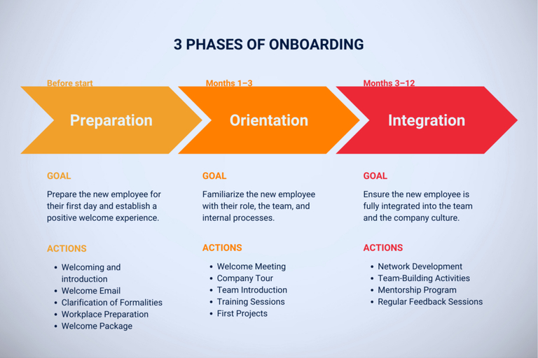

## Optimice su proceso de incorporación

Por fin se ha cubierto la vacante y comienza el proceso de incorporación de su nuevo empleado. El nerviosismo es inevitable, sobre todo por parte del empleado. Pero usted y el departamento de RR.HH. también se enfrentan a circunstancias especiales con cada nueva contratación y, naturalmente, quieren que la incorporación del empleado se desarrolle sin problemas. Para usted, esto significa organizar todos los procesos necesarios a tiempo.

   
La gestión de la incorporación se refiere a **la familiarización e integración sistemáticas de los nuevos empleados en una empresa**. El objetivo de un concepto de onboarding es ofrecer a sus nuevos empleados un buen comienzo en su empresa e integrarlos en su estructura corporativa tanto profesional como cultural y socialmente.

## Por qué es importante un concepto estructurado de onboarding

La incorporación estructurada de los nuevos empleados es de vital importancia para el éxito y el desarrollo a largo plazo de su empresa. Ayuda a sus nuevos empleados a **alcanzar su pleno potencial más rápidamente** introduciéndoles en sus nuevas tareas de forma segura. La iniciación y el apoyo específicos harán que se sientan competentes y productivos, lo que aumentará rápidamente su rendimiento.

   
Además, un programa de incorporación bien organizado ayuda a mantener a sus **empleados en la empresa a largo plazo**. Esto se debe a que los empleados que se sienten bien integrados y apoyados desde el principio tienen más probabilidades de permanecer leales a su empresa. Esto reduce la rotación de personal y garantiza que se conserven en la empresa valiosos conocimientos y experiencia.

Una gestión estructurada del proceso de incorporación **también fomenta la motivación y la satisfacción de los nuevos empleados**. Si entienden claramente lo que se espera de ellos y cómo pueden contribuir al éxito de la empresa, su satisfacción laboral aumenta considerablemente. Además, los empleados bien formados están encantados de aportar sus conocimientos internamente y están dispuestos a seguir desarrollándose. Esto crea una cultura de aprendizaje continuo e intercambio de conocimientos.

   
Por último, los empleados satisfechos y bien integrados están encantados de recomendar su empresa como empleador atractivo. **El boca a boca positivo y las buenas críticas** en plataformas como Kununu o Glassdoor contribuyen a reforzar su imagen de empleador y a atraer nuevos talentos.

## Los 3 niveles de integración

La incorporación estructurada de los nuevos empleados comprende tres niveles clave: integración profesional, social y cultural. Cada uno de estos niveles desempeña un papel crucial en la integración satisfactoria y completa de los nuevos **empleados en su organización**.

### Integración profesional

La integración profesional se centra en **proporcionar los conocimientos y aptitudes** que el nuevo empleado necesita para desempeñar su función específica. Esto incluye formación, familiarización con los procesos y sistemas de trabajo e introducción a las tareas y responsabilidades. El objetivo es dotar al nuevo empleado de las herramientas necesarias para realizar su trabajo de forma competente y eficaz. Una minuciosa integración profesional garantiza que sea productivo rápidamente y se sienta seguro en su nueva área de responsabilidad.

### Integración social

La integración social tiene por objeto integrar a su **empleado en el tejido social de su organización**. Esto incluye el fomento de la socialización y el establecimiento de relaciones con colegas y superiores. Actividades como las reuniones de equipo, los encuentros informales y las actividades de creación de equipos desempeñan un papel importante en este sentido. Mediante la integración social, su nuevo empleado se sentirá rápidamente parte del equipo, lo que aumenta su bienestar y retención. Una sólida red social dentro de la empresa también ofrece apoyo con preguntas y retos.

### Integración cultural

La integración cultural pretende familiarizar a sus nuevos **empleados con los objetivos, principios y cultura de su empresa**. Esto incluye comunicar su misión, visión y valores, así como las normas éticas y culturales que caracterizan las actividades diarias de su empresa. De este modo, sus nuevos empleados no sólo entenderán qué comportamiento se espera de ellos, sino también por qué son importantes esas expectativas y cómo contribuyen a alcanzar los objetivos de la empresa. Esto promueve una identificación más profunda con la empresa y refuerza la lealtad de sus empleados.

## Las 3 fases de la gestión del onboarding

Según un estudio, un nuevo empleado suele necesitar **ocho meses para ser plenamente productivo**. En este tiempo, la gestión del onboarding comprende tres fases: la fase de preparación, la fase de orientación y la fase de integración.

### 1\. Fase de preparación

La fase de preparación, también conocida como preboarding, **comienza con la firma del contrato y termina el primer día de trabajo**. El objetivo de esta fase es dar a tu nuevo empleado la sensación de que empieza a trabajar con un empleador profesional que cuida de sus empleados. Durante esta fase, le envías información importante, aclaras cualquier duda que tenga y elaboras un plan de acogida. Asegúrate también de que el lugar de trabajo está equipado con todo el material necesario. Los preparativos importantes que debes hacer en esta fase son

- Aclaración de las formalidades
- Coordinación de las citas
- Suministro de información
- Implicación de los compañeros
- Preparación del lugar de trabajo
- Organización de la formación de los trabajadores
- Definición de responsabilidades
- Elaboración de un paquete de bienvenida

### 2\. Fase de orientación

La fase de orientación **comienza el primer día de trabajo y dura los tres primeros meses**. Durante esta fase, usted presenta a su nuevo empleado su función y sus tareas en la empresa. Se familiarizará con la empresa, sus procesos, compañeros, clientes y superiores. Para que esta fase sea lo más agradable posible, debe tener en cuenta los siguientes puntos:

- Bienvenida y presentación del equipo
- Introducción al equipo de trabajo y a los sistemas informáticos
- Aclaración de las expectativas mutuas
- Asignación de tareas iniciales
- Aclaración de los aspectos jurídicos
- Seguridad social y prestaciones
- Visita a la empresa
- Presentación de los productos
- Comunicación de los objetivos y valores de la empresa

### 3\. Fase de integración

Esta fase de la incorporación **se extiende del tercer al sexto mes, a veces incluso hasta el duodécimo**. Durante este tiempo, el objetivo principal es que el nuevo empleado se integre cada vez más en la empresa. Para fomentarlo, debe permitir que su empleado tome la iniciativa en tantas ocasiones como sea posible y aplique el programa de forma independiente.

- Actos conjuntos
- Talleres y jornadas informativas
- Reuniones periódicas de feedback
- Suministro de información de seguimiento
- Refuerzo del espíritu de equipo
- Promoción de contactos y creación de redes

## Feedback y evaluación en el proceso de incorporación

La retroalimentación periódica es crucial para la mejora continua de su proceso de incorporación. Para garantizar el éxito de la integración de los nuevos empleados, usted y sus directivos deben **programar con antelación fechas fijas para las reuniones de feedback**. Estas reuniones deben celebrarse a intervalos regulares para obtener una imagen completa de la experiencia del nuevo empleado.

Recopilando y analizando sistemáticamente estos comentarios, su empresa podrá detectar los puntos débiles del proceso de incorporación para introducir mejoras específicas.

## 7 consejos para un proceso de incorporación satisfactorio

El éxito de la incorporación de nuevos empleados sienta las **bases de una colaboración positiva, productiva y duradera**. La primera impresión cuenta a la hora de dar la bienvenida a los nuevos empleados y presentarles la cultura y la forma de trabajar de su organización. Por eso es importante prestar especial atención a algunos aspectos clave.

### 1\. Crear un concepto de onboarding

Desarrolle un concepto global de incorporación que defina objetivos y expectativas claros. Integre listas de comprobación detalladas para garantizar que todos los pasos se llevan a cabo de forma sistemática y eficaz.

### 2\. Tener en cuenta los plazos

Deje tiempo suficiente para ultimar todos los preparativos necesarios antes del primer día de trabajo de su nuevo empleado. Tenga en cuenta los plazos de tramitación de todos los documentos y procesos internos pertinentes.

### 3\. Planifique eventos conjuntos

Organice eventos de creación de equipos y otras actividades conjuntas para promover la integración de los nuevos empleados y crear un ambiente de trabajo positivo. Esto ayuda a los recién contratados a sentirse rápidamente como en casa y a familiarizarse con la cultura de la empresa durante la incorporación.

### 4\. Obtener a tiempo los documentos legales y los datos de personal.

Solicite a tiempo todos los documentos legales y datos personales necesarios. Esto incluye el contrato de trabajo, la información fiscal, el justificante del seguro y otros documentos pertinentes. Asegúrate de que estén completos y correctos antes del primer día de trabajo.

### 5\. Optimice continuamente el proceso

Revise y mejore periódicamente el proceso de incorporación. Recoja las opiniones de sus nuevos empleados y directivos para identificar los puntos débiles y optimizar continuamente el proceso.

### 6\. Onboarding y offboarding

Preste atención al posterior proceso de offboarding durante la gestión del onboarding. Un concepto de onboarding bien estructurado es importante, pero es igual de crucial definir claramente desde el principio lo que hay que tener en cuenta cuando un empleado se va. Documente todos los pasos pertinentes para que no se olvide nada en el peor de los casos.

### 7\. Utilice un buen software

Utilice un programa de incorporación adecuado para mantener una visión de conjunto y organizar el proceso con eficacia. Un buen programa informático debe ofrecer listas de control para la incorporación y la salida, recordatorios y la gestión de todos los documentos e información pertinentes.

## El programa de incorporación adecuado a sus necesidades

Con la plantilla gratuita de SeaTable, puede diseñar su proceso de incorporación de forma tan eficiente que no sólo aliviará sus [procesos de RR.HH.](), sino que también facilitará al máximo la incorporación de sus nuevos empleados.

Con un solo clic, puede crear una lista de comprobación intuitiva con todas las tareas pendientes para cada nuevo empleado, para que todos sepan exactamente lo que hay que hacer. Para evitar el caos y el papeleo, puede almacenar todos los documentos importantes directamente en la tabla y hacer que se firmen digitalmente.



En la [plantilla gratuita](https://seatable.io/vorlage/nbmf4z3_rssykhs-3egoqa/) de SeaTable, puede agrupar todas las tareas y la información en un solo lugar. Al asignar responsabilidades claras, así como un horizonte temporal y un estado a cada tarea, puedes visualizar claramente el progreso de la inducción y hacer un seguimiento en directo.

   
Apóyese en un software adecuado y asegúrese de que sus nuevos empleados se sientan inmediatamente bienvenidos y se integren rápidamente en su empresa. Para utilizar la [plataforma sin código SeaTable](https://seatable.com/), sólo tiene que registrarse gratuitamente. A continuación, puede añadir la plantilla a su base y completarla con sus propios datos.

[Pruebe SeaTable ahora gratis](https://seatable.com/registrierung/)

## Preguntas frecuentes



¿Por qué es importante un proceso de incorporación estructurado?|||

## Un proceso de incorporación estructurado ayuda a los nuevos empleados a familiarizarse más rápidamente con su función, a integrarse profesional y socialmente y a trabajar con motivación. Esto no sólo aumenta la productividad, sino que también incrementa la lealtad de los empleados y reduce la tasa de rotación de personal.

¿Qué debe incluir un buen concepto de incorporación?|||

Un buen concepto de incorporación abarca la integración profesional, social y cultural de los nuevos empleados. Incluye listas de comprobación para las formalidades, planes de familiarización, formación, reuniones periódicas de feedback y medidas para fomentar el espíritu de equipo. También es esencial comunicar claramente los valores y objetivos de la empresa.

---

¿Cómo puedo optimizar el proceso de incorporación de nuevos empleados?|||

Las reuniones de feedback y las evaluaciones periódicas ayudan a mejorar el proceso. Con herramientas digitales como SeaTable, las tareas y los documentos pueden gestionarse y supervisarse eficazmente. Con responsabilidades claras y listas de comprobación intuitivas, los departamentos de RRHH pueden ahorrar tiempo y apoyar mejor a los nuevos empleados.

---

¿Cuáles son las fases de un proceso de incorporación típico?|||

Un proceso de incorporación típico consta de

- Fase de preparación (preboarding)**: Firma del contrato hasta el primer día de trabajo.
- Fase de orientación**: Los tres primeros meses en la empresa.
- Fase de integración**: De tres a doce meses después de empezar.

Cada fase se centra en tareas y objetivos diferentes, por ejemplo, preparación organizativa, introducción e integración a largo plazo.

---

¿Cuáles son las ventajas de utilizar programas informáticos en el proceso de incorporación?|||

Con SeaTable puede organizar su proceso de incorporación de forma eficaz. Recibirá una plantilla preparada con listas de comprobación, podrá gestionar todos los documentos de forma centralizada y realizar un seguimiento del progreso en tiempo real. Esto ahorra tiempo, minimiza los errores y ofrece a los nuevos empleados una experiencia de incorporación fluida y profesional.


