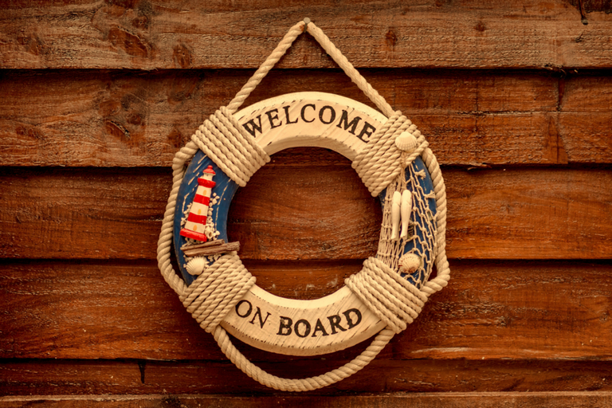
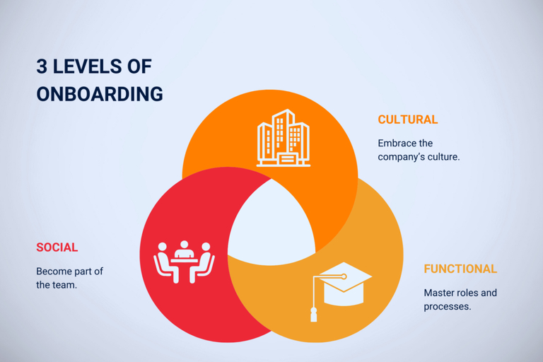
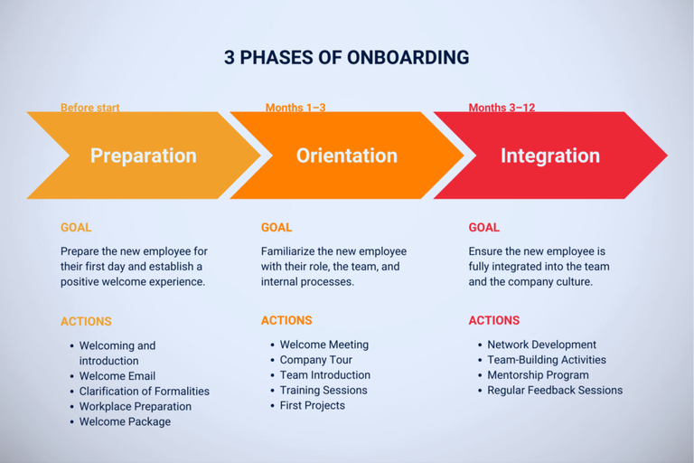

## Optimiser votre processus d'onboarding

Le poste vacant est enfin pourvu et le processus d'onboarding de votre nouveau collaborateur ou de votre nouvelle collaboratrice commence. La nervosité est inévitable, surtout du côté des collaborateurs. Mais vous et le service RH êtes également confrontés à des circonstances particulières lors de chaque nouvelle embauche et souhaitez naturellement que l'Employee Onboarding se déroule sans accroc. Pour vous, cela signifie mettre en place tous les processus nécessaires en temps voulu.

L'onboarding management désigne **la formation et l'intégration systématiques des nouveaux collaborateurs dans une entreprise**. Un concept d'onboarding a pour objectif de permettre à vos nouveaux collaborateurs de prendre un bon départ dans votre entreprise et de les intégrer dans la structure de votre entreprise, tant sur le plan professionnel que culturel et social.

## Pourquoi un concept d'onboarding structuré est important

Un onboarding structuré des nouveaux collaborateurs est d'une importance capitale pour le succès et le développement à long terme de votre entreprise. Il contribue à ce que vos nouveaux collaborateurs **atteignent plus rapidement leur plein potentiel** en les guidant en toute sécurité vers leurs nouvelles tâches. Grâce à une introduction et un soutien ciblés, ils se sentent compétents et productifs, ce qui améliore rapidement leurs performances.

De plus, un programme d'onboarding bien organisé aide à garder vos **collaborateurs à long terme dans l'entreprise**. En effet, les collaborateurs qui se sentent bien intégrés et soutenus dès le début sont plus enclins à rester fidèles à votre entreprise. Cela réduit le turnover et permet de conserver les précieuses connaissances et expériences au sein de votre entreprise.

Une gestion structurée de l'onboarding **favorise également la motivation et la satisfaction des nouveaux collaborateurs**. S'ils comprennent clairement ce que vous attendez d'eux et comment ils peuvent contribuer au succès de l'entreprise, leur satisfaction au travail augmente considérablement. De plus, les collaborateurs bien intégrés apportent volontiers leurs connaissances en interne et sont prêts à évoluer. Cela crée une culture d'apprentissage continu et de partage des connaissances.

Enfin, les collaborateurs satisfaits et bien intégrés recommandent volontiers leur entreprise comme employeur attractif. **Le bouche-à-oreille positif et les bonnes évaluations** sur des plateformes telles que Kununu ou Glassdoor contribuent à renforcer votre image d'employeur et à attirer de nouveaux talents.

## Les 3 niveaux de l'onboarding

Un onboarding structuré des nouveaux collaborateurs comprend trois niveaux essentiels : l'intégration professionnelle, sociale et culturelle. Chacun de ces niveaux joue un rôle crucial dans l'intégration réussie et complète des nouveaux **collaborateurs dans votre entreprise**.

### Intégration professionnelle

L'intégration professionnelle se concentre sur la **transmission des connaissances et des compétences nécessaires** à votre nouveau collaborateur pour son rôle spécifique. Cela comprend la formation, l'initiation aux processus de travail et aux systèmes ainsi que l'introduction aux tâches et aux responsabilités. L'objectif est de donner à votre nouveau collaborateur les outils nécessaires pour effectuer son travail de manière compétente et efficace. Une intégration professionnelle approfondie lui permettra d'être rapidement productif et de se sentir à l'aise dans son nouveau domaine d'activité.

### Intégration sociale

L'intégration sociale vise à intégrer votre nouveau **collaborateur dans le tissu social de votre entreprise**. Cela implique de favoriser les contacts sociaux et d'établir des relations avec les collègues et les supérieurs. Des activités telles que les réunions d'équipe, les rencontres informelles et les activités de team building jouent un rôle important à cet égard. Grâce à l'intégration sociale, votre nouveau collaborateur se sentira rapidement partie intégrante de l'équipe, ce qui augmentera son bien-être et son attachement. Un réseau social solide au sein de l'entreprise offre en outre un soutien en cas de questions ou de défis.

### Intégration culturelle

L'intégration culturelle vise à familiariser vos nouveaux **employés avec les objectifs, les principes et la culture de votre entreprise**. Cela implique de communiquer votre mission, votre vision et vos valeurs, ainsi que les normes éthiques et culturelles qui régissent les activités quotidiennes de votre entreprise. Vos nouveaux collaborateurs comprennent ainsi non seulement le comportement que l'on attend d'eux, mais aussi pourquoi ces attentes sont importantes et comment elles contribuent à la réalisation des objectifs de l'entreprise. Cela favorise une identification plus profonde avec l'entreprise et renforce la loyauté de vos collaborateurs.

## Les 3 phases de la gestion de l'onboarding

Selon une étude, il faut en général **huit mois à un nouveau collaborateur pour être pleinement productif**. Au cours de cette période, la gestion de l'onboarding comprend trois étapes : la phase de préparation, la phase d'orientation et la phase d'intégration.

### 1\. Phase de préparation

La phase de préparation, également appelée preboarding, **commence à la signature du contrat et se termine le premier jour de travail**. L'objectif de cette phase est de donner à votre nouveau collaborateur le sentiment qu'il débute chez un employeur professionnel qui se soucie de ses collaborateurs. Au cours de cette phase, vous lui envoyez des informations importantes, clarifiez les questions en suspens et établissez un plan d'intégration. En outre, vous veillez à ce que le poste de travail soit équipé de tous les outils de travail nécessaires. Les préparatifs importants que vous devez effectuer dans le cadre de cette démarche sont les suivants :

- Clarification des formalités
- Coordination des rendez-vous
- Mise à disposition d'informations
- Implication des collègues
- Préparation du lieu de travail
- Organisation de la formation des employés
- Définition des responsabilités
- Constitution d'un pack de bienvenue

### 2\. Phase d'orientation

La phase d'orientation **débute avec le premier jour de travail et s'étend sur les trois premiers mois**. Au cours de cette phase, vous introduisez votre nouveau collaborateur dans son rôle et ses tâches au sein de l'entreprise. Il apprend à connaître l'entreprise, ses procédures, ses collègues, ses clients et ses supérieurs. Pour rendre cette phase aussi agréable que possible, vous devez tenir compte des points suivants :

- Accueil et présentation à l'équipe
- Introduction aux outils de travail et aux systèmes informatiques
- Clarification des attentes mutuelles
- Attribution des premières tâches
- Clarification des aspects juridiques
- Sécurité sociale et avantages sociaux
- Visite de l'entreprise
- Présentation des produits
- Communication des objectifs et des valeurs de l'entreprise

### 3\. Phase d'intégration

Cette phase d'onboarding **s'étend du troisième au sixième mois, parfois même jusqu'au douzième**. Durant cette période, l'accent est mis sur l'intégration progressive de votre nouveau collaborateur dans l'entreprise. Pour favoriser cela, vous devez laisser votre collaborateur prendre l'initiative à autant d'occasions que possible et se charger de la mise en œuvre de manière autonome.

- Événements communs
- Ateliers et journées d'information
- Entretiens de feedback réguliers
- Mise à disposition d'informations de suivi
- Renforcement de l'esprit d'équipe
- Promotion des contacts et création de réseaux

## Feedback et évaluation dans le processus d'onboarding

Un feedback régulier est essentiel pour l'amélioration continue de votre processus d'onboarding. Pour garantir la réussite de l'intégration des nouveaux collaborateurs, vous et vos cadres devez **prévoir à l'avance des dates fixes pour les entretiens de feedback**. Ces entretiens doivent être organisés à intervalles réguliers afin d'obtenir une image complète de l'expérience de votre nouveau collaborateur.

En recueillant et en analysant systématiquement ce feed-back, votre entreprise peut identifier les points faibles du processus d'intégration et apporter des améliorations ciblées.

## 7 conseils pour un processus d'intégration réussi

Un onboarding réussi des nouveaux collaborateurs pose la **pierre angulaire d'une collaboration positive, productive et durable**. La première impression compte lorsque vous accueillez les nouveaux collaborateurs et que vous les initiez à la culture et aux méthodes de travail de votre entreprise. C'est pourquoi il est important de prêter une attention particulière à certains aspects clés.

### 1\. Créer un concept d'onboarding

Développez un concept d'onboarding complet qui définit des objectifs et des attentes clairs. Intégrez des listes de contrôle détaillées pour vous assurer que toutes les étapes sont réalisées de manière systématique et efficace.

### 2\. Prévoir des délais de mise en place

Prévoyez suffisamment de temps de préparation pour achever tous les préparatifs nécessaires avant le premier jour de travail de votre nouveau collaborateur. Tenez compte des délais de traitement de tous les documents pertinents et des processus internes.

### 3\. Planifier des événements communs

Organisez des événements de team building et d'autres activités communes afin de favoriser l'intégration des nouveaux collaborateurs et de créer un climat de travail positif. Cela aide les nouveaux à se sentir rapidement à l'aise et à découvrir la culture de l'entreprise pendant l'onboarding.

### 4\. Obtenir à temps les documents juridiques et les données personnelles

Demandez à temps tous les documents juridiques et données personnelles nécessaires. Cela comprend le contrat de travail, les informations fiscales, les attestations d'assurance et autres documents pertinents. Assurez-vous qu'ils sont complets et corrects avant le premier jour de travail.

### 5\. Optimiser le processus en permanence

Contrôlez et améliorez régulièrement le processus d'onboarding. Recueillez le feed-back de vos nouveaux collaborateurs et de vos cadres afin d'identifier les points faibles et d'optimiser constamment le processus.

### 6\. Onboarding et offboarding

Dès la gestion de l'onboarding, veillez au processus d'offboarding ultérieur. S'il est important de disposer d'un concept d'onboarding bien structuré, il est tout aussi crucial de définir clairement dès le départ ce dont il faut tenir compte lorsqu'un collaborateur quitte l'entreprise. Documentez toutes les étapes pertinentes afin de ne rien oublier en cas de besoin.

### 7\. Utiliser un bon logiciel

Utilisez un logiciel d'onboarding approprié pour garder une vue d'ensemble et organiser le processus de manière efficace. Une bonne solution logicielle doit proposer des listes de contrôle on-boarding et off-boarding, des rappels et la gestion de tous les documents et informations pertinents.

## Le programme d'onboarding adapté à vos besoins

Le modèle gratuit de SeaTable vous permet de concevoir votre processus d'onboarding de manière si efficace que non seulement vous allégez la charge de travail de vos [processus RH](), mais que vous facilitez également au maximum l'entrée en fonction de vos nouveaux collaborateurs.

En un seul clic, vous créez pour chaque nouveau collaborateur une liste de contrôle intuitive avec toutes les tâches à effectuer, ce qui permet à chacun de savoir exactement ce qu'il doit faire. Pour éviter le chaos et la paperasserie, vous pouvez classer tous les documents importants directement dans le tableau et les faire signer numériquement.



Dans le [modèle gratuit]() de SeaTable, vous pouvez regrouper toutes les tâches et informations en un seul endroit. En attribuant à chaque tâche à faire des responsabilités claires ainsi qu'un horizon temporel et un statut, vous pouvez visualiser clairement la progression de l'incorporation et la suivre en direct.

Misez sur un logiciel adapté et faites en sorte que vos nouveaux collaborateurs se sentent directement bienvenus et s'intègrent rapidement dans votre entreprise. Pour utiliser la [plate-forme No-Code SeaTable](), il vous suffit de vous inscrire gratuitement. Vous pouvez ensuite ajouter le modèle à votre base et le compléter avec vos propres données.

[Essayer SeaTable gratuitement maintenant]()

## Foire aux questions

## Un processus d'onboarding structuré aide les nouveaux collaborateurs à s'adapter plus rapidement à leur rôle, à s'intégrer sur le plan professionnel et social et à travailler avec motivation. Cela permet non seulement d'augmenter la productivité, mais aussi de fidéliser les collaborateurs et de réduire le taux de fluctuation.


Un bon concept d'onboarding comprend l'intégration professionnelle, sociale et culturelle des nouveaux collaborateurs. Cela comprend des listes de contrôle pour les formalités, des plans d'intégration, des formations, des entretiens de feedback réguliers et des mesures de team building. Il est également essentiel de communiquer clairement les valeurs et les objectifs de l'entreprise.

Des entretiens de feedback et des évaluations régulières permettent d'améliorer le processus. Des outils numériques comme SeaTable permettent de gérer et de suivre efficacement les tâches et les documents. Grâce à des responsabilités claires et des listes de contrôle intuitives, les services RH peuvent gagner du temps et mieux soutenir les nouveaux collaborateurs.

Un processus d'onboarding typique comprend :

- **Phase de préparation (preboarding)** : Signature du contrat jusqu'au premier jour de travail.
- **Phase d'orientation** : Trois premiers mois dans l'entreprise.
- **Phase d'intégration** : Trois à douze mois après le début.

Chaque phase se concentre sur des tâches et des objectifs différents, par exemple la préparation organisationnelle, l'introduction et l'intégration à long terme.

Avec SeaTable, vous pouvez organiser efficacement votre processus d'onboarding. Vous recevez un modèle prédéfini avec des listes de contrôle, vous pouvez gérer tous les documents de manière centralisée et suivre les progrès en direct. Cela permet de gagner du temps, de minimiser les erreurs et d'offrir aux nouveaux collaborateurs une expérience d'entrée en fonction fluide et professionnelle.


