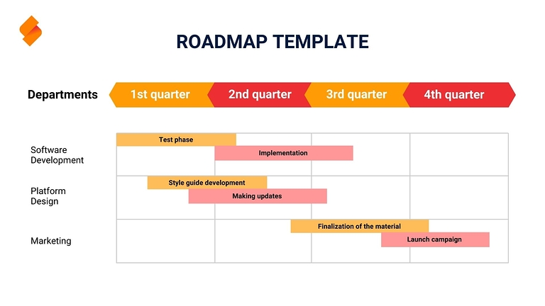

## So planen Sie Ihre Projekte effizient und zielgerichtet

Eine **Roadmap** (oder Road Map) ebnet Ihnen den Weg zum Erfolg! Kunden gewinnen, Strategien entwickeln, Fortschritt dokumentieren – Roadmap-Vorlagen sind für Ihre Projekte vielseitig einsetzbar. Für den größtmöglichen Nutzen ist es wichtig, dass Sie eine zu Ihren Zielen passende Roadmap erstellen. Eine Vorlage verschafft Ihnen dabei wertvolle Zeit und erhöht die Effizienz enorm.

Welche Roadmap zu Ihrem Projekt passt, wie Sie eine **Roadmap-Vorlage** optimal nutzen und was Sie beachten sollten, wenn Sie eine Roadmap erstellen, erfahren Sie in diesem Beitrag.

## Was ist eine Roadmap?

Eine Roadmap (wörtlich übersetzt *Straßenkarte*) hilft Ihnen dabei, Ihr nächstes Projekt strukturiert anzugehen. Dabei erstellen Sie einen visuellen Routenplan, in dem Sie alle **Arbeitsschritte**, **Meilensteine** und **Ziele** Ihres Projekts in einem zeitlichen Rahmen festhalten. Im Gegensatz zu einem Projektplan liegt das Augenmerk nicht auf den Details. Es geht vielmehr darum, eine Übersicht über die einzelnen Prozesse zu erlangen und diese auf dem Plan zu verorten.

Die Darstellung gleicht meist einer **Zeitachse**, auf der Sie alle Aufgaben nach Themen und Zuständigkeiten gruppieren und verschiedenen Zeitspannen zuordnen.

## Wobei hilft Ihnen eine Roadmap?

Um einen komplexen Sachverhalt, wie beispielsweise Geschäftsvisionen, Verkaufsstrategien oder Marketingkampagnen übersichtlich aufzubereiten, benötigen Sie eine vereinfachte Darstellung, die aufeinander abgestimmte Prozesse arbeitsteilig abbildet. Durch die visuelle Aufbereitung auf einer Roadmap ergibt sich aus allen Einzelprozessen ein stimmiges Gesamtkonstrukt, welches auf das gemeinsame Ziel ausgerichtet ist.

Eine **Roadmap-Vorlage** erleichtert Ihnen die Strukturierung Ihres Projektplans und hilft Ihnen dabei, Ihre Strategie für alle Beteiligten übersichtlich, nachvollziehbar und verständlich zu präsentieren.

Indem Sie gemeinsam einen Plan erstellen, ermöglichen Sie allen Beteiligten sich einzubringen und stärken zugleich die abteilungsübergreifende Zusammenarbeit.

Zudem lässt sich mit einer Roadmap grob abschätzen, ob die für ein Projekt veranschlagte Zeit realistisch ist, wie viele Ressourcen (Geld, Material, Personal etc.) Sie benötigen und ob alle erforderlichen Arbeitsschritte berücksichtigt sind.

## So erstellen Sie eine Roadmap in sechs Schritten

Eine Roadmap zu erstellen kostet Zeit und erfordert eine umfangreiche Vorbereitung. Im Folgenden erfahren Sie, wie Sie in sechs Schritten eine zu Ihren Anforderungen passende Roadmap erstellen.

### 1. Ziele setzen

Bevor Sie eine Roadmap erstellen, sollten Sie zunächst das allgemeine **Projektziel** festlegen, denn nach diesem richtet sich die gesamte weitere Planung. Definieren Sie hierfür klare Roadmap Ziele, die mit Ihren übergeordneten Unternehmenszielen in Einklang stehen. Die Umsetzung sollte realistisch **machbar** sein und sich in die Unternehmensprozesse integrieren lassen. Legen Sie grobe **Meilensteine** fest, welche Sie in einem bestimmten Zeitraum erreichen wollen.

### 2. Art der Roadmap festlegen

Aufbauend auf den Anforderungen, welche Ihr Plan erfüllen soll, können Sie diesen anhand von drei Dimensionen einstufen:

- **Zeitlicher Rahmen**: Ist Ihr Projekt kurz-, mittel- oder langfristig angelegt?
- **Detailgrad**: Wie detailliert wollen Sie die Abläufe darstellen?
- **Thema**: Welchen Themenschwerpunkt weist Ihre Roadmap auf?

Das Herausarbeiten der Ausprägungen hilft Ihnen dabei, die richtige Art von Roadmap für die Abbildung Ihrer Prozesse zu identifizieren.

### 3. Stakeholder einbeziehen

Um Ihr Projekt so effizient wie möglich zu gestalten, sollten Sie die betroffenen **Personen** und **Abteilungen** bereits zu Beginn des Erstellungsprozesse einbinden. Teilen Sie die **Verantwortlichkeiten** verbindlich zu, um eine möglichst hohe Verpflichtung und Motivation zu erzielen. Dadurch verbessern Sie die **Transparenz** und Kommunikation innerhalb des Projektteams.

### 4. Struktur und Prozesse ausarbeiten

Wie Sie Ihr Ziel erreichen wollen, legen Sie mit der Struktur der Roadmap fest. Ausgangspunkt sollte dabei immer der aktuelle Stand sein. In der Regel visualisiert eine Roadmap anschließend die **Hauptaufgaben**, die zur Erreichung des Ziels nötig sind. Dabei bringen Sie die Meilensteine in eine logische **zeitliche Reihenfolge**. Der gewünschte Detailgrad entscheidet darüber, wie viele Zwischenschritte und Teilaufgaben Sie festhalten wollen.

_Tipp: Für die Detailplanung Ihres Projekts nutzen Sie am besten einen Projektstrukturplan, der sich beliebig erweitern lässt._

### 5. Roadmap erstellen

Nun sollten Sie die wichtigsten Informationen zur Erstellung Ihrer Roadmap beisammen haben. Auf dieser Grundlage können Sie ein **Format und Design** wählen, welches zu Ihrem Projekt passt. Fügen Sie dann zunächst die wichtigsten Aufgaben, Meilensteine und Verantwortlichen hinzu, um sich und Ihren Kollegen einen groben Überblick zu verschaffen.

Um Ihnen die Gestaltung zu erleichtern, stellen Ihnen verschiedene Dienste fertige **Roadmap-Vorlagen** zur Verfügung, welche Sie nur noch individuell befüllen müssen.

### 6\. Regelmäßige Updates und Kommunikation\*\*

Egal, für welche Art der Roadmap Sie sich entschieden haben – Sie sollten Ihre **Fortschritte** und mögliche **Änderungen** regelmäßig aktualisieren. Zum Beispiel können neue Aufgaben hinzukommen oder sich die Umsetzung verzögern. Besonders Strategieänderungen führen zu weitreichenden Anpassungen Ihrer Road Map. Achten Sie darauf, die Auswirkungen der Updates schnell und umfassend zu kommunizieren, damit alle Stakeholder stets auf dem aktuellen Stand sind.

## Programme und Tools

Bei der Projektplanung ist es entscheidend, zum Roadmap erstellen ein passendes Tool auszuwählen. Erleichtern Sie sich deshalb die Erfassung Ihrer Projektinformationen, indem Sie Ihre Daten in eine vorgefertigte Struktur einpflegen. Je nachdem, welche Themen und Stakeholder Sie für Ihr Vorhaben identifiziert haben, gibt es spezielle Vorlagen. Diese unterscheiden sich zunächst nach Anbietern und den damit verbundenen Tools. 

### Roadmap erstellen in Excel und PowerPoint

Zu den bekanntesten Möglichkeiten, eine Roadmap zu erstellen, gehört Excel einerseits sowie die Visualisierung mit einem Roadmap Template in PowerPoint andererseits. Der Vorteil, wenn Sie eine Roadmap aus einer Vorlage in PowerPoint erstellen: PowerPoint bietet mehrere Roadmap-Vorlagen, sodass Sie direkt die Vorlage finden, die zu Ihren Anforderungen passt.

Um die passende Roadmap Vorlage in Excel zu finden, müssen Sie hingegen ein wenig mehr Zeit investieren, da diese nicht zum allgemeinen Angebot des Programms gehören. Folglich ist etwas mehr Recherche erforderlich, bis Sie die passende Vorlage für Ihre Zwecke zum Download finden.

### Roadmap in Jira

Jira bietet ein leistungsstarkes Roadmap Tool, das speziell für agile Software-Projekte entwickelt wurde. Mit einer Roadmap in Jira lassen sich komplexe Projekte übersichtlich visualisieren und in einzelne Arbeitsschritte unterteilen. Dabei können Sie Projektziele, Meilensteine und Zuständigkeiten in einem Gantt-Diagramm (mit Balken auf einer Zeitleiste) darstellen und die Fortschritte in Echtzeit verfolgen. 

### Projektmanagement- und Roadmap Tools wie SeaTable

Andere Anbieter stellen darüber hinaus direkt nutzbare Roadmap-Vorlagen zur Verfügung, welche die Datenerfassung und Visualisierung in einem ermöglichen. Seriöse [Projektmanagement]() Roadmap Tools wie SeaTable setzen dabei auf **individuell anpassbare Vorlagen**, die Sie genau auf Ihre Anforderungen zuschneiden können, und zeigen Ihnen bereits vor dem Download per Vorschau, was für Features Sie erwarten. So vermeiden Sie, dass Sie die sprichwörtliche Katze im Sack kaufen.

Außerdem sollte ein gutes Tool mehrere Darstellungsarten wie Kalender, Zeitleisten, Gantt- oder Flussdiagramme zulassen, um die Daten für unterschiedliche Personen und Zwecke individuell aufbereiten zu können. Wichtig ist, dass Sie genau die **Schlüsselfunktionen** zur Hand haben, die Sie für Ihre Arbeit brauchen.

Und wenn Sie einmal das richtige Tool gefunden haben, können Sie ganz ohne Mühe die optimale Roadmap erstellen und diese immer wieder als Vorlage nutzen.

## Die passende Roadmap finden

Jedes Ziel hat seine eigenen Anforderungen. Deswegen ist es sinnvoll, eine Roadmap zu wählen, welche unterschiedlichen Wünschen und Bedürfnissen gerecht werden kann. Welche Möglichkeiten Sie haben, eine Roadmap zu erstellen, und welche Vorlagen sich wann eignen, zeigen Ihnen folgende Roadmap-Beispiele.

### Projekt-Roadmap

Eine Projekt-Roadmap liefert genau das, was ihr Name vermuten lässt: einen Überblick über ein bestimmtes Projekt. Das können zum Beispiel eine Marketingkampagne, eine größere Veranstaltung oder ein Bauprojekt sein. Die Projekt-Roadmap dient dabei als leistungsfähiges Werkzeug, um die Ziele zu definieren, Anforderungen an die Stakeholder zu kommunizieren und Fristen einzuhalten. Typische Elemente sind zudem Meilensteine, Kosten- und Ressourcenplanung. 

 

Wenn Sie eine Vorlage suchen, die Ihnen das Festhalten von Projektberichten und -dokumentationen erleichtert, bietet sich der Projektplaner von SeaTable an.

### Strategische Roadmap

Sie sind Geschäftsführer oder Vorstand und möchten Ihren Mitarbeitern oder anderen Stakeholdern die **Gesamtvision** für das Unternehmen übersichtlich und griffig erklären? Dann ist eine strategische Roadmap, die viele Ähnlichkeiten zu einem Businessplan aufweist, das Mittel der Wahl. Damit können Sie Ihre kurz- und langfristigen Ziele (z. B. im Marketing und Vertrieb) abbilden, die Finanzplanung sowie alle zum Erreichen der Geschäftsvision erforderlichen Maßnahmen auf einen Blick greifbar machen.

Die Vorlage von SeaTable bildet alle wichtigen Prozesse übersichtlich ab. Diese können Sie an Ihr Unternehmen individuell anpassen.

### Produkt-Roadmap

Eine Produkt-Roadmap eignet sich sowohl für die **interne** als auch für die **externe Kommunikation** und hängt stark mit dem Innovationsmanagement des Unternehmens zusammen. Intern bildet sie die Produktentwicklung von der Idee bis zur Markteinführung ab. Dabei sollte sich die Roadmap flexibel an die Entwicklung des Produkts anpassen: Wie lassen sich seine Funktionen erweitern oder seine Herstellung optimieren? Die Konkurrenz schläft nicht – daher ist es entscheidend, dass Sie Ihre Produkte kontinuierlich verbessern und innovativ bleiben.

Bei externer Nutzung dient die Produkt-Roadmap dazu, Kunden, Investoren oder anderen externen Stakeholdern geplante Produkte oder Dienstleistungen zu präsentieren. Dabei können Sie direktes Feedback erhalten, welche Neuheiten besonders gut ankommen, welche eingeführt werden sollten bzw. welche nicht.

### Technologie-Roadmap

Eine Technologie- oder auch IT-Roadmap hilft Ihnen weiter, wenn es Ihr Ziel ist, die Technologie-Infrastruktur oder auch die Software-Entwicklung in Ihrem Unternehmen zu visualisieren. Damit behalten Sie den Überblick über Chancen und Risiken für das Management des Unternehmens: Welche Technologien haben ausgedient und welche Systeme wollen Sie einführen, um mit der Digitalisierung Schritt zu halten und auf dem Laufenden zu bleiben?

Stellen Sie Ihre Roadmap für [Softwareentwicklung]() mit der Vorlage von SeaTable dar und profitieren Sie von einer strukturierten Übersicht.

### Integrierte Roadmap

Integrierte Roadmaps bestehen aus mehreren Einzelthemen, wie beispielsweise der Projekt- und Technologieplanung. Je nach dem von Ihnen gewählten Schwerpunkt umfasst diese unterschiedlichen Ebenen in absteigenden Tiefen.

### Unternehmensweite Roadmap

Bei dieser Form werden alle Abteilungen im Unternehmen als Ganzes betrachtet. Technologie-, Produkt-, Marketing- und Vertriebsprozesse werden miteinander in Verbindung gebracht und im Gesamtkontext des Unternehmens bewertet.

Dabei können Sie bereits bestehende Prozesse mit neuen Technologien und Produkten verbinden und verbessern. Durch das Roadmapping können Sie zudem Lücken ausfindig machen und Innovationen vorantreiben.

## Online Roadmap-Vorlagen nutzen

Wenn Sie also eine Roadmap erstellen und eine Vorlage nutzen möchten, sollten Sie auf jeden Fall ein bisschen Zeit dafür einplanen, verschiedene Vorlagen und Anbieter zu vergleichen und auszutesten.

SeaTable bietet Ihnen spezielle Vorlagen an, welche Sie nach Belieben an die Anforderungen Ihres Unternehmens anpassen können.



Wenn Sie SeaTable für die Erstellung Ihrer Roadmap nutzen möchten, registrieren Sie sich einfach kostenlos.

## Häufig gestellte Fragen



Was ist eine Roadmap und wie kann sie mir bei der Projektplanung helfen?|||
Eine Roadmap ist eine visuelle Darstellung eines Projekts, die dessen Ziele, Meilensteine und Aufgaben übersichtlich darstellt. Sie hilft Ihnen dabei, den gesamten Projektverlauf klar zu strukturieren, so dass Sie die wichtigen Schritte im Auge behalten und den Fortschritt überwachen können. Die Roadmap ist besonders hilfreich, um komplexe Projekte zu vereinfachen und die Kommunikation mit allen Beteiligten zu verbessern.

---

Welche Arten von Roadmaps gibt es?|||
Es gibt verschiedene Arten von Roadmaps, die jeweils spezifische Anforderungen und Ziele adressieren. Zu den häufigsten gehören:

- Projekt-Roadmap
- Strategische Roadmap
- Produkt-Roadmap
- Technologie-Roadmap
- Integrierte Roadmap

---

Welche Tools eignen sich zur Erstellung einer Roadmap?|||
Es gibt zahlreiche Tools, die Ihnen bei der Erstellung einer Roadmap helfen können. Ein besonders flexibles Beispiel ist SeaTable: Ein Projektmanagement-Tool, das individuell anpassbare Roadmap-Vorlagen bereitstellt und verschiedene Darstellungsformen wie Gantt-Diagramme unterstützt.


