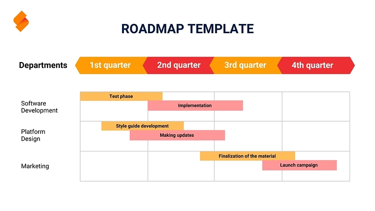
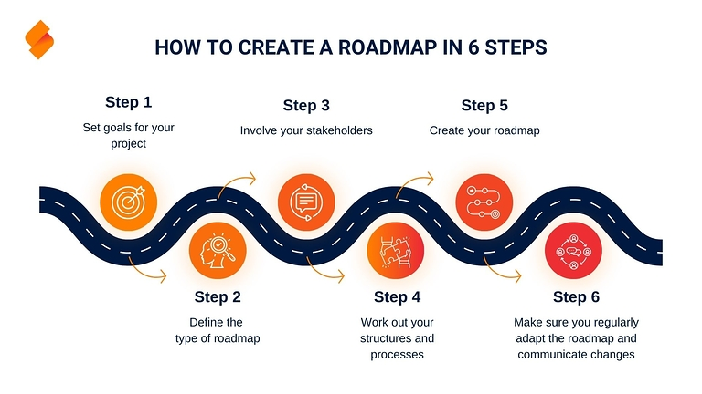
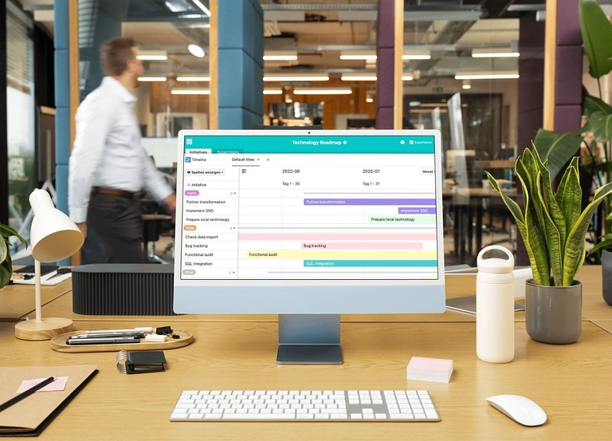

## How to plan your projects efficiently and purposefully

A **roadmap** (or road map) paves your way to success! Winning customers, developing strategies, documenting progress - roadmap templates are versatile for your projects. To maximize the benefits, it is important that you create a roadmap that matches your goals. A template saves you valuable time and increases efficiency enormously.

In this article, you can find out which roadmap is right for your project, how to make the best use of a roadmap template and what you should bear in mind when creating a roadmap.

## What is a roadmap?

A roadmap helps you to approach your next project in a structured way. You create a visual route plan in which you record all **work steps**, **milestones** and **goals** of your project within a time frame. In contrast to a project plan, the focus is not on the details. Instead, the aim is to gain an overview of the individual processes and to locate them on the plan.

The presentation usually resembles a **timeline** on which you group all tasks according to topics and responsibilities and assign them to different time spans.

## How does a roadmap help you?

In order to clearly prepare a complex issue, such as business visions, sales strategies or marketing campaigns, you need a simplified representation that depicts coordinated processes based on a division of labor. The visual preparation on a roadmap results in a coherent overall construct from all the individual processes, which is aligned with the common goal.

A **roadmap template** makes it easier for you to structure your project plan and helps you to present your strategy in a clear, comprehensible and understandable way for everyone involved.

By creating a plan together, you enable everyone involved to contribute and at the same time strengthen cross-departmental collaboration.

In addition, a roadmap allows you to roughly estimate whether the time estimated for a project is realistic, how many resources (money, materials, personnel, etc.) you need and whether all the necessary work steps have been taken into account.

## How to create a roadmap in six steps

Creating a roadmap takes time and requires extensive preparation. Below you will learn how to create a roadmap that meets your requirements in six steps.

### 1\. Set goals

Before you create a roadmap, you should first define the general **project objective**, as all further planning will be based on this. To do this, define clear roadmap goals that are in line with your overarching corporate goals. The implementation should be realistically **feasible** and be able to be integrated into the company processes. Define rough **milestones** that you want to achieve within a certain period of time.

### 2\. Define the type of roadmap

Based on the requirements that your plan should fulfill, you can classify it according to three dimensions:

- **Timeframe**: Is your project short, medium or long term?
- **Level of detail**: How much detail do you want to provide about the processes?
- **Topic**: What is the main focus of your roadmap?

Working out the characteristics will help you to identify the right type of roadmap for mapping your processes.

### 3\. Involve stakeholders

To make your project as efficient as possible, you should involve the **people** and **departments** concerned right from the start of the creation process. Assign binding **responsibilities** in order to achieve the highest possible level of commitment and motivation. This will improve **transparency** and communication within the project team.

### 4\. Develop structure and processes

You define how you want to achieve your goal with the structure of the roadmap. The starting point should always be the current status. As a rule, a roadmap then visualizes the **main tasks** that are necessary to achieve the goal. In doing so, you put the milestones in a logical **time sequence**. The desired level of detail determines how many intermediate steps and subtasks you want to record.

Tip: For the detailed planning of your project, it is best to use a work breakdown structure, which can be expanded as required.

### 5\. Create a roadmap

You should now have the most important information for creating your roadmap. On this basis, you can choose a **format and design** that suits your project. Then add the most important tasks, milestones and responsible parties to give yourself and your colleagues a rough overview.

To make the design easier for you, various services provide you with ready-made **roadmap templates**, which you only need to fill in individually.

### 6\. Regular updates and communication

Regardless of the type of roadmap you have chosen, you should regularly update your **progress** and any **changes**. For example, new tasks may be added or implementation may be delayed. Strategy changes in particular lead to far-reaching adjustments to your roadmap. Make sure you communicate the impact of updates quickly and comprehensively so that all stakeholders are always up to date.

## Programs and tools

When planning a project, it is crucial to select a suitable tool for creating a roadmap. Make it easier for yourself to record your project information by entering your data into a predefined structure. Depending on which topics and stakeholders you have identified for your project, there are special templates. These differ depending on the provider and the associated tools.

### Create roadmap in Excel and PowerPoint

The best-known options for creating a roadmap include Excel on the one hand and visualization with a roadmap template in PowerPoint on the other. The advantage of creating a roadmap from a template in PowerPoint: PowerPoint offers several roadmap templates, so you can directly find the template that suits your requirements.

To find the right roadmap template in Excel, on the other hand, you need to invest a little more time, as these are not part of the program's general offering. Consequently, a little more research is required before you find the right template for your purposes to download.

### Roadmap in Jira

Jira offers a powerful roadmap tool that has been specially developed for agile software projects. With a roadmap in Jira, complex projects can be clearly visualized and divided into individual work steps. You can display project goals, milestones and responsibilities in a Gantt chart (with bars on a timeline) and track progress in real time.

### Project management and roadmap tools such as SeaTable

Other providers also provide directly usable roadmap templates that enable data collection and visualization in one. Reputable [project management](https://()) roadmap tools such as SeaTable rely on **individually customizable templates** that you can tailor precisely to your requirements and show you a preview of the features you can expect before downloading. This way you avoid buying the proverbial pig in a poke.

In addition, a good tool should allow multiple display types such as calendars, timelines, Gantt or flow charts so that the data can be prepared individually for different people and purposes. It is important that you have exactly the **key functions** at hand that you need for your work.

And once you have found the right tool, you can easily create the ideal roadmap and use it as a template again and again.

## Find the right roadmap

Every goal has its own requirements. That's why it makes sense to choose a roadmap that can meet different wishes and needs. The following roadmap examples show you what options you have for creating a roadmap and which templates are suitable and when.

### Project roadmap

A project roadmap provides exactly what its name suggests: an overview of a specific project. This could be a marketing campaign, a major event or a construction project, for example. The project roadmap serves as a powerful tool for defining goals, communicating requirements to stakeholders and meeting deadlines. Milestones, cost and resource planning are also typical elements.

If you are looking for a template that makes it easier for you to record project reports and documentation, SeaTable's project planner is a good choice.

### Strategic roadmap

Are you a managing director or board member and want to explain the **overall vision** for the company to your employees or other stakeholders in a clear and concise way? Then a strategic roadmap, which has many similarities to a business plan, is the tool of choice. You can use it to map out your short and long-term goals (e.g. in marketing and sales) and make the financial planning and all the measures required to achieve the business vision tangible at a glance.

The SeaTable template clearly maps all important processes. You can customize it to suit your company.

### Product roadmap

A product roadmap is suitable for both **internal** and **external communication** and is closely linked to the company's innovation management. Internally, it maps product development from the idea to the market launch. The roadmap should adapt flexibly to the development of the product: How can its functions be expanded or its production optimized? The competition never sleeps - so it is crucial that you continuously improve your products and remain innovative.

When used externally, the product roadmap is used to present planned products or services to customers, investors or other external stakeholders. You can receive direct feedback on which innovations are particularly well received, which should be introduced and which should not.

### Technology roadmap

A technology or IT roadmap helps you if your goal is to visualize the technology infrastructure or software development in your company. This gives you an overview of the opportunities and risks for the company's management: which technologies have become obsolete and which systems do you want to introduce in order to keep pace with digitalization and stay up to date?

Present your roadmap for [software development]() with the SeaTable template and benefit from a structured overview.

### Integrated roadmap

Integrated roadmaps consist of several individual topics, such as project and technology planning. Depending on your chosen focus, these comprise different levels in descending depth.

### Company-wide roadmap

In this form, all departments in the company are considered as a whole. Technology, product, marketing and sales processes are linked together and evaluated in the overall context of the company.

This allows you to combine and improve existing processes with new technologies and products. Roadmapping also allows you to identify gaps and drive innovation.

## Use online roadmap templates

So if you want to create a roadmap and use a template, you should definitely plan some time to compare and test different templates and providers.

SeaTable offers you special templates that you can customize to suit your company's requirements.



If you would like to use SeaTable to create your roadmap, simply register for free.

## Frequently asked questions



What is a roadmap and how can it help me with project planning?|||
A roadmap is a visual representation of a project that clearly shows its goals, milestones and tasks. It helps you to clearly structure the entire course of the project so that you can keep an eye on the important steps and monitor progress. The roadmap is particularly useful for simplifying complex projects and improving communication with all stakeholders.

---

What types of roadmaps are there?|||
There are different types of roadmaps, each addressing specific requirements and goals. The most common include

- Project roadmap
- Strategic roadmap
- Product roadmap
- Technology roadmap
- Integrated roadmap

---

Which tools are suitable for creating a roadmap?|||
There are numerous tools that can help you create a roadmap. One particularly flexible example is SeaTable: a project management tool that provides customizable roadmap templates and supports various display formats such as Gantt charts.

