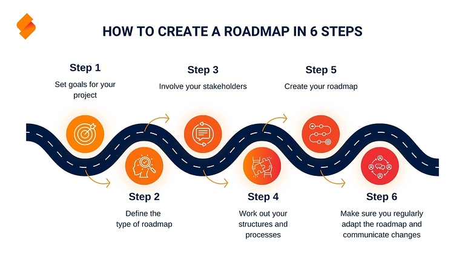

## Comment planifier vos projets de manière efficace et ciblée

Une **roadmap** (ou feuille de route) vous ouvre la voie du succès ! Acquérir des clients, développer des stratégies, documenter les progrès - les modèles de roadmap ont de nombreuses applications pour vos projets. Pour en tirer le meilleur parti, il est important d'établir une feuille de route adaptée à vos objectifs. Un modèle vous fait gagner un temps précieux et augmente considérablement votre efficacité.

Vous découvrirez dans cet article quelle feuille de route est adaptée à votre projet, comment utiliser au mieux un modèle de **feuille de route** et ce à quoi vous devez faire attention lorsque vous créez une feuille de route.

## Qu'est-ce qu'une feuille de route ?

Une feuille de route (littéralement _carte routière_) vous aide à aborder votre prochain projet de manière structurée. Pour ce faire, vous établissez un plan de route visuel dans lequel vous consignez toutes les **étapes de travail**, **jalons** et **objectifs** de votre projet dans un cadre temporel. Contrairement à un plan de projet, l'accent n'est pas mis sur les détails. Il s'agit plutôt d'obtenir une vue d'ensemble des différents processus et de les situer sur le plan.

La représentation ressemble généralement à un **axe temporel** sur lequel vous regroupez toutes les tâches par thèmes et responsabilités et les affectez à différentes périodes.

## En quoi une feuille de route peut-elle vous aider ?

Pour présenter clairement une situation complexe, comme par exemple des visions commerciales, des stratégies de vente ou des campagnes de marketing, vous avez besoin d'une représentation simplifiée qui illustre les processus coordonnés les uns avec les autres en fonction de la répartition du travail. Grâce à la présentation visuelle sur une feuille de route, tous les processus individuels forment une construction globale cohérente, orientée vers un objectif commun.

Un modèle de **roadmap** vous facilite la structuration de votre plan de projet et vous aide à présenter votre stratégie de manière claire, compréhensible et intelligible pour tous les participants.

En élaborant un plan en commun, vous permettez à tous les participants de s'impliquer et vous renforcez en même temps la collaboration interdépartementale.

En outre, une feuille de route permet d'estimer grossièrement si le temps prévu pour un projet est réaliste, de combien de ressources (argent, matériel, personnel, etc.) vous avez besoin et si toutes les étapes de travail nécessaires sont prises en compte.

## Comment créer une feuille de route en six étapes

La création d'une feuille de route prend du temps et nécessite une préparation importante. Nous vous expliquons ci-dessous comment créer une feuille de route adaptée à vos besoins en six étapes.

### 1. fixer des objectifs

Avant de créer une feuille de route, vous devez d'abord définir l'objectif général du **projet**, car toute la planification ultérieure en dépend. Pour ce faire, définissez des objectifs clairs pour la feuille de route, qui soient en accord avec les objectifs généraux de votre entreprise. La mise en œuvre doit être **faisable** de manière réaliste et s'intégrer dans les processus de l'entreprise. Définissez des **jalons** approximatifs que vous souhaitez atteindre dans un délai donné.

### 2. définir le type de feuille de route

Sur la base des exigences auxquelles votre plan doit répondre, vous pouvez le classer en fonction de trois dimensions :

- **Cadre temporel** : Votre projet s'inscrit-il dans le court, le moyen ou le long terme ?
- **Degré de détail** : Quel niveau de détail souhaitez-vous donner aux processus ?
- **Thème** : Quel est le thème principal de votre feuille de route ?

La mise en évidence des caractéristiques vous aidera à identifier le type de feuille de route approprié pour représenter vos processus.

### 3. impliquer les parties prenantes

Pour que votre projet soit aussi efficace que possible, vous devez impliquer les **personnes** et les **départements** concernés dès le début du processus d'élaboration. Attribuez les **responsabilités** de manière contraignante afin d'obtenir un engagement et une motivation aussi élevés que possible. Vous améliorez ainsi la **transparence** et la communication au sein de l'équipe de projet.

### 4. élaborer la structure et les processus

La structure de la feuille de route vous permet de déterminer comment vous souhaitez atteindre votre objectif. Le point de départ devrait toujours être l'état actuel. En règle générale, une roadmap visualise ensuite les **tâches principales** nécessaires pour atteindre l'objectif. Ce faisant, vous placez les étapes dans un **ordre chronologique logique**. Le niveau de détail souhaité détermine le nombre d'étapes intermédiaires et de tâches partielles que vous souhaitez consigner.

Conseil : pour la planification détaillée de votre projet, il est préférable d'utiliser un organigramme technique de projet, qui peut être étendu à volonté.

### 5. établir la feuille de route

Vous devriez maintenant avoir réuni les informations les plus importantes pour créer votre feuille de route. Sur cette base, vous pouvez choisir un **format et un design** adaptés à votre projet. Ajoutez ensuite dans un premier temps les tâches, les étapes et les responsables les plus importants afin de vous donner, ainsi qu'à vos collègues, une vue d'ensemble approximative.

Pour vous faciliter la tâche, différents services mettent à votre disposition des **modèles de feuilles de route** prêts à l'emploi qu'il ne vous reste plus qu'à remplir individuellement.

**6\. Mises à jour et communication régulières**.

Quel que soit le type de roadmap que vous avez choisi, vous devez régulièrement mettre à jour vos **progrès** et les **modifications éventuelles**. Par exemple, de nouvelles tâches peuvent être ajoutées ou leur mise en œuvre peut être retardée. Les changements de stratégie, en particulier, entraînent des adaptations importantes de votre feuille de route. Veillez à communiquer rapidement et largement les effets des mises à jour afin que toutes les parties prenantes soient toujours au courant.

## Programmes et outils

Lors de la planification d'un projet, il est essentiel de choisir un outil adapté à la création de la feuille de route. Facilitez-vous donc la saisie des informations relatives à votre projet en intégrant vos données dans une structure prédéfinie. Selon les thèmes et les parties prenantes que vous avez identifiés pour votre projet, il existe des modèles spécifiques. Ceux-ci se distinguent tout d'abord selon les fournisseurs et les outils qui leur sont associés.

### Créer une feuille de route dans Excel et PowerPoint

Parmi les possibilités les plus connues pour créer une feuille de route, on trouve Excel d'une part et la visualisation avec un modèle de feuille de route dans PowerPoint d'autre part. L'avantage de créer une feuille de route à partir d'un modèle dans PowerPoint : PowerPoint propose plusieurs modèles de feuilles de route, ce qui vous permet de trouver directement le modèle qui correspond à vos besoins.

En revanche, pour trouver le modèle de feuille de route adéquat dans Excel, vous devez investir un peu plus de temps, car ces modèles ne font pas partie de l'offre générale du programme. Par conséquent, il vous faudra faire des recherches supplémentaires avant de trouver le modèle adapté à vos besoins à télécharger.

### Roadmap dans Jira

Jira offre un outil de feuille de route puissant, spécialement conçu pour les projets logiciels agiles. Une feuille de route dans Jira permet de visualiser clairement des projets complexes et de les diviser en différentes étapes de travail. Ce faisant, vous pouvez représenter les objectifs du projet, les jalons et les responsabilités dans un diagramme de Gantt (avec des barres sur une ligne de temps) et suivre les progrès en temps réel.

### Outils de gestion de projet et de feuille de route comme SeaTable

D'autres fournisseurs proposent en outre des modèles de feuilles de route directement utilisables, qui permettent à la fois de collecter des données et de les visualiser. Les outils de roadmap [gestion de projet]() sérieux comme SeaTable misent sur des modèles **personnalisables** que vous pouvez adapter exactement à vos besoins et vous montrent, avant même le téléchargement, un aperçu des fonctionnalités qui vous attendent. Vous évitez ainsi d'acheter un chat dans un sac.

En outre, un bon outil doit permettre plusieurs types de représentation, comme des calendriers, des lignes de temps, des diagrammes de Gantt ou des organigrammes, afin de pouvoir préparer les données de manière individuelle pour différentes personnes et à différentes fins. L'important est d'avoir à portée de main exactement les **fonctions clés** dont vous avez besoin pour votre travail.

Et une fois que vous avez trouvé le bon outil, vous pouvez facilement créer la feuille de route optimale et l'utiliser comme modèle à plusieurs reprises.

¡[Personnaliser la feuille de route en fonction des besoins](Schluesselfunktionen-zur-Hand-haben.jpg)

## Trouver la bonne feuille de route

Chaque objectif a ses propres exigences. C'est pourquoi il est judicieux de choisir une feuille de route qui puisse répondre à différents souhaits et besoins. Les exemples de roadmap suivants vous montrent les possibilités dont vous disposez pour établir une roadmap et quels modèles conviennent à quel moment.

### Feuille de route du projet

Une feuille de route de projet fournit exactement ce que son nom laisse supposer : un aperçu d'un projet spécifique. Il peut s'agir par exemple d'une campagne de marketing, d'un événement important ou d'un projet de construction. La feuille de route du projet sert alors d'outil performant pour définir les objectifs, communiquer les exigences aux parties prenantes et respecter les délais. Les jalons, la planification des coûts et des ressources en sont également des éléments typiques.

Si vous cherchez un modèle qui vous permette de consigner plus facilement les rapports et la documentation du projet, le planificateur de projet de SeaTable s'impose.

### Feuille de route stratégique

Vous êtes directeur ou membre du conseil d'administration et vous souhaitez expliquer à vos collaborateurs ou à d'autres parties prenantes la **vision globale** de l'entreprise de manière claire et accessible ? Une feuille de route stratégique, qui présente de nombreuses similitudes avec un business plan, est alors l'outil de choix. Elle vous permet d'illustrer vos objectifs à court et à long terme (par exemple en matière de marketing et de vente), de rendre la planification financière et toutes les mesures nécessaires à la réalisation de la vision d'entreprise accessibles en un coup d'œil.

Le modèle de SeaTable illustre clairement tous les processus importants. Vous pouvez les adapter à votre entreprise.

### Feuille de route du produit

Une roadmap produit convient aussi bien à la **communication interne** qu'à la **communication externe** et est fortement liée à la gestion de l'innovation de l'entreprise. En interne, elle représente le développement du produit, de l'idée au lancement sur le marché. La feuille de route doit s'adapter de manière flexible à l'évolution du produit : Comment étendre ses fonctions ou optimiser sa fabrication ? La concurrence ne dort pas - il est donc crucial d'améliorer continuellement vos produits et de rester innovant.

En cas d'utilisation externe, la feuille de route du produit sert à présenter les produits ou services prévus aux clients, investisseurs ou autres parties prenantes externes. Vous pouvez ainsi obtenir un feed-back direct sur les nouveautés qui ont été particulièrement bien accueillies, sur celles qui devraient être introduites et sur celles qui ne devraient pas l'être.

### Feuille de route technologique

Une roadmap technologique ou informatique vous aide si votre objectif est de visualiser l'infrastructure technologique ou le développement de logiciels dans votre entreprise. Elle vous permet de garder une vue d'ensemble des opportunités et des risques pour la gestion de l'entreprise : quelles technologies sont obsolètes et quels systèmes souhaitez-vous introduire pour suivre le rythme de la numérisation et rester à la pointe du progrès ?

Représentez votre feuille de route pour [le développement de logiciels]() avec le modèle de SeaTable et profitez d'une vue d'ensemble structurée.

### Feuille de route intégrée

Les feuilles de route intégrées se composent de plusieurs thèmes individuels, comme par exemple la planification du projet et de la technologie. En fonction de l'axe que vous avez choisi, elles comprennent différents niveaux de profondeur décroissante.

### Feuille de route à l'échelle de l'entreprise

Dans cette forme, tous les départements de l'entreprise sont considérés comme un tout. Les processus de technologie, de produit, de marketing et de vente sont mis en relation et évalués dans le contexte global de l'entreprise.

Ce faisant, vous pouvez relier les processus déjà existants aux nouvelles technologies et aux nouveaux produits et les améliorer. Le roadmapping vous permet en outre de repérer les lacunes et de stimuler l'innovation.

¡[Créer une roadmap d'entreprise](Roadmap-in-6-Schritten.jpg)

## Utiliser des modèles de roadmap en ligne

Ainsi, si vous souhaitez créer une feuille de route et utiliser un modèle, vous devez absolument prévoir un peu de temps pour comparer et tester différents modèles et fournisseurs.

SeaTable vous propose des modèles spécifiques que vous pouvez adapter à votre guise aux besoins de votre entreprise.



Si vous souhaitez utiliser SeaTable pour créer votre feuille de route, il vous suffit de vous inscrire gratuitement.

## Questions fréquentes



Qu'est-ce qu'une feuille de route et comment peut-elle m'aider à planifier un projet?|||
Une feuille de route est une représentation visuelle d'un projet qui en décrit clairement les objectifs, les étapes et les tâches. Elle vous aide à structurer clairement l'ensemble du projet, de sorte que vous puissiez garder un œil sur les étapes importantes et surveiller les progrès. La feuille de route est particulièrement utile pour simplifier les projets complexes et améliorer la communication avec toutes les parties concernées.

---

Quels sont les différents types de feuilles de route?|||
Il existe différents types de feuilles de route, chacune s'adressant à des besoins et objectifs spécifiques. Parmi les plus courants, on trouve

- Feuille de route de projet
- Feuille de route stratégique
- Feuille de route produit
- Feuille de route technologique
- Feuille de route intégrée

---

Quels sont les outils qui permettent de créer une feuille de route ?
Il existe de nombreux outils qui peuvent vous aider à créer une feuille de route. SeaTable en est un exemple particulièrement flexible : c'est un outil de gestion de projet qui fournit des modèles de feuille de route personnalisables et qui prend en charge différents types de représentation, comme les diagrammes de Gantt.


