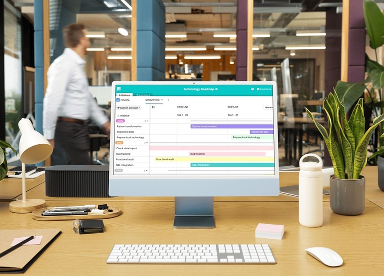

## Como planear os seus projectos de forma eficiente e com objectivos definidos

Um **roadmap** (ou roteiro) abre o caminho para o sucesso! Conquistar clientes, desenvolver estratégias, documentar o progresso - os modelos de roteiro podem ser utilizados de várias formas nos seus projectos. Para maximizar os benefícios, é importante que crie um roteiro que corresponda aos seus objectivos. Um modelo poupa-lhe tempo valioso e aumenta enormemente a eficiência.

Neste artigo, pode descobrir qual o roteiro mais adequado para o seu projeto, como utilizar da melhor forma um **modelo de roteiro** e o que deve ter em conta ao criar um roteiro.

## O que é um roteiro?

Um roteiro ajuda-o a abordar o seu próximo projeto de uma forma estruturada. Cria um plano de percurso visual no qual regista todas as **etapas de trabalho**, **metas** e **objectivos** do seu projeto dentro de um período de tempo. Ao contrário de um plano de projeto, o foco não está nos detalhes. Em vez disso, o foco está em obter uma visão geral dos processos individuais e localizá-los no plano.

A visualização assemelha-se normalmente a uma **linha de tempo** na qual se agrupam todas as tarefas de acordo com os tópicos e responsabilidades e se atribui a diferentes períodos de tempo.

## Como é que um roteiro o ajuda?

Para apresentar claramente uma questão complexa, como visões de negócios, estratégias de vendas ou campanhas de marketing, é necessária uma visualização simplificada que descreva processos coordenados com base numa divisão de trabalho. Ao visualizar os processos individuais num roteiro, pode criar uma construção global coerente que está alinhada com o objetivo comum.

Um **modelo de roteiro** facilita a estruturação do seu plano de projeto e ajuda-o a apresentar a sua estratégia de uma forma clara, compreensível e inteligível para todos os envolvidos.

Ao criar um plano em conjunto, permite que todos os envolvidos contribuam e, ao mesmo tempo, reforça a colaboração entre departamentos.

Um roteiro também permite estimar aproximadamente se o tempo previsto para um projeto é realista, quantos recursos (dinheiro, materiais, pessoal, etc.) são necessários e se todas as etapas de trabalho necessárias foram tidas em conta.

## Como criar um roteiro em seis passos

A criação de um roteiro leva tempo e requer uma preparação exaustiva. Em seguida, aprenderá a criar um roteiro que satisfaça as suas necessidades em seis passos.

### 1. Definir objectivos

Antes de criar um roteiro, deve primeiro definir o **objetivo geral do projeto**, uma vez que todo o planeamento posterior se baseará nele. Para tal, defina objectivos claros para o roteiro que estejam de acordo com os objectivos gerais da sua empresa. A implementação deve ser realisticamente **exequível** e poder ser integrada nos processos da empresa. Defina **milestones** aproximados que pretende alcançar num determinado período de tempo.

### 2. Definir o tipo de roteiro

Com base nos requisitos que o seu plano deve cumprir, pode classificá-lo de acordo com três dimensões:

- **Timeframe**: O seu projeto é de curto, médio ou longo prazo?
- **Nível de pormenor**: Qual o nível de pormenor que pretende fornecer sobre os processos?
- **Tópico**: Qual é o principal objetivo do seu roteiro?

A definição das caraterísticas ajudá-lo-á a identificar o tipo certo de roteiro para mapear os seus processos.

### 3. Envolver as partes interessadas

Para tornar o seu projeto tão eficiente quanto possível, deve envolver as **pessoas** e **departamentos** relevantes desde o início do processo de criação. Atribuir **responsabilidades** vinculativas para maximizar o empenho e a motivação. Isto irá melhorar a **transparência** e a comunicação no seio da equipa do projeto.

### 4. Desenvolver estrutura e processos

A estrutura do roteiro define como pretende atingir o seu objetivo. O ponto de partida deve ser sempre o estado atual. Em regra, um roteiro visualiza as **tarefas principais** que são necessárias para atingir o objetivo. Ao fazê-lo, organiza os marcos numa **sequência temporal** lógica. O nível de detalhe desejado determina quantos passos intermédios e subtarefas se pretende registar.

Dica: Para o planeamento detalhado do seu projeto, é melhor utilizar um [plano de trabalho](), que pode ser expandido conforme necessário.

### 5. Criar um roteiro

Agora deve ter as informações mais importantes para criar o seu roteiro. Com base nisso, pode escolher um **formato e design** que se adapte ao seu projeto. Em seguida, adicione as tarefas mais importantes, os marcos e as partes responsáveis para dar a si e aos seus colegas uma visão geral.

Para facilitar a conceção, vários serviços fornecem-lhe **modelos de roteiro** já prontos, que só tem de preencher individualmente.

### 6\. Actualizações e comunicação regulares

Independentemente do tipo de roteiro que escolheu, deve atualizar regularmente o seu **progresso** e quaisquer **alterações**. Por exemplo, podem ser acrescentadas novas tarefas ou a implementação pode ser adiada. As mudanças de estratégia, em particular, levam a ajustes de longo alcance no seu roteiro. Certifique-se de que comunica os efeitos das actualizações de forma rápida e abrangente, para que todas as partes interessadas estejam sempre actualizadas.

## Programas e ferramentas

Ao planear um projeto, é crucial selecionar uma ferramenta adequada para criar um roteiro. Facilite o registo das informações do seu projeto introduzindo os dados numa estrutura já pronta. Existem modelos especiais que dependem dos temas e das partes interessadas que identificou para o seu projeto. Estes modelos diferem consoante o fornecedor e as ferramentas associadas.

### Criar um roteiro em Excel e PowerPoint

As opções mais conhecidas para criar um roteiro incluem o Excel, por um lado, e a visualização com um modelo de roteiro no PowerPoint, por outro. A vantagem de criar um roteiro a partir de um modelo no PowerPoint: O PowerPoint oferece vários modelos de roadmap para que possa encontrar diretamente o modelo que se adequa às suas necessidades.

Por outro lado, para encontrar o modelo de roteiro adequado no Excel, é necessário investir um pouco mais de tempo, uma vez que estes não fazem parte da oferta geral do programa. Consequentemente, é necessário um pouco mais de pesquisa antes de encontrar o modelo certo para os seus objectivos e descarregá-lo.

### Roteiro no Jira

O Jira oferece uma poderosa ferramenta de roadmap que foi especialmente desenvolvida para projectos de software ágeis. Com um roteiro no Jira, os projectos complexos podem ser claramente visualizados e divididos em etapas de trabalho individuais. Pode visualizar os objectivos, marcos e responsabilidades do projeto num gráfico de Gantt (com barras numa linha temporal) e acompanhar o progresso em tempo real.

### Ferramentas de gestão de projectos e de roteiro, como o SeaTable

Outros fornecedores também fornecem modelos de roteiro diretamente utilizáveis que permitem a recolha e visualização de dados num só. As ferramentas de roadmap [de gestão de projectos]() de renome, como o SeaTable, baseiam-se em **modelos personalizáveis** que podem ser adaptados com precisão às suas necessidades e mostram uma pré-visualização das caraterísticas que pode esperar antes de os descarregar. Desta forma, evita-se comprar o proverbial "porco num papo".

Uma boa ferramenta deve também permitir vários tipos de visualização, como calendários, cronogramas, diagramas de Gantt ou fluxogramas, para que os dados possam ser personalizados para diferentes pessoas e objectivos. É importante que tenha à mão exatamente as **funções-chave** de que necessita para o seu trabalho.

E depois de encontrar a ferramenta certa, pode facilmente criar o roteiro ideal e utilizá-lo como modelo vezes sem conta.

## Encontrar o roteiro certo

Cada objetivo tem os seus próprios requisitos. É por isso que faz sentido escolher um roteiro que possa satisfazer diferentes desejos e necessidades. Os exemplos de roteiro que se seguem mostram-lhe as opções que tem para criar um roteiro e quais os modelos adequados e quando.

### Roteiro de projeto

Um roteiro de projeto fornece exatamente o que o seu nome sugere: uma visão geral de um projeto específico. Pode ser uma campanha de marketing, um grande evento ou um projeto de construção, por exemplo. O roteiro do projeto serve como uma ferramenta poderosa para definir objectivos, comunicar requisitos às partes interessadas e cumprir prazos. As etapas, o planeamento dos custos e dos recursos são também elementos típicos.

Se procura um modelo que lhe facilite o registo dos relatórios e da documentação do projeto, o planeador de projectos da SeaTable é ideal.

### Roteiro estratégico

É diretor-geral ou membro do conselho de administração e gostaria de explicar a **visão global** da empresa aos seus empregados ou a outras partes interessadas de uma forma clara e concisa? Então, um roteiro estratégico, que tem muitas semelhanças com um plano de negócios, é a ferramenta de eleição. Pode utilizá-lo para traçar os seus objectivos a curto e a longo prazo (por exemplo, em termos de [marketing]() e vendas), o [planeamento financeiro]() e todas as medidas necessárias para alcançar a visão da empresa num relance.

O modelo SeaTable mapeia claramente todos os processos importantes. Pode personalizá-lo para se adaptar à sua empresa.

### Roteiro do produto

Um roteiro de produtos é adequado tanto para a comunicação **interna** como para a **externa** e está intimamente ligado à gestão da inovação da empresa. A nível interno, mapeia o desenvolvimento do produto desde a ideia até ao lançamento no mercado. O roteiro deve adaptar-se de forma flexível ao desenvolvimento do produto: Como é que as suas funções podem ser expandidas ou a sua produção optimizada? A concorrência nunca dorme - por isso, é crucial que melhore continuamente os seus produtos e se mantenha inovador.

Quando utilizado externamente, o roteiro do produto é utilizado para apresentar os produtos ou serviços planeados aos clientes, investidores ou outras partes interessadas externas. Pode receber feedback direto sobre as inovações que são particularmente bem recebidas, as que devem ser introduzidas e as que não devem.

### Roteiro de tecnologia

Um roteiro de tecnologia ou de TI ajudá-lo-á se o seu objetivo for visualizar a infraestrutura tecnológica ou o desenvolvimento de software na sua empresa. Isto dá-lhe uma visão geral das oportunidades e riscos para a gestão da empresa: que tecnologias se tornaram obsoletas e que sistemas quer introduzir para acompanhar a digitalização e manter-se atualizado?

Visualize o seu roteiro para [desenvolvimento de software]() com o modelo SeaTable e beneficie de uma visão geral estruturada.

### Roteiro integrado

Os roteiros integrados consistem em vários tópicos individuais, como o planeamento de projectos e tecnologias. Dependendo do foco escolhido, estes compreendem diferentes níveis em profundidade decrescente.

### Roteiro para toda a empresa

Nesta forma, todos os departamentos da empresa são considerados como um todo. Os processos de tecnologia, produtos, marketing e vendas são ligados entre si e avaliados no contexto geral da empresa.

Isto permite-lhe combinar e melhorar os processos existentes com novas tecnologias e produtos. O roadmapping também permite identificar lacunas e impulsionar a inovação.

## Utilizar modelos de roteiro em linha

Por isso, se quiser criar um roteiro e utilizar um modelo, deve planear algum tempo para comparar e testar diferentes modelos e fornecedores.

O SeaTable oferece-lhe modelos especiais que pode personalizar de acordo com as necessidades da sua empresa.



Se quiser utilizar o SeaTable para criar o seu roteiro, basta registar-se gratuitamente.

## Perguntas frequentes


Um roteiro é uma representação visual de um projeto que mostra claramente os seus objectivos, marcos e tarefas. Ajuda-o a estruturar claramente todo o percurso do projeto, para que possa acompanhar as etapas importantes e monitorizar o progresso. O roteiro é particularmente útil para simplificar projectos complexos e melhorar a comunicação com todos os envolvidos.


Existem diferentes tipos de roteiros, cada um dos quais aborda requisitos e objectivos específicos. Os mais comuns incluem

- Roteiro de projeto
- Roteiro estratégico
- Roteiro do produto
- Roteiro tecnológico
- Roteiro integrado


Existem inúmeras ferramentas que o podem ajudar a criar um roteiro. Um exemplo particularmente flexível é o SeaTable: uma ferramenta de gestão de projectos que fornece modelos de roteiro personalizáveis e suporta vários formatos de apresentação, como gráficos de Gantt.


