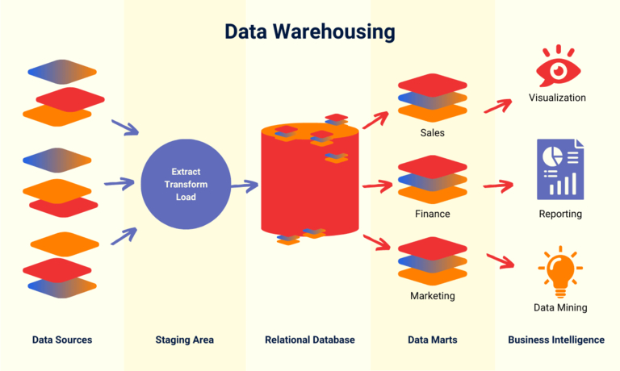

## O que é um armazém de dados?

Um armazém de dados (também abreviado para DWH) é um **sistema de armazenamento centralizado** que reúne grandes quantidades de dados de diferentes fontes, estrutura-os e prepara-os **para análise**. Ao armazenar e visualizar o **histórico** dos dados, é possível identificar padrões, tendências e correlações ao longo do tempo. É por esta razão que a inteligência empresarial também desempenha um papel importante nos armazéns de dados.

As funções de análise permitem-lhe obter informações valiosas sobre várias áreas de negócio a partir dos seus dados, a fim de melhorar a **tomada de decisões**. Se incorporar todos os dados da sua empresa no seu armazém de dados, este pode mesmo ser descrito como uma **fonte única de verdade** - ou seja, uma base de dados completa e fiável.

## As vantagens de um armazém de dados

- **Tornar as decisões mais fáceis**: Com a ajuda de uma base de dados sólida, pode tomar decisões informadas.
- **Melhorar a qualidade dos dados**: Um armazém de dados limpa, consolida e normaliza grandes quantidades de dados para os tornar utilizáveis.
- **Visualizar correlações**: Num sistema de data warehouse, é possível criar análises, relatórios e apresentações num instante.
- **Reconhecer desenvolvimentos**: No armazém de dados, o utilizador recolhe dados históricos de evolução a longo prazo, a partir dos quais pode obter padrões, tendências e previsões.

## As 4 principais caraterísticas dos armazéns de dados

O cientista informático norte-americano Bill Inmon, considerado o "pai do armazenamento de dados", define quatro caraterísticas dos armazéns de dados.

- **Orientado para o tema**: Em primeiro lugar, os dados e os índices de um tópico ou área de negócio específica (por exemplo, vendas, finanças, RH) são selecionados para inclusão no DWH. Que informações são necessárias para análises e tomadas de decisão subsequentes?
- **Integrado**: Um armazém de dados centraliza, normaliza e limpa os dados de várias fontes e armazena-os de forma estruturada. Isto assegura um elevado nível de consistência dos dados.
- **Orientado para o tempo**: Os dados históricos, que permitem analisar as alterações ao longo do tempo, estão no centro do armazenamento de dados. O armazenamento de dados a longo prazo é necessário para que se possa analisar a evolução ao longo do tempo.
- **Não volátil**: Uma vez armazenados no armazém de dados, os dados não podem ser alterados ou eliminados, sob pena de o historial ser falsificado. Por conseguinte, é importante que os dados não sejam voláteis, mas sim estáveis.

## História e futuro do armazenamento de dados

Os primeiros armazéns de dados surgiram no mercado no final da década de 1980. Nessa altura, destinavam-se a fornecer dados aos sistemas de apoio à decisão e aos sistemas de informação de gestão existentes.

- **Os sistemas de apoio à decisão** (DSS) foram as primeiras soluções de software que permitiram a modelação de dados e simulações para apoiar a tomada de decisões.

- **Os sistemas de informação de gestão** (MIS) foram concebidos para simplificar a preparação manual de dados e a criação de análises gráficas para a gestão de topo.

No entanto, os armazéns de dados da altura tinham de lidar com uma **enorme redundância** porque muitas empresas tinham vários DSS e FIS para diferentes áreas de negócio. Embora os sistemas utilizassem maioritariamente os mesmos dados, estes eram frequentemente armazenados separadamente para cada ambiente. No entanto, com o surgimento das plataformas de business intelligence, o data warehouse evoluiu para um repositório de informação mais **eficiente** com capacidades analíticas abrangentes para diferentes unidades de negócio.

Atualmente, a **IA, a aprendizagem automática e a automatização** estão a abrir possibilidades inteiramente novas para melhorar o desempenho dos armazéns de dados. Este desenvolvimento acaba por conduzir a **armazéns de dados autónomos** que são completamente autogeridos e já não necessitam de administração humana. Isto pode aliviar a carga do departamento de TI da sua empresa e libertar tempo para obter ainda mais informações dos seus dados. Ao mesmo tempo, é possível reduzir os custos com um armazém de dados moderno e conceber arquitecturas de armazém de dados optimizadas para as necessidades de diferentes utilizadores e áreas especializadas.

## Como é estruturado um armazém de dados

A forma exacta de configurar o sistema de data warehouse depende dos requisitos específicos de data warehouse da sua empresa, que devem ser definidos em primeiro lugar. No entanto, todas as arquitecturas de **data warehouse** partilham uma conceção básica: os dados brutos são armazenados temporariamente num repositório que é alimentado por fontes de dados, por um lado, e escreve dados estruturados numa base de dados relacional, por outro. No final, os utilizadores acedem aos dados depurados através de ferramentas de BI para análise, visualização e elaboração de relatórios.

### Principais componentes do armazenamento de dados

Um conceito típico de data warehouse pode ser dividido nos seguintes níveis:

1. **Fontes de dados internas**, por exemplo, sistemas ERP e CRM, ou **fontes de dados externas**, como dispositivos IoT ou plataformas de redes sociais, fornecem dados brutos.
1. Os dados em bruto são temporariamente armazenados e transformados numa **área de preparação**. No processo **ETL**, o armazém de dados transforma os dados para armazenamento estruturado.
1. o núcleo do armazém de dados é normalmente uma **base de dados relacional**, que armazena e gere os dados estruturados e limpos.
1. Um armazém de dados está normalmente dividido em vários **data marts**. Estes concentram-se em áreas especializadas ou departamentos individuais (por exemplo, vendas, marketing, finanças).
1. A **exploração de dados**, a **análise estatística de dados**, a **visualização gráfica** e a **elaboração de relatórios** são efectuadas com ferramentas de BI como o Tableau, o Microsoft Power BI ou o Google Looker.

### Processo ETL para uma gestão eficiente do armazém de dados

Um armazém de dados utiliza os chamados processos ETL para recolher dados de várias fontes, transformá-los e carregá-los na base de dados central. A abreviatura significa **Extrair, Transformar, Carregar**. O processo ETL ocorre em três etapas na área de preparação:

1. A **extração**: O armazém de dados recolhe os dados pretendidos de várias fontes. Para que isto funcione, normalmente é necessário ligar outros sistemas ao sistema de data warehouse através de uma API.
1. a **transformação**: Trata-se de limpar, enriquecer e formatar os dados de uma forma normalizada. Por exemplo, o armazém de dados remove duplicados, acrescenta valores em falta e adapta os tipos de dados.
1. o **carregamento**: Finalmente, os dados limpos são transferidos para a base de dados central.

### Exemplo de um processo de data warehouse

As explicações anteriores foram bastante técnicas. Aqui está outro exemplo ilustrativo para mostrar como um processo de data warehouse funciona sem problemas.

Vamos supor que gere uma **loja online** e pretende analisar as vendas, o tráfego e os dados dos clientes. Em primeiro lugar, é necessário considerar quais as fontes de dados que devem ser incluídas na sua base de dados e quais os sistemas a que deve aceder. Neste caso, pode ser o **histórico de encomendas** do Shopify, o **tráfego web** do Google Analytics e os **dados de CRM** do Pipedrive. Estes dados são agora limpos, harmonizados e armazenados no armazém de dados. Pode agora avaliar estatisticamente todos os números de vendas e de acessos, efetuar análises de clientes e tirar conclusões para a sua estratégia de vendas e para a melhoria da sua loja virtual.

## Diferenças entre um data warehouse e uma base de dados

Data warehouse e base de dados são dois [sistemas de gestão de dados] diferentes (). Enquanto uma base de dados se centra normalmente no **armazenamento de dados**, o sistema de armazenamento de dados mapeia um processo mais longo, desde a aquisição de dados, passando pela integração e preparação dos dados, até à análise dos mesmos. No entanto, os armazéns de dados também armazenam grandes quantidades de dados numa base de dados central, que é o coração de todas as soluções de DWH. Por sua vez, um armazém de dados serve de **base para análises e relatórios** em toda a empresa.

| **Data Warehouse**    | **Base de dados**             |                        |
| --------------------- | ----------------------------- | ---------------------- |
| **Finalidade / Foco** | Análises e Relatórios         | Armazenamento de Dados |
| **Alcance**           | normalmente em toda a empresa | variável               |

## Qual é a diferença entre um data warehouse e um data lake?

Um lago de dados é uma espécie de **bacia de recolha de todos os dados brutos de uma organização**. Estes podem ser dados estruturados de bases de dados relacionais, bem como dados não estruturados (por exemplo, e-mails, documentos PDF e ficheiros de imagem). No entanto, ao contrário de um armazém de dados, um lago de dados armazena os dados **não ajustados** até os querer preparar para análise ou visualização, conforme necessário. Pode literalmente imaginar um lago de dados como um lago de dados no qual os dados de diferentes fontes fluem em conjunto e inicialmente repousam sem serem processados. Os lagos de dados, como o Amazon S3, o Microsoft Azure Data Lake ou o Google Cloud Storage, permitem, por conseguinte, um **armazenamento rápido e flexível de grandes quantidades de dados**.

## As duas tecnologias básicas de armazenamento de dados

Existem várias soluções de data warehouse no mercado, que podem ser basicamente classificadas como **na nuvem ou no local**. Originalmente, os data warehouses eram fornecidos apenas em servidores locais. Ainda hoje, estes armazéns de dados locais podem ter certas vantagens em termos de **segurança e soberania dos dados**. No entanto, a administração destes sistemas pode ser muito morosa para arquitecturas complexas de armazéns de dados.

### Vantagens do "Data Warehouse na nuvem"

Um data warehouse na nuvem tem as seguintes vantagens, entre outras:

- **Elasticidade e escalabilidade**: Uma vez que tem um armazém de dados na nuvem alojado num centro de dados, tem à sua disposição um poder de computação e um espaço de armazenamento quase ilimitados. Dependendo da quantidade de dados, pode expandir ou reduzir de forma flexível as capacidades utilizadas, ou seja, aumentar ou diminuir a escala.
- **Custos operacionais mais baixos**: Com o DWH na nuvem, não tem de investir na sua infraestrutura, contratar pessoal adicional e pagar apenas a quantidade de recursos de que realmente necessita (princípio do pagamento consoante o uso).
- **Implementação rápida**: Pode criar um armazém de dados na nuvem num curto espaço de tempo, graças a processos prontos, e personalizá-lo de acordo com as suas necessidades, ao passo que uma configuração no local pode demorar vários meses e envolver muito trabalho de desenvolvimento.
- **Dados em tempo real**: As tecnologias DWH em memória permitem o processamento de dados a uma velocidade vertiginosa. Com base em dados em tempo real, é possível reconhecer e analisar imediatamente alterações súbitas.

Segue-se uma visão geral das diferenças entre a nuvem e o local.

|                               | **Nuvem**                                                                                 | **No local**                                                                                   |
| ----------------------------- | ----------------------------------------------------------------------------------------- | ---------------------------------------------------------------------------------------------- | ------------------------------------------------------------------ |
| **Disposições**               | Instalação possível em qualquer parte do mundo num curto espaço de tempo                  | A instalação do hardware no local pode demorar várias semanas                                  |
| **Custos**                    | Princípio da repartição, sem custos adicionais para as infra-estruturas e o pessoal       | elevados custos de aquisição e de funcionamento das infra-estruturas e do pessoal              | elevados custos de funcionamento das infra-estruturas e do pessoal |
| **Escalabilidade**            | Escalonamento flexível e automático sem limites                                           | Planeamento manual da capacidade com limites claros                                            |
| **Segurança**                 | Elevada encriptação, cópias de segurança automáticas                                      | controlo total e soberania dos dados, segurança dependente dos seus processos de TI            |
| **Atualização em tempo real** | Muito rápido graças à tecnologia in-memory                                                | Frequentemente baseado em lotes com atrasos                                                    |
| **Usabilidade**               | Muitas vezes de fácil utilização graças a elementos pré-fabricados, sem dependência de TI | frequentemente complexos, os peritos em TI têm de ligar as fontes de dados e administrar o DWH |

## SeaTable - o armazém de dados flexível, simples e económico

O SeaTable é uma [plataforma sem código] (https://seatable.com/) que oferece a vantagem, em relação a outras bases de dados relacionais, de os utilizadores poderem trabalhar numa **interface gráfica do utilizador intuitiva** sem conhecimentos de SQL ou outros conhecimentos de TI. Com a ajuda de vários **views, plugins e estatísticas**, pode facilmente preparar e visualizar os dados da forma que desejar. Isto facilita a realização de análises precisas e a tomada de decisões bem fundamentadas sem qualquer problema.

Os dados de inúmeras fontes podem fluir para o SeaTable através de **integrações com Zapier, Make ou n8n** e da **API do SeaTable**. Para permitir que o SeaTable guarde todos os dados de forma estruturada, selecione previamente os [tipos de dados] desejados (https://seatable.io/docs/arbeiten-mit-spalten/uebersicht-alle-spaltentypen/). Graças ao **princípio modular de fácil utilização**, isto é tão fácil como utilizar o **Construtor de aplicações integrado** [para criar as suas próprias aplicações](https://seatable.com/app-erstellen/). O SeaTable também permite a **colaboração em equipa** e actualiza os dados em tempo real - as alterações são imediatamente visíveis para todos os utilizadores e totalmente documentadas no histórico de versões.

Além disso, pode escolher se pretende operar o seu armazém de dados [on-premises]() ou na [cloud](). Beneficie da escalabilidade e da comodidade do **SeaTable Cloud** ou aloje o **SeaTable Server** nos seus próprios servidores com total controlo e soberania dos dados. Comece com a versão básica gratuita, que pode atualizar para uma subscrição [Plus ou Enterprise]() em qualquer altura, assim que necessitar de mais funções ou espaço de armazenamento.

[Registe-se gratuitamente]() e experimente como o armazenamento de dados pode ser fácil.

## FAQs sobre armazenamento de dados



O que é um armazém de dados?|||
Uma definição de armazém de dados amplamente reconhecida é que um DWH combina diversos dados de diferentes fontes numa base de dados uniforme para permitir análises bem fundamentadas. Para tal, prepara os dados e armazena-os numa base de dados estruturada.

---

O que é um lago de dados?|||
Tal como um armazém de dados, um lago de dados é um sistema de armazenamento especial. No entanto, ao contrário de um armazém de dados, um lago de dados armazena dados brutos não processados. O processamento é feito a jusante e só começa quando os dados são necessários para análise.

---

O que é um data mart?|||
Um data mart é uma parte do armazém de dados que se destina a um caso de utilização específico ou a uma área de negócio. Fornece a um grupo de utilizadores definido exatamente os dados que lhes são relevantes. O data warehouse, por outro lado, armazena os dados de toda uma empresa.

---

O que significa ETL?|||
ETL é a abreviatura de Extract, Transform, Load. Descreve as três etapas do processo em que os dados são recolhidos de diferentes fontes, transformados e armazenados no armazém de dados.


