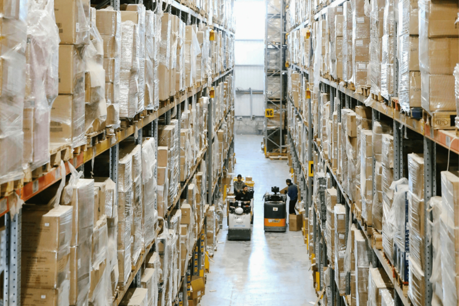

## Управление закупками в компаниях

Закупки в компаниях - сложная сфера ответственности, предъявляющая высокие требования к ответственным менеджерам по закупкам. Им приходится взвешивать порой противоречивые интересы и требования внутренних заинтересованных сторон и организовывать управление поставщиками. Вы также отвечаете за то, чтобы необходимые **материалы и услуги** были предоставлены вовремя и в рамках имеющегося бюджета. **Переговоры о ценах, управление предложениями, контроль качества и управление рисками** - вот лишь некоторые из основных задач менеджера по закупкам.

Хорошей новостью является то, что цифровые решения могут помочь вам оптимизировать закупки и наладить прозрачные процессы. Прежде чем мы рассмотрим возможности оптимизации процесса закупок, давайте сначала разберемся с самыми серьезными проблемами в этой области.

## Почему эффективные закупки важны для вашей компании?

Закупки - это не просто процесс приобретения товаров, это центральная корпоративная функция, которая **непосредственно участвует в создании стоимости**. Эффективный процесс закупок позволяет организациям сокращать расходы, минимизировать риски и повышать **конкурентоспособность**. Стратегические закупки - это ключ к экономическому успеху современных компаний.

## Каковы цели закупок?

Закупки охватывают все виды деятельности и процессы, необходимые для приобретения товаров, услуг и ресурсов для компании. По сути, цель состоит в том, чтобы предоставить необходимые товары или услуги в нужном количестве в нужное время и в нужном месте по экономически обоснованной цене. Однако в отличие от традиционных закупок, закупки выходят за рамки простых операций. Менеджеры по закупкам должны разрабатывать надежную стратегию закупок, создавать и поддерживать сети поставщиков, следить за расходами и в то же время поддерживать стратегические цели компании. Стратегия закупок также включает в себя вопрос о том, можно ли создать устойчивую систему закупок и как это сделать. Современное управление закупками включает в себя, помимо прочего

- Задачи планирования (например, определение потребностей и поиск поставщиков)
- управление закупками и централизованные закупки
- Организация приема и проверки поступающих товаров
- Управление складской логистикой и управление материалами
- Управление внутренними цепочками поставок

## Проблемы в сфере закупок

Сотрудники отдела закупок сталкиваются со сложными проблемами: Колеблющиеся рынки, нестабильные глобальные цепочки поставок, растущее давление на издержки, волатильность цен и растущее регулирование усложняют эффективный процесс закупок. Компаниям необходимо разрабатывать гибкие стратегии, чтобы справиться с этими неопределенностями и одновременно соответствовать требованиям качества. В быстром темпе повседневной деятельности даже **краткосрочные закупки материалов должны осуществляться без серьезных внутренних административных препятствий** - особенно в период **закупок точно в срок**. Однако закупки в компании не должны быть организованы настолько экономно, чтобы упускать **необходимый контроль качества** или чтобы срочная необходимость в действиях не приводила к ошибочным решениям, которых можно было бы избежать. Пять ключевых проблем

**Управление договорами** Современный процесс закупок требует разработки очень сложных договоров. К числу проблем относятся правовые риски, точное определение исполнения и ответственности, трудности переговоров и обеспечение прозрачности и гибкости контракта.

**Управление рисками** Выявление и минимизация рисков в логистике закупок становится все более сложной задачей. В частности, в последние годы возросли риски, связанные с узкими местами в поставках и геополитической нестабильностью, которые необходимо всегда учитывать при закупке и управлении материалами.

**Цепочки поставок** Глобальные цепочки поставок подвержены сбоям. К потенциальным проблемам относятся географические расстояния, таможенные правила, транспортные риски, а также обеспечение прозрачности и устойчивости цепей поставок. К этому добавляются меняющиеся нормативные требования.

**Управление поставщиками** Стратегическое управление отношениями с поставщиками требует всесторонней экспертизы и тесных взаимоотношений с ними. Основными задачами закупок в компании являются оценка эффективности, развитие стратегических партнерских отношений и обеспечение надежности поставщиков.

**Цифровизация** Цифровая трансформация закупок несет в себе как сложные проблемы, так и возможности. Ключевыми вопросами являются интеграция новых технологий, прозрачное управление данными, кибербезопасность и защита данных, а также квалификация сотрудников для работы с цифровыми процессами закупок.

## В чем разница между закупками и снабжением?

Закупка материалов, процесс закупки, управление закупками, закупочные процедуры в закупках: Каждый, кто работает в сфере закупок или имеет с ней дело, неизбежно сталкивается с различными терминами и формулировками, которые на первый взгляд кажутся синонимами. На самом деле, различие между закупками и снабжением очень важно для понимания всей сложности современной закупочной деятельности.

В то время как **закупки** сосредоточены на немедленном **приобретении товаров и услуг**, **закупки** включают в себя **более целостный подход** с долгосрочной перспективой. Он включает в себя такие стратегические аспекты, как выбор поставщика, управление контрактами, оценка рисков и долгосрочные партнерские отношения. Таким образом, закупки являются оперативным подкомпонентом процесса закупок. Это также называется стратегической закупкой и оперативной закупкой.

### Стратегическая закупка

Стратегические закупки или стратегические закупки относятся ко всему процессу управления закупками. Как уже говорилось, **в центре внимания здесь находятся долгосрочные корпоративные цели**. Сотрудники этой сферы всегда следят за всей цепочкой создания стоимости, чтобы генерировать конкурентные преимущества и минимизировать бизнес-риски. Менеджеры по закупкам должны уметь проводить анализ рынка и конкурентов, оценивать поставщиков, разрабатывать и оценивать стратегии закупок, поддерживать отношения с поставщиками и решать, какое программное обеспечение необходимо, среди прочего. Цепочка поставок также является важным аспектом стратегических закупок. Подробнее об этом вы можете узнать из нашей статьи в блоге [Supply Chain Management]().

### Оперативные закупки

Оперативная закупка (также известная как оперативная закупка), с другой стороны, заключается в приобретении **требуемых товаров и услуг**. Сюда входят такие задачи, как запрос котировок, сравнение цен, обработка заказов и прямая связь с поставщиками. В отличие от закупок, снабжение может быть организовано централизованно или децентрализованно. В обоих случаях сотрудники, занятые в этой сфере, должны сосредоточиться на эффективном выполнении, контроле затрат и своевременном приобретении товаров. В зависимости от назначения различают прямые закупки - приобретение сырья и комплектующих для производства продукции - и [косвенные закупки]() - приобретение ресурсов, необходимых для работы компании.

## Варианты закупок: Какие у вас есть варианты?

Как у менеджера по закупкам, у вас есть различные варианты организации закупок товаров. Помимо направленности деятельности вашей компании, важными критериями принятия решения являются финансовое планирование, стабильность цепочки поставок и надежность ваших поставщиков. На практике вам может подойти сочетание различных вариантов закупок.

При **индивидуальных закупках** вы приобретаете товары поштучно, например, если на них есть специальный заказ клиента.

Цель **складских закупок** - держать на складе большое количество товаров и материалов, чтобы постоянно выполнять заказы.

Закупки **точно в срок**, также известные как производственно-синхронные закупки, подразумевают приобретение товаров только тогда, когда они необходимы в производственном процессе.

## Факторы успеха в закупках: Что следует учитывать?

Успешные процессы закупок требуют прозрачной коммуникации, принятия решений на основе данных и постоянной оценки качества поставщиков и продукции. Ключевыми факторами являются использование цифровых технологий, управление рисками, требования к устойчивости закупок и способность быстро реагировать на изменения рынка.

**Определение требований** Определение требований - первый важный шаг в любом процессе закупок. Он включает в себя систематический анализ потребностей компании, количественных и качественных требований к товарам и услугам и определение целей закупок. Это позволяет ответственным за закупки лицам всегда держать в поле зрения то, что необходимо в данный момент.

**Выбор поставщика** Выбор поставщика требует всесторонней оценки потенциальных партнеров. Важными критериями являются качество, надежность, структура цены, возможность поставки, аспекты устойчивого развития и совместимость со стратегическими целями компании.

**Заказ и подтверждение заказа** Этот этап процесса включает в себя официальное сообщение о требованиях к закупке, запрос котировок и сравнение цен, точное определение условий поставки, количества, цен и сроков и, наконец, обязательное подтверждение заказа поставщиком.

**Приход товара и проверка товара** При проверке прихода товара проверяется соответствие поставленного товара заказу. Решающими факторами здесь являются контроль количества, проверка качества, документирование отклонений и, при необходимости, процесс рассмотрения претензий в случае несоответствия.

## Советы по оптимизации процессов закупок

Успех компании зависит и от того, насколько слаженно работают отдельные отделы. Соответственно, нестабильный процесс закупок обычно затрагивает не только один отдел, но может иметь последствия для всей компании. В худшем случае производство может застопориться или вовсе остановиться. Поэтому тем более важно, чтобы все отделы, участвующие в закупках, работали сообща - закупки, контроллинг, управление качеством и бухгалтерия. Основываясь на **центральных факторах успеха**, перечисленных выше, мы определили 5 подходов к оптимизации закупок:

**Автоматизация:** Стандартизируйте свои процессы и используйте инструменты с функциями автоматизации, например, для создания заказов, обработки счетов, получения котировок, автоматической отправки регулярных заказов и эффективного использования ресурсов. Платформа [no-code platform]() SeaTable предлагает внутреннюю автоматизацию, а также возможность подключения поставщиков платежных услуг, например, через [API]().

**Управление поставщиками:** Создайте центральную базу данных поставщиков, доступную для всех, в которую стекается вся необходимая информация, например, цены и доступные товары, предыдущие поставки, анализ качества, оценка надежности и производительности, невыполненные жалобы и т. д. Эту информацию можно использовать для целенаправленной комплектации заказов.

**Управление запасами:** Эффективный контроль запасов позволяет сократить расходы на хранение, избежать дублирования заказов и обеспечить способность компании выполнять поставки. Используйте современные системы для оптимизации процесса закупок благодаря точному прогнозированию спроса. С помощью [шаблона управления цепочками поставок]() бескодового решения для баз данных SeaTable вы всегда будете иметь представление обо всех запасах и невыполненных поставках.

**Проверка производительности и качества:** Установите систематические измерения производительности и качества для поставщиков. Определите четкие ключевые показатели, создайте информационные панели и регулярно контролируйте работу ваших поставщиков. Используйте современные решения для работы с базами данных, которые предоставляют статистику и информационные панели для более глубокого понимания ваших данных.

**Оцифровка:** Отсутствие оцифровки в сфере закупок - одна из самых больших проблем многих компаний. Используйте современное бескодовое решение, чтобы организовать весь процесс закупок в соответствии с вашими потребностями в одной интегрированной системе. Процессы принятия решений на основе данных, информация в режиме реального времени, прозрачность и улучшенный анализ - вот ключ к эффективным закупкам.

## Эффективные процессы закупок с SeaTable

Благодаря тщательному планированию, эффективному внедрению и постоянной оптимизации компании могут сократить расходы на закупки, повысить надежность поставщиков и общую эффективность бизнеса.

Независимо от того, управляете ли вы оперативными закупками или всем процессом закупок в своей компании, тщательное планирование и постоянная оценка и оптимизация процессов могут сократить расходы, улучшить выбор поставщиков и способствовать успеху компании. Для этого необходим обзор всех поставщиков, открытых и запланированных заказов, цепочки поставок, затрат и состояния заказов. Однако в зависимости от размера компании это может быстро запутать. С помощью бесплатных шаблонов от SeaTable вы всегда будете иметь обзор всех данных и обеспечите прозрачность для заинтересованных сторон. Это позволит вам в любой момент оценить цепочку поставок и закупок и принять стратегические решения.

Зарегистрируйтесь бесплатно сегодня, указав свой адрес электронной почты.

## FAQ Закупки


Определение требований, проверка и утверждение заказов, выбор поставщиков и запрос котировок, проверка поступающих товаров и контроль качества, а также последующая обработка платежей - все это является частью процесса закупок.


Логистика закупок отвечает за закупку и управление материалами в компаниях и обеспечивает наличие необходимых материалов. Это также включает в себя закупку товаров как можно более экономичным способом и на оптимальных условиях.


Это различные методы, которые ответственные менеджеры разрабатывают и применяют для того, чтобы организовать закупки в компании эффективно и рационально. Она также определяет, будет ли закупка организована централизованно или децентрализованно и будет ли применяться подход, основанный на единичном, множественном или ведущем закупщике.


Первичный спрос - это спрос на конечные продукты, запасные части или промежуточные продукты, которые продаются непосредственно клиентам. В отличие от этого, товары вторичного спроса - это сырье, компоненты или промежуточные продукты, которые необходимы компании для производства своих товаров, а третичный спрос включает в себя эксплуатационные материалы или быстроизнашивающиеся детали, которые необходимы для транспортировки вторичных товаров.


