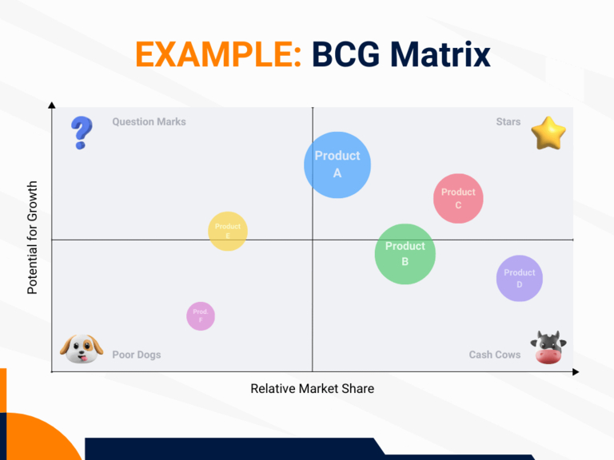

## What is portfolio management?

A portfolio bundles a portfolio of objects that are related to each other. These can be investment objects such as securities and real estate, for example, but also a company's project or product portfolio. Portfolio management therefore focuses on the **profitable compilation, management and further development of a portfolio**.

**Note**: The word portfolio (Latin for "leaf carrier", from _portare_ "to carry" and _folium_ "leaf") comes from the visual arts, where it refers to a folder containing special references and works. As early as the Renaissance, artists and architects used portfolios to apply for commissions and admission to academies. In its original meaning, the portfolio is still used today in the artistic and educational fields.

## Types of portfolio management

Below we take a look at the most important areas in which portfolio management has become established in business:

- **project portfolio management**
- **Product portfolio management**
- **IT / software portfolio management**
- **Portfolio management in the financial sector**

Portfolio management offers you numerous advantages in all areas.

### What advantages portfolio management has in store for you

- **Transparency**: Whether it's about projects, products, IT or finances: with a portfolio, you can keep track of the current status and create clarity about what is going on in your company. This prevents several employees from working on the same topics in parallel and without coordination.
- **Strategic consistency**: Why are we actually doing this? Portfolio management examines whether something is in line with the corporate strategy and contributes to the overarching objectives. This ensures that all activities in your company are coordinated and coherent overall.
- **Resource efficiency**: As resources such as budget, personnel and time are limited, you should use them efficiently. Portfolio management helps you to prioritize the issues in your company according to their strategic importance in order to achieve the best possible results.
- **Monitoring and control**: Key performance indicators, schedules and cost plans flow together in a portfolio so that you have all developments on screen, can recognize deviations immediately and react quickly to changes.

## Project portfolio management

Project portfolio management (PPM) is responsible for the **overarching management, planning and control of all projects** that are interrelated within a company. Above all, it aims to ensure that resources are optimally distributed and projects are prioritized in such a way that they best support the company's strategic goals. Project portfolio management is therefore a permanent task that is repeated cyclically and requires the evaluation of many projects. This is the biggest difference to normal [project management](), which usually ends with the completion of individual projects.

**Note**: In larger companies and public authorities, there is often a separate department for project portfolio management: the **Project Management Office (PMO)**.

### Important tasks and steps in project portfolio management

#### 1\. Identification of all projects

For portfolio management, it is essential that you gain an **overall overview of all projects** in your organization. In large organizations in particular, this allows you to avoid projects with similar objectives existing in parallel in several departments without your knowledge.

The first step is therefore to record **all current, planned and potential projects**. For each project, document the objectives, expected benefits, potential risks and estimated resource and time requirements in order to obtain a complete picture of the entire project portfolio.

#### 2\. Analysis and evaluation of projects

Portfolio management makes it easy to compare, analyze and evaluate current, planned and potential projects. For example, you can compare the **net cash values** of projects over a certain period of time. This allows you to determine the profitability of investments in relation to current expenditure and expected future income.

You can also use a **scoring model** to carry out a strategic evaluation of projects based on weighted criteria. This could look as follows:

You can also combine monetary and non-monetary analysis methods, for example in a **balanced scorecard**, to find out which projects are both financially worthwhile and contribute strategically to achieving the company's goals. Equally popular in this context is the **cost-benefit analysis**.

#### 3\. Resource allocation and prioritization of projects

Within a project portfolio, many projects compete for the **attention of management** and the **availability of resources**. You should therefore clarify in advance which strategic objectives have the highest priority for portfolio management. The overarching goals of your organization, your in-depth analysis and the urgency of the projects will result in a prioritization, which you can then use to determine **which projects are absolutely necessary and have priority over other projects**. These projects end up or remain in the portfolio and receive the most resources in terms of budget, personnel and time.

#### 4\. Communication and decision on project applications

One of your central tasks as a portfolio manager is to assess **proposed projects** according to whether and to what extent they can contribute to achieving the organizational goals and how many resources they would tie up. Because resources are usually limited, you have to weigh up which projects are preferable to others in project portfolio management. Once you have weighted the projects according to existing priorities, you make the decision whether to approve or reject **implementation of a project** and whether to schedule the project soon or put it on the back burner - a sensitive issue that can cause frustration among applicants. It is therefore important to communicate your decisions skillfully and give good reasons.

#### 5\. Monitoring the projects

The project portfolio never sleeps. Therefore, you must always keep a watchful eye to ensure that the projects remain in line with the company's objectives. Keep yourself informed about the **progress, costs and schedule of the projects** in regular status updates in order to identify deviations at an early stage and make adjustments if necessary. Special software solutions can be used to facilitate monitoring and reporting.

However, standard portfolio management software such as Microsoft Project, Asana or Jira can quickly become expensive. Try the **free alternative** from SeaTable:



[Here you can find out how to use SeaTable's project portfolio template to your advantage](https://seatable.io/vorlage/ajlptlawq6-nyxqwyjfujq/)

#### 6\. Quality, information and knowledge management

In the end, the decisive factor is whether the **quality of the projects** is right and whether they achieve the desired results with an appropriate use of resources. In particular, if you have a Project Management Office (PMO), you can establish **uniform standards for efficient project management** in your organization, which ensure that certain [project management methods](), processes and tools are applied. A PMO provides project managers with advice and support and takes on cross-project quality, information and knowledge management, for example with instructions, documentation and training.

## Product portfolio management

Product portfolio management is a strategic process in which a company optimizes its products, services or brands so that they remain successful and competitive in the long term. This involves regularly analyzing and adapting the **brand or product portfolio** so that it meets both current and future market requirements and customer needs.

### Important tasks and steps in product portfolio management

#### 1\. Inventory and analysis

The first step in product portfolio management is a detailed analysis of all existing products in the portfolio. A frequently used model for analysis is the **BCG matrix** from the Boston Consulting Group, which divides products into categories such as _Stars_, _Cash Cows_, _Question Marks_ and _Poor Dogs_ based on their market growth and market share.

A more advanced version of the BCG matrix, in which you evaluate your products based on their market attractiveness and competitive advantages, is the **McKinsey portfolio.** With a [SWOT analysis](https://seatable.io/vorlage/mldpcbsqsr2yifjof71qkg/) you can also identify strengths, weaknesses, opportunities and threats in order to make strategic decisions for individual products.

#### 2\. Strategic evaluation and goal setting

Based on the analysis, you define strategic goals for each product. This is where you decide which products your company should **promote, develop further, let run or take off the market**. You may also want to question the market positioning and value proposition of a product in order to adapt it to changing customer needs or market trends.

#### 3\. Resource allocation and prioritization

One of the most important tasks in portfolio management is the efficient allocation of resources such as **budget, personnel and time for marketing and product development**. You should prioritize products that you consider to be strategically important or have high growth potential. Products with lower growth potential or declining market share receive fewer resources or are removed from the product portfolio.

#### 4\. Product life cycle management

Every product goes through **different phases in the course of its life: Introduction, growth, maturity and decline**. Through strategic portfolio management, you ensure that your products contribute optimally to success in each phase. For example, products in the launch phase receive additional marketing resources, while you should minimize costs for products in decline.

#### 5\. Innovation and development of new products

In Product Portfolio Management, however, you can also identify **opportunities for new products** that could complement your existing product portfolio or promise success in other markets. In any case, a balanced portfolio should be present in different market segments in order to spread risks. Keep an eye on **trends and customer expectations** in order to exploit innovation potential in good time.

#### 6\. Continuous monitoring and adjustment

Product portfolio management, just like project portfolio management, is a **dynamic, repetitive process** that requires regular review and optimization. Market changes, new competitors, technological developments or changing customer needs can make adjustments necessary to ensure that your products always stay one step ahead of the competition.

## IT portfolio management

**IT portfolio management** (also known as IT asset management) offers the opportunity to manage a company's IT assets systematically and with foresight. The IT portfolio can be divided into three asset categories:

1. **Software**: all software applications, operating systems and tools used
1. **Hardware & infrastructure**: all devices, networks, servers and cloud services
1. **Projects & competencies**: all current and planned IT projects as well as the IT knowledge in the company

IT portfolio management should optimize these assets so that they best support the company's strategic goals and efficient operations. First and foremost, the **scalability, security and reliability of all IT systems** must be guaranteed.

### Important tasks and steps in IT portfolio management

#### 1\. Inventory and categorization

First of all, you should record all IT assets in your company and classify them into the categories mentioned above. As with the previous types of portfolio management, it is helpful to record additional data such as the cost or value of IT assets as part of the inventory. In addition, IT assets usually have a limited life cycle: for example, clarify when software licenses expire and what condition the hardware is in in order to gain a complete **overview of the IT portfolio**.

#### 2\. Evaluation and prioritization

You then analyze **the strategic importance, costs, benefits and possible risks** for each IT asset. Similar to project portfolio management, the benefits of IT investments cannot be evaluated solely in monetary terms. The assessment criteria are therefore both monetary and strategic in nature and are recorded using **cost-benefit analyses, scoring models, balanced scorecards or SWOT analyses**, for example. The highest priority in IT portfolio management is given to projects that are essential for continued operation.

#### 3\. Continuous monitoring and adjustment

Regularly review your IT portfolio to ensure it stays on track and meets business needs. Are there **innovative technologies** that will increase efficiency and give your company a competitive edge? Are there **changes in the market** or company that require adjustments? In order to make optimum use of resources such as budget, personnel and time in this dynamic environment, you must be able to react flexibly. Structured IT portfolio management makes it easier for you to decide which IT assets you should introduce, update, develop or migrate.

## Portfolio management in the financial sector

In the financial sector, portfolio management consists of managing and optimizing investments and assets in a portfolio. This involves **financial investments such as shares, bonds, funds, real estate or precious metals**. The aim of portfolio management is to make a strategic selection of assets in order to achieve the highest possible return** while minimizing risk through **balanced diversification\*\*.

In actively managed portfolios, the aim is to outperform the market rate of return according to agreed criteria in the interests of the investor by keeping an eye on the market and anticipating future developments in order to make **purchases and sales at exactly the right time**. A special form of this is real estate portfolio management.

### Real estate portfolio management

Whether you are a private owner, a company or a municipal housing association: if you own a large number of buildings and properties, it is not easy to **keep track of all the properties, rents and renovation measures**. To make your real estate portfolio management as easy as possible, you can use SeaTable's free template.



[Learn how to use SeaTable's real estate portfolio template to your advantage here](https://seatable.io/vorlage/ufyf6scpsgucxv8y0g9asw/)

Further information can be found either in the article [Property management](https://seatable.io/hausverwaltung/) for private owners or in the article [Property management](https://seatable.com/liegenschaftsverwaltung/) for companies and municipal bodies.

## Clear portfolio management with SeaTable

Whether project, product, IT or financial portfolio management - they all aim to manage a **portfolio profitably**. But depending on the size of your portfolio, this is not so easy. With SeaTable's free and user-friendly templates, you always have a strategic overview and all the data you need for well-founded analyses and decisions at your fingertips.

Would you like to use SeaTable as a portfolio management tool? Then [register today]() for free with your e-mail address.
