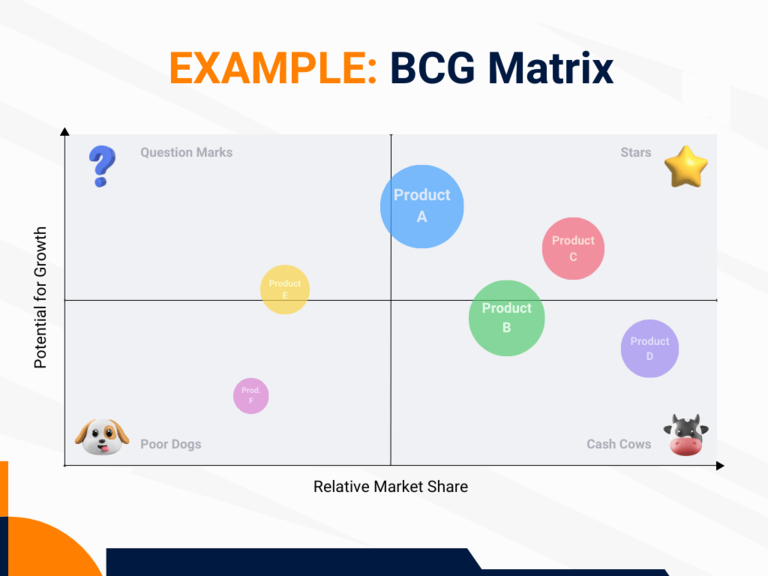
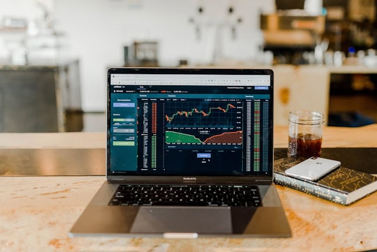

## ¿Qué es la gestión de carteras?

Una cartera agrupa un conjunto de objetos relacionados entre sí. Puede tratarse de objetos de inversión como valores y propiedades, por ejemplo, pero también de la cartera de proyectos o productos de una empresa. Por tanto, la gestión de carteras se centra en la **composición rentable, la gestión y el desarrollo posterior de una cartera**.

**Nota**: La palabra cartera (que en latín significa "portador de hojas", de _portare_ "llevar" y _folium_ "hoja") procede de las artes visuales, donde se refiere a una carpeta que contiene referencias y obras especiales. Ya en el Renacimiento, artistas y arquitectos utilizaban portafolios para solicitar encargos y ser admitidos en academias. En su significado original, el portafolio se sigue utilizando hoy en día en los ámbitos artístico y educativo.

## Tipos de gestión de carteras

A continuación echamos un vistazo a las áreas más importantes en las que la gestión de carteras se ha establecido en los negocios:

- **Gestión de carteras de proyectos**
- **Gestión de carteras de productos**
- **Gestión de carteras de TI / software**
- **Gestión de carteras en el sector financiero**

La gestión de carteras le ofrece numerosas ventajas en todos los ámbitos.

### ¿Qué ventajas le ofrece la gestión de carteras?

- **Transparencia**: Ya se trate de proyectos, productos, TI o finanzas: con una cartera, puede hacer un seguimiento del estado actual y crear claridad sobre lo que ocurre en su empresa. Esto evita que varios empleados trabajen en los mismos temas en paralelo y sin coordinación.
- **Coherencia estratégica**: ¿Por qué hacemos esto? La gestión de carteras examina si algo está en consonancia con la estrategia corporativa y contribuye a los objetivos generales. Así se garantiza que todas las actividades de la empresa estén coordinadas y sean coherentes en su conjunto.
- **Eficiencia de los recursos**: Dado que recursos como el presupuesto, el personal y el tiempo son limitados, hay que utilizarlos con eficiencia. La gestión de carteras le ayuda a priorizar los asuntos de su empresa en función de su importancia estratégica para lograr los mejores resultados posibles.
- **Seguimiento y control**: Los indicadores clave de rendimiento, los calendarios y los planes de costes fluyen juntos en una cartera para que tenga todos los avances en pantalla, pueda reconocer las desviaciones inmediatamente y reaccionar con rapidez a los cambios.

## Gestión de la cartera de proyectos

La gestión de la cartera de proyectos (PPM) se encarga de la **gestión global, la planificación y el control de todos los proyectos** interrelacionados de una empresa. Sobre todo, pretende garantizar que los recursos se distribuyan de forma óptima y que los proyectos se prioricen de tal manera que apoyen mejor los objetivos estratégicos de la empresa. La gestión de la cartera de proyectos es, por tanto, una tarea permanente que se repite cíclicamente y requiere la evaluación de muchos proyectos. Esta es la mayor diferencia con la [gestión de proyectos] normal (), que suele terminar con la finalización de proyectos individuales.

**Nota**: En las grandes empresas y administraciones públicas, suele existir un departamento independiente para la gestión de la cartera de proyectos: la **Oficina de Gestión de Proyectos (PMO)**.

### Tareas y pasos importantes en la gestión de la cartera de proyectos

#### 1\. Identificación de todos los proyectos

Es esencial para la gestión de la cartera que obtenga una **visión general de todos los proyectos** de su organización. En las grandes organizaciones, en particular, esto le permite evitar que proyectos con objetivos similares existan en paralelo en varios departamentos sin que usted los conozca.

El primer paso es, por tanto, registrar **todos los proyectos en curso, previstos y potenciales**. Para cada proyecto, documente los objetivos, los beneficios esperados, los riesgos potenciales y las necesidades estimadas de recursos y tiempo, a fin de obtener una imagen completa de toda la cartera de proyectos.

#### 2\. Analizar y evaluar los proyectos

Gracias a la gestión de carteras, es fácil comparar, analizar y evaluar los proyectos actuales, previstos y potenciales. Por ejemplo, puede comparar los **valores netos de caja** de los proyectos a lo largo de un periodo de tiempo determinado. Esto le permite determinar la rentabilidad de las inversiones en relación con los gastos actuales y los ingresos futuros previstos.

También puede utilizar un **modelo de puntuación** para llevar a cabo una evaluación estratégica de los proyectos basada en criterios ponderados. Podría ser el siguiente

También puede combinar métodos de análisis monetarios y no monetarios, por ejemplo en un **cuadro de mando integral**, para averiguar qué proyectos merecen la pena desde el punto de vista financiero y contribuyen estratégicamente a la consecución de los objetivos de la empresa. Igualmente popular en este contexto es el **análisis coste-beneficio**.

#### 3\. Asignación de recursos y priorización de proyectos

Dentro de una cartera de proyectos, muchos de ellos compiten por la **atención de la dirección** y la **disponibilidad de recursos**. Por lo tanto, debe aclarar de antemano qué objetivos estratégicos tienen la máxima prioridad para la gestión de la cartera. Los objetivos generales de su organización, su análisis en profundidad y la urgencia de los proyectos darán lugar a una priorización, que podrá utilizar para determinar **qué proyectos son absolutamente necesarios y tienen prioridad sobre otros proyectos**. Estos proyectos terminan o permanecen en la cartera y reciben la mayor cantidad de recursos en términos de presupuesto, personal y tiempo.

#### 4\. Comunicación y decisión sobre las solicitudes de proyectos

Una de tus tareas centrales como gestor de cartera es evaluar los **proyectos propuestos** en función de si pueden contribuir a alcanzar los objetivos de la organización y en qué medida, y de cuántos recursos ocuparían. Como los recursos suelen ser limitados, en la gestión de la cartera de proyectos hay que sopesar qué proyectos son preferibles a otros. Una vez que ha priorizado los proyectos, toma la decisión de aprobar o rechazar la **ejecución de un proyecto** y de programarlo pronto o dejarlo en un segundo plano, una cuestión delicada que puede causar frustración entre los candidatos. Por eso es importante comunicar sus decisiones con habilidad y dar buenas razones.

#### 5\. Seguimiento de los proyectos

La cartera de proyectos nunca duerme. Por lo tanto, debe estar siempre atento para asegurarse de que los proyectos se ajustan a los objetivos de la empresa. Proporcione actualizaciones periódicas del estado de los **progresos, costes y calendario de los proyectos** para reconocer las desviaciones en una fase temprana y hacer los ajustes necesarios. Pueden utilizarse soluciones informáticas especializadas para facilitar el seguimiento y la elaboración de informes.

Sin embargo, el software estándar de gestión de carteras, como Microsoft Project, Asana o Jira, puede resultar caro rápidamente. Pruebe la **alternativa gratuita** de SeaTable:



[Aquí puedes descubrir cómo utilizar la plantilla de cartera de proyectos de SeaTable en tu beneficio](https://seatable.io/es/vorlage/ajlptlawq6-nyxqwyjfujq/)

#### 6\. Gestión de la calidad, la información y el conocimiento

Al final, el factor decisivo es si la **calidad de los proyectos** es la adecuada y si consiguen los resultados deseados con un uso apropiado de los recursos. En particular, si dispone de una Oficina de Gestión de Proyectos (PMO), puede establecer **normas uniformes para una gestión eficaz de los proyectos** en su organización, que garanticen la aplicación de determinados [métodos de gestión de proyectos](https://seatable.com/es/projektmanagement-methoden/), procesos y herramientas. Una PMO ofrece a los gestores de proyectos asesoramiento y apoyo y se encarga de la gestión de la calidad, la información y el conocimiento entre proyectos, por ejemplo con instrucciones, documentación y formación.

## Gestión de la cartera de productos

La gestión de la cartera de productos es un proceso estratégico en el que una empresa optimiza sus productos, servicios o marcas para que sigan siendo exitosos y competitivos a largo plazo. Esto implica analizar y adaptar periódicamente la **cartera de marcas o productos** para que satisfaga los requisitos actuales y futuros del mercado y las necesidades de los clientes.

### Tareas y pasos importantes en la gestión de la cartera de productos

#### 1\. Inventario y análisis

El primer paso en la gestión de la cartera de productos es un análisis detallado de todos los productos existentes en la cartera. Un modelo de análisis muy utilizado es la **matriz BCG** del Boston Consulting Group, que clasifica los productos en función de su crecimiento y cuota de mercado en categorías como _Stars_, _Cash Cows_, _Question Marks_ y _Poor Dogs_.

Una versión más avanzada de la matriz BCG, en la que usted evalúa sus productos en función de su atractivo en el mercado y sus ventajas competitivas, es la **cartera McKinsey.** Con un [análisis DAFO](https://seatable.io/es/vorlage/mldpcbsqsr2yifjof71qkg/) también puede identificar puntos fuertes, puntos débiles, oportunidades y amenazas con el fin de tomar decisiones estratégicas para productos individuales.

#### 2\. Evaluación estratégica y fijación de objetivos

Basándose en el análisis, defina objetivos estratégicos para cada producto. Aquí es donde decide qué productos debe su empresa **promover, seguir desarrollando, dejar correr o retirar del mercado**. También puede examinar el posicionamiento en el mercado y la propuesta de valor de un producto para adaptarlo a las necesidades cambiantes de los clientes o a las tendencias del mercado.

#### 3\. Asignación de recursos y priorización

Una de las tareas más importantes de la gestión de carteras es la asignación eficaz de recursos como **presupuesto, personal y tiempo para el marketing y el desarrollo de productos**. Debe dar prioridad a los productos que considere estratégicamente importantes o que tengan un alto potencial de crecimiento. Los productos con menor potencial de crecimiento o cuota de mercado decreciente reciben menos recursos o se eliminan de la cartera de productos.

#### 4\. Gestión del ciclo de vida del producto

Todo producto pasa por **diferentes fases a lo largo de su vida: Introducción, crecimiento, madurez y declive**. Mediante la gestión estratégica de la cartera, usted se asegura de que sus productos contribuyen de forma óptima al éxito en cada fase. Por ejemplo, los productos en fase de lanzamiento reciben recursos de marketing adicionales, mientras que debe minimizar los costes de los productos en declive.

#### 5\. Innovación y desarrollo de nuevos productos

En la gestión de la cartera de productos, sin embargo, también se pueden identificar **oportunidades para nuevos productos** que podrían complementar la cartera de productos existente o prometer éxito en otros mercados. En cualquier caso, una cartera equilibrada debe estar presente en diferentes segmentos del mercado para repartir los riesgos. No pierda de vista las **tendencias y expectativas de los clientes** para aprovechar a tiempo el potencial de innovación.

#### 6\. Seguimiento y ajuste continuos

Al igual que la gestión de la cartera de proyectos, la gestión de la cartera de productos es un **proceso dinámico y repetitivo** que requiere una revisión y optimización periódicas. Los cambios en el mercado, los nuevos competidores, los avances tecnológicos o la evolución de las necesidades de los clientes pueden hacer necesarios ajustes para que sus productos vayan siempre un paso por delante de la competencia.

## Gestión de la cartera de TI

La gestión de la cartera de TI\*\* (también conocida como gestión de activos de TI) ofrece la oportunidad de gestionar los activos de TI de una empresa de forma sistemática y previsora. La cartera de TI puede dividirse en tres categorías de activos:

1. **Software**: todas las aplicaciones de software, sistemas operativos y herramientas utilizadas.
1. **hardware e infraestructura**: todos los dispositivos, redes, servidores y servicios en la nube
1. **Proyectos y conocimientos especializados**: todos los proyectos informáticos actuales y previstos, así como los conocimientos informáticos de la empresa

La gestión de la cartera de TI debe optimizar estos activos para que respalden mejor los objetivos estratégicos y las operaciones eficientes de la empresa. Ante todo, debe garantizarse la **escalabilidad, seguridad y fiabilidad de todos los sistemas informáticos**.

### Tareas y pasos importantes en la gestión del portafolio de TI

#### 1\. Inventario y categorización

En primer lugar, debe registrar todos los activos informáticos de su empresa y categorizarlos como se ha descrito anteriormente. Al igual que en los tipos anteriores de gestión de carteras, resulta útil registrar datos adicionales como el coste o el valor de los activos informáticos a la hora de hacer inventario. Además, los activos informáticos suelen tener un ciclo de vida limitado: por ejemplo, aclare cuándo caducan las licencias de software y en qué estado se encuentra el hardware para obtener una **visión completa de la cartera informática**.

.

#### 2\. Evaluación y priorización

A continuación se analiza **la importancia estratégica, los costes, los beneficios y los posibles riesgos** de cada activo informático. Al igual que en la gestión de la cartera de proyectos, los beneficios de las inversiones en TI no pueden evaluarse únicamente en términos monetarios. Por lo tanto, los criterios de evaluación son de naturaleza tanto monetaria como estratégica y se registran mediante **análisis coste-beneficio, modelos de puntuación, cuadros de mando integral o análisis DAFO**, por ejemplo. En la gestión de la cartera de TI se da la máxima prioridad a los proyectos que son esenciales para la continuidad del funcionamiento.

#### 3\. Seguimiento y ajuste continuos

Examine periódicamente su cartera de TI para asegurarse de que se mantiene en el buen camino y satisface las necesidades de la empresa. ¿Existen **tecnologías innovadoras** que aumenten la eficacia y den a su organización una ventaja competitiva? ¿Hay **cambios en el mercado** o en la empresa que requieran ajustes? Para optimizar el uso de recursos como el presupuesto, el personal y el tiempo en este entorno dinámico, debe ser capaz de reaccionar con flexibilidad. Una gestión estructurada de la cartera de TI le facilita decidir qué activos informáticos debe introducir, actualizar, desarrollar o migrar.

## Gestión de carteras en el sector financiero

En el sector financiero, la gestión de carteras consiste en gestionar y optimizar las inversiones y los activos de una cartera. Se trata de **inversiones financieras como acciones, obligaciones, fondos, inmuebles o metales preciosos**. El objetivo de la gestión de carteras es realizar una selección estratégica de activos para lograr la **mayor rentabilidad posible** minimizando el riesgo mediante una **diversificación equilibrada**.

En las carteras gestionadas activamente, el objetivo es superar la tasa de rentabilidad del mercado según criterios acordados en interés del inversor, vigilando el mercado y anticipando la evolución futura para realizar **compras y ventas exactamente en el momento adecuado**. Una forma especial es la gestión de carteras inmobiliarias.

### Gestión de carteras inmobiliarias

Ya sea un propietario privado, una empresa o una asociación municipal de la vivienda: si posee un gran número de edificios y propiedades, no es fácil mantener una **visión general de todas las propiedades, alquileres y medidas de renovación**. Para facilitar al máximo la gestión de su cartera de inmuebles, puede utilizar la plantilla gratuita de SeaTable.



[Aprenda a utilizar la plantilla de cartera de propiedades de SeaTable en su beneficio aquí](https://seatable.io/es/vorlage/ufyf6scpsgucxv8y0g9asw/)

Encontrará más información en el artículo [Gestión de la propiedad](https://seatable.io/es/hausverwaltung/) para propietarios privados o en el artículo [Gestión de la propiedad](https://seatable.com/es/liegenschaftsverwaltung/) para empresas y organizaciones municipales.

## Gestión clara de la cartera con SeaTable

Ya se trate de la gestión de carteras de proyectos, productos, TI o finanzas, todas ellas tienen como objetivo gestionar una **cartera de forma rentable**. Sin embargo, dependiendo del tamaño de su cartera, esto no es tan fácil. Con las plantillas gratuitas y fáciles de usar de SeaTable, siempre tendrá a mano una visión estratégica y todos los datos que necesita para realizar análisis y tomar decisiones bien fundamentadas.

¿Le gustaría utilizar SeaTable como herramienta de gestión de carteras? Entonces [regístrese hoy]() de forma gratuita con su dirección de correo electrónico.
