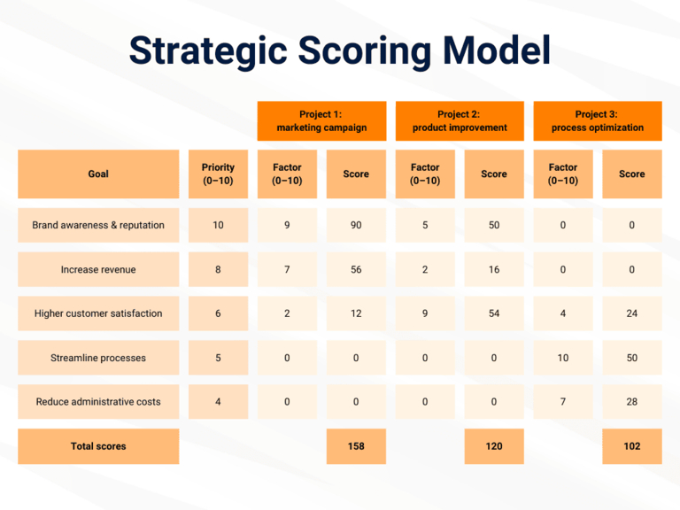

## Qu'est-ce que la gestion de portefeuille ?

Un portefeuille regroupe un ensemble d'objets qui sont en relation les uns avec les autres. Il peut s'agir par exemple d'objets de placement tels que des titres et des biens immobiliers, mais aussi du portefeuille de projets ou de produits d'une entreprise. La gestion de portefeuille consiste donc à **composer, gérer et développer un portefeuille de manière rentable**.

**Remarque** : Le mot portfolio (du latin "support de feuilles", de _portare_ "porter" et _folium_ "feuille") vient des arts plastiques, où il désigne un dossier de collection dans lequel se trouvent des références et des œuvres particulières. Dès la Renaissance, les artistes et les architectes se servaient d'un portfolio pour obtenir des commandes et être admis dans les académies. Dans son sens originel, le portfolio est encore utilisé aujourd'hui dans le domaine artistique et pédagogique.

## Types de gestion de portefeuille

Nous allons maintenant jeter un coup d'œil sur les principaux domaines dans lesquels la gestion de portefeuille s'est établie dans l'économie :

- **gestion de portefeuille de projets**.
- **gestion de portefeuille de produits**.
- **Gestion de portefeuille IT / logiciels**.
- **Gestion de portefeuille dans le domaine financier**.

Dans ce contexte, la gestion de portefeuille vous offre de nombreux avantages dans tous les domaines.

### Les avantages de la gestion de portefeuille pour vous

- **Transparence** : Qu'il s'agisse de projets, de produits, d'informatique ou de finances, un portefeuille vous permet de garder une vue d'ensemble de l'état actuel et de clarifier ce qui se passe dans votre entreprise. Ainsi, il n'est pas possible que plusieurs collaborateurs travaillent en parallèle et sans concertation sur les mêmes sujets.
- **Cohérence stratégique** : Pourquoi faisons-nous cela ? La gestion de portefeuille se demande si quelque chose est en accord avec la stratégie de l'entreprise et s'il contribue aux objectifs supérieurs. Vous vous assurez ainsi que toutes les activités de votre entreprise se déroulent de manière coordonnée et sont globalement cohérentes.
- **Efficacité des ressources** : Les ressources telles que le budget, le personnel et le temps étant limitées, vous devez les utiliser efficacement. La gestion de portefeuille vous aide à prioriser les préoccupations de votre entreprise en fonction de leur importance stratégique afin d'obtenir les meilleurs résultats possibles.
- **Suivi et contrôle** : Un portefeuille regroupe les indicateurs de réussite, les calendriers et les budgets, ce qui vous permet de garder un œil sur tous les développements, d'identifier immédiatement les écarts et de réagir rapidement aux changements.

## Gestion de portefeuille de projets

La gestion de portefeuille de projets (PPM) prend en charge la **gestion, la planification et le pilotage de tous les projets** qui sont liés entre eux au sein d'une entreprise. Elle doit avant tout permettre de répartir les ressources de manière optimale et de prioriser les projets de façon à ce qu'ils soutiennent au mieux les objectifs stratégiques de l'entreprise. La gestion de portefeuille de projets est donc une tâche permanente, qui se répète de manière cyclique et qui nécessite l'évaluation de nombreux projets. C'est la principale différence avec la [gestion de projet]() normale, qui se termine généralement par l'achèvement de projets individuels.

**Remarque** : Dans les grandes entreprises et les administrations, il existe souvent un service spécifique pour la gestion du portefeuille de projets : le **Project Management Office (PMO)**.

### Tâches et étapes importantes de la gestion de portefeuille de projets

#### 1\. Identification de tous les projets

Pour la gestion de portefeuille, il est essentiel que vous ayez une **vue d'ensemble de tous les projets** dans votre organisation. Cela vous permet d'éviter, surtout dans les grandes organisations, que des projets ayant des objectifs comparables existent en parallèle dans plusieurs départements sans que vous le sachiez.

Dans un premier temps, vous recensez donc **tous les projets en cours, planifiés et potentiels**. Pour chaque projet, documentez les objectifs, les avantages escomptés, les risques éventuels ainsi que les ressources et le temps estimés nécessaires afin d'obtenir une image complète de l'ensemble du portefeuille de projets.

#### 2\. Analyse et évaluation des projets

Grâce à la gestion de portefeuille, il est facile de comparer, d'analyser et d'évaluer les projets en cours, planifiés et potentiels. Vous pouvez par exemple comparer les **valeurs nettes en espèces** des projets sur une période donnée. Vous déterminez ainsi la rentabilité des investissements par rapport aux dépenses actuelles et aux revenus futurs escomptés.

A l'aide d'un **modèle de scoring**, vous pouvez également procéder à une évaluation stratégique des projets sur la base de critères pondérés. Cela pourrait se présenter comme suit :

.

En outre, vous pouvez combiner des méthodes d'analyse monétaires et non monétaires, par exemple dans un **balanced scorecard**, afin de déterminer quels projets sont à la fois rentables financièrement et contribuent stratégiquement à la réalisation des objectifs de l'entreprise. L'analyse coûts-bénéfices est tout aussi populaire dans ce contexte.

#### 3\. Allocation des ressources et priorisation des projets

Au sein d'un portefeuille de projets, de nombreux projets se disputent l'**attention de la direction** et la **disponibilité des ressources**. C'est pourquoi vous devez déterminer au préalable quels objectifs stratégiques sont les plus importants pour la gestion du portefeuille. Les objectifs généraux de votre organisation, votre analyse fondée et l'urgence des projets donnent lieu à une hiérarchisation qui vous permet ensuite de déterminer **les projets qui sont absolument nécessaires et qui ont la priorité sur les autres**. Ces projets atterrissent ou restent dans le portefeuille et reçoivent le plus de ressources en termes de budget, de personnel et de temps.

#### 4\. Communication et décision sur les demandes de projets

L'une de vos tâches principales en tant que gestionnaire de portefeuille consiste à **évaluer les projets demandés** en fonction de leur capacité à contribuer à la réalisation des objectifs de l'organisation et de la quantité de ressources qu'ils mobiliseraient. Comme les ressources sont généralement limitées, vous devez évaluer quels projets sont préférables à d'autres dans la gestion de portefeuille de projets. Une fois que vous avez pondéré les projets en fonction des priorités existantes, vous prenez la décision d'approuver ou de refuser la **réalisation d'un projet** et de planifier le projet rapidement ou de le reporter à plus tard - un sujet délicat qui peut être source de frustration pour les demandeurs. Il est donc important de communiquer habilement vos décisions et de bien les justifier.

#### 5\. Suivi des projets

Le portefeuille de projets ne dort pas. C'est pourquoi vous devez vous aussi garder un œil attentif pour vous assurer que les projets restent en phase avec les objectifs de l'entreprise. Informez-vous régulièrement sur l'état d'avancement, les coûts et le calendrier des projets\*\*, afin de détecter rapidement les écarts et de procéder à des ajustements si nécessaire. Des solutions logicielles spécifiques peuvent être utilisées à cet effet pour faciliter le suivi et l'établissement de rapports.

Les logiciels de gestion de portefeuille habituels tels que Microsoft Project, Asana ou Jira peuvent toutefois vite coûter cher. Testez l'alternative **gratuite** de SeaTable :



[Découvrez comment tirer profit du modèle de portefeuille de projets de SeaTable](https://seatable.io/vorlage/ajlptlawq6-nyxqwyjfujq/)

#### 6\. Gestion de la qualité, de l'information et des connaissances

Au final, ce qui compte, c'est de savoir si la **qualité des projets** est bonne et s'ils atteignent les résultats souhaités avec une utilisation appropriée des ressources. En particulier, si vous disposez d'un Project Management Office (PMO), vous pouvez établir dans votre organisation **des normes uniformes pour une gestion de projet efficace**, qui garantissent l'application de certaines [méthodes de gestion de projet](), de processus et d'outils. Un PMO assiste les chefs de projet en leur prodiguant des conseils et en prenant en charge la gestion de la qualité, de l'information et des connaissances pour l'ensemble du projet, par exemple en leur fournissant des instructions, de la documentation et des formations.

## Gestion du portefeuille de produits

La gestion du portefeuille de produits est un processus stratégique par lequel une entreprise optimise ses produits, services ou marques de manière à ce qu'ils restent performants et compétitifs à long terme. Il s'agit d'analyser et d'adapter régulièrement le **portefeuille de marques ou de produits** afin qu'il réponde aux exigences du marché et aux besoins des clients, tant actuels que futurs.

### Tâches et étapes importantes de la gestion du portefeuille de produits

#### 1\. Inventaire et analyse

La première étape de la gestion du portefeuille de produits est une analyse détaillée de tous les produits existants dans le portefeuille. Un modèle souvent utilisé pour l'analyse est la **MatriceBCG** du Boston Consulting Group, qui classe les produits dans des catégories telles que _Stars_, _Cash Cows_, _Question Marks_ et _Poor Dogs_ sur la base de leur croissance et de leur part de marché.

Une version plus élaborée de la matrice BCG, dans laquelle vous évaluez vos produits en fonction de leur attractivité sur le marché et de leurs avantages concurrentiels, est le **portefeuille McKinsey.** Une [analyse SWOT](https://seatable.io/vorlage/mldpcbsqsr2yifjof71qkg/) vous permet en outre d'identifier les forces, les faiblesses, les opportunités et les menaces afin de prendre des décisions stratégiques pour des produits individuels.

#### 2\. Évaluation stratégique et définition des objectifs

Sur la base de l'analyse, vous définissez des objectifs stratégiques pour chaque produit. Vous décidez ici quels produits votre entreprise doit **promouvoir, développer, laisser fonctionner ou retirer du marché**. Vous devriez éventuellement aussi remettre en question le positionnement sur le marché et la proposition de valeur d'un produit afin de l'adapter à l'évolution des besoins des clients ou des tendances du marché.

#### 3\. Allocation des ressources et définition des priorités

L'une des tâches les plus importantes de la gestion de portefeuille consiste à allouer efficacement les ressources telles que **le budget, le personnel et le temps pour le marketing et le développement de produits**. Les produits que vous considérez comme stratégiques ou à fort potentiel de croissance doivent être promus en priorité. Les produits dont le potentiel de croissance est plus faible ou dont la part de marché diminue se voient attribuer moins de ressources ou sont éliminés du portefeuille de produits.

#### 4\. Gestion du cycle de vie des produits

Au cours de sa vie, chaque produit passe par **différentes phases : Lancement, croissance, maturité et déclin**. Grâce à une gestion stratégique du portefeuille, vous veillez à ce que vos produits contribuent de manière optimale au succès à chaque phase. Par exemple, les produits en phase de lancement bénéficient de ressources marketing supplémentaires, tandis que vous devez minimiser les coûts des produits en déclin.

#### 5\. Innovation et développement de nouveaux produits

Dans la gestion du portefeuille de produits, vous pouvez également **identifier les opportunités de nouveaux produits** qui pourraient compléter votre portefeuille de produits existant ou qui pourraient avoir du succès sur d'autres marchés. De toute façon, un portefeuille équilibré doit être présent dans différents segments de marché afin de répartir les risques. Gardez un œil sur les **tendances et les attentes des clients** afin d'exploiter à temps les potentiels d'innovation.

#### 6\. Surveillance et adaptation continues

La gestion du portefeuille de produits, tout comme la gestion du portefeuille de projets, est un **processus dynamique et répétitif** qui nécessite un contrôle et une optimisation réguliers. Les changements sur le marché, les nouveaux concurrents, les développements technologiques ou l'évolution des besoins des clients peuvent nécessiter des adaptations pour que vos produits gardent toujours une longueur d'avance sur la concurrence.

## Gestion de portefeuille informatique

La **gestion de portefeuille informatique** (également appelée IT Asset Management) offre la possibilité de gérer les actifs informatiques d'une entreprise de manière systématique et prévisionnelle. A cet égard, le portefeuille informatique peut être divisé en trois catégories d'actifs :

1. **Logiciel** : toutes les applications logicielles, les systèmes d'exploitation et les outils utilisés.
1. **Matériel & infrastructure** : tous les appareils, réseaux, serveurs et services en nuage.
1. **Projets & compétences** : tous les projets informatiques en cours et planifiés ainsi que les connaissances informatiques au sein de l'entreprise.

La gestion du portefeuille informatique doit optimiser ces actifs de manière à ce qu'ils soutiennent au mieux les objectifs stratégiques et le fonctionnement efficace de l'entreprise. Pour cela, il faut en premier lieu garantir **l'évolutivité, la sécurité et la fiabilité de tous les systèmes informatiques**.

### Tâches et étapes importantes de la gestion du portefeuille informatique

#### 1\. Inventaire et catégorisation

Tout d'abord, vous devez recenser tous les actifs informatiques de votre entreprise et les classer dans les catégories mentionnées ci-dessus. Comme pour les types de gestion de portefeuille précédents, il est utile de noter dès l'inventaire d'autres données telles que le coût ou la valeur des actifs informatiques. En outre, les actifs informatiques ont généralement un cycle de vie limité : clarifiez par exemple la date d'expiration des licences logicielles et l'état du matériel afin d'obtenir une **vue d'ensemble complète du portefeuille informatique**.

#### 2\. Évaluation et hiérarchisation

Ensuite, vous analysez pour chaque actif informatique **l'importance stratégique, les coûts, les avantages et les risques éventuels**. Comme dans la gestion de portefeuille de projets, l'utilité des investissements informatiques ne peut pas être évaluée uniquement en termes monétaires. C'est pourquoi les critères d'évaluation sont à la fois monétaires et stratégiques et sont saisis par exemple à l'aide d'**analyses coûts/bénéfices, de modèles de scoring, de tableaux de bord équilibrés ou d'analyses SWOT**. La priorité la plus élevée dans la gestion du portefeuille informatique est accordée aux projets qui sont indispensables à la poursuite de l'exploitation.

#### 3\. Surveillance et adaptation continues

Passez régulièrement votre portefeuille informatique au crible pour vous assurer qu'il maintient le cap et répond aux besoins de l'entreprise. Existe-t-il des **technologies innovantes** qui améliorent l'efficacité et promettent un avantage concurrentiel à votre entreprise ? Y a-t-il des **changements sur le marché** ou dans l'entreprise qui nécessitent des adaptations ? Pour utiliser au mieux les ressources telles que le budget, le personnel et le temps dans cet environnement dynamique, vous devez pouvoir réagir de manière flexible. Une gestion structurée du portefeuille informatique vous aide à décider quels actifs informatiques vous devez introduire, mettre à jour, développer ou migrer.

## Gestion de portefeuille dans le domaine financier

Dans le domaine financier, la gestion de portefeuille consiste à gérer et à optimiser les investissements et les actifs dans un portefeuille. Il s'agit de **placements financiers tels que des actions, des obligations, des fonds, des biens immobiliers ou des métaux précieux**. L'objectif de la gestion de portefeuille est de faire un choix stratégique d'actifs afin d'obtenir un **rendement le plus élevé possible**, tout en minimisant les risques grâce à une **diversification équilibrée**.

Dans les portefeuilles gérés activement, on essaie, selon des critères convenus et dans l'intérêt de l'investisseur, de dépasser le rendement habituel du marché en gardant un œil sur le marché et en anticipant les évolutions futures afin de **procéder à des achats et à des ventes exactement au bon moment**. La gestion de portefeuille immobilier en est une forme particulière.

### Gestion de portefeuille immobilier

Que vous soyez un propriétaire privé, une entreprise ou une société de logement communale, si vous possédez un grand nombre de bâtiments et de terrains, il n'est pas facile de garder une **vue d'ensemble de tous les biens immobiliers, des loyers et des mesures de rénovation**. Pour vous faciliter au maximum la gestion de votre portefeuille immobilier, vous pouvez utiliser le modèle gratuit de SeaTable.



[Découvrez comment utiliser le modèle de portefeuille immobilier de SeaTable pour en tirer profit](https://seatable.io/vorlage/ufyf6scpsgucxv8y0g9asw/)

Pour plus d'informations, consultez soit l'article [Gestion immobilière](https://seatable.io/hausverwaltung/) pour les propriétaires privés, soit l'article [Gestion immobilière](https://seatable.com/liegenschaftsverwaltung/) pour les entreprises et les collectivités locales.

## Gestion de portefeuille claire avec SeaTable

Qu'il s'agisse de la gestion de portefeuille de projets, de produits, de technologies de l'information ou de finances, elles ont toutes pour objectif de gérer un **portefeuille de manière rentable**. Mais selon la taille de votre portefeuille, ce n'est pas si facile. Les modèles gratuits et faciles à utiliser de SeaTable vous permettent de garder une vue d'ensemble stratégique et de disposer de toutes les données dont vous avez besoin pour effectuer des analyses et prendre des décisions en connaissance de cause.

Vous souhaitez utiliser SeaTable comme outil de gestion de portefeuille ? Alors [inscrivez-vous dès aujourd'hui]() gratuitement avec votre adresse e-mail.
