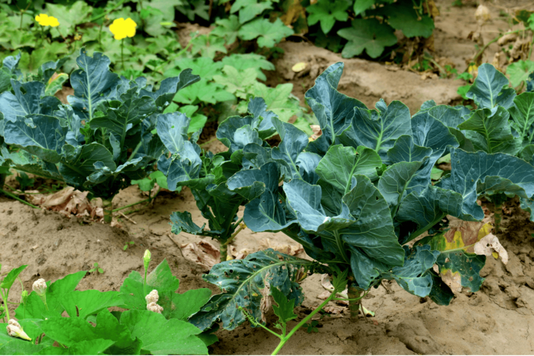
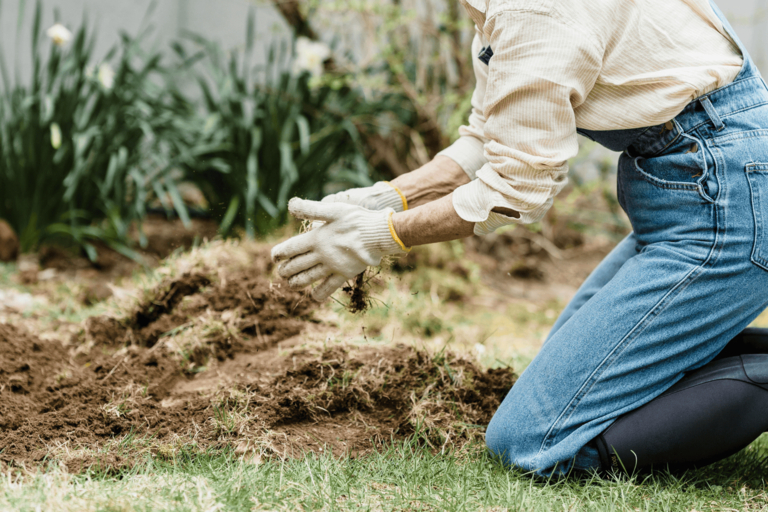
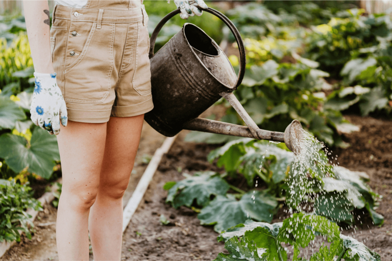
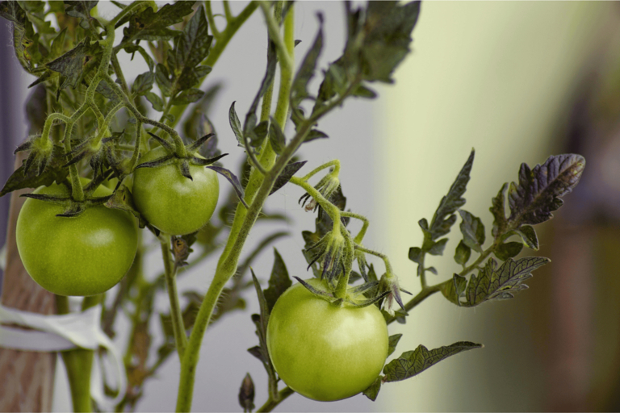
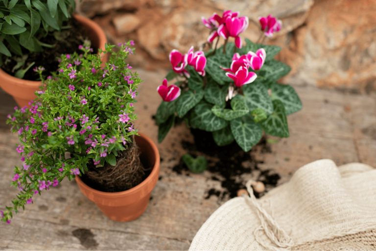
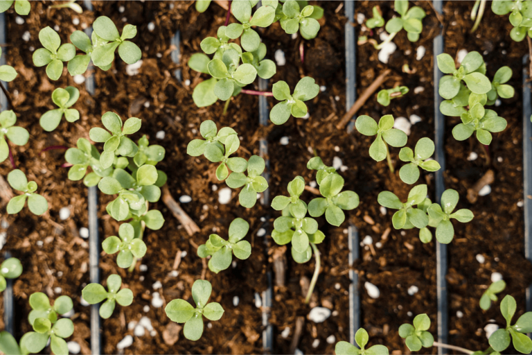

## Un plan de plantación para camas exitosas

Si empieza a planificar sus arriates en primavera, puede verse abrumado rápidamente. No es tan fácil mantener una visión de conjunto entre el plan de plantación, la rotación de cultivos y el cultivo mixto. ¿Qué plantas van juntas? ¿Qué debes plantar después de los tomates, las patatas o las judías? ¿Y cómo evitar que el suelo se agote con el tiempo?

Tanto si se trata de un plan de plantación para bancales elevados, como para bancales de hortalizas o plantas perennes, una planificación inteligente tiene muchas ventajas. En este artículo aprenderá cómo llevar a cabo una rotación de cultivos bien pensada, qué combinaciones han dado buenos resultados y cómo las ayudas digitales como SeaTable le facilitan la organización.

## ¿Por qué es importante un plan de siembra?

Un huerto de éxito no empieza con la primera semilla en la tierra, sino con un plan de plantación bien pensado. **Sin planificación, el suelo puede agotarse rápidamente**, lo que afectará al crecimiento de las plantas a largo plazo. Plantar los mismos cultivos en el mismo lugar todos los años también favorece la proliferación de plagas y enfermedades. La rotación de cultivos adecuada contrarresta esta situación: garantiza que el suelo no se agote unilateralmente, sino que pueda recuperarse.

Un plan de plantación bien pensado no sólo hace que el huerto sea más productivo, sino también más fácil de cuidar. Coordine con sensatez plantas con necesidades de nutrientes similares y utilice cultivos mixtos que puedan mantener alejadas las plagas de forma natural. Pero, ¿cómo es en realidad una rotación de cultivos bien pensada? Eso es exactamente lo que explicaremos a continuación.

## Fundamentos de la rotación de cultivos

Rotación de cultivos significa que las plantas de un bancal no crecen todos los años en el mismo sitio, sino que van rotando en un orden determinado. La razón principal de la rotación de cultivos es **optimizar el uso de nutrientes en el suelo y evitar enfermedades y plagas** que, de lo contrario, podrían acumularse a lo largo de los años. La rotación de cultivos tradicional organiza las plantas en función de sus necesidades de nutrientes:

- **Los cultivos de alto rendimiento** extraen muchos nutrientes del suelo.
- **Los cultivos de rendimiento medio** necesitan menos nutrientes que los cultivos de alto rendimiento.
- **Los cultivos débiles** se las arreglan con pocos nutrientes.
- **Las enmiendas del suelo** enriquecen el suelo con nutrientes, especialmente nitrógeno.  

El truco consiste en **rotar las plantas** en los bancales en un ciclo de 3 a 4 años. Esto mantiene la fertilidad del suelo y permite reducir el uso de abonos. También ayuda a mantener a raya las plagas y enfermedades de las plantas, ya que sus plantas huésped favoritas no crecen permanentemente en el mismo lugar.

Nota\*\*: Lógicamente, en el plan de plantación se puede prever un arriate siempre florido sin ninguna rotación de cultivos. Si desea crear un plan de plantación para su arriate de flores perennes, debe asegurarse de combinar plantas con diferentes épocas de floración para equilibrar la absorción de nutrientes a lo largo de la temporada. Por ejemplo, un plan de plantación para un arriate perenne (soleado y seco) puede incluir lavanda, salvia y milenrama, mientras que un plan de plantación para hortensias en el diseño del arriate debe incluir tierra rica en humus y húmeda \_.

## Consejos para crear su propio plan de plantación

Para que la rotación de cultivos de hortalizas funcione, necesitas un plan claro. Siga estos pasos para que funcione:

1. **Divide y documenta los bancales**: Determina cuántas camas o zonas de cultivo tienes. Lo mejor es numerarlos o crear un esquema, digitalmente en una pizarra.
1. **Agrupa las plantas según sus necesidades de nutrientes**: Clasifica tus hortalizas en plantas que se alimentan mucho, que se alimentan medianamente, que se alimentan poco y que mejoran el suelo. Así sabrás qué plantas deben crecer, cuándo y dónde.
1. **Determina el principio de rotación**: Un sistema sencillo es el cultivo en 4 parcelas, en el que las plantas se desplazan una hilera de bancales más cada año. A continuación se explica el procedimiento exacto.
1. **Considerar el cultivo mixto**: No todas las plantas se llevan igual de bien. Por lo tanto, integra plantas compañeras que se refuercen mutuamente, como zanahorias y cebollas, ya que las cebollas mantienen alejadas a las moscas de las zanahorias.
1. **Registra el plan de plantación y ajústalo anualmente**: Documente la secuencia de plantación para evitar errores y optimizarla. Las herramientas digitales como SeaTable te ayudan a llevar un seguimiento.

## Ejemplos prácticos de rotación eficaz de cultivos en su huerto

Una buena rotación de cultivos de fresas y otras plantas es fácil de poner en práctica si divides los bancales con sensatez y combinas las plantas adecuadas. Aquí tienes algunos ejemplos de diferentes tamaños de bancales y necesidades que muestran cómo funciona la rotación a lo largo de varios años.

### Ejemplo 1: Cultivo clásico en 4 bancales.

Este sistema es especialmente adecuado para huertos grandes con varios bancales. Cada año, las plantas rotan una posición más, de modo que el suelo nunca se sobrecarga. En el quinto año, el ciclo vuelve a empezar, lo que significa, por ejemplo, que después de las judías en la rotación de cultivos, es el turno de las plantas de gran consumo, como las patatas.

- **Año 1**: Cultivos de alto rendimiento (por ejemplo, patatas, tomates, coles, calabazas)
- **Año 2**: Cultivos de consumo medio (por ejemplo, zanahorias, cebollas, espinacas, pimientos)
- **Año 3**: Cultivos débiles (por ejemplo, rábanos, hierbas aromáticas, canónigos, guisantes)
- **Año 4**: Mejoradores del suelo (por ejemplo, judías, trébol, phacelia, abono verde)

### Ejemplo 2: Plantar arriates elevados (plan anual)

No todo el mundo tiene espacio para cuatro bancales grandes. Pero incluso en una superficie pequeña, puedes utilizar la rotación de cultivos dividiendo el bancal en secciones o utilizando cultivos mixtos. Un plan de plantación de arriates elevados para principiantes debe incluir cultivos sencillos que requieran pocos cuidados y se adapten bien a la rotación gradual de cultivos. Un plan sensato de plantación en bancales elevados te ayudará a aprovechar al máximo el espacio y a maximizar el rendimiento.

- **Año 1**: Tomates y albahaca + rábanos para rellenar los huecos
- **Año 2**: Zanahorias y cebollas (buen cultivo mixto contra las plagas)
- **Año 3**: Espinacas y lechugas como cultivos débiles
- **Año 4**: Frijoles para el enriquecimiento de nitrógeno, entonces el ciclo comienza de nuevo

### Ejemplo 3: Rotación de cultivos para horticultores de balcón (plan anual)

La rotación de cultivos también puede aplicarse, por ejemplo, en las jardineras de los balcones. En este caso, el objetivo principal es mantener el suelo fértil renovando regularmente el sustrato o añadiendo compost.

- **Año 1**: Pimientos y tomates con albahaca como planta de compañía
- **Año 2**: Zanahorias o lechugas como cultivo central
- **Año 3**: Hierbas aromáticas como el tomillo, la menta o el perejil como plantas de crecimiento débil.
- **Año 4**: Judías o trébol como enmiendas del suelo

## Soporte digital: Crear un plan de plantación con SeaTable

Si cada año se anota a mano qué se ha plantado y dónde, se puede perder rápidamente la cuenta. Aquí es exactamente donde la [plataforma sin código](https://seatable.com/es) SeaTable puede ayudarle: una solución digital que le permite gestionar sus planes de plantación de forma clara y optimizarlos a largo plazo. En lugar de pelearse con notas caóticas u hojas de cálculo de Excel, puede registrar **remolachas, especies vegetales y rotaciones de cultivos de forma estructurada y adaptarlos con flexibilidad**.

El plan de plantación en SeaTable está estructurado de tal forma que cada hilera de bancales tiene su propia fila y las plantas para los próximos años se introducen en columnas separadas. Esto significa que siempre puede ver qué cultivo está creciendo actualmente y cuál debería seguir el próximo año. La codificación por colores puede ayudarle a diferenciar de un vistazo entre las categorías de cultivos fuertes, medios, débiles y mejoradores del suelo. También puede añadir notas adicionales, por ejemplo sobre el rendimiento de los cultivos, las condiciones meteorológicas o la infestación de plagas.



Lo que hace que SeaTable sea especialmente práctico es que no sólo puede planificar en forma de tabla, sino también crear un **esquema del cultivo directamente en el plugin de pizarra integrado**. Esto le permite ver inmediatamente dónde crecen las hortalizas. Gracias a los sencillos enlaces, con un solo clic puede conectar los bancales con las plantas que ha plantado, sin fórmulas complicadas. Y como también puede crear su propia aplicación en SeaTable sin conocimientos de programación, podrá adaptar su plan de plantación directamente en el huerto e introducir los cambios de inmediato.

Una gran ventaja de la documentación digital es que es fácil de personalizar. Si, por ejemplo, una rotación de cultivos resulta desfavorable para sus tomates o surgen nuevos descubrimientos, puede **modificar el plan con sólo unos clics**. SeaTable no sólo le permite organizar sus huertos, sino también estructurar eficazmente un plan de plantación de plantas perennes, incluidos los tiempos de floración y los requisitos de ubicación. Una visión general digital también le impide plantar accidentalmente plantas en el mismo lugar donde crecieron en años anteriores.

## Conclusión y consejos para una rotación de cultivos exitosa

Un plan de plantación bien pensado con rotación de cultivos es la clave para unos arriates sanos y una cosecha de alto rendimiento. La alternancia de cultivos fuertes, medios y débiles mantiene el suelo fértil, las enfermedades y plagas tienen menos oportunidades y los nutrientes se aprovechan al máximo. Si planifica sus bancales estratégicamente, podrá cultivar de forma más sostenible y obtener mejores cosechas año tras año.

Para que la rotación de cultivos de patatas y similares funcione sin problemas en la práctica, conviene observar algunas reglas básicas. Debes documentar y adaptar tu **plan de siembra** cada año para evitar errores y optimizar la rotación de cultivos. También es útil **mejorar regularmente** el suelo con compost, mantillo o abono verde para que siga siendo rico en nutrientes a largo plazo. Los cultivos mixtos también pueden ser una valiosa aportación a tu bancal\*\*, ya que algunas plantas se protegen mutuamente de las plagas y favorecen el crecimiento. Por ejemplo, los tomates combinan bien con la albahaca, mientras que las cebollas junto a las zanahorias mantienen alejadas a las plagas.

La flexibilidad es otro factor importante: si un cultivo no crece bien o fracasa, debes ajustar tu plan sin descuidar los principios de la rotación de cultivos. Las herramientas digitales como SeaTable pueden ayudarle a mantener una visión de conjunto y a realizar fácilmente un seguimiento de los años anteriores. Esto no sólo le permite organizar de forma óptima el cuadro de rotación de cultivos, sino también identificar qué combinaciones tuvieron especial éxito a largo plazo. Si sigue estos consejos, podrá gestionar sus bancales de forma eficaz y beneficiarse de plantas sanas y una cosecha abundante año tras año.
