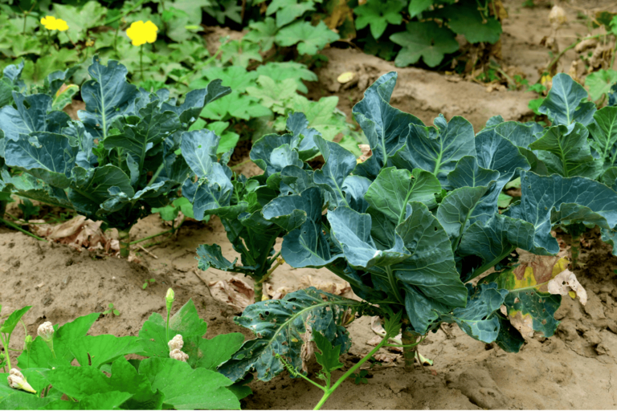

Les personnes qui se lancent dans la planification des plates-bandes au printemps peuvent vite être dépassées. Entre le plan de plantation, la rotation des cultures et les cultures mixtes, il n'est pas si facile de garder une vue d'ensemble. Quelles sont les plantes qui vont ensemble ? Que faut-il cultiver après les tomates, les pommes de terre ou les haricots ? Et comment éviter que le sol ne s'épuise avec le temps ?

Qu'il s'agisse d'un plan de plantation pour une plate-bande surélevée, un potager ou des plantes vivaces, une planification intelligente présente de nombreux avantages. Dans cet article, vous découvrirez comment mettre en œuvre une rotation des cultures bien pensée, quelles sont les combinaisons qui ont fait leurs preuves et comment des outils numériques comme SeaTable peuvent vous faciliter l'organisation.

## Pourquoi un plan de plantation est-il important ?

Un jardin réussi ne commence pas avec la première graine dans la terre, mais avec un plan de plantation bien pensé. **Sans planification, le sol peut rapidement s'épuiser**, ce qui nuit à la croissance des plantes à long terme. En outre, si l'on cultive chaque année les mêmes cultures au même endroit, on favorise la multiplication des parasites et des maladies. Une bonne rotation des cultures permet d'y remédier : elle veille à ce que le sol ne soit pas épuisé unilatéralement, mais qu'il puisse se rétablir.

Un plan de plantation bien élaboré rend le jardin non seulement plus productif, mais aussi plus facile à entretenir. Accordez judicieusement les plantes ayant des besoins nutritifs similaires et utilisez de manière ciblée des cultures mixtes qui peuvent éloigner les parasites de manière naturelle. Mais à quoi ressemble concrètement une rotation des cultures bien pensée ? C'est ce que nous allons vous expliquer dans la suite de cet article.

## Les bases de la rotation des cultures

La rotation des cultures signifie que les plantes d'une plate-bande ne poussent pas chaque année au même endroit, mais qu'elles tournent dans un certain ordre. La raison principale de la rotation des cultures est **l'utilisation optimale des substances nutritives du sol et la prévention des maladies et des parasites** qui pourraient sinon s'accumuler pendant des années. La rotation classique des cultures répartit les plantes en fonction de leurs besoins en nutriments :

- **Les plantes à forte croissance** puisent beaucoup d'éléments nutritifs dans le sol.
- **Les plantes à croissance moyenne** ont besoin de moins d'éléments nutritifs que les plantes à forte croissance.
- **Les plantes à faible croissance** se contentent de peu d'éléments nutritifs.
- **Les améliorateurs de sol** enrichissent le sol en éléments nutritifs, notamment en azote.  
    

L'astuce consiste à **faire tourner les plantes dans les plates-bandes tous les 3 à 4 ans**. Ainsi, le sol reste fertile et vous pouvez réduire l'utilisation d'engrais. En outre, cela permet de tenir les ravageurs et les maladies des plantes à distance, car leurs plantes hôtes préférées ne poussent pas en permanence au même endroit.

_**Remarque** : Un parterre de fleurs persistantes peut logiquement être planifié dans le plan de plantation sans aucune rotation des cultures. Si vous souhaitez établir un plan de plantation pour votre parterre de fleurs persistantes, veillez à combiner des plantes ayant des périodes de floraison différentes afin d'équilibrer l'absorption de nutriments au cours de la saison. Un plan de plantation pour un massif de plantes vivaces (ensoleillé, sec) peut par exemple inclure de la lavande, de la sauge et de l'achillée, tandis qu'un plan de plantation pour des hortensias dans la composition du massif doit inclure une terre riche en humus et humide._

## Conseils pour créer votre propre plan de plantation

Pour que la rotation des cultures pour les légumes fonctionne, il faut un plan clair. Voici les étapes à suivre pour y parvenir :

1. **Répartir les planches et les documenter** : Déterminez le nombre de plates-bandes ou de surfaces de culture dont vous disposez. Le mieux est de les numéroter ou de faire un croquis - numérique sur un tableau blanc.
1. **Grouper les plantes en fonction de leurs besoins nutritionnels** : Classez vos légumes dans les catégories suivantes : plantes à forte croissance, plantes à croissance moyenne, plantes à faible croissance et plantes améliorant le sol. Vous saurez ainsi quelles plantes doivent pousser où et quand.
1. **Définir le principe de rotation** : Un système simple est celui de la culture sur 4 champs, dans lequel les plantes avancent chaque année d'une rangée de plates-bandes. Nous expliquons plus loin la procédure exacte.
1. **Tenir compte de la culture mixte** : Toutes les plantes ne se supportent pas de la même manière. Intégrez donc des plantes compagnes qui se renforcent mutuellement, par exemple des carottes et des oignons, car les oignons éloignent les mouches des carottes.
1. **consigner le plan de plantation et l'adapter chaque année** : Documentez votre séquence de plantation afin d'éviter les erreurs et de procéder à des optimisations. Des outils numériques comme SeaTable vous aident à garder une vue d'ensemble.  
    

## Exemples pratiques pour une rotation efficace des cultures dans votre jardin

Une bonne rotation des cultures pour les fraises et d'autres plantes est facile à mettre en pratique si l'on répartit judicieusement les plates-bandes et si l'on associe les bonnes plantes. Voici quelques exemples de plates-bandes de différentes tailles et exigences, qui montrent comment l'alternance fonctionne sur plusieurs années.

### Exemple 1 : culture classique sur 4 champs**

Ce système convient particulièrement bien aux grands jardins avec plusieurs plates-bandes. Chaque année, les plantes tournent d'une position, de sorte que le sol n'est jamais trop sollicité. La cinquième année, le cycle recommence, ce qui signifie par exemple que dans la rotation des cultures, après les haricots, c'est à nouveau le tour des plantes à forte croissance comme les pommes de terre.

- **Année 1** : Plantes à forte croissance (p. ex. pommes de terre, tomates, choux, courges).
- **Année 2** : Plantes à croissance moyenne (p. ex. carottes, oignons, épinards, poivrons).
- **Année 3** : Plantes à faible rendement (p. ex. radis, herbes aromatiques, mâche, petits pois)
- **Année 4** : Améliorateurs de sol (p. ex. haricots, trèfle, phacélie, engrais vert)
    

### Exemple 2 : Planter un parterre surélevé (plan annuel)

Tout le monde n'a pas la place pour quatre grandes plates-bandes. Mais même sur une petite surface, il est possible d'appliquer la rotation des cultures en divisant votre plate-bande en sections ou en utilisant des cultures mixtes ciblées. Un plan de plantation de platebandes surélevées pour débutants doit contenir des cultures simples qui nécessitent peu d'entretien et qui se prêtent bien à une rotation progressive des cultures. Un plan de plantation judicieux pour les plates-bandes surélevées permet ensuite d'utiliser l'espace de manière optimale et de maximiser les rendements.

- **Année 1** : Tomates et basilic + radis pour combler les vides.
- **Année 2** : Carottes et oignons (bonne culture mixte contre les parasites)
- **Année 3** : Épinards et salades comme cultures à faible rendement
- **année 4** : Haricots pour enrichir l'azote, puis le cycle recommence.
    

### Exemple 3 : Rotation des cultures pour les jardiniers de balcon (plan annuel)

La rotation des cultures peut également être mise en œuvre dans des bacs à plantes sur les balcons, par exemple. Ici, il s'agit avant tout de maintenir la fertilité du sol en renouvelant régulièrement le substrat ou en apportant du compost.

- **Année 1** : Poivrons et tomates avec du basilic comme plante compagne.
- **Année 2** : Carottes ou salades en tant que plantes à croissance moyenne
- **année 3** : Les herbes aromatiques comme le thym, la menthe ou le persil comme plantes à faible rendement.
- **année 4** : Haricots ou trèfle comme améliorateurs de sol
    

## Support numérique : créer un plan de plantation avec SeaTable

Si vous notez chaque année à la main ce qui a été planté et où, vous perdez rapidement la vue d'ensemble. C'est précisément là que la [plate-forme No-Code]() SeaTable peut vous aider - une solution numérique qui permet de gérer clairement vos plans de plantation et de les optimiser à long terme. Au lieu de vous battre avec des notes chaotiques ou des tableaux Excel, vous pouvez **retenir de manière structurée les plantations, les types de plantes et les rotations et les adapter de manière flexible**.

Le plan de plantation de SeaTable est conçu de manière à ce que chaque rangée de plates-bandes ait sa propre ligne et que les plantes pour les années à venir soient inscrites dans des colonnes séparées. Vous pouvez ainsi savoir à tout moment quelle culture pousse actuellement et ce qui devrait suivre l'année suivante. Des codes couleur peuvent vous aider à distinguer d'un coup d'œil les catégories de plantes à forte croissance, de plantes à croissance moyenne, de plantes à faible croissance et d'amendements. Vous pouvez également ajouter des notes supplémentaires, par exemple sur le rendement de la récolte, les conditions météorologiques ou les attaques de parasites.  


  
Ce qui rend SeaTable particulièrement pratique : vous pouvez non seulement planifier sous forme de tableau, mais aussi créer un **schéma de culture directement dans le plugin de tableau blanc intégré**. Vous voyez ainsi immédiatement où poussent les différents légumes. Grâce à des liens simples, les plates-bandes peuvent être reliées aux plantes que vous avez créées en un seul clic - sans formules compliquées. Et comme SeaTable vous permet également de créer votre propre application sans aucune connaissance en programmation, vous pouvez adapter votre plan de plantation directement dans le jardin et y apporter immédiatement des modifications.  
  
L'un des grands avantages de la documentation numérique est sa facilité d'adaptation. Si, par exemple, une rotation des cultures pour vos tomates s'avère défavorable ou si de nouvelles connaissances apparaissent, vous pouvez **modifier le plan en quelques clics**. SeaTable vous permet non seulement d'organiser votre potager, mais aussi de structurer efficacement un plan de plantation de vivaces - y compris les périodes de floraison et les exigences du site. De plus, une vue d'ensemble numérique vous évite de placer par erreur des plantes au même endroit que les années précédentes.

## Conclusion & conseils pour une rotation des cultures réussie

Un plan de plantation bien pensé avec une rotation des cultures est la clé pour des plates-bandes saines et une récolte fructueuse. En alternant de manière ciblée les cultures fortes, moyennes et faibles, votre sol reste fertile, les maladies et les parasites ont moins de chances de s'installer et les nutriments sont utilisés de manière optimale. Si vous planifiez vos plates-bandes de manière stratégique, vous pouvez jardiner de manière plus durable et profiter de meilleurs rendements année après année.

Pour que la rotation des cultures pour les pommes de terre et autres fonctionne sans problème dans la pratique, il vaut la peine de respecter quelques règles de base. Vous devriez documenter et adapter chaque année votre **plan de plantation** afin d'éviter les erreurs et de gérer au mieux l'alternance des cultures. En outre, il est utile d'améliorer **régulièrement le sol avec du compost, du paillis ou des engrais verts** afin qu'il reste riche en substances nutritives à long terme. Les **cultures mixtes peuvent également être un complément précieux dans votre parterre**, car certaines plantes se protègent mutuellement contre les parasites et favorisent la croissance. Par exemple, les tomates se combinent bien avec le basilic, tandis que les oignons placés à côté des carottes éloignent les parasites.

La flexibilité est un autre facteur important : si une culture ne pousse pas bien ou disparaît, vous devez adapter votre plan sans pour autant négliger les principes de la rotation des cultures. Des outils numériques tels que SeaTable peuvent vous aider à garder une vue d'ensemble et à retracer facilement les années passées. Cela permet non seulement d'organiser le tableau de rotation des cultures de manière optimale, mais aussi de voir à long terme quelles combinaisons ont été particulièrement efficaces. Si vous suivez ces conseils, vous pourrez cultiver vos plates-bandes de manière efficace et profiter, année après année, de plantes saines et d'une récolte abondante.
