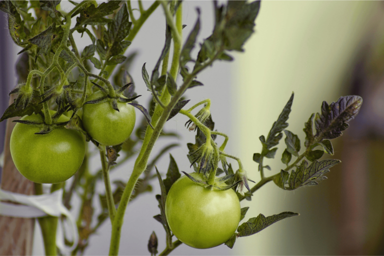
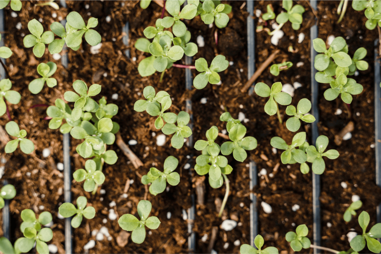

## Um plano de plantação para canteiros de sucesso

Se começar a planear os seus canteiros na primavera, pode ficar rapidamente sobrecarregado. Não é assim tão fácil manter uma visão geral entre o plano de plantação, a rotação de culturas e o cultivo misto. Que plantas combinam entre si? O que é que se deve plantar depois do tomate, da batata ou do feijão? E como é que se evita que o solo se esgote com o tempo?

Quer seja um plano de plantação para canteiros elevados, canteiros para legumes ou canteiros para plantas perenes - um planeamento inteligente tem muitas vantagens. Neste artigo, aprenderá como implementar uma rotação de culturas bem pensada, quais as combinações que provaram ser bem sucedidas e como os ajudantes digitais, como o SeaTable, lhe facilitam a organização.

## Porque é que um plano de plantação é importante?

Um jardim de sucesso não começa com a primeira semente no solo, mas com um plano de plantação bem pensado. **Sem planeamento, o solo pode ficar rapidamente esgotado**, o que irá afetar o crescimento das plantas a longo prazo. Plantar as mesmas culturas no mesmo sítio todos os anos também favorece a proliferação de pragas e doenças. A rotação correta das culturas contraria esta situação: garante que o solo não é esgotado unilateralmente, mas que pode recuperar.

Um plano de plantação bem pensado não só torna o jardim mais produtivo, mas também mais fácil de cuidar. Coordenar plantas com necessidades nutricionais semelhantes de forma sensata e utilizar culturas mistas que possam manter as pragas afastadas naturalmente. Mas como é, de facto, uma rotação de culturas bem pensada? É exatamente isso que vamos explicar a seguir.

## Os princípios básicos da rotação de culturas

A rotação de culturas significa que as plantas num canteiro não crescem no mesmo local todos os anos, mas rodam numa determinada ordem. A principal razão para a rotação de culturas é **otimizar a utilização dos nutrientes no solo e evitar doenças e pragas** que, de outra forma, poderiam acumular-se ao longo dos anos. A rotação tradicional de culturas organiza as plantas de acordo com as suas necessidades de nutrientes:

- As culturas de alto rendimento** extraem uma grande quantidade de nutrientes do solo.
- As culturas de rendimento médio** necessitam de menos nutrientes do que as culturas de rendimento elevado.
- As culturas fracas** conseguem gerir-se com poucos nutrientes.
- Os corretivos do solo** enriquecem o solo com nutrientes, especialmente azoto.  
    

O truque consiste em **rotar as plantas** nos canteiros num ciclo de 3 a 4 anos. Isto mantém o solo fértil e permite-lhe reduzir a utilização de fertilizantes. Também ajuda a manter afastadas as pragas e as doenças das plantas, uma vez que as suas plantas hospedeiras favoritas não crescem permanentemente no mesmo sítio.

_**Nota**: Um canteiro sempre florido pode, logicamente, ser planeado no plano de plantação sem qualquer rotação de culturas. Se quiser criar um plano de plantação para o seu canteiro de flores perenes, deve certificar-se de que combina plantas com diferentes épocas de floração, de modo a equilibrar a absorção de nutrientes ao longo da estação. Por exemplo, um plano de plantação para um canteiro perene (ensolarado e seco) pode incluir lavanda, salva e milefólio, enquanto um plano de plantação para hortênsias no desenho do canteiro deve incluir solo rico em húmus e húmido _.

## Dicas para criar o seu próprio plano de plantação

Para que a rotação de culturas de vegetais funcione, é necessário um plano claro. Siga estes passos para o fazer funcionar:

1. **Divida e documente os canteiros**: Determine quantos canteiros ou áreas de cultivo tem. É melhor numerá-los ou criar um esboço - digitalmente num quadro branco.
1 **Grupo de plantas de acordo com as necessidades nutricionais**: Classifique os seus vegetais em alimentadores pesados, alimentadores médios, alimentadores ligeiros e melhoradores do solo. Desta forma, saberá quais as plantas que devem crescer quando e onde.
1 **Determinar o princípio de rotação**: Um sistema simples é o cultivo em 4 campos, no qual as plantas avançam uma fila de canteiros todos os anos. O procedimento exato é explicado abaixo.
1 **Considerar o cultivo misto**: Nem todas as plantas se dão igualmente bem. Por isso, integre plantas companheiras que se reforcem mutuamente, como as cenouras e as cebolas, uma vez que as cebolas afastam as moscas das cenouras.
1 **Registar o plano de plantação e ajustá-lo anualmente**: Documentar a sequência de plantação para evitar erros e otimizar. Ferramentas digitais como o SeaTable ajudam-no a manter o controlo.  
    

## Exemplos práticos de rotação eficaz de culturas na sua horta

Uma boa rotação de culturas para morangos e outras plantas é fácil de pôr em prática se dividir os canteiros de forma sensata e combinar as plantas certas. Aqui estão alguns exemplos de diferentes tamanhos de canteiros e necessidades que mostram como a rotação funciona ao longo de vários anos.

### Exemplo 1: Cultivo clássico de 4 campos**

Este sistema é particularmente adequado para jardins maiores com vários canteiros. Todos os anos, as plantas rodam uma posição mais à frente para que o solo nunca seja sobrecarregado. No quinto ano, o ciclo recomeça, o que significa, por exemplo, que depois dos feijões na rotação de culturas, é a vez dos alimentos pesados, como as batatas.

- Ano 1**: Culturas de alto rendimento (por exemplo, batata, tomate, couve, abóbora)
- Ano 2**: Culturas de rendimento médio (por exemplo, cenouras, cebolas, espinafres, pimentos)
- Ano 3**: Culturas fracas (por exemplo, rabanetes, ervas aromáticas, alface-de-cordeiro, ervilhas)
- Ano 4**: Melhoradores do solo (por exemplo, feijão, trevo, phacelia, adubo verde)
    

### Exemplo 2: Plantação de canteiros elevados (plano anual)

Nem toda a gente tem espaço para quatro canteiros grandes. Mas mesmo numa área pequena, a rotação de culturas pode ser aplicada dividindo o seu canteiro em secções ou utilizando culturas mistas. Um plano de plantação de canteiros elevados para principiantes deve incluir culturas simples que requerem poucos cuidados e que se adaptam bem à rotação gradual de culturas. Um plano de plantação de canteiros elevados sensato ajudá-lo-á a utilizar o espaço da melhor forma possível e a maximizar os rendimentos.

- Ano 1**: Tomates e manjericão + rabanetes para preencher os espaços vazios
- Ano 2**: Cenouras e cebolas (boa cultura mista contra as pragas)
- Ano 3**: Espinafres e alface como culturas fracas
- Ano 4**: Feijão para enriquecimento em azoto, depois o ciclo recomeça
    

### Exemplo 3: Rotação de culturas para jardineiros de varanda (plano anual)

A rotação de culturas também pode ser implementada em jardineiras em varandas, por exemplo. O principal objetivo aqui é manter o solo fértil, renovando regularmente o substrato ou adicionando composto.

- Ano 1**: Pimentos e tomates com manjericão como planta companheira
- Ano 2**: Cenouras ou alface como cultura central
- Ano 3**: Ervas como o tomilho, a hortelã ou a salsa como plantas de crescimento fraco
- Ano 4**: Feijão ou trevo como melhoradores do solo
    

## Suporte digital: Criar um plano de plantação com o SeaTable

Se todos os anos escrever à mão o que foi plantado e onde, pode perder rapidamente o rasto. É exatamente aqui que a [plataforma sem código](https://seatable.com/) SeaTable o pode ajudar - uma solução digital que lhe permite gerir os seus planos de plantação de forma clara e optimizá-los a longo prazo. Em vez de se debater com notas caóticas ou folhas de cálculo Excel, pode registar **beterrabas, espécies vegetais e rotações de culturas de forma estruturada e adaptá-las de forma flexível**.

O plano de plantação no SeaTable está estruturado de forma a que cada linha de canteiros tenha a sua própria linha e as plantas para os próximos anos sejam registadas em colunas separadas. Isto significa que pode sempre ver qual a cultura que está atualmente a crescer e o que deverá seguir-se no próximo ano. A codificação por cores pode ajudá-lo a diferenciar rapidamente as categorias de plantas fortes, médias, fracas e melhoradoras do solo. Também pode acrescentar notas adicionais - por exemplo, sobre o rendimento das culturas, as condições climatéricas ou a infestação de pragas.  


  
O que torna o SeaTable particularmente prático é o facto de poder não só planear em forma de tabela, mas também criar um **esboço da cultura diretamente no plugin integrado do quadro branco**. Isto permite-lhe ver imediatamente onde estão a crescer os vegetais. Graças a ligações simples, pode ligar os canteiros às plantas que plantou com apenas um clique - sem quaisquer fórmulas complicadas. E porque também pode criar a sua própria aplicação no SeaTable sem qualquer conhecimento de programação, pode adaptar o seu plano de plantação diretamente na horta e introduzir alterações imediatamente.  
  
Uma grande vantagem da documentação digital é o facto de ser fácil de personalizar. Se, por exemplo, uma rotação de culturas se revelar desfavorável para os seus tomates ou se surgirem novas descobertas, pode **alterar o plano com apenas alguns cliques**. O SeaTable permite-lhe não só organizar os seus canteiros de legumes, mas também estruturar eficazmente um plano de plantação de canteiros de plantas perenes - incluindo períodos de floração e requisitos de localização. Uma visão geral digital também evita que plante acidentalmente plantas no mesmo sítio onde cresceram em anos anteriores.

## Conclusão e dicas para uma rotação de culturas bem sucedida

Um plano de plantação bem pensado com rotação de culturas é a chave para canteiros saudáveis e uma colheita de alto rendimento. A alternância de culturas fortes, médias e fracas mantém o solo fértil, as doenças e as pragas têm menos oportunidades e os nutrientes são utilizados de forma óptima. Se planear os seus canteiros de forma estratégica, pode cultivar de forma mais sustentável e beneficiar de melhores rendimentos ano após ano.

Para que a rotação de culturas de batatas e outras culturas funcione corretamente na prática, vale a pena observar algumas regras básicas. O **plano de plantação** deve ser documentado e adaptado todos os anos para evitar erros e otimizar a rotação de culturas. Também é útil **melhorar regularmente o solo** com composto, cobertura vegetal ou adubo verde, para que este se mantenha rico em nutrientes a longo prazo. As culturas mistas também podem ser um complemento valioso para o seu canteiro**, pois certas plantas protegem-se mutuamente das pragas e favorecem o crescimento. Por exemplo, os tomates combinam bem com o manjericão, enquanto as cebolas ao lado das cenouras mantêm as pragas afastadas.

A flexibilidade é outro fator importante: se uma cultura não crescer bem ou falhar, deve ajustar o seu plano sem negligenciar os princípios da rotação de culturas. Ferramentas digitais como o SeaTable podem ajudá-lo a manter uma visão geral e a acompanhar facilmente os anos anteriores. Isto permite não só organizar de forma óptima o quadro de rotação de culturas, mas também identificar as combinações que foram particularmente bem sucedidas a longo prazo. Se seguir estas dicas, pode gerir os seus canteiros de forma eficiente e beneficiar de plantas saudáveis e de uma colheita rica ano após ano.
