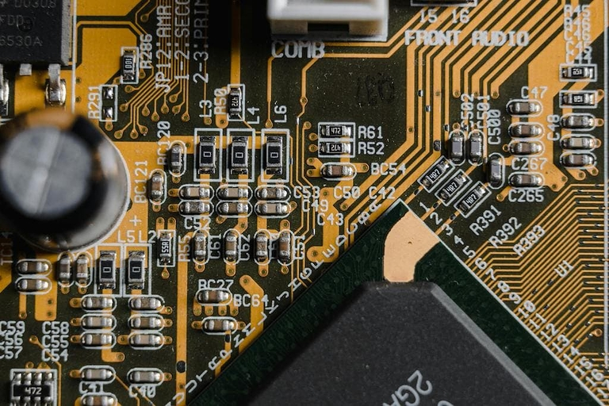
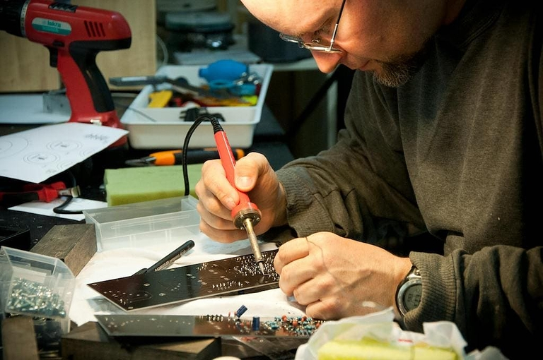

## éolane – führend in der Elektronikfertigung, auf der Suche nach effizienterem Datenmanagement

éolane ist der führende Electronic Manufacturing Services (EMS) in Frankreich, der hochmoderne, elektronische Platinen entwickelt und sie in die Endprodukte seiner Kunden integriert. Das Unternehmen sah sich zunehmend mit den Herausforderungen immer komplexer werdender Auftragsprozesse konfrontiert. Traditionelle Tools, wie Tabellenkalkulationen, konnten die Anforderungen nicht mehr erfüllen, und das Unternehmen suchte nach einer flexiblen und leistungsfähigen Lösung, um ihre Daten- und Auftragsverwaltung zu optimieren.

## Die Herausforderung: Komplexe Auftragsprozesse mit traditionellen Tools managen

Die instabilen und komplizierten bestehenden Tools erschwerten die Verwaltung der komplexen Prozesse. Zudem führte die Verteilung der Daten auf mehrere Dateien zu einem höheren Fehlerrisiko und Zeitverlust. Darüber hinaus boten die vorherigen Tools keine präzise und sichere Rechteverwaltung, was die Zusammenarbeit zwischen den verschiedenen Abteilungen und Standorten des Unternehmens erschwerte.

## Der Weg zu einer maßgeschneiderten No-Code-Lösung

Bruno Vérilhac, verantwortlich für Daten- und Prozesse bei éolane, testete zehn verschiedene Tools, um die richtige Lösung für das Unternehmen zu finden. Letztendlich entschied er sich für SeaTable – die leistungsstarke No-Code-Plattform, die es ihm ermöglichte, eine maßgeschneiderte Software zur Digitalisierung der Auftragsverwaltung zu entwickeln.

## In nur zwei Monaten zur digitalen Transformation – So optimierte SeaTable die Auftragsverwaltung bei éolane

In nur zwei Monaten konnte Bruno Vérilhac mit SeaTable eine individuelle Lösung entwickeln und implementieren, die die gesamten Auftragsprozesse digitalisierte. Vom Kundenbedarf bis hin zur Nachverfolgung der Zeitpläne der Support-Teams in den Werkstätten – SeaTable erleichtert die Verwaltung komplexer Prozesse, die dutzende von Mitarbeitern pro Auftrag umfassen.

## Effizientere Prozesse und verbesserte Zusammenarbeit durch No-Code Automatisierung

Die Implementierung von SeaTable führte zu sofortigen Verbesserungen. Prozesse wurden stabilisiert, die Rechteverwaltung optimiert und die Zusammenarbeit zwischen den Standorten von éolane erleichtert. Besonders wertvoll war die Möglichkeit, durch automatisierte Visualisierungen das Reporting zu vereinfachen und die Entscheidungsfindung im Management zu beschleunigen.

## Begeisterte Nutzer: Wie SeaTable Veränderungsresistenz überwand und die Produktivität steigerte

„Oft führt man ein Tool ein, weil es der Firma Vorteile bringt. Der Nutzer denkt aber oft, dass es ihn Zeit kosten wird – eine typische Veränderungsresistenz. Doch wenn der Bedarf richtig digitalisiert wird und das Tool den Alltag erleichtert, nehmen die Nutzer es begeistert an,“ so Bruno Vérilhac. Die Einführung von SeaTable bei éolane wurde von den Teams schnell und begeistert angenommen, selbst von Mitarbeitern, die zuvor skeptisch gegenüber neuen digitalen Lösungen waren.

## Fazit: Maßgeschneiderte No-Code-Lösung für moderne Datenverwaltung

Heute profitiert éolane von einer zentralisierten und optimierten Auftragsverwaltung, bei der jeder Prozess mit höchster Präzision überwacht wird. Die Herausforderungen im Zusammenhang mit Dateninstabilität und Rechteverwaltung gehören der Vergangenheit an. SeaTable hat nicht nur diese Probleme gelöst, sondern auch die Zusammenarbeit und Kommunikation innerhalb des Unternehmens deutlich verbessert. éolane ist ein perfektes Beispiel dafür, wie die Digitalisierung, wenn sie richtig umgesetzt wird, ein Unternehmen transformieren kann.

## Möchten Sie Ihre Auftrags- und Datenprozesse effizienter gestalten?

Entdecken Sie, wie eine maßgeschneiderte No-Code-Lösung Ihre Auftrags- und Datenverwaltung revolutionieren kann. Kontaktieren Sie uns und erfahren Sie, wie wir Ihr Unternehmen bei der digitalen Transformation unterstützen können.

## Zusammenfassung

- **Hintergrund:** éolane, ein Technologieunternehmen, das elektronische Platinen herstellt, stand vor Herausforderungen mit herkömmlichen IT-Tools.
- **Herausforderungen:** Instabilität und Komplexität der Tools, Datenverteilung und ineffiziente Rechteverwaltung.
- **Übergang:** Bruno Vérilhac, verantwortlich für Datenflüsse, testete zehn Tools und entschied sich schließlich für SeaTable, mit dem er in zwei Monaten eine maßgeschneiderte Lösung entwickelte.
- **Implementierung:** Digitalisierung des gesamten Auftragsverwaltungsprozesses in zwei Monaten.
- **Ergebnisse:** Erhöhte Stabilität, präzise Rechteverwaltung, mehr Flexibilität und verbessertes Reporting. Sofortige Visualisierungen für das Reporting.
- **Nutzerfeedback:** Schnelle und begeisterte Annahme des Tools, verbesserte Arbeitsabläufe und höhere Sicherheit. Zitat von Bruno: „Oft führt man ein Tool ein, weil es der Firma Vorteile bringt. Der Nutzer denkt aber, dass es ihm Zeit kosten wird – das ist der Widerstand gegen Veränderungen. Doch wenn das Tool den Alltag erleichtert, nehmen die Nutzer es begeistert an.“
- **Fazit:** Verbesserte Zusammenarbeit und Datenverwaltung bei éolane dank SeaTable.
