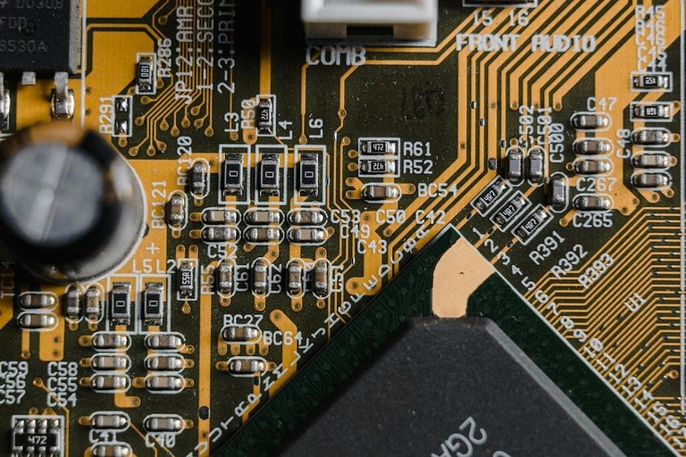

## éolane - líder en fabricación electrónica, en busca de una gestión de datos más eficaz

éolane es el líder de servicios de fabricación electrónica (EMS) en Francia, que desarrolla placas de circuitos electrónicos de última generación y las integra en los productos finales de sus clientes. La empresa se enfrentaba cada vez más a los retos de unos procesos de pedidos cada vez más complejos. Las herramientas tradicionales, como las hojas de cálculo, ya no podían cumplir los requisitos y la empresa buscaba una solución flexible y potente para optimizar la gestión de sus datos y pedidos.

## El reto: Gestionar procesos de pedidos complejos con herramientas tradicionales

Las inestables y complicadas herramientas existentes dificultaban la gestión de los complejos procesos. Además, la distribución de los datos en varios archivos conllevaba un mayor riesgo de errores y pérdidas de tiempo. Además, las herramientas anteriores no ofrecían una gestión de derechos precisa y segura, lo que dificultaba la colaboración entre los distintos departamentos y ubicaciones de la empresa.

## El camino hacia una solución personalizada sin código

Bruno Vérilhac, responsable de datos y procesos de éolane, probó diez herramientas diferentes para encontrar la solución adecuada para la empresa. Al final, optó por SeaTable, la potente plataforma sin código que le permitió desarrollar un software a medida para digitalizar la gestión de pedidos.

## Transformación digital en sólo dos meses - Cómo SeaTable optimizó la gestión de pedidos en éolane

En sólo dos meses, Bruno Vérilhac pudo desarrollar e implantar una solución personalizada con SeaTable que digitalizó todo el proceso de pedidos. Desde los requisitos de los clientes hasta el seguimiento de los horarios de los equipos de asistencia en los talleres, SeaTable facilita la gestión de procesos complejos en los que intervienen decenas de empleados por pedido.

## Procesos más eficientes y colaboración mejorada gracias a la automatización sin código

La implantación de SeaTable produjo mejoras inmediatas. Se estabilizaron los procesos, se optimizó la gestión de derechos y se facilitó la colaboración entre las sedes de éolane. La capacidad de simplificar los informes y acelerar la toma de decisiones de gestión mediante visualizaciones automatizadas resultó especialmente valiosa.

## Usuarios entusiastas: cómo SeaTable venció la resistencia al cambio y aumentó la productividad

"A menudo se introduce una herramienta porque beneficia a la empresa. Sin embargo, el usuario suele pensar que le costará tiempo: una resistencia típica al cambio. Pero si la necesidad está bien digitalizada y la herramienta facilita el día a día, los usuarios la adoptan con entusiasmo", afirma Bruno Vérilhac. La introducción de SeaTable en éolane fue aceptada rápidamente y con entusiasmo por los equipos, incluso por empleados que antes se mostraban escépticos ante las nuevas soluciones digitales.

## Conclusión: solución personalizada sin código para una gestión de datos moderna

Hoy en día, éolane se beneficia de una gestión de pedidos centralizada y optimizada, en la que cada proceso se controla con la máxima precisión. Los retos asociados a la inestabilidad de los datos y la gestión de derechos son cosa del pasado. SeaTable no sólo ha resuelto estos problemas, sino que también ha mejorado significativamente la colaboración y la comunicación dentro de la empresa. éolane es un ejemplo perfecto de cómo la digitalización, cuando se aplica correctamente, puede transformar una empresa.

## ¿Quiere que sus procesos de pedidos y datos sean más eficientes?

Descubra cómo una solución sin código personalizada puede revolucionar su gestión de pedidos y datos. Póngase en contacto con nosotros y descubra cómo podemos apoyar a su empresa en su transformación digital.

## Resumen

- **Antecedentes:** éolane, una empresa tecnológica que fabrica placas de circuitos electrónicos, se enfrentaba a desafíos con las herramientas de TI tradicionales.
- **Desafíos:** Inestabilidad y complejidad de las herramientas, distribución de datos y gestión de derechos ineficiente.
- **Transición:** Bruno Vérilhac, responsable de flujos de datos, probó diez herramientas y finalmente eligió SeaTable, con la que desarrolló una solución a medida en dos meses.
- **Implantación:** Digitalización de todo el proceso de gestión de pedidos en dos meses.
- **Resultados:** Mayor estabilidad, gestión precisa de los derechos, más flexibilidad y mejora de los informes. Visualizaciones instantáneas para la elaboración de informes.
- **Comentarios de los usuarios:** Adopción rápida y entusiasta de la herramienta, mejora de los flujos de trabajo y aumento de la seguridad. Cita de Bruno: "A menudo se introduce una herramienta porque beneficia a la empresa. Pero el usuario piensa que le costará tiempo: esa es la resistencia al cambio. Pero si la herramienta facilita el día a día, los usuarios la aceptan con entusiasmo".
- **Conclusión:** Mejora de la colaboración y la gestión de datos en éolane gracias a SeaTable.
