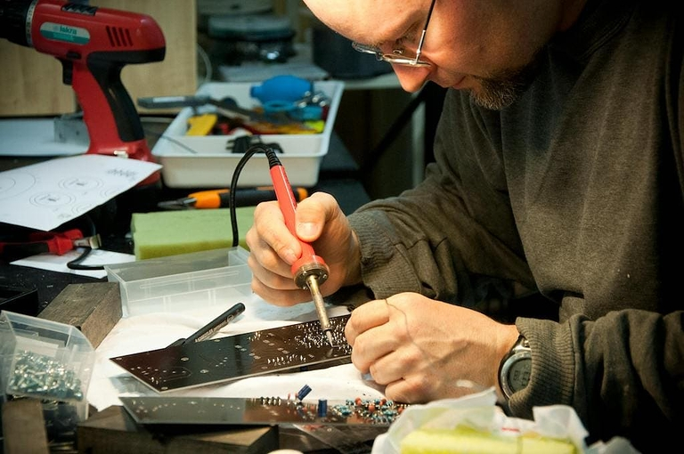

## éolane - leader de la fabrication électronique, à la recherche d'une gestion plus efficace des données

éolane est le leader des services de fabrication électronique (EMS) en France, qui conçoit des cartes électroniques de pointe et les intègre dans les produits finaux de ses clients. L'entreprise était de plus en plus confrontée aux défis posés par des processus de commande de plus en plus complexes. Les outils traditionnels, tels que les tableurs, ne pouvaient plus répondre à ses besoins et l'entreprise était à la recherche d'une solution flexible et performante pour optimiser la gestion de ses données et de ses commandes.

## Le défi : gérer des processus de commande complexes avec des outils traditionnels

L'instabilité et la complexité des outils existants rendaient difficile la gestion des processus complexes. De plus, la répartition des données sur plusieurs fichiers augmentait le risque d'erreur et la perte de temps. De plus, les outils précédents n'offraient pas une gestion précise et sécurisée des droits, ce qui rendait difficile la collaboration entre les différents départements et sites de l'entreprise.

## La voie vers une solution "no code" sur mesure

Bruno Vérilhac, responsable des données et des processus chez éolane, a testé dix outils différents afin de trouver la solution adaptée à l'entreprise. Finalement, il a opté pour SeaTable - la puissante plateforme No-Code qui lui a permis de développer un logiciel sur mesure pour numériser la gestion des commandes.

## Transformation numérique en deux mois seulement - Comment SeaTable a optimisé la gestion des commandes chez éolane

En seulement deux mois, Bruno Vérilhac a pu développer et mettre en œuvre une solution personnalisée avec SeaTable, qui a numérisé l'ensemble des processus de commande. De la demande du client au suivi des plannings des équipes d'assistance dans les ateliers, SeaTable facilite la gestion de processus complexes impliquant des dizaines de personnes par commande.

## Des processus plus efficaces et une meilleure collaboration grâce à l'automatisation No-Code

L'implémentation de SeaTable a entraîné des améliorations immédiates. Les processus ont été stabilisés, la gestion des droits optimisée et la collaboration entre les sites d'éolane facilitée. La possibilité de simplifier le reporting grâce à des visualisations automatisées et d'accélérer la prise de décision au niveau de la direction a été particulièrement précieuse.

## Des utilisateurs enthousiastes : comment SeaTable a surmonté la résistance au changement et a augmenté la productivité

"Souvent, on introduit un outil parce qu'il apporte des avantages à l'entreprise. Mais l'utilisateur pense souvent que cela va lui faire perdre du temps - une résistance au changement typique. Mais si le besoin est correctement numérisé et que l'outil facilite le quotidien, les utilisateurs l'adoptent avec enthousiasme", explique Bruno Vérilhac. La mise en place de SeaTable chez éolane a été rapidement adoptée avec enthousiasme par les équipes, même par des collaborateurs qui étaient auparavant sceptiques face aux nouvelles solutions numériques.

## Conclusion : une solution no-code sur mesure pour une gestion moderne des données

Aujourd'hui, éolane bénéficie d'une gestion des commandes centralisée et optimisée, où chaque processus est suivi avec la plus grande précision. Les défis liés à l'instabilité des données et à la gestion des droits appartiennent désormais au passé. SeaTable a non seulement résolu ces problèmes, mais a aussi considérablement amélioré la collaboration et la communication au sein de l'entreprise. éolane est un parfait exemple de la manière dont la numérisation, lorsqu'elle est correctement mise en œuvre, peut transformer une entreprise.

## Vous souhaitez rendre vos processus de commande et de données plus efficaces ?

Découvrez comment une solution sans code sur mesure peut révolutionner la gestion de vos commandes et de vos données. Contactez-nous pour savoir comment nous pouvons aider votre entreprise à se transformer numériquement.

## Résumé

- **Contexte:** éolane, une entreprise technologique qui fabrique des cartes électroniques, était confrontée à des défis avec les outils informatiques traditionnels.
- **Défis:** Instabilité et complexité des outils, distribution des données et gestion inefficace des droits.
- **Transition:** Bruno Vérilhac, responsable des flux de données, a testé dix outils et a finalement opté pour SeaTable, avec lequel il a développé une solution sur mesure en deux mois.
- **Mise en œuvre:** Numérisation de l'ensemble du processus de gestion des commandes en deux mois.
- **Résultats:** Stabilité accrue, gestion précise des droits, flexibilité accrue et amélioration des rapports. Visualisations instantanées pour le reporting.
- **Réactions des utilisateurs:** Adoption rapide et enthousiaste de l'outil, amélioration des processus de travail et sécurité accrue. Citation de Bruno : "Souvent, on introduit un outil parce qu'il apporte des avantages à l'entreprise. Mais l'utilisateur pense que cela va lui faire perdre du temps - c'est la résistance au changement. Mais si l'outil facilite le quotidien, les utilisateurs l'adoptent avec enthousiasme".
- **Conclusion:** Amélioration de la collaboration et de la gestion des données chez éolane grâce à SeaTable.
