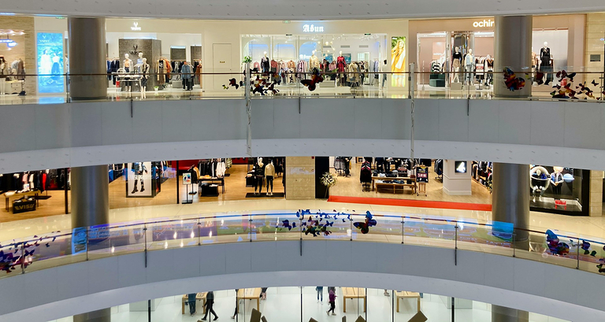
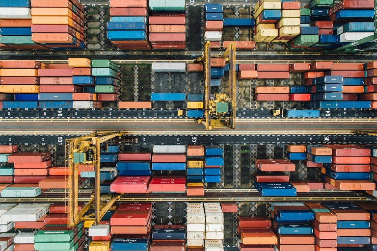
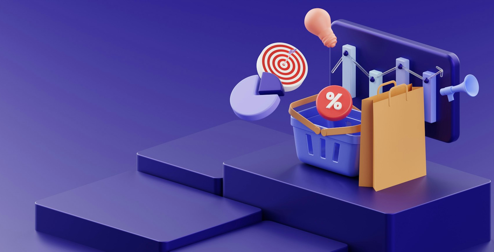
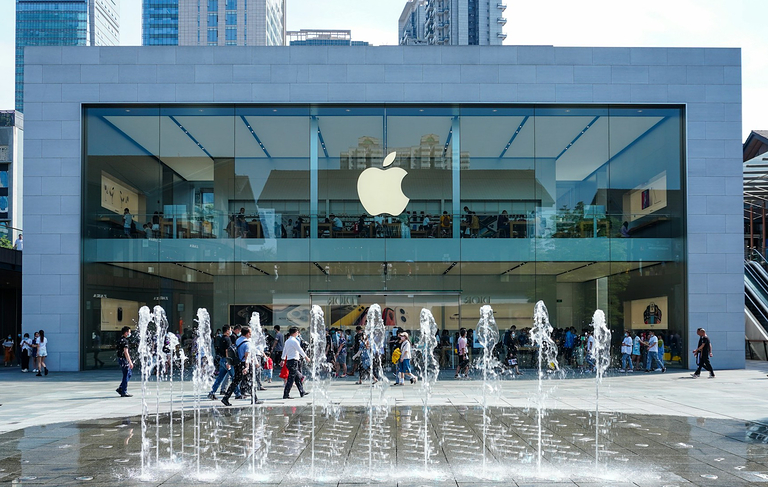

## What is distribution policy? Definition and relevance

Distribution policy, also known as sales policy, is a central component of any successful business model. But what does distribution actually mean? In economic terms, it refers to the **distribution of economic goods** - from manufacturers to retailers to consumers.

Your distribution policy therefore determines **how your products or services reach your customers**. The tasks of distribution policy include the selection of sales channels, warehousing, transportation and product placement at the point of sale.

## Objectives of the distribution policy

In order to be able to offer your products or services at the lowest possible cost, efficient distribution is of great importance. If you explain distribution policy simply, you could say that the challenge is to make your products available in such a way that they are

- in the best possible condition
- in sufficient quantities
- at different locations
- at the right time
- reaching many potential customers.

The objectives can therefore be summarized as follows:



Increase the availability of your products at all relevant points of sale, for example in online stores or stationary retail outlets.





Ensure stable supply chains and packaging so that your products reach the customer on time and undamaged.





Optimize your distribution logistics to avoid overproduction, delivery bottlenecks, losses and complaints, and thus save costs.





Try to positively influence customer buying behavior through strategic placement at the right points of sale.





Secure exclusive distribution channels and stay one step ahead of the competition thanks to a well thought-out distribution policy.



## The role of distribution policy in the marketing mix

Alongside product, price and promotion policy, distribution policy (or _place_) is one of the four elementary instruments of the marketing mix described by E. Jerome McCarthy back in the 1960s. A distinction is made between **physical and acquisition-based distribution**, i.e. logistical distribution and [customer acquisition](), which involves designing the distribution strategy and the distribution process.

### The physical distribution

Physical distribution deals with the **distribution of products over long distances**. This raises the question of which areas you want to supply with your products across the board and how many **sales outlets** are required. This results in the necessary distribution logistics, in which you plan the flow of goods and ensure that your products are properly packaged, transported and stored. The **degree of distribution** indicates the percentage of retailers who carry your products in their range, measured against the total number of retailers who are eligible to sell your products.

### Acquisition-based distribution

Acquisition-based distribution enables you to **establish customer contacts, generate sales and gain market share**. The focus is particularly on acquiring new customers, retaining existing customers and winning back former customers. An essential part of your distribution strategy is the definition of your **sales and distribution channels**, which in turn are closely linked to your product, pricing and communication policy.

## Advantages and disadvantages of different distribution channels

One of the main characteristics of distribution channels is the **difference between direct and indirect distribution**. The decisive factor for classification is whether you own the distribution channel yourself (for example, if you sell your goods in your online store or your own stores) or whether sales are made indirectly via intermediaries (e.g. supermarkets, specialist retailers, franchises, e-commerce platforms). A successful distribution policy has an immediate impact on your turnover, cost structure, market share and customer experience.

### Direct distribution

If your customers buy directly from you, this naturally brings a number of advantages:

- You have **full control over the presentation and prices** of your products.
- You can achieve **higher profit margins** without intermediaries.
- You build a **close customer relationship** and have **valuable customer data** at your disposal.

Direct distribution has the disadvantage that you have to take care of selling, storing and shipping the products yourself and require more internal resources (especially personnel) for sales and customer service. In addition, it usually takes longer to set up your own distribution channels than to use existing sales channels from retailers.

### Indirect sales

Accordingly, indirect distribution offers the following advantages for your distribution policy:

- You benefit from existing networks and distribution channels as well as the **expertise of dealers** who know the market.
- This enables you to distribute your products **quickly with a wide reach**.
- Your **fixed costs are lower**, as you do not have to employ as many staff for sales and customer service and do not have to maintain your own stores or online stores.

Indirect distribution has a negative impact on price control and profit margin due to the **dependence on retailers**. In addition, you have less influence on brand presence and customer contact.

## Important sales channels of distribution policy simply explained

Everyone is familiar with some distribution channels from everyday life - be it shopping in the **supermarket**, a shopping trip through **clothing stores** or ordering from an **online shop**. But there are also more specialized distribution channels that are not so familiar. In this section, we therefore take a closer look at various distribution channels.

### Franchise

In indirect distribution, franchise refers to a business model in which a company grants other contractual partners the right to work under its **umbrella brand** or with its business concept. The franchisor receives a **fee** for this and can impose certain standards on the franchisees. This type of distribution is popular in the food service industry, for example, where individual branches are usually **independent companies** that also bear the entrepreneurial risk. Nevertheless, the customer experience can hardly be distinguished from branch to branch. By ensuring that the umbrella brand has an extensive **contractual say in pricing and product presentation**, franchising can compensate for the major disadvantages of indirect distribution.

### Reseller

A reseller is a dealer who procures a company's products or services and resells them **without further processing**. He adds a **trade margin** to his purchase price in order to make a profit on the sale. Resellers often specialize in certain sectors or brands. Exclusive distribution partners with whom you contractually agree to offer your company's goods can also be interesting for your distribution policy. However, you have less influence on prices and the customer experience than with franchising.

### Wholesale

Within the [supply chain](), wholesalers are often the **link between producers and corporate customers**. Wholesalers procure goods on a **large scale** from various producers and sell them on to commercial customers such as retailers, restaurants or the processing industry. In order to bridge the gap between the production and consumption of goods, wholesalers take on the important function of **stockpiling**, which is associated with high storage costs. The larger the quantity of goods you wish to distribute to individual points of sale, the greater the benefit of this distribution channel for your distribution logistics. For **consumer goods manufacturers** in particular, wholesale and retail are indispensable for getting goods into circulation cost-effectively.

### Mail order companies

Mail order companies are companies that offer their products in **catalogs** and online stores and send them to customers by post or parcel service. This allows you to outsource distribution and not have to worry about tedious issues such as **ordering and payment processes, shipping and returns**. Customers increasingly prefer to order goods online and have them delivered to their homes. As a result, many mail order companies have slimmed down their catalogs and are increasingly relying on their own online stores, blurring the boundaries with e-commerce.

### E-commerce platforms

E-commerce has experienced an unprecedented boom in recent decades. These are platforms on which you can sell goods or services **over the internet**. This can be your own online store for direct sales, but also an **online marketplace**. The US giants Amazon and eBay are the main players here, but Temu from China and the German mail order companies Otto and Zalando are also heavily involved. E-commerce platforms have expanded distribution policy options and have become indispensable for many companies. The biggest advantage over stationary sales is the flexibility of being able to accept orders **around the clock, from anywhere and without staff**.

### Field service and sales representatives

Nevertheless, sales channels in the analog world can still prove productive. This applies in particular to very expensive products and services or those that require explanation, where potential customers want **intensive advice** before making a purchase. In the B2B sector in particular, a company's **own sales force** is common for direct sales, which represents the company in certain geographical areas and acquires and supports customers. The counterpart in indirect sales are **self-employed sales representatives** who broker and close deals on your behalf, but work on a commission basis.

## Distribution with the help of multichannel strategies

As there are numerous distribution channels, it is not easy to find the perfect distribution policy for your company. Of course, nowadays it is almost always an advantage to have a well-designed website that showcases your products or services and ideally allows your customers to order them straight away. However, online stores are not equally suitable for all companies. Consider, for example, a car manufacturer whose vehicles customers prefer to see, touch and experience in dealerships. This is why several distribution channels often exist in parallel.

Most successful companies today rely on a clever mix of direct and indirect sales. Multichannel strategies give you the opportunity to supply different target groups according to their needs. It is important to strategically coordinate the channels. Without a uniform brand image, cross-channel data management and clear responsibilities, the customer experience suffers - and the customer may abandon the purchasing process. Therefore, seamlessly integrate all channels of your distribution policy to create a consistent customer experience.

## Success factors for your distribution strategy

If you answer these fundamental strategic questions, you will be well equipped for your distribution policy:

1. **What type of goods do you offer and what distribution logistics does it require?**

    Perishable or fragile products have completely different storage, packaging and transportation requirements than clothing, for example. Furthermore, different distribution channels make sense for capital goods that require explanation than for consumer goods, which generally reach consumers mainly indirectly via wholesalers and retailers.

2. **Who are your competitors and what are their sales markets?**

    Thoroughly analyze the positioning and market power of your competitors, the number and characteristics of the competing products and the sales markets. Your sales strategy and the choice of your sales channels should match the market in which you want to sell your products.

3. **Where do your customers buy and which distribution channels do they use?**

    Identify as precisely as possible the points of sale where your products should be present in order to reach your target groups. The number of potential customers, the size of the sales area, the purchase frequency and the purchasing habits of the customers are relevant for the distribution channels.

## Practical examples of successful distribution policy

Apple is a prime example of a successful distribution policy. Due to its name recognition and market power, the US technology group now relies on exclusive distribution channels - its own stores, authorized partners ("premium resellers") and a convincing online store. Apple uses these distribution channels to ensure a uniform brand image, strong customer loyalty and high profit margins. However, Apple devices are also available to the general public in electronics stores and on e-commerce platforms in order to increase availability and lower the barriers to entry.

Below are three fictitious examples of a balanced mix of direct and indirect sales:

- A manufacturer of screws, plugs and nails sells its goods mainly through DIY stores, but also offers its range in the company's own online store so that tradesmen can order directly from it.
- A manufacturer of frozen baked goods sells its products through a wholesaler who sells them on to supermarkets. The company operates a bakery at its headquarters, where visitors and employees can purchase the fresh baked goods. The company also relies on a sales force that acquires major customers such as hotels, cafés and canteens.
- A start-up decides to sell its products directly via its own online shop. However, to facilitate market entry, it initially also offers its goods on e-commerce platforms.

## Conclusion: put your distribution policy to the test

Even the best and most reasonably priced product is useless if it is not available at enough points of sale and is therefore difficult for potential customers to find. So regularly check and scrutinize the ways in which your products can reach your customers. A clever mix of different sales channels will diversify your distribution policy and lead to long-term success.

## Frequently asked questions about distribution policy



Basically, distribution is the distribution of money, products or other things. In business, distribution means the flow of goods from manufacturers via retailers to consumers. Furthermore, distribution is used synonymously with sales in this definition.





You may be asking yourself: What is distribution policy? Basically, your distribution policy (simply explained) answers the question of how your products or services reach your customers. In the [marketing mix](https://en.wikipedia.org/wiki/Marketing_mix), distribution policy is one of the four central aspects together with product, price and promotion policy.




Logistics is crucial for physical distribution. One of the tasks of distribution policy is therefore to consider how packaging, storage and transportation should be carried out so that products arrive quickly and undamaged at the point of sale and to the consumer. However, indirect distribution allows you to outsource large parts of distribution logistics to intermediaries.


