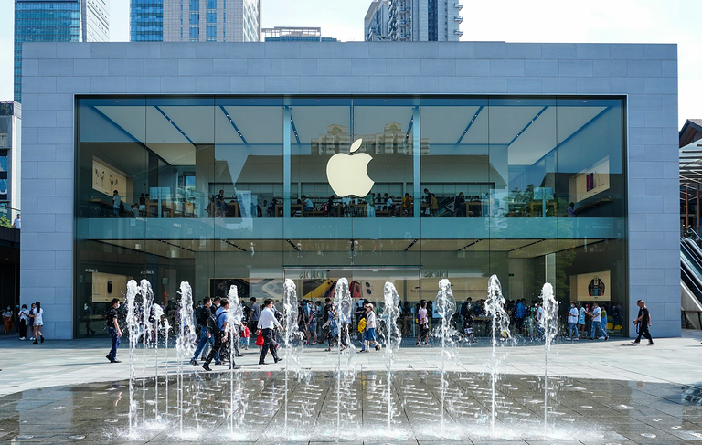

## ¿Qué es la política de distribución? Definición y relevancia

La política de distribución, también conocida como política de ventas, es un componente central de cualquier modelo empresarial de éxito. Pero, ¿qué significa realmente distribución? En términos económicos, se refiere a la **distribución de bienes económicos**, desde los fabricantes hasta los minoristas y los consumidores.

Por tanto, su política de distribución determina **cómo llegan sus productos o servicios a sus clientes**. Las tareas de la política de distribución incluyen la selección de los canales de venta, el almacenamiento, el transporte y la colocación del producto en el punto de venta.

## Objetivos de la política de distribución

Para poder ofrecer sus productos o servicios al menor coste posible, una distribución eficaz es de gran importancia. Si se explica la política de distribución de forma sencilla, se podría decir que el reto consiste en hacer que sus productos estén disponibles de tal forma que se encuentren

- en las mejores condiciones posibles
- en cantidades suficientes
- en diferentes lugares
- en el momento adecuado
- llegando a muchos clientes potenciales.

Así pues, los objetivos pueden resumirse del siguiente modo:



Aumente la disponibilidad de sus productos en todos los puntos de venta relevantes, por ejemplo en tiendas online o puntos de venta fijos.





Garantice cadenas de suministro y embalajes estables para que sus productos lleguen al cliente a tiempo y sin daños.





Optimice su logística de distribución para evitar sobreproducciones, cuellos de botella en las entregas, pérdidas y reclamaciones, y ahorrar así costes.





Intentar influir positivamente en el comportamiento de compra de los clientes mediante la colocación estratégica en los puntos de venta adecuados.





Asegúrese canales de distribución exclusivos y vaya un paso por delante de la competencia gracias a una política de distribución bien pensada.



## El papel de la política de distribución en el marketing mix

Junto con la política de productos, de precios y de comunicación, la política de distribución es uno de los cuatro instrumentos elementales del marketing mix descrito por E. Jerome McCarthy en los años sesenta. **Se distingue entre distribución física y adquisitiva**, es decir, la distribución logística y la adquisición de clientes, que implica la organización de la estrategia de distribución y el proceso de distribución.

### La distribución física

La distribución física se ocupa de la **distribución de productos a grandes distancias**. Esto plantea la cuestión de a qué zonas quiere suministrar sus productos de forma generalizada y cuántos puntos de venta son necesarios. Esto da lugar a la necesaria **logística de distribución**, en la que se planifica el flujo de mercancías y se garantiza que los productos se embalan, transportan y almacenan adecuadamente. El **grado de distribución** indica el porcentaje de minoristas que tienen sus productos en su surtido, medido en relación con el número total de minoristas que pueden vender sus productos.

### La distribución adquisitiva

La distribución basada en la adquisición le permite establecer **contactos con clientes**, generar **tratos de venta** y ganar **cuota de mercado**. Se centra especialmente en captar nuevos clientes, retener a los existentes y recuperar a los antiguos. Una parte esencial de su estrategia de distribución es la definición de sus **canales de distribución y venta**, que a su vez están estrechamente relacionados con su política de productos, precios y comunicación.

## Ventajas e inconvenientes de los distintos canales de distribución

Una de las principales características de los canales de distribución es la **diferencia entre distribución directa e indirecta**. El factor decisivo para la categorización es si usted mismo posee el canal de distribución (por ejemplo, si vende sus productos en su tienda en línea o en sus propias tiendas) o si las ventas se realizan indirectamente a través de intermediarios (por ejemplo, supermercados, minoristas especializados, franquicias, plataformas de comercio electrónico). Una política de distribución acertada tiene un impacto inmediato en su volumen de negocio, estructura de costes, cuota de mercado y experiencia del cliente.

### Distribución directa

Si sus clientes le compran directamente a usted, esto conlleva naturalmente una serie de ventajas:

- Tiene **control total sobre la presentación y los precios** de sus productos.
- Puede conseguir **márgenes de beneficio más altos** sin intermediarios.
- Establece una **estrecha relación con el cliente** y dispone de **valiosos datos** sobre él.

La distribución directa tiene la desventaja de que usted mismo tiene que encargarse de la venta, el almacenamiento y la expedición de los productos y necesita más recursos internos (sobre todo personal) para las ventas y el servicio al cliente. Además, suele llevar más tiempo crear canales de distribución propios que utilizar los canales de venta existentes de los minoristas.

### Distribución indirecta

En consecuencia, la distribución indirecta ofrece las siguientes ventajas para su política de distribución:

- Usted se beneficia de las redes y canales de distribución existentes, así como del **conocimiento de los distribuidores** que están familiarizados con el mercado.
- Esto le permite distribuir sus productos **rápidamente y con un amplio alcance**.
- Tiene **costes fijos más bajos**, ya que no tiene que emplear tanto personal de ventas y atención al cliente ni mantener tiendas propias o tiendas en línea.

La distribución indirecta tiene un impacto negativo en el control de precios y el margen de beneficios debido a la **dependencia de los distribuidores**. Además, tienes menos influencia sobre la presencia de la marca y el contacto con los clientes.

## Canales de distribución importantes explicados de forma sencilla

Todo el mundo está familiarizado con algunos canales de distribución de su vida cotidiana, ya sea comprando en un **supermercado**, en una **tienda de ropa** o haciendo un pedido en una **tienda online**. Pero también hay canales de venta más especializados que no nos resultan tan familiares. Por eso, en esta sección analizaremos más detenidamente los distintos canales de distribución.

### Franquicia

En la distribución indirecta, la franquicia se refiere a un modelo de negocio en el que una empresa concede a otros socios contractuales el **derecho a trabajar bajo su marca paraguas** o con su concepto de negocio. El franquiciador recibe una **comisión** por ello y puede imponer ciertas normas a los franquiciados. Este tipo de distribución es popular en la restauración colectiva, por ejemplo, donde las sucursales individuales suelen ser **empresas independientes** que también asumen el riesgo empresarial. Sin embargo, la experiencia del cliente apenas puede diferenciarse de una sucursal a otra. La franquicia puede compensar las importantes desventajas de la distribución indirecta garantizando contractualmente a la marca paraguas una **amplia capacidad de decisión en materia de precios y presentación de los productos**.

### Revendedores

Un revendedor es un comerciante que adquiere productos o servicios de una empresa y los revende **sin transformación posterior**. Añade un **margen comercial** a su precio de compra para obtener un beneficio de la venta. Los revendedores suelen estar especializados en determinados sectores o marcas. Los socios distribuidores exclusivos con los que acuerda contractualmente ofrecer los productos de su empresa también pueden ser interesantes para su política de distribución. Sin embargo, usted tiene menos influencia sobre los precios y la experiencia del cliente que con la franquicia.

### Venta al por mayor

Dentro de la [cadena de suministro](), los mayoristas suelen constituir el **enlace entre productores y clientes corporativos**. Los mayoristas adquieren mercancías a gran escala de diversos productores y las venden a clientes comerciales como minoristas, el sector de la restauración o la industria de transformación. Para salvar la distancia entre la producción y el consumo de mercancías, los mayoristas cumplen la importante función de **almacenamiento**, que está asociada a elevados costes de almacenamiento. Cuanto mayor sea la cantidad de mercancías que desee distribuir a puntos de venta individuales, mayor será el beneficio de este canal de distribución para su logística de distribución. Para los **fabricantes de bienes de consumo**, en particular, el comercio mayorista y minorista son indispensables para poner las mercancías en circulación de forma rentable.

### Empresas de venta por correo

Las empresas de venta por correo son empresas que ofrecen sus productos en **catálogos** y tiendas online y los envían a los clientes por correo postal o servicio de paquetería. Esto les permite externalizar la distribución y no tener que preocuparse de asuntos tediosos como **los procesos de pedido y pago, los envíos y las devoluciones**. Los clientes prefieren cada vez más pedir productos por Internet y recibirlos en su domicilio. Como consecuencia, muchas empresas de venta por correo han reducido sus catálogos y se apoyan cada vez más en sus propias tiendas online, difuminando las fronteras con el comercio electrónico.

### Plataformas de comercio electrónico

El comercio electrónico ha experimentado un auge sin precedentes en las últimas décadas. Se trata de plataformas en las que se pueden vender bienes o servicios **a través de Internet**. Puede tratarse de su propia tienda online de venta directa, pero también de un **mercado online**. Los gigantes estadounidenses Amazon y eBay son los principales actores en este ámbito, pero Temu, de China, y las empresas alemanas de venta por correo Otto y Zalando también participan activamente. Las plataformas de comercio electrónico han ampliado las opciones de la política de distribución y se han hecho indispensables para muchas empresas. La mayor ventaja frente a la venta estacionaria es la flexibilidad de poder aceptar pedidos **a cualquier hora, desde cualquier lugar y sin personal**.

### Servicio externo y representantes de ventas

No obstante, los canales de venta del mundo analógico pueden seguir resultando productivos. Esto se aplica en particular a los productos y servicios muy caros o que requieren explicaciones, en los que los clientes potenciales desean **un asesoramiento intensivo** antes de realizar una compra. En el sector B2B, en particular, es habitual que una empresa cuente con su propia **fuerza de ventas sobre el terreno** para la venta directa, que representa a la empresa en determinadas zonas geográficas y adquiere y presta apoyo a los clientes. En la venta indirecta, la contrapartida son los **representantes de ventas autónomos**, que intermedian y cierran acuerdos en su nombre pero no son empleados suyos sino que trabajan a comisión.

## Distribución con ayuda de estrategias multicanal

Dado que existen numerosos canales de distribución, no es fácil encontrar la política de distribución perfecta para su empresa. Por supuesto, hoy en día casi siempre es una ventaja tener un sitio web bien diseñado que muestre sus productos o servicios y que, en el mejor de los casos, permita a sus clientes pedirlos directamente. Sin embargo, las tiendas online no son igualmente adecuadas para todas las empresas. Pensemos, por ejemplo, en un fabricante de automóviles cuyos vehículos los clientes prefieren ver, tocar y experimentar en los concesionarios. Por eso suelen existir varios canales de distribución en paralelo.

Hoy en día, la mayoría de las empresas de éxito se basan en una inteligente combinación de ventas directas e indirectas. Las estrategias multicanal permiten satisfacer las necesidades de distintos grupos de destinatarios. Es importante armonizar estratégicamente los canales. Sin una imagen de marca estandarizada, una gestión de datos multicanal y unas responsabilidades claras, la experiencia del cliente se resiente y éste puede abandonar el proceso de compra. Por tanto, integre perfectamente todos los canales de su política de distribución para crear una experiencia de cliente coherente.

## Factores de éxito de su estrategia de distribución

Si responde a estas preguntas estratégicas fundamentales, estará bien equipado para su política de distribución:

1. **¿Qué tipo de productos ofrece y qué logística de distribución requiere?**

    Los productos perecederos o frágiles tienen unos requisitos de almacenamiento, embalaje y transporte completamente distintos a los de la ropa, por ejemplo. Además, tienen sentido canales de distribución diferentes para los bienes de equipo que requieren una explicación que para los bienes de consumo, que suelen llegar a los consumidores principalmente de forma indirecta a través de mayoristas y minoristas.

2. **¿Quiénes son sus competidores y cuáles son sus mercados de venta?**

    Analice a fondo el posicionamiento y el poder de mercado de sus competidores, el número y las características de sus productos y sus mercados de venta. Su estrategia de ventas y la elección de sus canales de venta deben ajustarse al mercado en el que desea vender sus productos.

3. **¿Dónde compran sus clientes y qué canales de distribución utilizan?**

    Identifique con la mayor precisión posible los puntos de venta en los que deben estar presentes sus productos para llegar a sus grupos objetivo. El número de clientes potenciales, el tamaño de la zona de venta, la frecuencia de compra y los hábitos de compra de los clientes son relevantes para los canales de distribución.

## Ejemplos prácticos de una política de distribución exitosa

Apple es un buen ejemplo de política de distribución con éxito. Debido al reconocimiento de su nombre y a su poder de mercado, el grupo tecnológico estadounidense se basa en canales de distribución exclusivos: tiendas propias, socios autorizados ("revendedores premium") y una convincente tienda en línea. Apple utiliza estos canales de distribución para garantizar una imagen de marca uniforme, una fuerte fidelidad de los clientes y elevados márgenes de beneficio. Sin embargo, los dispositivos de Apple también están a disposición del público en general en tiendas de electrónica y plataformas de comercio electrónico para aumentar la disponibilidad y reducir las barreras de entrada.

A continuación se presentan tres ejemplos ficticios de una combinación equilibrada de ventas directas e indirectas:

- Un fabricante de tornillos, tacos y clavos vende sus productos principalmente a través de tiendas de bricolaje, pero también ofrece su gama en la propia tienda online de la empresa para que los comerciantes puedan hacerle pedidos directamente.
- Un fabricante de productos de panadería congelados vende sus productos a través de un mayorista que los vende a los supermercados. La empresa tiene una panadería en su sede, donde los visitantes y empleados pueden comprar los productos de panadería frescos. La empresa también cuenta con una fuerza de ventas que capta clientes importantes, como hoteles, cafeterías y comedores.
- Una empresa emergente decide vender sus productos directamente a través de su propia tienda en línea. Sin embargo, para facilitar su entrada en el mercado, inicialmente también ofrece sus productos en plataformas de comercio electrónico.

## Conclusión: ponga a prueba su política de distribución

Incluso el producto mejor y más barato es inútil si no está disponible en suficientes puntos de venta y, por tanto, es difícil de encontrar para los clientes potenciales. Por tanto, revise y examine con regularidad las formas en que sus productos pueden llegar a sus clientes. Una combinación inteligente de diferentes canales de venta diversificará su política de distribución y le conducirá al éxito a largo plazo.

## Preguntas frecuentes sobre política de distribución



Básicamente, la distribución es el reparto de dinero, productos u otras cosas. En el ámbito empresarial, distribución significa el flujo de mercancías desde los fabricantes hasta los consumidores, pasando por los minoristas. Además, en esta definición, distribución se utiliza como sinónimo de ventas.





Quizá se pregunte: ¿Qué es la política de distribución? Básicamente, su política de distribución (explicado de forma sencilla) responde a la pregunta de cómo llegan sus productos o servicios a sus clientes. En el [marketing mix](https://es.wikipedia.org/wiki/Mezcla_de_mercadotecnia), la política de distribución es uno de los cuatro aspectos centrales junto con la política de producto, precio y comunicación.





La logística es crucial para la distribución física. Por ello, una de las tareas de la política de distribución es estudiar cómo deben organizarse el embalaje, el almacenamiento y el transporte para que los productos lleguen rápidamente y sin daños al punto de venta y al consumidor. Sin embargo, la distribución indirecta permite externalizar gran parte de la logística de distribución a intermediarios.


