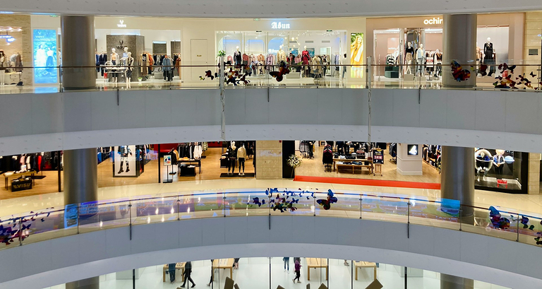

## Qu'est-ce que la politique de distribution ? Définition et pertinence

La politique de distribution, également appelée politique de vente, est un élément central de tout modèle d'entreprise réussi. Mais que signifie réellement la distribution ? Au sens économique du terme, il s'agit de la **distribution de biens économiques** - et ce, des fabricants aux consommateurs en passant par le commerce.

Avec votre politique de distribution, vous déterminez donc **comment vos produits ou services parviennent à vos clients**. Les tâches de la politique de distribution comprennent entre autres le choix des canaux de distribution, la gestion des stocks, le transport et le placement des produits sur le lieu de vente.

## Objectifs de la politique de distribution

Pour pouvoir proposer vos produits ou services au coût le plus bas possible, une distribution efficace est essentielle. Si l'on explique simplement la politique de distribution, on pourrait dire que le défi consiste à rendre vos produits disponibles de manière à ce qu'ils soient

- dans le meilleur état possible
- en quantité suffisante
- à différents endroits
- au bon moment
- atteignant de nombreux clients potentiels.

Les objectifs peuvent donc être résumés comme suit :



Présence sur le marché |||

Augmentez la disponibilité de vos produits dans tous les points de vente pertinents, par exemple dans les boutiques en ligne ou dans le commerce de détail stationnaire.

---

Satisfaction des clients |||

Assurez la stabilité des chaînes d'approvisionnement et des emballages pour que vos produits arrivent intacts et dans les délais chez vos clients.

---

Efficacité des coûts |||

Optimisez votre logistique de distribution pour éviter la surproduction, les ruptures de stock, les pertes et les réclamations, et ainsi réduire les coûts.

---

Augmentation du chiffre d'affaires |||

Essayez d'influencer positivement le comportement d'achat des clients en les plaçant stratégiquement aux bons points de vente.

---

Avantages concurrentiels |||

Assurez-vous des canaux de distribution exclusifs et ayez toujours une longueur d'avance sur vos concurrents grâce à une politique de distribution bien pensée.



## Le rôle de la politique de distribution dans le marketing mix

Outre la politique de produits, de prix et de communication, la politique de distribution fait partie des quatre instruments élémentaires du marketing-mix, décrits par E. Jerome McCarthy dès les années 1960. **On y distingue la distribution physique et la distribution par acquisition**, c'est-à-dire la distribution logistique et l'acquisition de clients, qui consiste à concevoir la stratégie de distribution et le processus de vente.

### La distribution physique

La distribution physique s'occupe de la **distribution de produits sur de grandes distances**. La question qui se pose ici est de savoir quelles zones vous souhaitez approvisionner en produits sur l'ensemble du territoire et combien de points de vente sont nécessaires à cet effet. Il en résulte la **logistique de distribution** nécessaire, dans laquelle vous planifiez les flux de marchandises et vous assurez que vos produits sont correctement emballés, transportés et stockés. Le **taux de distribution** indique ici le pourcentage de distributeurs qui proposent vos produits dans leur assortiment, par rapport à l'ensemble des distributeurs susceptibles de vendre vos produits.

### La distribution par acquisition

La distribution par acquisition vous permet d'établir des **contacts avec les clients**, de générer des **conclusions de vente** et de gagner des **parts de marché**. L'accent est mis en particulier sur l'acquisition de nouveaux clients, la fidélisation des clients existants et la reconquête des anciens clients. Une partie essentielle de votre stratégie de distribution consiste à définir vos **canaux de distribution et vos canaux de vente**, qui sont à leur tour fortement liés à votre politique de produits, de prix et de communication.

## Avantages et inconvénients des différents canaux de distribution

L'une des principales caractéristiques des canaux de distribution est la **différence entre distribution directe et indirecte**. Pour la classification, il est déterminant de savoir si le canal de distribution vous appartient en propre (par exemple, si vous vendez vos marchandises dans votre boutique en ligne ou dans vos propres filiales) ou si la vente se fait indirectement par le biais d'intermédiaires (par exemple, supermarchés, commerces spécialisés, franchises, plates-formes de commerce électronique). Une politique de distribution réussie a alors un impact immédiat sur votre chiffre d'affaires, votre structure de coûts, vos parts de marché et l'expérience client.

### Distribution directe

Si vos clients achètent directement chez vous, cela présente bien sûr quelques avantages :

- Vous avez le **contrôle total de la présentation et des prix** de vos produits.
- Sans intermédiaire, vous pouvez réaliser **des marges bénéficiaires plus élevées**.
- Vous établissez une **relation étroite avec vos clients** et disposez vous-même de **données clients précieuses**.

La distribution directe présente l'inconvénient que vous devez vous occuper vous-même de la vente, du stockage et de l'expédition des produits et que vous avez besoin de plus de ressources internes (surtout du personnel) pour la distribution et le service à la clientèle. De plus, il faut généralement plus de temps pour mettre en place ses propres canaux de distribution que pour utiliser les canaux de vente existants des commerçants.

### Distribution indirecte

En conséquence, la distribution indirecte présente les avantages suivants pour votre politique de distribution :

- Vous profitez des réseaux et des canaux de distribution existants ainsi que du **savoir-faire des distributeurs** qui connaissent bien le marché.
- Cela vous permet une **distribution rapide avec une grande portée** pour vos produits.
- Vous avez **des coûts fixes moins élevés**, car vous embauchez moins de personnel pour la distribution et le service clientèle et vous n'avez pas besoin d'entretenir vos propres magasins ou boutiques en ligne.

La vente indirecte a un impact négatif sur le contrôle des prix et la marge bénéficiaire en raison de la **dépendance vis-à-vis des distributeurs**. En outre, vous avez moins d'influence sur l'image de marque et le contact avec la clientèle.

## Les principaux canaux de la politique de distribution expliqués simplement

Tout le monde connaît certains canaux de distribution dans sa vie quotidienne - qu'il s'agisse de faire ses courses dans un **supermarché**, de faire du shopping dans des **magasins de vêtements** ou de commander dans une **boutique en ligne**. Mais il existe aussi des canaux de distribution plus spécifiques qui ne sont pas aussi courants. C'est pourquoi nous allons examiner de plus près dans cette section différents canaux de vente de la politique de distribution.

### Franchise

Dans la distribution indirecte, la franchise désigne un modèle commercial dans lequel une entreprise accorde à d'autres partenaires contractuels le droit de travailler sous sa **marque ombrelle** ou avec son concept commercial. Le franchiseur reçoit en contrepartie une **redevance** et peut imposer certaines normes aux franchisés. Ce type de distribution est par exemple très apprécié dans la restauration de système, où les différentes filiales sont généralement des **entreprises indépendantes** qui assument également le risque entrepreneurial. Néanmoins, l'expérience client ne peut guère être différenciée d'un point de vente à l'autre. En s'assurant par contrat **un droit de regard étendu sur la fixation des prix et la présentation des produits**, la marque ombrelle permet de compenser des inconvénients majeurs de la distribution indirecte.

### Revendeur

Un revendeur est un commerçant qui achète les produits ou les services d'une entreprise et les revend **sans les transformer**. Il ajoute une **marge commerciale** à son prix d'achat afin de réaliser un bénéfice lors de la vente. Les revendeurs se spécialisent souvent dans certains secteurs ou marques. Pour votre politique de distribution, il peut également être intéressant d'avoir des partenaires de distribution exclusifs avec lesquels vous convenez par contrat de proposer les marchandises de votre entreprise. Vous avez toutefois moins d'influence sur les prix et l'expérience client que dans le cas du franchisage.

### Commerce de gros

Dans la chaîne d'approvisionnement, le commerce de gros constitue souvent le **lien entre les producteurs et les clients de l'entreprise**. Les grossistes achètent des marchandises à grande échelle auprès de différents producteurs et les revendent à des clients professionnels tels que le commerce de détail, la restauration ou l'industrie de transformation. Pour combler le temps entre la production et la consommation de biens, le commerce de gros assume la fonction importante de **stockage**, qui implique des coûts de stockage élevés. Plus la quantité de marchandises que vous souhaitez distribuer à des points de vente individuels est importante, plus l'utilité de ce canal de distribution pour votre logistique de distribution est grande. Pour les **producteurs de biens de consommation** en particulier, le commerce de gros et de détail est indispensable pour faire circuler les marchandises à moindre coût.

### Maisons de vente par correspondance

Les maisons de vente par correspondance sont des entreprises qui proposent leurs produits dans des **catalogues** et des boutiques en ligne et les envoient aux clients par la poste ou par colis. Cela permet d'externaliser la distribution et de ne pas avoir à s'occuper de questions ennuyeuses telles que les **processus de commande et de paiement, l'expédition et les retours**. La préférence des clients va de plus en plus vers la commande de marchandises sur Internet et leur livraison à domicile. C'est pourquoi de nombreuses sociétés de vente par correspondance ont allégé leurs catalogues et misent de plus en plus sur leurs propres boutiques en ligne, ce qui brouille les frontières avec le commerce électronique.

### Plateformes de commerce électronique

L'e-commerce a connu un essor sans précédent au cours des dernières décennies. Il s'agit de plates-formes sur lesquelles vous pouvez vendre des biens ou des services **par internet**. Il peut s'agir de votre propre boutique en ligne pour la vente directe, mais aussi d'un **marché en ligne**. On peut citer ici en premier lieu les géants américains Amazon et eBay, mais aussi Temu en Chine et les sociétés allemandes de vente par correspondance Otto et Zalando qui s'en mêlent fortement. Les plates-formes de commerce électronique ont élargi les options de la politique de distribution et sont devenues incontournables pour de nombreuses entreprises. Le principal avantage par rapport à la vente stationnaire est la flexibilité de pouvoir prendre des commandes **à toute heure, de n'importe où et sans personnel**.

### Service extérieur et agents commerciaux

Néanmoins, des canaux de distribution dans le monde analogique peuvent encore s'avérer productifs. C'est notamment le cas pour les produits et services très chers ou nécessitant des explications, pour lesquels les clients potentiels souhaitent un **conseil intensif** avant l'achat. Dans le secteur B2B, il est courant d'avoir un **service extérieur** qui représente l'entreprise dans certaines zones géographiques et qui acquiert et gère les clients. Le pendant dans la distribution indirecte sont les **agents commerciaux indépendants** qui négocient et concluent des affaires en votre nom, mais qui, contrairement au service extérieur, ne sont pas employés par vous, mais travaillent sur la base de commissions.

## Distribution à l'aide de stratégies multicanales

Comme il existe de nombreux canaux de distribution, il n'est pas si facile de trouver la politique de distribution parfaite pour votre entreprise. Bien sûr, de nos jours, il est presque toujours avantageux d'avoir un site web bien conçu qui met en valeur vos produits ou services et qui, dans l'idéal, permet à vos clients de les commander immédiatement. Mais les boutiques en ligne ne conviennent pas de la même manière à toutes les entreprises. Pensez par exemple à un constructeur automobile dont les clients préfèrent voir, toucher et découvrir les véhicules dans les concessions automobiles. Il est donc fréquent que plusieurs canaux de distribution coexistent.

La plupart des entreprises qui réussissent aujourd'hui misent sur un mélange astucieux de distribution directe et indirecte. Les stratégies multicanales vous permettent d'approvisionner différents groupes cibles en fonction de leurs besoins. Il est important de coordonner les canaux de manière stratégique. Sans une image de marque uniforme, une gestion des données intercanal et une répartition claire des responsabilités, l'expérience client en pâtit et le client risque d'abandonner le processus d'achat. C'est pourquoi vous devez intégrer tous les canaux de votre politique de distribution de manière transparente afin de créer une expérience client cohérente.

## Facteurs de réussite pour votre stratégie de distribution

Si vous répondez à ces questions stratégiques fondamentales, vous êtes bien équipé pour votre politique de distribution :

1. **Quel type de marchandise vous proposez et quelle logistique de distribution elle exige?**

    Les produits périssables ou fragiles posent des exigences très différentes en matière de stockage, d'emballage et de transport que les vêtements, par exemple. En outre, les biens d'investissement nécessitant des explications doivent être distribués par d'autres moyens que les biens de consommation qui, en règle générale, parviennent aux consommateurs de manière indirecte via le commerce de gros et de détail.

2. **Qui sont vos concurrents et quels sont leurs marchés de vente?**

    Analysez en profondeur le positionnement et le pouvoir de marché de vos concurrents, le nombre et les caractéristiques des produits concurrents ainsi que les débouchés. Votre stratégie de vente et le choix de vos canaux de distribution doivent être adaptés au marché sur lequel vous souhaitez vendre vos produits.

3. **Où vos clients achètent-ils et quels sont les canaux de distribution qu'ils utilisent?**

    Identifiez le plus précisément possible les points de vente où vos produits doivent être présents pour atteindre vos groupes cibles. Pour les canaux de distribution, le nombre de clients potentiels, la taille de la zone de vente, la fréquence d'achat et les habitudes d'achat des clients sont pertinents.

## Exemples pratiques de politiques de distribution réussies

Apple est l'exemple parfait d'une politique de distribution réussie. En raison de sa notoriété et de sa puissance sur le marché, le groupe technologique américain mise désormais sur des canaux de distribution exclusifs - ses propres boutiques, des partenaires autorisés ("Premium Reseller") et une boutique en ligne convaincante. Grâce à ces canaux de distribution, Apple s'assure une image de marque uniforme, une forte fidélisation de la clientèle et des marges bénéficiaires élevées. Mais pour le grand public, les appareils Apple sont également disponibles dans les magasins d'électronique et sur les plates-formes de commerce électronique afin d'augmenter la disponibilité et de réduire les barrières à l'entrée.

Voici trois exemples fictifs d'un mélange équilibré de distribution directe et indirecte :

- Un fabricant de vis, de chevilles et de clous vend principalement ses produits par l'intermédiaire de grandes surfaces de bricolage, mais propose également son assortiment dans la boutique en ligne de l'entreprise, afin que les entreprises artisanales puissent commander directement chez lui.
- Un fabricant de produits de boulangerie surgelés vend ses produits via un grossiste qui les revend aux supermarchés. Au siège de l'entreprise, il exploite lui-même une boulangerie dans laquelle les visiteurs et les employés peuvent acheter les produits de boulangerie frais. En outre, l'entreprise mise sur un service extérieur qui acquiert de gros clients tels que des hôtels, des cafés ou des cantines.
- Une start-up décide de vendre ses produits directement via sa propre boutique en ligne. Toutefois, pour faciliter son entrée sur le marché, elle propose également ses marchandises sur des plateformes de commerce électronique au début.

## Conclusion : mettez votre politique de distribution à l'épreuve

Même le produit le meilleur et le moins cher ne sert à rien s'il n'est pas disponible dans un nombre suffisant de points de vente et donc difficile à trouver pour les clients potentiels. Vérifiez donc et remettez régulièrement en question les moyens par lesquels vos produits peuvent parvenir à vos clients. Un mélange astucieux de différents canaux de distribution vous permettra d'élargir votre politique de distribution et de réussir à long terme.

## Questions fréquentes sur la politique de distribution



Qu'est-ce que la distribution ? |||

En principe, on entend par distribution la répartition d'argent, de produits ou d'autres choses. Dans l'économie, la distribution signifie que les flux de marchandises vont des producteurs aux consommateurs via le commerce. En outre, dans cette définition, la distribution est utilisée comme synonyme de vente.

---

Qu'est-ce que la politique de distribution ? |||

Vous vous demandez peut-être : qu'est-ce que la politique de distribution ? En fait, votre politique de distribution (expliquée simplement) répond à la question de savoir par quels moyens vos produits ou services parviennent à vos clients. Dans le marketing mix, la politique de distribution fait partie des quatre aspects centraux, avec la politique de produit, la politique de prix et la politique de communication.

---

Qu'entend-on par logistique de distribution ? |||

La logistique est essentielle à la distribution physique. L'une des tâches de la politique de distribution consiste donc à réfléchir à la manière dont l'emballage, le stockage et le transport doivent être effectués pour que les produits arrivent rapidement et sans dommage sur les lieux de vente et chez les consommateurs. La distribution indirecte permet toutefois d'externaliser une grande partie de la logistique de distribution à des intermédiaires.


