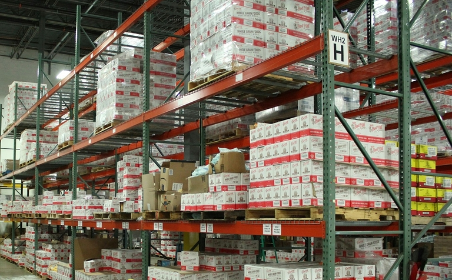

## O que é a política de distribuição? Definição e relevância

A política de distribuição, também conhecida como política de vendas, é uma componente central de qualquer modelo de negócio bem sucedido. Mas o que significa de facto distribuição? Em termos económicos, refere-se à **distribuição de bens económicos**, desde os fabricantes até aos retalhistas e consumidores.

Por conseguinte, a sua política de distribuição determina **como os seus produtos ou serviços chegam aos seus clientes**. As tarefas da política de distribuição incluem a seleção dos canais de venda, o armazenamento, o transporte e a colocação do produto no ponto de venda.

## Objectivos da política de distribuição

Para poder oferecer os seus produtos ou serviços ao menor custo possível, uma distribuição eficiente é de grande importância. Se a política de distribuição for explicada de forma simples, o desafio consiste em disponibilizar os seus produtos de forma a que estejam
- no melhor estado possível
- em quantidades suficientes
- em diferentes locais
- no momento certo
- chegando a muitos clientes potenciais.

Os objectivos podem, por conseguinte, ser resumidos da seguinte forma:



Presença no mercado |||

Aumente a disponibilidade dos seus produtos em todos os pontos de venda relevantes, por exemplo, em lojas online ou pontos de venda fixos.

---

Satisfação do cliente |||

Assegurar cadeias de abastecimento e embalagens estáveis para que os seus produtos cheguem ao cliente a tempo e sem danos.

---
  
Eficiência de custos |||

Optimize a sua logística de distribuição para evitar a sobreprodução, os estrangulamentos nas entregas, as perdas e as reclamações, e poupe custos.

---

Aumento das vendas |||

O objetivo é influenciar positivamente o comportamento de compra dos clientes através da colocação estratégica nos pontos de venda certos.

---

Vantagens competitivas |||

Garantir canais de distribuição exclusivos e estar um passo à frente da concorrência graças a uma política de distribuição bem pensada.



## O papel da política de distribuição no marketing mix

Juntamente com a política de produtos, de preços e de comunicação, a política de distribuição é um dos quatro instrumentos elementares do marketing mix descritos por E. Jerome McCarthy na década de 1960. **É feita uma distinção entre a distribuição física e a distribuição aquisitiva**, ou seja, a distribuição logística e a aquisição de clientes, que envolve a organização da estratégia de distribuição e o processo de distribuição.

### Distribuição física

A distribuição física diz respeito à **distribuição de produtos a longas distâncias**. Isto levanta a questão de saber em que áreas pretende fornecer os seus produtos numa base generalizada e quantos pontos de venda são necessários. Isto dá origem à necessária **logística de distribuição**, na qual o fluxo de mercadorias é planeado e é assegurado que os produtos são devidamente embalados, transportados e armazenados. O **grau de distribuição** indica a percentagem de retalhistas que têm os seus produtos no seu sortido, medida em relação ao número total de retalhistas que podem vender os seus produtos.

### Distribuição aquisitiva

A distribuição baseada na aquisição permite-lhe estabelecer **contactos com clientes**, gerar **negócios de vendas** e ganhar **parte de mercado**. Centra-se particularmente em atrair novos clientes, manter os actuais e reconquistar os antigos. Uma parte essencial da sua estratégia de distribuição é a definição dos seus **canais de distribuição e de venda**, que, por sua vez, estão intimamente ligados à sua política de produtos, de preços e de comunicação.

## Vantagens e desvantagens dos diferentes canais de distribuição

Uma das principais caraterísticas dos canais de distribuição é a **diferença entre distribuição direta e indireta**. O fator decisivo para a categorização é o facto de o canal de distribuição ser propriedade do próprio cliente (por exemplo, se vende os seus produtos na sua loja online ou nas suas próprias lojas) ou se as vendas são feitas indiretamente através de intermediários (por exemplo, supermercados, retalhistas especializados, franchisings, plataformas de comércio eletrónico). Uma política de distribuição bem sucedida tem um impacto imediato no seu volume de negócios, estrutura de custos, quota de mercado e experiência do cliente.

### Distribuição direta

Se os seus clientes comprarem diretamente a si, isto conduz naturalmente a uma série de vantagens:

* Tem **controlo total sobre a apresentação e os preços** dos seus produtos.
* Pode obter **margens de lucro mais elevadas** sem intermediários.
* Estabelece uma **relação estreita com o cliente** e dispõe de **dados valiosos sobre o cliente**.

A distribuição direta tem a desvantagem de ter de ser o próprio a tratar das vendas, do armazenamento e da expedição dos produtos e de necessitar de mais recursos internos (especialmente pessoal) para as vendas e o serviço ao cliente. Além disso, muitas vezes é necessário mais tempo para criar os seus próprios canais de distribuição do que para utilizar os canais de vendas existentes dos retalhistas.

### Distribuição indireta

A distribuição indireta oferece assim as seguintes vantagens para a sua política de distribuição:

* Beneficia das redes e canais de distribuição existentes, bem como do **conhecimento dos distribuidores** que estão familiarizados com o mercado.
* Isto permite-lhe distribuir os seus produtos de forma **rápida e com um vasto alcance**.
* Tem **custos fixos mais baixos**, uma vez que não tem de empregar tanto pessoal de vendas e de serviço ao cliente nem de manter as suas próprias lojas ou lojas em linha.

A distribuição indireta tem um impacto negativo no controlo dos preços e na margem de lucro devido à **dependência dos distribuidores**. Além disso, tem menos influência na presença da marca e no contacto com os clientes.

## Canais de distribuição importantes explicados de uma forma simples

Todos conhecemos alguns canais de distribuição do nosso quotidiano, quer se trate de fazer compras num **supermercado**, numa **loja de roupa** ou de encomendar numa **loja online**. Mas há também canais de venda mais especializados que não nos são tão familiares. É por isso que, nesta secção, vamos analisar mais de perto os diferentes canais de distribuição.

### Franquia

Na distribuição indireta, o franchising refere-se a um modelo de negócio em que uma empresa concede a outros parceiros contratuais o **direito de trabalhar sob a sua marca de referência** ou com o seu conceito de negócio. O franchisador recebe uma **comissão** por este facto e pode impor determinadas regras aos franchisados. Este tipo de distribuição é popular na restauração colectiva, por exemplo, onde as sucursais individuais são frequentemente **empresas independentes** que também assumem o risco empresarial. No entanto, a experiência do cliente dificilmente pode diferir de ramo para ramo. O franchising pode compensar as desvantagens significativas da distribuição indireta, garantindo contratualmente à marca de referência um **grande poder de decisão em termos de preços e de apresentação do produto**.

### Revendedores

Um revendedor é um comerciante que compra produtos ou serviços a uma empresa e revende-os **sem processamento adicional**. Acrescenta uma **marcação comercial** ao seu preço de compra, a fim de obter um lucro na venda. Os revendedores são geralmente especializados em determinados sectores ou marcas. Os parceiros de distribuição exclusivos, com os quais acorda contratualmente oferecer os produtos da sua empresa, também podem ser interessantes para a sua política de distribuição. No entanto, tem menos influência nos preços e na experiência do cliente do que no franchising.

### Comércio grossista

Dentro da cadeia de abastecimento, os grossistas são muitas vezes a **ligação entre os produtores e as empresas clientes**. Os grossistas compram bens em grande escala a vários produtores e vendem-nos a clientes comerciais, tais como retalhistas, o sector da restauração ou a indústria transformadora. Para colmatar a lacuna entre a produção e o consumo de bens, os grossistas desempenham a importante função de **armazenagem**, que está associada a elevados custos de armazenamento. Quanto maior for a quantidade de mercadorias que se pretende distribuir aos diferentes pontos de venda, maior será a vantagem deste canal de distribuição para a sua logística de distribuição. Para os **fabricantes de bens de consumo**, em particular, o comércio grossista e retalhista são indispensáveis para colocar as mercadorias em circulação de forma rentável.

### Empresas de venda por correspondência

As empresas de venda por correspondência são empresas que oferecem os seus produtos em **catálogos** e lojas online e os enviam aos clientes por correio ou serviço de encomendas. Isto permite-lhes subcontratar a distribuição e não ter de se preocupar com questões fastidiosas como **processos de encomenda e pagamento, envio e devoluções**. Os clientes preferem cada vez mais encomendar produtos em linha e recebê-los em casa. Consequentemente, muitas empresas de venda por correspondência reduziram os seus catálogos e dependem cada vez mais das suas próprias lojas em linha, esbatendo as fronteiras com o comércio eletrónico.

### Plataformas de comércio eletrónico

O comércio eletrónico registou um boom sem precedentes nas últimas décadas. Trata-se de plataformas nas quais é possível vender bens ou serviços **na Internet**. Pode ser a sua própria loja direta em linha, mas também um **mercado em linha**. Os gigantes americanos Amazon e eBay são os principais intervenientes nesta área, mas a Temu da China e as empresas alemãs de venda por correspondência Otto e Zalando também estão activas. As plataformas de comércio eletrónico alargaram as opções de política de distribuição e tornaram-se indispensáveis para muitas empresas. A maior vantagem em relação às vendas fixas é a flexibilidade de poderem aceitar encomendas **a qualquer momento, em qualquer lugar e sem intervenção humana**.

### Serviço de campo e representantes de vendas

No entanto, os canais de vendas do mundo analógico ainda podem ser produtivos. Isto aplica-se, em particular, a produtos e serviços muito dispendiosos ou explicativos, em que os potenciais clientes pretendem um **aconselhamento intensivo** antes de efectuarem uma compra. No sector B2B, em particular, é comum que uma empresa tenha a sua própria **força de vendas no terreno** para vendas diretas, que representa a empresa em determinadas áreas geográficas e adquire e apoia clientes. Na venda indireta, a contrapartida são os **representantes comerciais independentes**, que intermediam e fecham negócios em seu nome, mas não são seus empregados e trabalham à comissão.

## Distribuição com a ajuda de estratégias multi-canal

Uma vez que existem inúmeros canais de distribuição, não é fácil encontrar a política de distribuição perfeita para a sua empresa. É claro que, hoje em dia, é quase sempre uma vantagem ter um sítio Web bem concebido que apresente os seus produtos ou serviços e, idealmente, permita que os seus clientes os encomendem diretamente. No entanto, as lojas em linha não são igualmente adequadas para todas as empresas. Tomemos, por exemplo, um fabricante de automóveis cujos veículos os clientes preferem ver, tocar e experimentar nos concessionários. É por isso que, muitas vezes, existem vários canais de distribuição em paralelo.

Atualmente, as empresas mais bem sucedidas baseiam-se numa combinação inteligente de vendas diretas e indirectas. As estratégias multicanais permitem satisfazer as necessidades de diferentes grupos-alvo. É importante harmonizar estrategicamente os canais. Sem uma imagem de marca normalizada, uma gestão de dados multicanal e responsabilidades claras, a experiência do cliente é afetada e os clientes podem abandonar o processo de compra. Por conseguinte, integre perfeitamente todos os canais na sua política de distribuição para criar uma experiência consistente para o cliente.

## Factores de sucesso da sua estratégia de distribuição

Ao responder a estas questões estratégicas fundamentais, estará bem equipado para a sua política de distribuição:

1. **Que tipo de produtos oferece e de que logística de distribuição necessita?**
   
   Os produtos perecíveis ou frágeis têm requisitos de armazenamento, embalagem e transporte completamente diferentes dos do vestuário, por exemplo. Além disso, os canais de distribuição são diferentes para os bens de equipamento que necessitam de explicação do que para os bens de consumo, que tendem a chegar aos consumidores principalmente de forma indireta através de grossistas e retalhistas.

2. **Quem são os seus concorrentes e quais são os seus mercados de venda?**
   
   Analise cuidadosamente o posicionamento e o poder de mercado dos seus concorrentes, o número e as caraterísticas dos seus produtos e os seus mercados de venda. A sua estratégia de vendas e a escolha dos seus canais de venda devem ser adaptadas ao mercado em que pretende vender os seus produtos.

3. **Onde é que os seus clientes compram e que canais de distribuição utilizam?**
   
   Identifique com a maior precisão possível os pontos de venda onde os seus produtos devem estar presentes para chegar aos seus grupos-alvo. O número de clientes potenciais, a dimensão da área de vendas, a frequência de compra e os hábitos de compra dos clientes são relevantes para os canais de distribuição.

## Exemplos práticos de uma política de distribuição bem sucedida

A Apple é um bom exemplo de uma política de distribuição bem sucedida. Devido ao reconhecimento do seu nome e ao seu poder de mercado, o grupo tecnológico norte-americano baseia-se em canais de distribuição exclusivos: lojas próprias, parceiros autorizados ("revendedores premium") e uma loja em linha convincente. A Apple utiliza estes canais de distribuição para assegurar uma imagem de marca uniforme, uma forte fidelização dos clientes e margens de lucro elevadas. No entanto, os dispositivos Apple também estão disponíveis para o público em geral em lojas de eletrónica e plataformas de comércio eletrónico para aumentar a disponibilidade e reduzir as barreiras à entrada.

Seguem-se três exemplos fictícios de uma combinação equilibrada de vendas diretas e indirectas:

* Um fabricante de parafusos, buchas e pregos vende os seus produtos principalmente através de lojas de bricolage, mas também oferece a sua gama na sua própria loja em linha, para que os retalhistas possam encomendá-la diretamente.
* Um fabricante de produtos de padaria congelados vende os seus produtos através de um grossista que os vende a supermercados. A empresa tem uma padaria no local, onde os visitantes e os empregados podem comprar produtos de padaria frescos. A empresa também tem uma força de vendas que atrai clientes importantes, como hotéis, cafetarias e cantinas.
* Uma empresa em fase de arranque decide vender os seus produtos diretamente através da sua própria loja em linha. No entanto, para facilitar a sua entrada no mercado, inicialmente também oferece os seus produtos em plataformas de comércio eletrónico.

## Conclusão: teste a sua política de distribuição

Mesmo o melhor e mais barato produto é inútil se não estiver disponível em pontos de venda suficientes e, por conseguinte, se for difícil de encontrar pelos potenciais clientes. Por conseguinte, reveja e examine regularmente as formas como os seus produtos podem chegar aos seus clientes. Uma combinação inteligente de diferentes canais de venda diversificará a sua política de distribuição e conduzirá ao sucesso a longo prazo.

## Perguntas frequentes sobre a política de distribuição



O que é a distribuição? |||

Basicamente, a distribuição é a distribuição de dinheiro, produtos ou outros objectos. No mundo dos negócios, distribuição significa o fluxo de bens desde os fabricantes, passando pelos retalhistas, até aos consumidores. Nesta definição, a distribuição é também utilizada como sinónimo de vendas.

---

O que significa política de distribuição? |||

Poderá estar a perguntar-se: o que é a política de distribuição? Basicamente, a sua política de distribuição responde à questão de saber como é que os seus produtos ou serviços chegam aos seus clientes. No marketing mix, a política de distribuição é um dos quatro aspectos centrais, juntamente com a política de produtos, preços e comunicação.

---

O que é a logística de distribuição? |||

A logística é crucial para a distribuição física. Por conseguinte, uma das tarefas da política de distribuição consiste em analisar a forma como a embalagem, a armazenagem e o transporte devem ser organizados para que os produtos cheguem ao ponto de venda e ao consumidor rapidamente e sem danos. No entanto, a distribuição indireta permite que uma grande parte da logística de distribuição seja subcontratada a intermediários.

