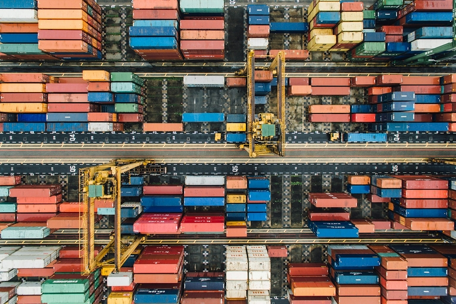

## Что такое политика дистрибуции? Определение и значение

Политика дистрибуции, также известная как политика продаж, является центральным компонентом любой успешной бизнес-модели. Но что на самом деле означает дистрибуция? В экономических терминах это **распределение экономических товаров** - от производителей к розничным торговцам и потребителям.

Таким образом, ваша политика распределения определяет **как ваши товары или услуги попадают к вашим клиентам**. В задачи политики дистрибуции входит выбор каналов сбыта, складирование, транспортировка и размещение продукции в местах продаж.

## Цели политики дистрибуции

Для того чтобы иметь возможность предлагать свои товары или услуги по минимально возможной цене, эффективная дистрибуция имеет огромное значение. Если объяснять политику распределения просто, то можно сказать, что задача состоит в том, чтобы сделать вашу продукцию доступной таким образом, чтобы она была

- в наилучшем состоянии
- в достаточном количестве
- в разных местах
- в нужное время
- чтобы они дошли до многих потенциальных покупателей.

Таким образом, цели можно сформулировать следующим образом:



Присутствие на рынке |||

Повысьте доступность вашей продукции во всех соответствующих точках продаж, например, в интернет-магазинах или стационарных торговых точках.

---

Удовлетворенность клиентов |||

Обеспечьте стабильные цепи поставок и упаковку, чтобы ваша продукция доходила до клиента вовремя и без повреждений.

---

Экономическая эффективность |||

Оптимизируйте логистику дистрибуции, чтобы избежать перепроизводства, узких мест в доставке, потерь и рекламаций и тем самым сократить расходы.

---

Увеличение продаж |||

Попытайтесь положительно повлиять на покупательское поведение клиентов с помощью стратегического размещения в нужных точках продаж.

---

Конкурентные преимущества |||

Обеспечьте эксклюзивные каналы сбыта и будьте на шаг впереди конкурентов благодаря продуманной политике дистрибуции.



## Роль политики дистрибуции в маркетинг-миксе

Наряду с товарной, ценовой и коммуникационной политикой, политика распределения является одним из четырех элементарных инструментов маркетинг-микса, описанного Э. Джеромом Маккарти еще в 1960-х годах. **Различают физическую и приобретательскую дистрибуцию**, то есть логистическое распределение и привлечение клиентов, что подразумевает организацию стратегии дистрибуции и процесса распределения.

### Физическое распределение

Физическая дистрибуция связана с **распределением продукции на большие расстояния**. В связи с этим возникает вопрос о том, в какие районы вы хотите поставлять свою продукцию и сколько точек продаж необходимо. В результате возникает необходимость **распределительной логистики**, в рамках которой вы планируете движение товаров и обеспечиваете их правильную упаковку, транспортировку и хранение. Степень дистрибуции\*\* - это процент розничных магазинов, которые имеют в своем ассортименте вашу продукцию, по отношению к общему числу розничных магазинов, которые имеют право продавать вашу продукцию.

### Распространение на основе приобретения

Дистрибуция, основанная на приобретении, позволяет вам устанавливать **контакты с клиентами**, заключать **продажные сделки** и завоевывать **долю рынка**. Особое внимание уделяется привлечению новых клиентов, удержанию существующих и возвращению бывших клиентов. Важнейшей частью стратегии дистрибуции является определение **каналов дистрибуции и каналов продаж**, которые, в свою очередь, тесно связаны с вашей продукцией, ценовой и коммуникационной политикой.

## Преимущества и недостатки различных каналов дистрибуции

Одной из основных характеристик каналов распределения является **различие между прямой и непрямой дистрибуцией**. Решающим фактором для классификации является то, владеете ли вы каналом распределения самостоятельно (например, если вы продаете свои товары в интернет-магазине или собственных магазинах) или же продажи осуществляются косвенно через посредников (например, супермаркеты, специализированные розничные сети, франшизы, платформы электронной коммерции). Успешная политика дистрибуции оказывает непосредственное влияние на ваш оборот, структуру затрат, долю рынка и впечатления покупателей.

### Прямая дистрибуция

Если ваши клиенты покупают у вас напрямую, это, естественно, дает ряд преимуществ:

- Вы имеете **полный контроль над презентацией и ценообразованием** вашей продукции.
- Вы можете добиться **высокой нормы прибыли** без посредников.
- Вы устанавливаете **близкие отношения с клиентами** и сами располагаете **ценными данными о покупателях**.

Недостатком прямой дистрибуции является то, что вы должны сами заботиться о продаже, хранении и отправке продукции и нуждаться в большем количестве внутренних ресурсов (особенно персонала) для продаж и обслуживания клиентов. Кроме того, создание собственных каналов сбыта обычно занимает больше времени, чем использование существующих каналов сбыта от розничных торговцев.

### Косвенные продажи

Соответственно, непрямая дистрибуция дает следующие преимущества для вашей политики дистрибуции:

- Вы получаете выгоду от существующих сетей и каналов сбыта, а также от **знаний дилеров**, хорошо знакомых с рынком.
- Это позволяет вам распространять свою продукцию **быстро и с широким охватом**.
- У вас **меньше постоянных расходов**, так как вам не нужно нанимать много сотрудников для продаж и обслуживания клиентов и не нужно содержать собственные магазины или интернет-магазины.

Непрямая дистрибуция оказывает негативное влияние на контроль цен и маржу прибыли из-за **зависимости от дистрибьюторов**. Кроме того, вы в меньшей степени влияете на присутствие бренда и контакты с клиентами.

## Важные каналы сбыта политики дистрибуции объясняются просто

Каждый человек знаком с некоторыми каналами сбыта из своей повседневной жизни - будь то покупка в **супермаркете**, в **магазине одежды** или заказ в **интернет-магазине**. Но есть и более специализированные каналы сбыта, которые не так хорошо знакомы. Поэтому в этом разделе мы подробно рассмотрим различные каналы сбыта.

### Франшиза

В непрямой дистрибуции франшиза означает бизнес-модель, в которой компания предоставляет другим договорным партнерам право работать под ее зонтиком или с ее бизнес-концепцией. За это франчайзер получает **зарплату** и может навязывать франчайзи определенные стандарты. Такой тип дистрибуции популярен, например, в системном общественном питании, где отдельные филиалы обычно являются **независимыми компаниями**, которые также несут предпринимательский риск. Тем не менее, клиентский опыт вряд ли может быть дифференцирован от филиала к филиалу. Обеспечивая по договору **широкое право на ценообразование и представление продукции** для зонтичного бренда, франчайзинг может компенсировать существенные недостатки непрямой дистрибуции.

### Реселлер

Торговый посредник - это дилер, который приобретает товары или услуги у компании и перепродает их **без дальнейшей обработки**. Он добавляет **торговую маржу** к своей закупочной цене, чтобы получить прибыль от продажи. Торговые посредники часто специализируются на определенных секторах или брендах. Эксклюзивные партнеры по сбыту, с которыми вы заключаете договор о предложении товаров вашей компании, также могут быть интересны для вашей политики сбыта. Однако вы в меньшей степени, чем при франчайзинге, можете влиять на цены и качество обслуживания клиентов.

### Оптовая торговля

В цепочке поставок оптовики часто являются **связующим звеном между производителями и корпоративными клиентами**. Оптовики закупают товары в больших объемах у различных производителей и продают их коммерческим клиентам, таким как розничные торговцы, предприятия общественного питания или перерабатывающей промышленности. Чтобы сократить разрыв между производством и потреблением товаров, оптовики выполняют важную функцию **складирования**, которая связана с высокими затратами на хранение. Чем большее количество товаров вы хотите распределить по отдельным торговым точкам, тем больше пользы от этого канала распределения для вашей распределительной логистики. В частности, для **производителей потребительских товаров** оптовая и розничная торговля незаменимы для экономически эффективного ввода товаров в оборот.

### Компании почтовых заказов

Компании, заказывающие товары по почте, - это компании, которые предлагают свои товары в **каталогах** и интернет-магазинах и отправляют их клиентам по почте или посылками. Это позволяет вам передать дистрибуцию на аутсорсинг и не беспокоиться о таких утомительных вопросах, как **заказ и процесс оплаты, доставка и возврат**. Покупатели все чаще предпочитают заказывать товары через Интернет и получать их на дом. В результате многие компании, занимающиеся почтовыми заказами, сократили свои каталоги и все больше полагаются на собственные интернет-магазины, размывая границы с электронной коммерцией.

### Платформы электронной коммерции

В последние десятилетия электронная коммерция переживает небывалый бум. Это платформы, на которых вы можете продавать товары или услуги **через Интернет**. Это может быть как ваш собственный интернет-магазин для прямых продаж, так и **онлайн-маркетплейс**. Основными игроками здесь являются американские гиганты Amazon и eBay, но также активно участвуют китайская компания Temu и немецкие компании Otto и Zalando, занимающиеся почтовыми заказами. Платформы электронной коммерции расширили возможности дистрибуции и стали незаменимыми для многих компаний. Самое большое преимущество перед стационарными магазинами - это гибкость, позволяющая принимать заказы **круглосуточно, из любого места и без персонала**.

### Выездное обслуживание и торговые представители

Тем не менее, каналы продаж в аналоговом мире все еще могут оказаться продуктивными. Особенно это касается очень дорогих продуктов и услуг или тех, которые требуют объяснений, когда потенциальные клиенты хотят получить **интенсивную консультацию** перед совершением покупки. В секторе B2B, в частности, для прямых продаж характерно наличие у компании собственного **полевого отдела продаж**, который представляет компанию в определенных географических регионах, приобретает и поддерживает клиентов. Аналогом непрямых продаж являются **самостоятельные торговые представители**, которые выступают посредниками и заключают сделки от вашего имени, но, в отличие от торговых представителей, не нанимаются вами, а работают на комиссионной основе.

## Дистрибуция с помощью многоканальных стратегий

Поскольку существует множество каналов дистрибуции, не так-то просто найти идеальную политику распространения для вашей компании. Конечно, в наше время почти всегда выгодно иметь хорошо оформленный веб-сайт, на котором представлены ваши товары или услуги, а в идеале - клиенты могут сразу же их заказать. Однако интернет-магазины подходят не всем компаниям. Возьмем, к примеру, автопроизводителя, чьи автомобили клиенты предпочитают видеть, трогать и испытывать в дилерских центрах. Поэтому часто параллельно существует несколько каналов сбыта.

Большинство успешных компаний сегодня полагаются на разумное сочетание прямых и непрямых продаж. Многоканальные стратегии позволяют удовлетворять потребности различных целевых групп. Важно стратегически согласовать каналы. Без стандартизированного образа бренда, кросс-канального управления данными и четкой ответственности страдает клиентский опыт, и покупатель может отказаться от покупки. Поэтому интегрируйте все каналы вашей дистрибьюторской политики, чтобы создать единый потребительский опыт.

## Факторы успеха для вашей стратегии дистрибуции

Если вы ответите на эти основополагающие стратегические вопросы, вы будете хорошо подготовлены к реализации своей стратегии дистрибуции:

1. **Какой тип товаров вы предлагаете и какая логистика дистрибуции для этого требуется?**

    Скоропортящиеся или хрупкие товары имеют совершенно иные требования к хранению, упаковке и транспортировке, чем, например, одежда. Кроме того, для капитальных товаров, требующих разъяснений, существуют иные каналы распределения, чем для потребительских товаров, которые, как правило, попадают к потребителям в основном опосредованно, через оптовые и розничные магазины.

2. **Кто является вашими конкурентами и каковы их рынки сбыта?**

    Тщательно проанализируйте позиционирование и рыночную силу ваших конкурентов, количество и характеристики их продукции, а также их рынки сбыта. Ваша стратегия продаж и выбор каналов сбыта должны соответствовать рынку, на котором вы хотите продавать свою продукцию.

3. **Где покупают ваши клиенты и какие каналы сбыта они используют?**

    Как можно точнее определите точки продаж, где должна быть представлена ваша продукция, чтобы охватить целевые группы. Количество потенциальных клиентов, размер торговой площади, частота покупок и покупательские привычки клиентов имеют значение для каналов распределения.

## Практические примеры успешной политики дистрибуции

Apple - яркий пример успешной политики дистрибуции. Благодаря узнаваемости своего имени и рыночной власти американский технологический концерн сегодня полагается на эксклюзивные каналы дистрибуции - собственные магазины, авторизованных партнеров ("премиум-реселлеров") и убедительный интернет-магазин. Apple использует эти каналы дистрибуции, чтобы обеспечить единый имидж бренда, лояльность покупателей и высокую рентабельность. Однако устройства Apple также доступны широкой публике в магазинах электроники и на платформах электронной коммерции, чтобы повысить доступность и снизить барьеры для входа.

Ниже приведены три вымышленных примера сбалансированного сочетания прямых и непрямых продаж:

- Производитель шурупов, дюбелей и гвоздей продает свои товары в основном через магазины DIY, но также предлагает свой ассортимент в собственном интернет-магазине, чтобы торговцы могли делать заказы непосредственно у него.
- Производитель замороженной выпечки продает свою продукцию через оптовика, который продает ее в супермаркеты. В штаб-квартире компании работает пекарня, где посетители и сотрудники могут купить свежую выпечку. Компания также опирается на отдел продаж, который привлекает крупных клиентов, таких как отели, кафе и столовые.
- Начинающая компания решает продавать свою продукцию напрямую через собственный интернет-магазин. Однако, чтобы облегчить выход на рынок, он первоначально предлагает свои товары на платформах электронной коммерции.

## Заключение: проверьте свою политику дистрибуции на практике

Даже самый лучший и дешевый товар бесполезен, если он не представлен в достаточном количестве торговых точек и его трудно найти потенциальным покупателям. Поэтому регулярно пересматривайте и тщательно анализируйте способы, с помощью которых ваши товары могут попасть к покупателям. Умелое сочетание различных каналов сбыта разнообразит вашу политику распространения и приведет к долгосрочному успеху.

## Часто задаваемые вопросы о политике дистрибуции



Что такое дистрибуция? |||

По сути, дистрибуция - это распределение денег, продуктов или других вещей. В бизнесе дистрибуция означает движение товаров от производителей через розничные сети к потребителям. Кроме того, в этом определении дистрибуция используется как синоним продаж.

---

Что означает политика дистрибуции?? |||

Вы можете спросить себя: что такое политика распространения? По сути, ваша политика дистрибуции (проще говоря) отвечает на вопрос, как ваши товары или услуги попадают к вашим клиентам. В маркетинг-миксе политика дистрибуции является одним из четырех центральных аспектов, наряду с товарной, ценовой и коммуникационной политикой.

---

Что такое логистика распределения? |||

Логистика имеет решающее значение для физического распределения. Поэтому одна из задач политики распределения - продумать, как организовать упаковку, хранение и транспортировку, чтобы продукция быстро и без повреждений доставлялась в точки продаж и к потребителю. Однако непрямая дистрибуция позволяет передать значительную часть логистики распределения посредникам.


