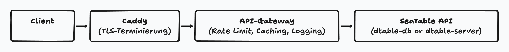

Avec la sortie de SeaTable v5.3, l'API de SeaTable sera exclusivement accessible via la nouvelle passerelle API. L'accès direct aux anciens points de terminaison de `dtable-db` et `dtable-server` **est totalement supprimé**.

Après avoir annoncé ce changement important [sur le forum](https://forum.seatable.com/t/important-changes-to-the-seatable-cloud-api-in-version-5-3/6677), nous expliquons dans cet article le contexte de ce changement, les avantages concrets ainsi que les points les plus importants auxquels les développeurs doivent désormais prêter attention.

## Cible de cet article

Cet article s'adresse en premier lieu aux **développeurs** qui ont construit leurs propres solutions basées sur l'API SeaTable, ainsi qu'aux personnes intéressées par la technique qui souhaitent en savoir plus sur l'architecture de SeaTable.

Pour les utilisateurs qui travaillent exclusivement dans l'interface web ou qui utilisent des intégrations via [n8n](https://n8n.io/integrations/seatable/), [Zapier](https://zapier.com/apps/seatable/integrations) ou [Make.com](https://www.make.com/en/integrations/seatable), le changement est certes intéressant, mais pas pertinent dans la pratique.

## Accès à l'API SeaTable jusqu'à présent

Dans SeaTable, l'accès aux données SeaTable se fait par deux composants différents :

- **dtable-server** : Représente le contenu d'une base sous forme de JSON, génère la vue tabulaire et permet la collaboration en temps réel.
- **dtable-db** : Offre un langage de requête similaire à SQL et sert d'interface avec le backend Big Data.

En conséquence, il y avait deux structures d'API : par exemple, les lignes d'une table étaient sorties par `/dtable-server/api/v1/{base_uuid}/rows/`, tandis que les requêtes SQL passaient par `/dtable-db/api/v1/query/{base_uuid}/`. Il était possible de définir des limites pour les deux API, mais il n'existait pas de limite centrale pour l'ensemble de l'équipe.

## Défis à relever : Utilisation inégale et manque de transparence

Notre analyse détaillée de l'utilisation de l'API montre une image claire : la grande majorité des utilisateurs de SeaTable travaillent soit exclusivement dans l'interface web, soit n'utilisent l'API qu'occasionnellement. En même temps, il y a cependant des utilisateurs qui sollicitent l'API de manière intensive. SeaTable Cloud traite ainsi jusqu'à un demi-million de requêtes API par jour - et plus de 70% de ces requêtes API externes proviennent de seulement 20 bases ou des dix équipes les plus actives.

De plus, nous pouvons observer que beaucoup de ces demandes proviennent d'intégrations ou d'automatisations développées en interne et qui ne sont pas programmées de manière optimale. Cela signifie que de grandes quantités de données sont récupérées, que de nombreuses demandes se répètent inutilement et qu'il est rarement fait appel à des stratégies de requête ou de mise en cache efficaces. Dans la pratique, cela conduit certaines équipes à générer des dizaines de milliers de requêtes par jour - souvent pour lire et écrire des données comme dans une base de données SQL classique.

Pour un produit SaaS public comme SeaTable Cloud, c'est un défi de taille. L'infrastructure doit être performante et stable pour tous. En même temps, la charge due à l'utilisation intensive de l'API doit être amortie. Si de tels pics de charge se produisent, cela peut nuire à la performance pour tous les utilisateurs - par exemple en raison de temps de chargement plus longs ou de temps de réponse retardés de l'API. Sans transparence et sans contrôle ciblé de l'utilisation de l'API, il n'est guère possible de garantir une expérience d'utilisation rapide et stable pour toutes les équipes.

## Limites actuelles de l'API : trop grossières et peu transparentes

Jusqu'à la version 5.3, l'API SeaTable n'avait que des limites relativement élevées en termes de minutes et des limites modérées en termes d'heures ou de jours - toujours par base et séparément pour `dtable-server` et `dtable-db`. De ce fait, les limites pouvaient être facilement contournées et un contrôle centralisé n'était guère possible.

En outre, les utilisateurs ne pouvaient pas voir combien d'appels API ils avaient déjà utilisés. Ni l'interface web ni l'API n'indiquaient les quotas actuels. Il était donc difficile de contrôler sa propre utilisation ou de réagir à temps à une limite imminente.

Du point de vue du fournisseur, ce système était également insatisfaisant : une tarification ou un contrôle ciblé de l'utilisation intensive n'était pratiquement pas possible. Certains utilisateurs intensifs pouvaient surcharger le système sans que cela soit transparent ou qu'il soit possible de le limiter de manière appropriée.

## La nouvelle passerelle API : contrôle centralisé et transparence

Afin de répondre aux exigences croissantes en matière de stabilité et de transparence, et en même temps de mieux gérer la complexité croissante de l'utilisation de l'API, nous avons décidé d'introduire une interface centrale, la nouvelle passerelle API, qui offre de nombreux avantages à tous les groupes d'utilisateurs :

- **Point d'entrée central:** Toutes les demandes d'API passeront dorénavant par la passerelle, qui agira comme un reverse proxy.
- **Harmonisation des limites:** Il y a désormais une limite centrale de minutes et de mois par équipe, en fonction de la taille de l'équipe et de l'abonnement.
- **Transparence:** L'utilisation actuelle est visible à tout moment dans l'interface web. De plus, les en-têtes x-ratelimit dans l'API renvoient les valeurs actuelles.
- **Performance:** Les demandes répétées peuvent être répondues à partir du cache, ce qui réduit la charge sur les systèmes backend.

## Procédure technique :

Chaque demande adressée à l'API SeaTable passe désormais toujours en premier lieu par le serveur Caddy, qui assure la sécurité de la connexion. Ensuite, la passerelle API prend le relais : elle vérifie les limites, crée des logs et répond aux demandes récurrentes directement depuis le cache. Ce n'est que si nécessaire que la demande est transmise aux services internes de SeaTable (`dtable-db` ou `dtable-server`). L'API reste ainsi rapide, sûre et équitable pour toutes les équipes.



## Qu'est-ce que cela signifie concrètement pour les développeurs ?

- Les anciens points de terminaison de `dtable-db` et `dtable-server` ne sont plus supportés à partir de la version 5.3. Les demandes adressées à ces points finaux entraînent des messages d'information correspondants.
- Les solutions et intégrations individuelles doivent être adaptées aux nouveaux points finaux de la passerelle API. La documentation à ce sujet se trouve sous [api.seatable.com](https://api.seatable.com).
- Les intégrations standard (_n8n_, _Zapier_, _Make.com_) ainsi que les scripts internes de SeaTable ont déjà été convertis aux nouveaux points de terminaison et continuent de fonctionner sans adaptation.

## Nouvelles limites de l'API : simple, transparente, à l'échelle de l'équipe

A l'avenir, seules deux limites régiront l'accès à une base SeaTable :

- **Limite minute:** Protège contre les pics de charge à court terme et les abus.
- **Limite mensuelle:** elle dépend de la taille de l'équipe et de l'abonnement. Les équipes plus grandes reçoivent proportionnellement plus de requêtes API par mois.

L'utilisation et les quotas restants peuvent être consultés à tout moment dans l'interface web et via les `API-Header`. En cas de dépassement de la limite mensuelle, l'abonnement de l'équipe peut être directement étendu afin de pouvoir faire immédiatement de nouvelles demandes.

Voici un exemple des `x-ratelimit-header` retournés sur la ligne de commande :

```
x-powered-by : Passerelle api SeaTable
x-ratelimit-limit : 200
x-ratelimit-remaining : 199
x-ratelimit-reset : 1748424867
```

Comme on peut le voir dans l'exemple, l'API SeaTable renvoie ce que l'on appelle des `en-têtes de limite de taux` à chaque appel.

Ces en-têtes indiquent le nombre de requêtes API que vous pouvez actuellement faire par minute (`x-ratelimit-limit`), combien il en reste dans la fenêtre de temps actuelle (`x-ratelimit-remaining`) et quand la limite sera réinitialisée (`x-ratelimit-reset`, comme horodatage Unix).

Pour des raisons techniques, l'API indique toujours ici la limite en minutes, car celle-ci peut être vérifiée rapidement et sans requêtes complexes dans la base de données. Cependant, si la limite mensuelle de votre équipe est atteinte, l'API renvoie la valeur 0 pour `x-ratelimit-remaining` et l'heure du prochain début de mois lors de la réinitialisation. Ce comportement a été délibérément mis en place afin d'éviter des interrogations inutiles de la base de données à chaque demande et de maintenir des performances élevées.

Vous savez ainsi à tout moment combien de demandes vous pouvez encore faire actuellement - et vous êtes informé à temps lorsque vous avez atteint une limite. Dans l'interface web, vous voyez à tout moment la limite mensuelle de l'équipe et votre consommation actuelle. Vous trouverez plus de détails sur l'API et les limites dans la [documentation officielle](https://api.seatable.com).



Les limites finales ne sont pas encore fixées au lancement. Nous observerons l'utilisation effective de la passerelle pendant une à deux semaines, puis nous fixerons successivement les limites. Notre objectif est que 99% des utilisateurs ne remarquent même pas les nouvelles limites de l'API.



## Avantages en termes de performance et de coûts

La mise en cache dans la passerelle permet de répondre plus rapidement aux demandes de lecture fréquentes sans surcharger à chaque fois le backend. Parallèlement, le nouveau modèle permet aux équipes ayant des besoins très élevés en API de payer à l'avenir de manière ciblée pour leur utilisation - ce qui maintient les coûts stables pour toutes les autres équipes.

## Conclusion

Avec la version 5.3, SeaTable pose les jalons d'une utilisation des API à l'épreuve du temps, équitable et performante. Les développeurs doivent adapter leurs solutions aux nouveaux points finaux, mais ils bénéficient d'une plus grande transparence, de meilleures performances et de règles claires.
