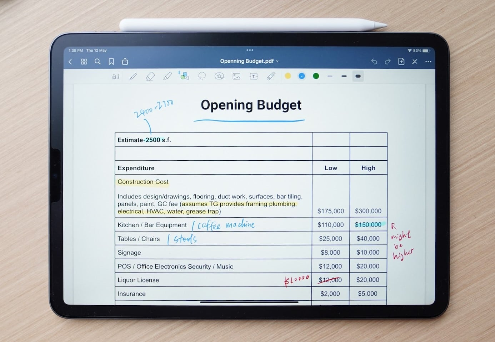

**¿Ha elaborado ya su presupuesto para el próximo año?** Si no es así, ha llegado el momento: cuanto antes sepa de cuánto dinero dispone, con mayor precisión podrá iniciar las medidas para alcanzar sus objetivos: ¿Quiere contratar a más empleados o está planeando una gran campaña publicitaria? No importa lo que tenga en mente, este artículo le proporcionará valiosos consejos para planificar su presupuesto.

El siguiente artículo trata de la **planificación presupuestaria en las empresas** y de la mejor forma de abordarla. Para **los hogares** recomendamos un [libro de presupuestos]().

## ¿Qué es la elaboración de un presupuesto?

La presupuestación – también conocida como planificación presupuestaria o asignación presupuestaria – trata, como su nombre indica, de **la asignación de presupuestos y la planificación de recursos**. Por definición, la planificación presupuestaria se realiza para el futuro, normalmente para el ejercicio financiero siguiente. Por un lado, se puede determinar el presupuesto para toda la empresa y, por otro, llevar a cabo una **presupuestación detallada para departamentos específicos o proyectos individuales**. El plan presupuestario resultante especifica a dónde debe ir a parar el dinero disponible en la empresa y qué objetivos quiere alcanzar con él y en qué periodo de tiempo.

## Ventajas de la planificación presupuestaria prospectiva

- **Distribución razonable del presupuesto**: La planificación presupuestaria le ayuda a distribuir el dinero y los recursos de forma sensata entre los departamentos y proyectos y a utilizarlos específicamente allí donde aportarán el mayor beneficio posible.
- **Objetivos vinculantes**: Con un plan presupuestario vinculante, puede asegurarse de que sus directivos formulen objetivos claros y tomen medidas eficaces para alcanzarlos.  

- **Transparencia financiera**: La elaboración de presupuestos proporciona claridad sobre en qué se gasta el dinero. Puede vigilar los costes y los objetivos, medir el éxito y anticiparse a los acontecimientos indeseables.
- **Inversiones prioritarias**: La lista de deseos en los departamentos suele ser larga. Un presupuesto fijo le ayuda a priorizar las inversiones cruciales y a evitar gastos innecesarios.

## El presupuesto va de la mano de la planificación financiera

La planificación **presupuestaria operativa** forma parte de la planificación financiera a corto plazo, en la que usted estima sus ingresos y gastos futuros para el año siguiente. Utiliza los datos del ejercicio en curso y/o del anterior para obtener previsiones de la evolución futura. A diferencia de la planificación financiera, la presupuestación se centra generalmente en la parte de los gastos, independientemente de la procedencia del dinero.

La planificación **presupuestaria estratégica** para los próximos dos a cinco años también es bastante habitual. Esto le ayuda a tomar decisiones empresariales a largo plazo que impulsarán a su empresa y garantizarán su éxito, como la apertura de nuevas sedes. Sin embargo, cuanto más lejos en el futuro esté el horizonte de planificación, más difícil e incierto será hacer una previsión precisa.



## El proceso de presupuestación - cómo planificar su presupuesto

¿Cuál es la mejor manera de elaborar un presupuesto? Aunque no existe una solución única para todos los casos, puede seguir algunos pasos y procedimientos para la planificación presupuestaria que se han establecido en muchas empresas. No obstante, los puntos siguientes presuponen que ya se ha elaborado un presupuesto inicial o que es posible comparar cifras de años anteriores.

- Investigue si hay cambios significativos en sus cifras financieras clave (por ejemplo, volumen de negocio, beneficios, costes) en comparación con el periodo de referencia anterior.
- Sobre esta base, prevea la evolución futura del presupuesto disponible para toda la empresa.
- Ahora es el momento de asignar el presupuesto: coordine los subpresupuestos con los distintos departamentos utilizando los siguientes procedimientos.

### ¿Qué métodos de presupuestación existen?

Existen tres procedimientos o métodos de presupuestación que han demostrado ser especialmente exitosos:

- **Descendente**: La dirección determina el presupuesto global, así como la asignación presupuestaria, y a continuación los directores de departamento/proyecto planifican las medidas que pueden aplicar con él.
- **De abajo arriba**: Aquí, los propios directores de departamento/proyecto determinan qué presupuesto necesitan para sus tareas y pasan la planificación presupuestaria a los responsables de la toma de decisiones. Éstos suman los subpresupuestos, los comparan con el presupuesto global y determinan lo que se aprueba.
- **Procedimiento de contracorriente**: Aquí se combinan el enfoque descendente y el ascendente. La dirección fija los objetivos, pero no entra en detalles sobre la elaboración del presupuesto. A continuación, los responsables de departamento/proyecto desarrollan medidas adecuadas y concretan los gastos previstos. Por último, el nivel directivo debe revisar la presupuestación y armonizarla con el presupuesto global.

## Posibles problemas con la planificación presupuestaria

Como todos los procesos empresariales, la elaboración de presupuestos puede desarrollarse más o menos bien. Debe ser consciente de algunos escollos, aunque es imposible prepararse para todas las eventualidades.

Pueden surgir los siguientes problemas:

- En función de la **complejidad de la estructura de la empresa** (por ejemplo, filiales, sedes, niveles de organización), la elaboración de un presupuesto detallado puede resultar confusa rápidamente.
- La elaboración de presupuestos suele requerir un **gran gasto de tiempo** e inmoviliza capacidades de personal que no están disponibles para el trabajo productivo.
- Hoy en día, **la evolución económica** es tan rápida y difícil de predecir que un presupuesto planificado con mucha antelación rara vez hace justicia a las circunstancias reales.
- **Los objetivos presupuestarios estrictos** limitan el margen de maniobra de los departamentos cuando los costes aumentan (por ejemplo, en caso de subidas de precios inesperadas).
- También puede conducir al estancamiento de la empresa si se orienta demasiado al **presupuesto de años anteriores** sin replantear y optimizar los procesos.
- Por último, pero no por ello menos importante, las **rivalidades entre directivos o departamentos enteros** pueden dificultar una planificación presupuestaria eficaz y favorecer las solicitudes de gastos innecesarios.

## 7 consejos para presupuestar con éxito

Hemos reunido 7 consejos para ayudarle a superar estos retos:

### 1\. Analice los datos cuidadosamente

Hacia el final del ejercicio en curso, evalúe los resultados de su empresa basándose en el último presupuesto y **compare su previsión de entonces con las cifras reales**. ¿Todavía le sobra dinero o ya ha superado su presupuesto? ¿Siguen siendo alcanzables los objetivos que se fijó o ya se han logrado?

### 2\. Explique las discrepancias

Si hay grandes desviaciones con respecto al presupuesto, debe averiguar si se han producido **cambios significativos dentro o fuera de su empresa** que no pudo prever en su previsión. En cuanto conozca las causas, podrá poner en marcha contramedidas eficaces o planificar más presupuesto en el futuro para alcanzar sus objetivos.

### 3\. Establezca objetivos realistas

No eleve a proporciones inconmensurables los objetivos que quiere alcanzar con su presupuesto. **La planificación presupuestaria de los distintos departamentos debe ser realista** y ajustarse al éxito esperado de la empresa.

### 4\. Evite la ineficacia

**El dinero y los recursos deben utilizarse de la forma más eficiente (sin despilfarros) y eficaz (para alcanzar los objetivos) posible**. Sin embargo, puede resultar contraproducente limitarse a recortar del presupuesto del año siguiente los fondos que un departamento no haya utilizado. En lugar de recompensar el uso económico de los recursos, esto anima a los departamentos a utilizar el presupuesto del año siguiente, independientemente de si las medidas tienen sentido o no.

### 5\. Reconocer el potencial de conflicto

El tamaño del presupuesto puede llevar rápidamente al **pensamiento competitivo o de estatus ("Quien tiene más presupuesto es más importante")** entre los directivos. Por lo tanto, asegúrese de reconocer los conflictos relacionados con el presupuesto en una fase temprana y comunique claramente que todos los departamentos y proyectos contribuyen al éxito general.

### 6\. Exija transparencia

Sobre todo en las luchas de poder internas, a menudo se pasan por alto los resultados o se formulan objetivos exagerados para obtener un presupuesto mejor. Sea consciente de ello y **examine críticamente para qué se necesitan los fondos y por qué**. En última instancia, debe asignar su presupuesto de forma que su organización alcance sus objetivos empresariales.

### 7\. Sea flexible

**El presupuesto específico debe seguir siendo adaptable**, ya que se basa en parte en suposiciones para el futuro que no pueden predecirse con certeza. Si las cosas evolucionan de forma distinta a la prevista, deberá reaccionar con flexibilidad.



## Presupuestación en departamentos individuales

La planificación presupuestaria de toda la empresa se compone de los subpresupuestos de todos los departamentos. A la hora de asignar el presupuesto, tenga en cuenta que inevitablemente habrá desequilibrios: por ejemplo, el departamento de RRHH suele soportar con diferencia los costes más elevados, pero también proporciona recursos humanos a todos los demás departamentos.

Para que la elaboración del presupuesto sea transparente, es importante implicar a todos los departamentos en la planificación presupuestaria en una fase temprana. Las áreas importantes son la planificación del presupuesto de personal (contratación, salarios, etc.), la planificación del presupuesto de marketing y la planificación del presupuesto de TI. Estos departamentos suelen gestionar grandes presupuestos propios y son indispensables para la planificación presupuestaria estratégica.

A continuación examinaremos más de cerca la planificación presupuestaria en [TI]() y [gestión de proyectos](). Si le interesa la [planificación de personal]() o el [plan de marketing](), haga clic en los artículos enlazados para obtener más información.

### Planificación del presupuesto informático

El funcionamiento de los sistemas informáticos, los procesos automatizados y la eficiente [gestión de datos]() son de vital importancia para todas las áreas de una empresa. Además, casi todos los empleados necesitan hardware de alto rendimiento (por ejemplo, ordenadores portátiles, teléfonos móviles de empresa) para poder trabajar de forma productiva. Esto significa que la planificación del presupuesto de TI desempeña un papel cada vez más importante. Básicamente, se pueden diferenciar estos tipos de gastos en la presupuestación informática:

- **Gastos de capital (inversiones puntuales)**: Se trata de activos fijos como hardware e infraestructuras que usted mismo adquiere para un periodo de tiempo más largo, por ejemplo, dispositivos finales, servidores, tecnología de red, monitores, auriculares, etc.

- **Gastos de explotación corrientes**: Aquí se incluyen los costes de licencia de todas las aplicaciones de software, sistemas operativos y herramientas utilizadas (SaaS), pero también la infraestructura alquilada, como servidores externos y servicios en la nube (IaaS), así como los costes de Internet y telefonía. A esto hay que añadir servicios como los contratos de consultoría informática, mantenimiento y asistencia. Si es necesario, también puede incluir los costes de su propio personal informático en la planificación del presupuesto informático y eliminarlos de la planificación del presupuesto de personal.
- Además, todos los **proyectos** que desee completar con un resultado concreto dentro de un ejercicio financiero, por ejemplo, la automatización de un proceso empresarial, la introducción de una nueva herramienta o una prueba de penetración, deben tenerse en cuenta en la elaboración del presupuesto de TI.
- También debe incluir en su presupuestación de TI **las tareas en curso, como la formación en TI de los nuevos empleados**, porque el tiempo es oro.

Gracias a la presupuestación de TI, enseguida queda claro si con su dinero sólo puede financiar lo estrictamente necesario o soluciones de gama alta, y con qué rapidez se pueden poner en marcha los proyectos de digitalización y automatización. Prevea un colchón en el presupuesto para gastos imprevistos (por ejemplo, subidas de precios, reparación o sustitución de dispositivos averiados).

### Planificación presupuestaria en la gestión de proyectos

Un ámbito de aplicación popular de la elaboración de presupuestos es la gestión de proyectos. Allí le proporciona una visión general de **lo que es posible en un proyecto**. En función de sus recursos, puede decidir, por ejemplo, si desea contratar a proveedores de servicios externos o si prefiere gestionar la mayor parte usted mismo.

Especialmente si en un proyecto participan clientes, inversores u otras partes interesadas, es casi seguro que exigirán **un presupuesto transparente y realista**. En este caso, un plan presupuestario es esencial y puede utilizarse para negociar los recursos financieros.

**El presupuesto debe realizarse sin duda antes de que comience el proyecto**. Determina si un proyecto es viable y en qué medida. La presupuestación revela los objetivos: tanto las oportunidades como los riesgos se hacen patentes. Por lo tanto, debería empezar a presupuestar lo antes posible.

Para poder calcular de forma realista las estimaciones de costes, resulta útil analizar proyectos anteriores. **¿Qué tal funcionó la planificación presupuestaria en proyectos anteriores y qué debería adaptar esta vez?** La creación de un plan presupuestario puede llevar mucho tiempo, pero le brinda la oportunidad de evaluar proyectos antiguos y organizar mejor los nuevos.

## Un ejemplo de cómo puede aplicar la planificación presupuestaria

Veamos un ejemplo de planificación presupuestaria en la práctica. Supongamos que una empresa en crecimiento con unos 15 empleados en la actualidad desea planificar su presupuesto para 2024. La empresa ofrece servicios, lo que significa que no hay costes de producción (por ejemplo, de materiales, máquinas, almacenamiento).



En primer lugar, la dirección **analiza todos los gastos y costes de explotación en 2023** y compara las cifras con el plan presupuestario de 2023. Si se ha superado el presupuesto de un centro de costes, los responsables explican por qué el presupuesto previsto no era suficiente. A continuación, **formulan sus expectativas y objetivos** para el año siguiente.

Basándose en estos análisis y objetivos, los directivos comunican cuánto dinero quieren gastar en un proceso ascendente. A continuación, los directivos establecen un **presupuesto global realista para 2024** y los objetivos que deben alcanzarse con él.

## Cree sus planes presupuestarios con SeaTable

Mucha gente utiliza hojas de cálculo [Excel]() para su planificación presupuestaria, pero éstas sólo ofrecen funciones y opciones de visualización limitadas. En **SeaTable** puede [registrarse gratuitamente]() y empezar directamente con la plantilla mostrada arriba. Podrá agrupar y evaluar todos los centros de costes, objetivos, presupuestos y gastos en dicha base de datos central.

Asigne a sus gestores la responsabilidad del presupuesto y utilice **SeaTable como herramienta de colaboración** para trabajar en la elaboración del presupuesto con varios departamentos al mismo tiempo. Esto le permitirá ajustar el plan presupuestario a lo largo del año, seguir el **registro de gastos en tiempo real** y tener siempre una visión general del presupuesto actual.

Pruebe nuestra [plantilla gratuita de planificación presupuestaria]() y descubra otros casos de uso interesantes que puede implementar con SeaTable.
