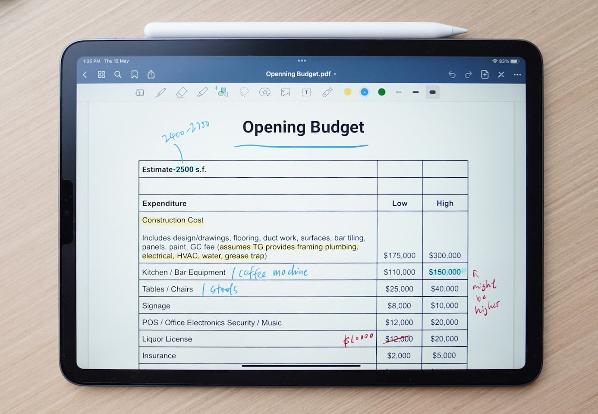

**Avez-vous déjà établi votre budget pour l'année prochaine ?** Si ce n'est pas le cas, il est temps pour la budgétisation : plus vite vous connaîtrez le montant dont vous disposez, plus vous pourrez prendre des mesures précises pour atteindre vos objectifs : Souhaitez-vous embaucher davantage de salariés ou envisagez-vous une campagne publicitaire importante ? Peu importe ce que vous avez en tête, cet article vous fournira des conseils précieux pour la planification budgétaire.

L'article suivant traite de la **planification budgétaire dans les entreprises** et de la meilleure façon de l'aborder. Pour les **ménages privés**, nous recommandons un [livre de budget]().

## Qu'est-ce que la budgétisation ?

La budgétisation - également connue sous le nom de planification budgétaire ou d'allocation budgétaire - est, comme son nom l'indique, **l'allocation des budgets et la planification des ressources**. Par définition, la planification budgétaire est effectuée pour l'avenir, généralement pour l'année financière suivante. Vous pouvez d'une part déterminer le budget pour l'ensemble de l'entreprise et d'autre part effectuer une **budgétisation détaillée pour des départements spécifiques ou des projets individuels**. Le budget prévisionnel qui en résulte détermine où l'argent disponible dans l'entreprise doit aller et quels objectifs vous souhaitez atteindre avec lui et sur quelle période de temps.

## Avantages de la planification budgétaire prospective

- **Allocation budgétaire sensible** : La planification budgétaire vous aide à allouer de manière sensible l'argent et les ressources aux départements et aux projets et à les utiliser spécifiquement là où ils apporteront le plus grand bénéfice possible.

- **Cibles de liaison** : Avec un plan budgétaire contraignant, vous pouvez vous assurer que vos managers formulent des objectifs clairs et prennent des mesures efficaces pour les atteindre.  

- **Transparence financière** : L'établissement d'un budget permet de savoir clairement sur quoi vous dépensez votre argent. Vous pouvez garder un œil sur les coûts et les objectifs, mesurer le succès et anticiper les évolutions indésirables.

- **Investissements prioritaires** : La liste des souhaits dans les départements est souvent longue. Un budget fixe vous aide à prioriser les investissements essentiels et à éviter les dépenses inutiles.

## La budgétisation va de pair avec la planification financière

**La budgétisation opérationnelle** fait partie de la planification financière à court terme, dans laquelle vous estimez vos revenus et dépenses futurs pour l'année à venir. Vous utilisez les données de l'exercice en cours et/ou de l'exercice précédent pour établir des prévisions pour les évolutions futures. Contrairement à la planification financière, la budgétisation se concentre généralement sur les dépenses, indépendamment de l'origine de l'argent.

**La planification budgétaire stratégique** pour les deux à cinq prochaines années est également très courante. Cela vous aide à prendre des décisions commerciales à long terme qui permettront à votre entreprise d'aller de l'avant et d'assurer son succès, comme par exemple l'ouverture de nouveaux sites. Cependant, plus l'horizon de planification est lointain, plus il est difficile et incertain de faire des prévisions précises.

{{< warning headline="Astuce" text="Comme vous avez besoin d'un budget prévisionnel pour chaque année financière, il est préférable de créer un modèle que vous pourrez utiliser à plusieurs reprises. Initialement, un simple tableau peut être suffisant pour une vue d'ensemble, mais à long terme, il est judicieux d'utiliser une base de données avec plus de fonctionnalités pour votre budgétisation. Vous pouvez en savoir plus à ce sujet [ci-dessous](#un-exemple-de-la-façon-dont-vous-pouvez-mettre-en-œuvre-la-planification-budgétaire)." />}}

## Le processus de budgétisation - comment planifier votre budget

Quelle est la meilleure façon d'aborder la budgétisation ? Bien qu'il n'y ait pas de solution unique, vous pouvez suivre quelques étapes et procédures de budgétisation qui sont devenues courantes dans de nombreuses entreprises. Toutefois, les points suivants supposent qu'un budget initial a déjà été établi ou qu'il est possible de comparer les chiffres des années précédentes.

- Examinez s'il y a des changements significatifs dans vos chiffres financiers clés (par exemple, le chiffre d'affaires, le bénéfice, les coûts) par rapport à la période de référence précédente.
- Sur cette base, prévoyez l'évolution future du budget disponible pour l'ensemble de l'entreprise.
- Il est maintenant temps d'allouer le budget : coordonnez les sous-budgets avec les différents départements en utilisant les procédures suivantes.

### Quelles sont les méthodes de budgétisation ?

Il existe trois procédures ou méthodes de budgétisation qui se sont avérées particulièrement efficaces :

- **De haut en bas** : La direction détermine le budget global ainsi que la répartition du budget et les chefs de service/projets planifient ensuite les mesures qu'ils peuvent mettre en œuvre avec ce budget.

- **Du bas vers le haut** : Ici, les chefs de service/projet déterminent eux-mêmes le budget dont ils ont besoin pour leurs tâches et transmettent la planification budgétaire aux décideurs. Ils ajoutent les sous-budgets, les comparent au budget total et déterminent ce qui est approuvé.

- **Procédure de counterflow** : Ici, vous combinez l'approche descendante et ascendante. La direction fixe des objectifs, mais n'entre pas dans les détails concernant le budget. Les chefs de service/projet développent ensuite des mesures appropriées et précisent les dépenses prévues. Enfin, le niveau de gestion doit réviser le budget et l'aligner sur le budget global.

## Problèmes possibles avec la planification budgétaire

Comme tous les processus d'entreprise, la budgétisation peut se dérouler plus ou moins souplement. Vous devez être conscient de quelques blocages, même s'il est impossible de se préparer à toutes les éventualités.

Les problèmes suivants peuvent survenir :

- En fonction de la **complexité de la structure de l'entreprise** (par exemple, les filiales, les sites, les niveaux organisationnels), la budgétisation détaillée peut rapidement devenir confuse.
- La budgétisation requiert généralement un **dépense de temps** et mobilise des capacités de personnel qui ne sont pas disponibles pour le travail productif.
- Aujourd'hui, les **évolutions économiques** sont si rapides et difficiles à prévoir qu'un budget bien planifié à l'avance ne tient que rarement compte des circonstances réelles.
- Les **objectifs budgétaires stricts** limitent la marge de manœuvre des départements en cas de hausse des coûts (par exemple en cas d'augmentation inattendue des prix).
- Il peut également conduire à la stagnation de l'entreprise si vous vous orientez trop étroitement vers le **budget des années précédentes** sans repenser et optimiser les processus.
- Last but not least, **des rivalités entre les managers ou des départements entiers** peuvent rendre une planification budgétaire efficace plus difficile et encourager des dépenses inutiles.

## 7 conseils pour une budgétisation réussie

Nous avons rassemblé 7 conseils pour vous aider à surmonter ces défis :

### 1\. Analysez soigneusement les données

À la fin de l'année financière en cours, évaluez les performances de votre entreprise sur la base du dernier budget et **comparez vos prévisions à ce moment-là avec les chiffres réels**. Avez-vous encore de l'argent en réserve ou avez-vous déjà dépassé votre budget ? Les objectifs que vous vous êtes fixés sont-ils encore réalisables ou ont-ils déjà été atteints ?

### 2\. Expliquez les écarts

S'il y a des écarts importants par rapport au budget, vous devez déterminer s'il y a eu des changements **significatifs à l'intérieur ou à l'extérieur de votre entreprise** que vous n'avez pas pu prévoir dans vos prévisions. Dès que vous connaissez les causes, vous pouvez mettre en place des contre-mesures efficaces ou prévoir plus de budget à l'avenir pour atteindre vos objectifs.

### 3\. Fixez des objectifs réalistes

N'augmentez pas les objectifs que vous souhaitez atteindre avec votre budget dans des proportions démesurées. **La planification budgétaire des différents départements doit être réaliste** et correspondre au succès attendu de l'entreprise.

### 4\. Évitez l'inefficacité

**L'argent et les ressources doivent être utilisés de manière aussi efficiente (sans gaspillage) et efficace (pour atteindre les objectifs) que possible**. Cependant, il peut être contre-productif de simplement couper les fonds qu'un service n'a pas utilisés du budget de l'année suivante. Au lieu de récompenser l'utilisation économique des ressources, cela encourage les départements à utiliser le budget de l'année suivante, que les mesures soient utiles ou non.

### 5\. Reconnaître le potentiel de conflit

La taille du budget peut rapidement conduire à une **pensée compétitive ou de statut ("celui qui a le plus de budget est le plus important")** parmi les managers. Par conséquent, assurez-vous de reconnaître les conflits concernant le budget à un stade précoce et de communiquer clairement que tous les services et les projets contribuent à la réussite globale.

### 6\. Demander de la transparence

En particulier dans les luttes de pouvoir internes, les résultats sont souvent glosés ou des objectifs exagérés sont formulés dans le but d'obtenir un meilleur budget. Soyez conscient de cela et **regardez de manière critique ce que les fonds sont nécessaires pour et pourquoi**. En définitive, vous devriez allouer votre budget de manière à ce que votre entreprise atteigne ses objectifs commerciaux.

### 7\. Restez flexible

**La budgétisation spécifique doit rester adaptable**, car elle est en partie basée sur des hypothèses futures qui ne peuvent pas être prédites avec certitude. Si les choses évoluent différemment de ce qui était prévu, vous devez réagir de manière flexible.



## Budgétisation dans les départements individuels

La planification budgétaire pour l'ensemble de l'entreprise est faite à partir des sous-budgets de tous les services. Lors de l'allocation du budget, gardez à l'esprit qu'il y aura inévitablement des déséquilibres : par exemple, le département RH supporte généralement les coûts les plus élevés, mais il fournit également des ressources humaines à tous les autres départements.

Afin de rendre le budget transparent, il est important d'impliquer tous les services dans la planification budgétaire à un stade précoce. Les domaines importants sont la budgétisation du personnel (recrutement, salaires, etc.), la budgétisation du marketing et la budgétisation informatique. Ces services gèrent généralement des budgets importants de leur propre chef et sont indispensables à la planification budgétaire stratégique.

Ci-dessous, nous examinons de plus près la planification budgétaire dans [IT]() et [gestion de projet](). Si vous êtes intéressé par la [planification du personnel]() ou un [plan marketing](), cliquez sur les articles liés pour plus d'informations.

### Planification du budget informatique

Le bon fonctionnement des systèmes informatiques, les processus automatisés et la [gestion des données]() sont d'une importance capitale pour tous les secteurs de l'entreprise. En outre, presque tous les employés ont besoin d'un matériel informatique performant (par ex. ordinateurs portables, téléphones portables d'entreprise) pour pouvoir travailler de manière productive. La planification du budget informatique joue donc un rôle de plus en plus important. En principe, vous pouvez faire une distinction entre ces types de dépenses dans la budgétisation informatique :

- **Dépenses en capital (investissements à fonds perdus)** : Il s'agit d'actifs fixes tels que le matériel et l'infrastructure que vous achetez pour une longue période de temps, par exemple les terminaux, les serveurs, la technologie réseau, les moniteurs, les casques, etc.
- **Dépenses d'exploitation (coûts d'exploitation courants)** : Cela inclut les frais de licence pour toutes les applications logicielles, les systèmes d'exploitation et les outils utilisés (SaaS), mais aussi l'infrastructure louée telle que les serveurs externes et les services en nuage (IaaS), ainsi que les coûts d'Internet et de téléphonie. A cela s'ajoutent des services tels que le conseil informatique, la maintenance et les contrats de support. Si nécessaire, vous pouvez également inclure les coûts de votre propre personnel informatique dans la planification du budget informatique et les retirer de la planification du budget du personnel.
- De plus, tous les **projets** que vous souhaitez mener à bien avec un résultat concret au cours d'une année financière, par exemple l'automatisation d'un processus de gestion, l'introduction d'un nouvel outil ou un test de pénétration, doivent être pris en compte dans le budget informatique.
- Vous devez également inclure les **tâches en cours telles que la formation informatique des nouveaux employés** dans votre budget informatique - parce que le temps c'est de l'argent.

Grâce à la budgétisation informatique, il devient rapidement clair si vous pouvez financer uniquement les éléments essentiels ou des solutions haut de gamme avec votre argent et à quelle vitesse les projets de numérisation et d'automatisation peuvent être mis en œuvre. Incluez une marge dans le budget pour les dépenses imprévues (par exemple, les augmentations de prix, la réparation ou le remplacement d'équipements cassés).

### Planification du budget dans la gestion de projet

Un domaine d'application populaire pour la budgétisation est la gestion de projet. Ici, il vous fournit un aperçu de **ce qui est possible dans un projet**. En fonction des ressources, vous pouvez décider, par exemple, si vous souhaitez engager des prestataires de services externes ou si vous préférez gérer la majorité vous-même.

Surtout si des clients, des investisseurs ou d'autres parties prenantes sont impliqués dans un projet, ils demanderont presque toujours **un budget transparent et réaliste**. Dans ce cas, un budget prévisionnel est essentiel et peut être utilisé pour négocier les ressources financières.

**Le budget doit être établi avant le début du projet**. Il détermine si et dans quelle mesure un projet est réalisable. Le budget révèle les objectifs - les opportunités et les risques deviennent évidents. Vous devez donc commencer à établir un budget le plus tôt possible.

Afin d'être en mesure de calculer de manière réaliste les estimations de coûts, il est utile de passer en revue les projets précédents. **Dans quelle mesure la planification budgétaire a-t-elle bien fonctionné dans les projets précédents et que devriez-vous adapter cette fois-ci ?** La création d'un budget prévisionnel peut prendre du temps, mais elle vous donne l'occasion d'évaluer les anciens projets et d'en améliorer les nouveaux.

## Un exemple de la façon dont vous pouvez mettre en œuvre la planification budgétaire

Jetons un coup d'œil à un exemple de planification budgétaire en pratique. Supposons qu'une entreprise en pleine croissance, employant actuellement environ 15 personnes, souhaite planifier son budget pour 2024. L'entreprise propose des services, ce qui signifie qu'il n'y a pas de coûts de production (par exemple pour les matériaux, les machines, le stockage).



Tout d'abord, la direction **analyse toutes les dépenses et les coûts d'exploitation en 2023** et compare les chiffres avec le plan budgétaire 2023. Si le budget d'un centre de coûts a été dépassé, les managers responsables expliquent pourquoi le budget estimé n'était pas suffisant. Ils **formulent ensuite leurs attentes et leurs objectifs** pour l'année suivante.

Sur la base de ces analyses et de ces objectifs, les managers communiquent le montant qu'ils souhaitent dépenser dans le cadre d'un processus bottom-up. La direction fixe ensuite un **budget global réaliste pour 2024** - et les objectifs à atteindre avec celui-ci.

## Créez vos plans budgétaires avec SeaTable

Beaucoup de gens utilisent des [feuilles de calcul Excel]() pour planifier leur budget, mais celles-ci n'offrent que des fonctionnalités et des options d'affichage limitées. Dans **SeaTable** vous pouvez [vous inscrire gratuitement]() et commencer directement avec le modèle ci-dessus. Vous pouvez regrouper et évaluer tous les centres de coûts, les objectifs, les budgets et les dépenses dans une telle base de données centrale.

Donnez à vos managers la responsabilité du budget et utilisez **SeaTable comme un outil de collaboration** pour travailler sur le budget avec plusieurs départements en même temps. Cela vous permet d'ajuster le plan budgétaire tout au long de l'année, de suivre le **enregistrement des dépenses en temps réel** et d'avoir toujours une vue d'ensemble du budget actuel.

Essayez notre [modèle gratuit de planification budgétaire]() et découvrez d'autres cas d'utilisation intéressants que vous pouvez mettre en œuvre avec SeaTable.
