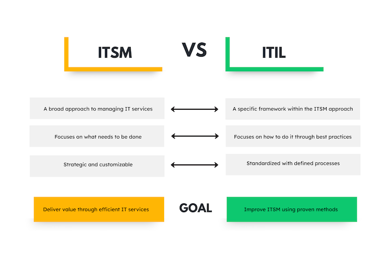

Ein zentraler Server fällt aus, Bestellungen im Onlineshop bleiben liegen oder die Produktion steht still – Situationen wie diese zeigen, wie wichtig ein zuverlässiges Incident Management ist. Denn jede Minute, in der ein System nicht funktioniert, kostet nicht nur Zeit und Geld, sondern auch das Vertrauen Ihrer Kunden.
Mit einem klaren Prozess lassen sich Störungen nicht nur schnell beheben, sondern auch langfristig vermeiden. Doch wie funktioniert Incident Management eigentlich in der Praxis? Welche Schritte sind notwendig, um Ihre Systeme stabil und Ihr Team handlungsfähig zu halten?
In diesem Artikel erfahren Sie, wie Sie Störungen effizient managen, Ausfallzeiten minimieren und Ihre IT-Strukturen widerstandsfähiger machen. Egal ob für kleine Probleme oder große Herausforderungen – wir geben Ihnen hilfreiche Tipps an die Hand, die Ihre Abläufe optimieren und für mehr Sicherheit sorgen.

## Was ist Incident Management?

Incident Management ist ein Prozess, der darauf abzielt, Störungen schnell zu erkennen und effizient zu beheben. Ziel ist es, den normalen Servicebetrieb möglichst rasch wiederherzustellen oder Verzögerungen auf ein Minimum zu reduzieren. Eine Störung wird dann als Incident klassifiziert, wenn sie drei spezifische Merkmale erfüllt: Sie tritt einzeln und unerwartet auf, führt zu einer ungeplanten Unterbrechung und kann zeitnah behoben werden.

## ITIL: Bedeutung in der IT

Die ITIL (Information Technology Infrastructure Library) ist ein international anerkannter Standard für Methoden und Prozesse im **IT-Service-Management** (ITSM). Sie unterstützt Sie dabei, Ihre IT-Dienste optimal auf die Anforderungen Ihrer Kunden und Geschäftsziele abzustimmen. Mit den ITIL Standards verbessern Sie nicht nur die Qualität Ihrer Services, sondern steigern gleichzeitig die Effizienz in Ihrer IT-Abteilung.
Durch die Einführung und Anwendung der ITIL Prozesse lernen Sie, strukturierter vorzugehen, Ihre Ressourcen effizienter zu managen und klare Rollen sowie Verantwortlichkeiten innerhalb Ihrer Organisation zu definieren. Darüber hinaus können Sie mit ITIL Prozessen besser auf unvorhergesehene Ausfallzeiten reagieren und Änderungen ohne Komplikationen implementieren. Dies führt zu einer höheren Stabilität, Flexibilität und Kundenzufriedenheit in Ihrem IT-Betrieb.



## Problem Management vs. Incident Management

Problem Management und Incident Management werden zwar häufig synonym verwendet, doch sie sind lediglich eng miteinander verbunden und unterscheiden sich in einigen wesentlichen Punkten.

Ein Problem ist im Allgemeinen das Resultat mehrerer Vorkommnisse und führt oft zu einem Stillstand im Geschäftsbetrieb, der so lange anhält, bis die zugrunde liegende Ursache behoben ist. Ein Incident hingegen beschreibt ein einzelnes, spontanes Ereignis, das eine ungeplante Unterbrechung verursacht. Incidents lassen sich in der Regel schnell beheben, sodass der Betrieb zeitnah wiederhergestellt werden kann. Diese grundlegende Unterscheidung spiegelt sich auch in den Aufgaben des Problem- und Incident-Managements wider:

* **Problem Management in der IT** konzentriert sich darauf, die grundlegenden Ursachen eines Problems zu identifizieren und dauerhaft zu beheben. Ein zentrales Ziel ist es, durch präzise Analyse und präventive Maßnahmen künftige Wiederholungen derselben Probleme zu verhindern.

* **Incident Management** hingegen zielt auf die schnelle und effiziente Behebung von Störungen ab, um kurzfristige Betriebsunterbrechungen so rasch wie möglich zu minimieren.

Beide Ansätze sind essenziell für ein effektives Service Management, gehen jedoch unterschiedlich vor: Das Problem Management denkt langfristig und strategisch, während das Incident Management auf eine schnelle, operative Reaktion setzt.

## Die Vorteile des Incident Managements

Wer auf zuverlässige IT-Strukturen angewiesen ist, sollte sich mit dem Thema Incident Management auseinandersetzen. Denn ein Systemausfall, der nicht schnell behoben wird, kann weitreichende Konsequenzen haben. Stellen Sie sich vor, der Checkout-Prozess in einem Onlineshop funktioniert nicht oder die Produktion in einem Fertigungsbetrieb steht still. Solche Vorfälle wirken sich nicht nur negativ auf den Umsatz oder den Betrieb aus, sondern auch auf das Vertrauen Ihrer Kunden. Dabei bietet ein gut aufgestelltes Incident Management zahlreiche Vorteile, die weit über die bloße Schadensbegrenzung hinausgehen.

* **Schnelle und gezielte Problemlösung**: Durch einen klar strukturierten Prozess im Incident Management können Sie schnell Störungen identifizieren und beheben, wodurch Ausfallzeiten minimiert werden.
* **Konsistente Servicequalität**: Mit einem einheitlichen Vorgehen stellen Sie sicher, dass alle Mitarbeiter nach denselben Standards arbeiten. Dies gewährleistet eine zuverlässige und konsistente Servicequalität, die Ihre Nutzer jederzeit erwarten können.
* **Fokus auf das Wesentliche**: Durch die Priorisierung kritischer Vorfälle stellen Sie sicher, dass die dringendsten Probleme zuerst bearbeitet werden. So vermeiden Sie, dass weniger wichtige Aufgaben den Fortschritt bei dringenden Störungen blockieren.
* **Langfristige Optimierung**: Die systematische Erfassung und Auswertung von Vorfällen gibt Ihnen wertvolle Einblicke in wiederkehrende Probleme. Diese können Sie so gezielt adressieren und langfristig lösen, wodurch die Effizienz Ihres gesamten Systems stetig verbessert wird.
  

## Die grundlegenden Schritte im Incident Management Prozess

Ob es sich um Cyberangriffe, Systemausfälle oder andere unvorhergesehene Störungen handelt – ein klar strukturiertes Vorfallmanagement minimiert nicht nur den Schaden, sondern sorgt auch dafür, dass die betroffenen Systeme schnellstmöglich wieder in den Normalbetrieb übergehen. Wie genau das passiert, ist in jedem Unternehmen unterschiedlich geregelt, doch ein bewährter Reaktionsplan enthält immer die folgenden fünf Schritte:

1. Identifikation
Ein Incident kann jederzeit und in jeder Phase auftreten – und jedes Ihrer Systeme betreffen. Je früher Sie über einen Incident Bescheid wissen, desto besser können Sie die Auswirkungen minimieren und Gegenmaßnahmen einleiten. Wenn Sie einen Incident feststellen, ist es wichtig, zunächst alle relevanten Informationen zu erfassen. Diese dienen nicht nur der Dokumentation, sondern ermöglichen es Ihnen auch, den Vorfall später korrekt einzuordnen und effizient zu bearbeiten. Achten Sie darauf, die folgenden Daten vollständig zu notieren:

* Name oder ID: Zur eindeutigen Identifikation des Vorfalls.  
* Beschreibung: Was genau ist passiert? Fassen Sie das Problem präzise zusammen.
* Datum und Uhrzeit: Wann wurde der Incident festgestellt?
* Zuständige Person: Wer ist verantwortlich für die Untersuchung oder Lösung?

2. Eingrenzung
Um den Vorfall effektiv zu bewältigen, ist es entscheidend, das volle Ausmaß des Problems zu identifizieren. Nur wenn Sie wissen, wie weitreichend der Vorfall ist, können Sie gezielte Maßnahmen ergreifen. Gleichzeitig ist es unerlässlich, die Situation unter Kontrolle zu bringen, bevor sie sich verschlimmert. Das bedeutet: Sie müssen Vorfälle eingrenzen, um weitere Schäden zu vermeiden.

Hier kommt es oft auf temporäre Workarounds und schnelle Maßnahmen an, die das Problem eindämmen. Beispiele dafür sind das Deaktivieren einer Anwendung, das Einschränken von Berechtigungen oder der Neustart von Servern. In manchen Fällen reicht eine dieser Sofortmaßnahmen sogar aus, um das Problem vollständig zu lösen.

Doch Technik allein ist nicht alles. Gerade in solchen Momenten ist offene Kommunikation mit den Betroffenen unabdingbar. Transparenz schafft Vertrauen, das essenziell ist, um die Situation zu stabilisieren und mögliche Unsicherheiten abzubauen. Ein zuvor gut durchdachter Kommunikationsplan ist hier Gold wert, denn im Eifer des Gefechts sorgt er dafür, dass Sie klare und einheitliche Botschaften übermitteln.

3. Priorisierung
Sobald Sie herausgefunden haben, was hinter dem Incident steckt, können Sie ihm eine Priorität zuweisen. Dies ist ein entscheidender Schritt, denn nicht jeder Vorfall erfordert die gleiche Aufmerksamkeit – und nicht alle Ressourcen können sofort überall eingesetzt werden.

Am besten haben Sie sich bereits im Vorfeld Gedanken darüber gemacht, welche Priorität unterschiedliche Störungen für Ihr Unternehmen haben. Eine solche Vorbereitung ermöglicht es Ihnen, Vorfälle sinnvoll zu vergleichen und gezielt zu handeln. Ein wichtiger Anhaltspunkt dabei: Incident Management konzentriert sich auf die kurzfristigen Folgen. Deshalb sollten Störungen, die direkt starke Auswirkungen haben, stets den Vorrang erhalten.

Darüber hinaus kann es hilfreich sein, den Workload zu berücksichtigen, den eine Störung mit sich bringt. Fragen Sie sich: Können wir diese Belastung momentan bewältigen? Falls nicht, ist es oft sinnvoll, den Incident niedriger zu priorisieren, bis Sie wieder über ausreichend Kapazitäten und Unterstützung verfügen.

3. Reaktion
Sobald Sie die Störung analysiert und die Ursache identifiziert haben, beginnt der nächste entscheidende Schritt. Sie setzen eine langfristige Lösung um, die sicherstellt, dass der Incident vollständig behoben ist. Dabei geht es nicht nur darum, das Problem oberflächlich zu beseitigen. Viel wichtiger ist es, den Vorfall wirklich zu verstehen und die zugrunde liegenden Ursachen gründlich zu analysieren.

Das Ziel ist, die Ursache so zu korrigieren, dass ähnliche Vorfälle in Zukunft ausgeschlossen sind. Statt das System einfach in seinen ursprünglichen Zustand zurückzuversetzen, optimieren Sie es. Es wird besser und sicherer, als es zuvor war. Jeder Vorfall wird dadurch zu einer Gelegenheit, Ihr System weiterzuentwickeln und zu stärken.

4. Abschluss
Die letzte Phase widmet sich der Dokumentation der Störung in einem umfassenden Störungsprotokoll. Damit schaffen Sie eine wertvolle Wissensressource, auf die Sie jederzeit zurückgreifen können – sei es, um Informationen für einen ähnlichen Vorfall in der Zukunft zu nutzen oder um den Fall nachträglich genauer zu analysieren.
Zusätzlich eröffnet Ihnen eine Post-Mortem-Analyse an dieser Stelle die Möglichkeit, den gesamten Prozess der Incident-Bearbeitung noch einmal in Ruhe zu reflektieren. Gemeinsam mit Ihrem Team können Sie besprechen, was gut funktioniert hat, welche Herausforderungen es gab und wie Sie künftig noch effektiver vorgehen können.

### Best Practices für ein effektives Incident Management

Probleme erkennen, Lösungen finden, den Betrieb schnell wieder aufnehmen – in der Theorie klingt das einfach. Doch in der Praxis zeigt sich, dass gerade in kritischen Momenten strukturierte Prozesse und klare Abläufe den entscheidenden Unterschied machen. Unsere Best Practices zeigen Ihnen, wie Sie das Beste aus Ihrem Incident Management herausholen.

* Schnell handeln: Entwickeln Sie Abläufe, um die Störungen so früh wie möglich zu erkennen, idealerweise bevor sie den Betrieb beeinträchtigen. Nutzen Sie wenn möglich ein **Security Incident and Event Management System**, das Sie dabei unterstützt.
* Ordnung und Struktur: Klar definierte Verantwortlichkeiten, ein transparentes Eskalationsmanagement und gut dokumentierte Abläufe verhindern, dass Stress die Oberhand gewinnt – gerade in kritischen Situationen.
* Das Team stärken: Regelmäßige Trainings stellen sicher, dass jeder im Ernstfall weiß, was zu tun ist. Erstellen Sie außerdem eine **Wissensdatenbank**, damit Ihr Team selbstständig auf vergangene Lösungen zurückgreifen kann.
* Automatisierungen nutzen: Warum wertvolle Zeit mit wiederkehrenden Aufgaben verschwenden? Automatisieren Sie, wo es geht – von Benachrichtigungen bis hin zur To-do-Liste. Das spart nicht nur Zeit, sondern reduziert auch menschliche Fehler.
* Kommunikation sicherstellen: Eine zentrale Plattform, auf der alle Informationen und Updates gebündelt werden, hält alle Beteiligten auf dem gleichen Stand. Missverständnisse und Informationslücken haben so keine Chance.
* Kontinuierliche Prozessoptimierung: Ein gutes Incident Management ist niemals fertig. Nach jedem Vorfall sollten Sie die Abläufe analysieren und - wo nötig - optimieren. Lernen Sie aus Fehlern und passen Sie sich den wechselnden Gegebenheiten an.
* Das richtige Tool: Ein leistungsstarkes **Incident Management Tool** bietet nicht nur Überblick über alle Vorgänge, sondern hilft Ihnen auch, Prozesse effizient zu steuern und Störungen schneller zu beheben.

### Tool zur Unterstützung Ihres Incident Managements

Die richtige Incident Management Software zu finden, ist keine leichte Aufgabe – der Emergency Management Service Markt bietet schließlich eine ganze Menge Auswahl. Die entscheidende Frage ist: Benötigen Sie eine Software, die exakt auf Incident Management zugeschnitten ist, oder möchten Sie mehr Flexibilität für individuelle Anpassungen? Soll das Tool vielleicht auch andere IT-Prozesse wie ein [Ticketing-System]() oder einen Bugtracker beinhalten? Und nicht zu vergessen: Wie hoch darf das Budget ausfallen? Muss es eine kostenfreie Lösung sein oder gibt es Raum für Investitionen?

Eine solide und flexible Lösung ist die No-Code-Plattform SeaTable. Sie bietet einen vorgefertigten Reaktionsplan als Vorlage, der speziell auf Incident Management ausgerichtet ist. Diese kostenlose Vorlage ist jedoch nur der Anfang – denn dank Baukastenprinzip können Sie alle verfügbaren Vorlagen nach Belieben kombinieren und so eine maßgeschneiderte Lösung entwickeln, die nur die Funktionen enthält, die Sie wirklich brauchen. Keine unnötigen Extras, sondern genau das, was Ihnen bei der täglichen Arbeit hilft. Dadurch müssen Sie sich nicht an starre, vordefinierte Prozesse binden, sondern können Ihre Abläufe kontinuierlich optimieren und flexibel anpassen.

## FAQs zum Incident Management


Ein Incident ist ein einzelnes, unerwartetes Ereignis, das zu einer ungeplanten Unterbrechung führt und kurzfristig behoben werden kann. Ein Problem hingegen ist die Ursache mehrerer Incidents und wird durch tiefere Analysen identifiziert, um langfristige Lösungen zu entwickeln.


In der IT besteht ein Incident Management Process aus fünf Schritten:
1.Identifikation: Das Feststellen und Erfassen von Incidents.
2.Eingrenzung: Maßnahmen, um die Auswirkungen zu minimieren.
3.Priorisierung: Festlegen der Dringlichkeit und Reihenfolge der Bearbeitung.
4.Reaktion: Umsetzen langfristiger Lösungen zur Behebung der Ursache.
5.Abschluss: Dokumentation und Reflexion zur Prozessoptimierung.


ITSM (IT Service Management) ist ein übergeordnetes Konzept, das die Verwaltung von IT-Services umfasst. ITIL (Information Technology Infrastructure Library) ist ein Framework, das bewährte Verfahren und Anleitungen für die praktische Umsetzung von IT Service Management bereitstellt.


Eine Post Mortem Analyse ist eine systematische Nachbesprechung eines Incidents. Sie dient dazu, den Prozess zu reflektieren, Erfolge und Herausforderungen zu identifizieren sowie Optimierungspotenziale für zukünftige Vorfälle herauszuarbeiten.



Wenn Sie SeaTable nutzen möchten, um Ihr Incindent Management effizient aufzusetzen, [registrieren]() Sie sich einfach kostenlos mit Ihrer E-Mail-Adresse.
