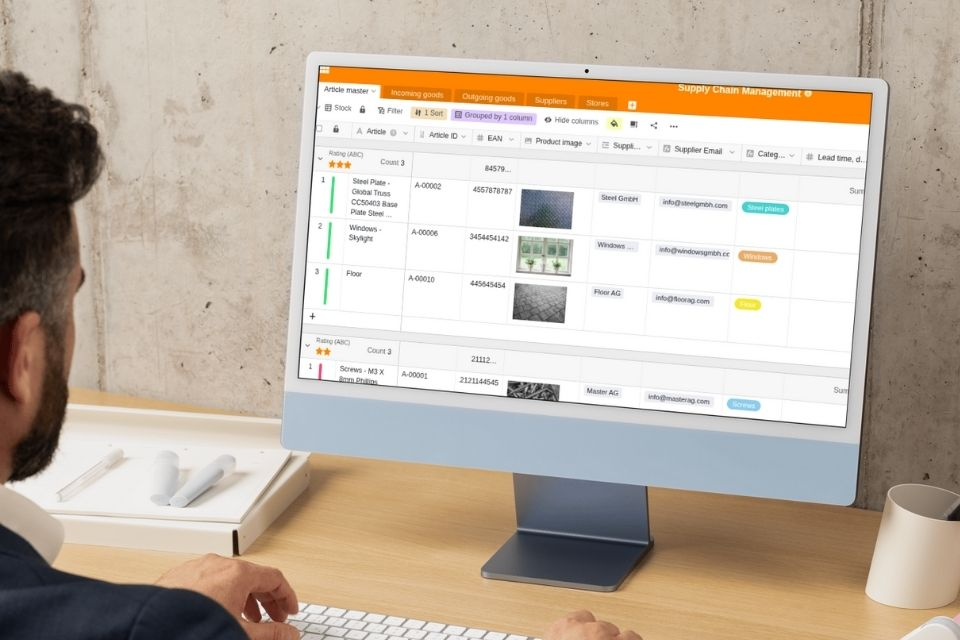

## Supply Chain Management und die Wertschöpfungskette

Die Verzahnung von mehreren Prozessen entlang der Wertschöpfungskette eines Produktes ist sehr komplex. Von der Beschaffung der benötigten Waren über die Produktion und Lagerhaltung bis hin zur Auslieferung an den Kunden müssen Prozesse effizient geplant, dokumentiert und überwacht werden. Nur so können Firmen gewährleisten, dass ihre Produktion nicht stockt und der Kunde sein gewünschtes Produkt zum richtigen Zeitpunkt erhält – nämlich dann, wenn er es braucht. 

Diese Prozesse richtig zu gestalten und zu kontrollieren ist die Aufgabe eines Supply Chain Managers. Und dank moderner Softwarelösungen haben Sie heute ideale Möglichkeiten, um Ihr **Supply Chain Management** (SCM), auf Deutsch auch Lieferkettenmanagement genannt, optimal abzubilden. So haben Sie Ihre gesamte Wertschöpfungskette stets im Griff.

In diesem Blog-Artikel erfahren Sie mehr über das Thema SCM und wie Sie die digitale Transformation nutzen, um Ihre Materialbedarfsplanung, ihre Produktion und ihren Versand zu optimieren.

## Was ist Supply Chain Management überhaupt?

Generell gesprochen dreht sich beim Supply Chain Management alles um die Planung, Steuerung und Integration aller Aktivitäten entlang der Wertschöpfungskette von einem oder mehreren Produkten. Diese startet im Normalfall beim Rohstofflieferanten und endet bei Ihrem Kunden. Ein Supply Chain Manager ist für die integrierte prozessorientierte Planung und Steuerung sämtlicher Waren-, Informations- und Geldflüsse verantwortlich.

1.	**Materialfluss**: Der Materialfluss beschäftigt sich mit der eigentlichen Beförderung der Ware und beinhaltet den Weg vom Rohstofflieferanten über das Zentrallager bis hin zum Endkunden und gegebenenfalls der Rückgabe der Ware.
2.	**Informationsfluss**: Hier werden alle relevanten Informationen über Aufträge und deren Lieferungen übertragen. Das bedeutet, dass alle Informationen, ob von extern (Partner) oder intern (Abteilungen), an einem Ort zentral zusammenfließen. So können z. B. bei Lieferschwierigkeiten schnellere und effizientere Entscheidungen getroffen werden.
3.	**Finanzfluss**: Der Finanzfluss umfasst die Kreditbedingungen, Zahlungspläne, sowie Warensendungen und Eigentumsverhältnisse.

## Was ist der Unterschied zwischen Supply Chain Management und Logistik?

Logistik und Supply Chain Management werden häufig synonym verwendet. Tatsächlich geht SCM jedoch weit über reine Logistikprozesse hinaus und umfasst alle Prozesse entlang der Lieferkette. Die reine Logistik befasst sich demgegenüber primär mit dem physischen Transport und der Lagerung von Waren.

## Die Bedeutung des Supply Chain Managements für Unternehmen

Das Supply Chain Management ist entscheidend für den Erfolg eines Unternehmens. Mit geplanten und durchgeführten Prozessen in [Beschaffung](), Produktion und Vertrieb, einer effizienten Logistik und einer stabilen Lieferkette lassen sich mehrere Ziele erreichen. Dabei geht es immer darum, eine reibungslose Logistik sicherzustellen und Verzögerungen oder Störungen auf ein Minimum zu reduzieren, damit die gesamte Wertschöpfungskette optimal funktionieren kann. 

* **Kosten reduzieren:** Durch eine optimale Ressourcenplanung und verlässliche Lieferanten werden langfristig Kosten gesenkt. Hierzu zählen unter anderem der schnelle Abbau von Beständen, die Senkung von Lagerkosten, die Sicherstellung einer zeitgerechten Lieferung (Just-in-time-Versorgung) und die Verkürzung der Cash-to-Cash-Zyklen.
* **Größere Flexibilität:** Wertschöpfungsketten und Prozesse lassen sich mit einem effizienten Supply Chain Management so gestalten, dass Sie auch kurzfristig auf geänderte Marktbedingungen und Lieferengpässe reagieren können.
* **Kunden- und Lieferantenbindung:** Durch optimierte Prozesse und schnelle Reaktionsfähigkeit werden die Beziehungen zu Kunden und Lieferanten gepflegt und gestärkt. Dadurch erhöhen Sie die Lieferzuverlässigkeit erhöht. 
* **Effizienzsteigerungen:** Workflows und Prozesse werden kontinuierlich überprüft und verbessert.
* **Informationsaustausch:** Zu den Aufgaben im Supply Chain Management gehört auch, für einen reibungslosen Informationsaustausch zu sorgen, damit die beteiligten Mitarbeiter und externen Dienstleister relevante Informationen zeitnah erhalten.

## Die 5 Prozesse der Lieferkette im Supply Chain Management

Üblicherweise müssen Supply Chain Manager in Unternehmen fünf Prozesse im Blick behalten, die verschiedene Abteilungen betreffen. Hierbei geht es um die Planung, die Beschaffung, die Produktion und den Vertrieb sowie die Rücknahme. 

1.	**Planung:** Einen großen Teil nehmen hier die eigentlichen Lieferanten ein. Wichtig ist es, geeignete Lieferanten zu identifizieren und einen flexiblen und vor allem schnellen Beschaffungsprozess zu entwerfen. Dabei steht die eigene Unternehmenspolitik bei der Auswahl der Lieferanten mit im Fokus. Die Produkte und Lieferanten sollten mit den eigenen Qualitätsanforderungen und Werten übereinstimmen.
2.	**Beschaffungsbereich:** Ziel ist es, eine optimale Versorgung des eigenen Unternehmens sicherzustellen. Natürlich sollten Sie hierbei stets wirtschaftlich handeln und die Beschaffungs- und Lagerhaltungskosten so gering wie möglich halten. Ein effizienter und permanenter Materialnachschub und ein optimales Lagerkonzept stehen an erster Stelle.
3.	**Produktionsbereich:** In diesem Bereich werden alle Produktionsprozesse genauestens analysiert und optimiert. Die Ressourcen von Materialien, Fertigungseinrichtungen und Werkzeugen stehen hierbei im Fokus. Verpackungskonzepte oder die Mitarbeiterqualifikation sind auch Bestandteile dieses Bereichs.
4.	**Vertriebsbereich:** Mitarbeiter in diesem Bereich kümmern sich um die benötigten Transportmittel, deren Kapazität und Auslastung und optimierte Transportrouten, um die Gesamtkosten zu senken.
5.	**Rücknahmen:** Kunden, die mit einem Produkt unzufrieden sind oder eine beschädigte Sendung erhalten haben, möchten ihre Lieferung möglichst unkompliziert retournieren können und eine Entschädigung erhalten. Dieser Schritt wird im SCM oft stiefmütterlich behandelt, ist jedoch ungemein wichtig, um die Kundenzufriedenheit und damit die Kundenbindung zu steigern. 

## Supply Chain Management in Echtzeit dank moderner Technologien

Supply Chain Manager können bei ihrer Arbeit enorm von modernen Technologien profitieren. Dank Echtzeitinformationen werden Bestell- und Lieferstatus automatisch aktualisiert. Mittels automatisierter Benachrichtigungen können Sie bei Verzögerungen zeitnah reagieren. Bestandsführung, Bedarfsprognose, die Kommunikation und Zusammenarbeit im Unternehmen oder die Datenanalyse: Es gibt kaum einen Bereich im SCM, in dem durch die digitale Transformation keine neuen Maßstäbe gesetzt werden. Verantwortliche Mitarbeiter werden dadurch schneller und agiler und können effizientere Prozesse entwickeln.

Ein **modernes SCM** basiert auf Systemen, die Datenerfassung, Analyse und Entscheidungsfindung in **Echtzeit** ermöglichen. Dadurch lassen sich belastbare Prognosen erstellen und direkt an veränderte Bedingungen anpassen, so dass Störungen vorhersehbarer werden. Unternehmen können so frühzeitig entsprechende Maßnahmen vorbereiten und einleiten. 

### Supply Chain Management in einer Cloud-Umgebung

Moderne Cloud-Umgebungen ermöglichen ein flexibleres Supply Chain Management. Neben den bereits genannten Vorteilen – Schnelligkeit, Prozessautomatisierung, Echtzeit-Kommunikation – lässt sich das Unternehmenswachstum mit einer Cloud-Lösung problemlos skalieren. Sie aktivieren zusätzliche Ressourcen oder Funktionen erst dann, wenn sie benötigt werden. Unternehmen minimieren damit ihr finanzielles Risiko und reduzieren Kosten. 

Cloud-Lösungen wie die No-Code-Plattform SeaTable bieten indes noch einen weiteren, nicht zu unterschätzenden Vorteil: sie sind keine normierten Lösungen von der Stange. Im Gegenteil können Supply Chain Manager das System an Ihre spezifischen Anforderungen anpassen – entweder von Grund auf neu oder mit einer Supply Chain Management Vorlage als Basis. 

**Das eingebettete Template ist scroll- und klickbar.**




## 5 Tipps für Ihr erfolgreiches Supply Chain Management

Ein effizientes und wirksames Supply Chain Management für Ihr Unternehmen zu entwickeln und zu managen ist zweifellos eine herausfordernde Tätigkeit. Moderne Technologien unterstützen Sie dabei, effiziente Prozesse aufzusetzen und Aufgaben zu automatisieren. Damit Ihr SCM auch wirklich zu optimalen Ergebnissen führt, sollten Sie diese fünf Tipps beachten:

1. **Arbeiten Sie kooperativ:** Wir haben bereits gezeigt, dass ein modernes SCM verschiedene abteilungsübergreifende Bereiche einschließt. Beteiligen Sie alle betroffenen Mitarbeiter an den Prozessen und fördern Sie eine kooperative und kollaborative Arbeitsatmosphäre, um gemeinsam die besten Lösungen zu erarbeiten.  
2. **Kommunizieren Sie regelmäßig:** Teilen Sie relevante Informationen aktiv und offen mit den betroffenen Kollegen und Abteilungen. Dadurch können Sie schneller auf Probleme reagieren und Schwachstellen in Ihren Prozessen erkennen.
3. **Bestimmen Sie Verantwortliche:** Legen Sie von Anfang an klare Verantwortlichkeiten für die einzelnen Prozessschritte innerhalb Ihrer Wertschöpfungskette fest. Viele Schwierigkeiten lassen sich vermeiden, wenn jedem Beteiligten klar ist, wer wann tätig werden oder eine Entscheidung treffen muss.
4. **Optimieren Sie kontinuierlich:** Prozessoptimierung ist eine laufende Aufgabe. Legen Sie dafür einen repetitiven Workflow fest, z. B. den PDCA-Zyklus. Bei diesem kreisförmigen Konzept wiederholen sich die vier Schritte Plan, Do, Check und Act ständig. Dadurch werden Ihre Prozesse immer effizienter und Ihr Unternehmen gewinnt einen Wettbewerbsvorteil
5. **Wählen Sie passende Software:** Kommunikation, Prozessdarstellung, Automatisierung von Aufgaben, Monitoring und Reporting, Lieferantenmanagement – die Liste der Aufgaben, die eine Supply Chain Management Plattform abdecken muss, ist lang. Analysieren Sie daher genau Ihren Bedarf und das Angebot am Markt. Eine oft übersehene Alternative zu SCM-Software oder Work Management Plattformen sind No-Code Lösungen wie SeaTable. Diese ermöglichen es Ihnen, alle Informationen und Prozesse zentral und für alle Beteiligten zugänglich zu speichern und die Struktur Ihren spezifischen Bedürfnissen anzupassen.  

## Starten Sie die Transformation Ihres Supply Chain Managements 

Sie wissen nun, was SCM ist und worauf es bei der Optimierung ankommt. Der entscheidende Schritt bleibt jetzt, die technischen Rahmenbedingungen zu schaffen. SeaTable schafft einen Ort, an dem alle Informationen zusammenlaufen können. Somit schaffen Sie es in nur wenigen Schritten und Klicks Ihr Supply Chain Management effizient abzubilden. Erfassen Sie alle nötigen Informationen, wie z. B. Ihre Lieferanten, eingehende sowie ausgehende Sendungen und Ihr Produktportfolio und behalten Sie Ihr gesamtes Lager im Blick. Arbeiten Sie mit Ihren Kollegen in Echtzeit zusammen, richten Sie Automatisierungen für Benachrichtigungen oder Task-Zuweisungen ein und nutzen Sie Dashboards und Statistiken für datenbasierte Entscheidungen. Registrieren Sie sich ganz einfach kostenlos und testen Sie unsere Supply Chain Management Vorlage.



## FAQ Supply Chain Management


Supply Chain Management umfasst die Planung und das Management aller Aktivitäten, die mit der Beschaffung, der Produktion und dem gesamten Logistik Management verbunden sind. Wichtig ist, dass es auch die Koordinierung und Zusammenarbeit mit den Vertriebspartnern umfasst, bei denen es sich um Lieferanten, Zwischenhändler, Drittdienstleister und Kunden handeln kann. 


Cloudbasierte SCM-Systeme ermöglichen kollaboratives Arbeiten und Informationsaustausch in Echtzeit. Unternehmen können ihre Prozesse in Cloud-Umgebungen besser skalieren, da Funktionen oder zusätzlicher Speicherplatz je nach Bedarf problemlos aktiviert oder deaktiviert werden können. 


In einer Supply Chain Management-Strategie wird zwischen der operativen, der taktischen und der strategischen Ebene unterschieden. Diese unterscheiden sich in ihrer zeitlichen Ausrichtung.
1.	Operatives Supply Chain Management: Alle Entscheidungen sind kurzfristig bzw. innerhalb von Tagen oder wenigen Wochen umsetzbar. Im Normalfall betrifft dies schnell realisierbare Prozesse, wie z.B. die Ablaufplanung, Verladung oder Auftragsverarbeitung. Weiterhin werden auch Beziehungen zwischen Bestellungen und Beständen analysiert. Ziel hierbei ist es, eine möglichst hohe Kundenzufriedenheit zu erzielen, da man sich vor allem mit den Kundenbeziehungen beschäftigt.
2.	Taktisches Supply Chain Management: Alle Entscheidungen sind mittelfristig bzw. zwischen einem Vierteljahr und einem Jahr umsetzbar. Diese betreffen z.B. Entscheidungen im Bezug auf Produktionsmengen, Produktionsressourcen, Bestände, Versandstrategien und Transporte.
3.	Strategisches Supply Chain Management: Hier werden Entscheidungen mit langfristigem Erfolg getroffen. Darunter fallen z.B. die Standortwahl für das eigene Lager, die Produktions- und Lagerkapazitäten, die Investitionen, die Lieferantenauswahl, Make-or-Buy-Entscheidungen und die Vertriebsstrategien.
