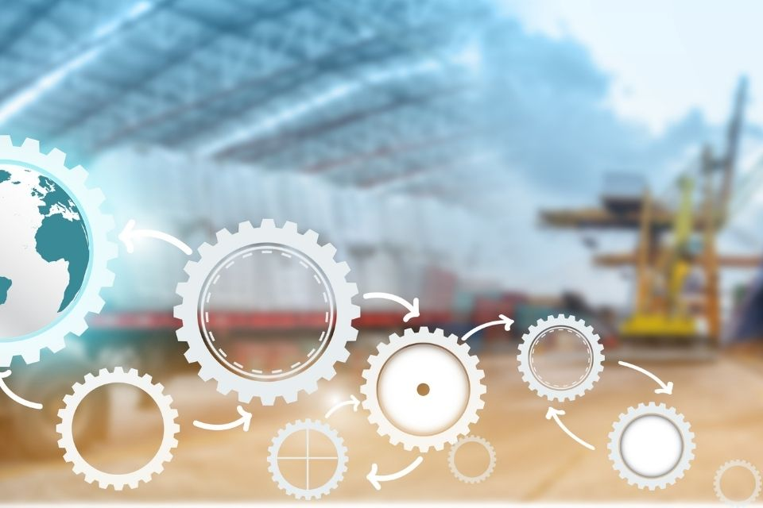

## Управление цепочками поставок и цепочкой создания стоимости

Взаимосвязь нескольких процессов в цепочке создания стоимости продукта очень сложна. Начиная с закупки необходимых товаров, производства, складирования и заканчивая доставкой клиенту, процессы должны быть эффективно спланированы, документированы и контролируемы. Только так компании могут гарантировать, что их производство не остановится и что клиент получит желаемый продукт в нужное время - именно тогда, когда он ему нужен.

Задача менеджера цепочки поставок - правильно разработать и контролировать эти процессы. Благодаря современным программным решениям у вас есть идеальные возможности для оптимального планирования **Управления цепочкой поставок** (SCM). Это означает, что вы всегда держите под контролем всю цепочку создания стоимости.

В этой статье блога вы узнаете больше о SCM и о том, как можно использовать цифровую трансформацию для оптимизации планирования потребностей в материалах, производства и отгрузки.

## Что такое управление цепочками поставок?

Вообще говоря, управление цепочками поставок - это планирование, контроль и интеграция всех видов деятельности на протяжении всей цепочки создания стоимости одного или нескольких продуктов. Обычно все начинается с поставщика сырья и заканчивается клиентом. Менеджер по управлению цепочками поставок отвечает за комплексное, ориентированное на процессы планирование и контроль всех потоков товаров, информации и денег.

1. **Материальный поток**: Материальный поток связан с фактической транспортировкой товара и включает в себя путь от поставщика сырья через центральный склад до конечного потребителя и, при необходимости, возврат товара.
2. **Информационный поток**: Сюда передается вся необходимая информация о заказах и их поставках. Это означает, что вся информация, как внешняя (партнеры), так и внутренняя (отделы), стекается централизованно в одно место. Это позволяет быстрее и эффективнее принимать решения, например, в случае проблем с доставкой.
3. **Финансовый поток**: Финансовый поток включает в себя условия кредитования, планы платежей, а также поставки и владение товарами.

## В чем разница между управлением цепями поставок и логистикой?

Логистика и управление цепями поставок часто используются как взаимозаменяемые понятия. Однако SCM на самом деле выходит далеко за рамки чисто логистических процессов и охватывает все процессы в цепи поставок. Чистая логистика, с другой стороны, в первую очередь занимается физической транспортировкой и хранением товаров.

## Важность управления цепочками поставок для компаний

Управление цепочками поставок имеет решающее значение для успеха компании. Благодаря планированию и выполнению процессов [закупок](), производства и продаж, эффективной логистике и стабильной цепи поставок можно достичь нескольких целей. Цель всегда состоит в том, чтобы обеспечить бесперебойную логистику и свести задержки или сбои к минимуму, чтобы вся цепочка создания стоимости могла функционировать оптимально.

* **Снижение затрат:** Оптимизированное планирование ресурсов и надежные поставщики снижают затраты в долгосрочной перспективе. Это включает в себя быстрое сокращение запасов, снижение затрат на хранение, обеспечение своевременной доставки (поставка "точно в срок") и сокращение циклов "деньги - деньги".
* **Большая гибкость:** Цепочки создания стоимости и процессы могут быть разработаны с учетом эффективного управления цепочками поставок, чтобы вы могли оперативно реагировать на изменение рыночных условий и узкие места в поставках.
* **Лояльность клиентов и поставщиков:** Оптимизированные процессы и способность быстро реагировать поддерживают и укрепляют отношения с клиентами и поставщиками. Это повышает надежность поставок.
* **Повышение эффективности:** Рабочие процессы и процессы постоянно пересматриваются и совершенствуются.
* **Обмен информацией:** В задачи управления цепочками поставок также входит обеспечение бесперебойного обмена информацией, чтобы сотрудники и внешние поставщики услуг оперативно получали необходимую информацию.

## 5 процессов цепи поставок в управлении цепями поставок

Менеджеры по управлению цепочками поставок в компаниях обычно должны следить за пятью процессами, которые затрагивают различные отделы. Это планирование, закупки, производство, распределение и возврат.

1. **Планирование:** Здесь важную роль играют фактические поставщики. Важно найти подходящих поставщиков и разработать гибкий и, главное, быстрый процесс закупок. При выборе поставщиков также следует ориентироваться на корпоративную политику компании. Продукция и поставщики должны соответствовать требованиям к качеству и ценностям компании.
2. **Сфера закупок:** Цель - обеспечить оптимальные поставки для вашей собственной компании. Разумеется, вы всегда должны действовать экономно и поддерживать расходы на закупки и складирование на как можно более низком уровне. Эффективное и постоянное пополнение запасов материалов и оптимальная концепция хранения - вот главные приоритеты.
3. **Производственная область:** В этой области детально анализируются и оптимизируются все производственные процессы. Основное внимание уделяется ресурсам материалов, производственного оборудования и инструментов. Концепции упаковки и квалификация сотрудников также являются частью этой области.
4. **Дистрибуция:** Сотрудники этой области заботятся о необходимых транспортных средствах, их мощности и загрузке, а также об оптимизации транспортных маршрутов с целью снижения общих затрат.
5. **Возврат:** Клиенты, недовольные товаром или получившие поврежденный груз, хотят иметь возможность как можно проще вернуть товар и получить компенсацию. Этот шаг часто игнорируется в SCM, но он чрезвычайно важен для повышения удовлетворенности клиентов и, следовательно, их лояльности.

## Управление цепочками поставок в режиме реального времени благодаря современным технологиям

Менеджеры по управлению цепочками поставок могут извлечь огромную пользу из использования современных технологий в своей работе. Благодаря информации, поступающей в режиме реального времени, статусы заказов и поставок обновляются автоматически. Автоматические уведомления позволяют оперативно реагировать в случае задержек. Управление запасами, прогнозирование спроса, коммуникация и сотрудничество внутри компании или анализ данных: вряд ли найдется область в SCM, где цифровая трансформация не устанавливает новые стандарты. В результате ответственные сотрудники становятся быстрее и проворнее и могут разрабатывать более эффективные процессы.

В основе **современного SCM** лежат системы, позволяющие собирать данные, анализировать их и принимать решения в **реальном времени**. Это позволяет создавать надежные прогнозы и адаптироваться непосредственно к изменяющимся условиям, делая перебои более предсказуемыми. Это позволяет компаниям подготовиться и принять соответствующие меры на ранней стадии.

### Управление цепочками поставок в облачной среде

Современные облачные среды позволяют более гибко управлять цепочками поставок. Помимо уже упомянутых преимуществ - скорости, автоматизации процессов, связи в режиме реального времени - рост компании можно легко масштабировать с помощью облачных решений. Вы активируете дополнительные ресурсы или функции только тогда, когда они необходимы. Таким образом, компании минимизируют свои финансовые риски и сокращают расходы.

Облачные решения, такие как бескодовая платформа SeaTable, обладают еще одним преимуществом, которое не стоит недооценивать: это не стандартизированные, готовые решения. Напротив, менеджеры цепочек поставок могут адаптировать систему к своим специфическим требованиям - либо с нуля, либо взяв за основу шаблон управления цепочками поставок.

**Встроенный шаблон можно прокручивать и нажимать.**




## 5 советов для успешного управления цепочками поставок

Разработка и управление эффективной и действенной цепочкой поставок для вашей компании, несомненно, является сложной задачей. Современные технологии помогают вам наладить эффективные процессы и автоматизировать задачи. Для того чтобы SCM действительно приводило к оптимальным результатам, необходимо следовать этим пяти советам:

1. **Работайте сообща:** Мы уже показали, что современный SCM включает в себя различные межведомственные области. Вовлекайте в процессы всех сотрудников, которых это касается, и поддерживайте атмосферу сотрудничества, чтобы вместе разрабатывать лучшие решения.  
2. **Регулярно общайтесь:** Активно и открыто делитесь необходимой информацией с коллегами и отделами, которых это касается. Это позволит вам быстрее реагировать на проблемы и выявлять слабые места в ваших процессах.
3. **Определите ответственных:** С самого начала определите четкую ответственность за отдельные этапы процесса в вашей цепочке создания стоимости. Многих трудностей можно избежать, если каждый участник процесса знает, кто и когда должен предпринимать действия или принимать решения.
4. **Оптимизируйте непрерывно:** Оптимизация процессов - это постоянная задача. Определите для этого повторяющийся рабочий процесс, например, цикл PDCA. В этой круговой концепции четыре шага "Планируй, делай, проверяй и действуй" постоянно повторяются. Это делает ваши процессы все более эффективными и дает вашей компании конкурентное преимущество
5. **Выберите правильное программное обеспечение:** Коммуникация, визуализация процессов, автоматизация задач, мониторинг и отчетность, управление поставщиками - список задач, которые должна решать платформа управления цепочками поставок, очень велик. Внимательно изучите свои потребности и предложения на рынке. Часто упускаемой из виду альтернативой программному обеспечению SCM или платформам управления работой являются решения без кода, такие как SeaTable. Они позволяют хранить всю информацию и процессы централизованно и доступно для всех участников процесса, а также адаптировать структуру к вашим конкретным потребностям.  

## Начните преобразования в управлении цепочками поставок

Теперь вы знаете, что такое SCM и что важно для его оптимизации. Теперь решающим шагом является создание технической базы. SeaTable создает место, где вся информация может быть собрана воедино. Это позволит вам эффективно составить карту управления цепочкой поставок всего за несколько шагов и кликов. Записывайте всю необходимую информацию, например, о поставщиках, входящих и исходящих поставках, ассортименте продукции, и следите за всем своим складом. Сотрудничайте с коллегами в режиме реального времени, устанавливайте автоматические уведомления или задания, используйте информационные панели и статистику для принятия решений на основе данных. Просто зарегистрируйтесь бесплатно и протестируйте наш шаблон управления цепочками поставок.



## FAQ Управление цепочками поставок


Управление цепочками поставок включает в себя планирование и управление всеми видами деятельности, связанными с закупками, производством и общим управлением логистикой. Важно отметить, что оно также включает в себя координацию и сотрудничество с партнерами по сбыту, которыми могут быть поставщики, посредники, сторонние поставщики услуг и клиенты.


Облачные SCM-системы обеспечивают совместную работу и обмен информацией в режиме реального времени. Компании могут лучше масштабировать свои процессы в облачных средах, поскольку функции или дополнительное пространство для хранения данных можно легко активировать или деактивировать по мере необходимости.


В стратегии управления цепочками поставок различают оперативный, тактический и стратегический уровни. Они различаются по временной ориентации.
1. Оперативное управление цепями поставок: все решения могут быть реализованы в кратчайшие сроки, в течение нескольких дней или недель. Обычно это касается процессов, которые могут быть быстро реализованы, таких как планирование процессов, погрузка или обработка заказов. Также анализируются взаимосвязи между заказами и запасами. Целью здесь является достижение максимально возможного уровня удовлетворенности клиентов, поскольку основное внимание уделяется взаимоотношениям с ними.
2. тактическое управление цепочкой поставок: все решения могут быть реализованы в среднесрочной перспективе или в период от квартала до года. Они касаются, например, решений, касающихся объемов производства, производственных ресурсов, запасов, стратегий отгрузки и транспортировки.
3. стратегическое управление цепочками поставок: здесь принимаются решения, рассчитанные на долгосрочный успех. К ним относятся, например, выбор места для собственного склада компании, производственные и складские мощности, инвестиции, выбор поставщика, решения "делать или покупать" и стратегии продаж.
