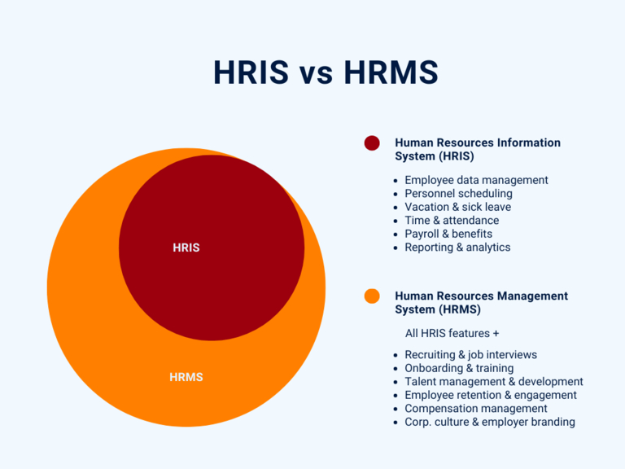

## Что такое HRIS?

**Информационная система управления персоналом (HRIS)** - это программное решение, которое позволяет записывать, хранить и управлять данными о сотрудниках вашей компании. В любом случае HRIS должна охватывать основные функции и процессы, необходимые для бесперебойного управления персоналом. К ним, в частности, относятся:

- управление данными о сотрудниках и их личными делами
- составление расписания и учет рабочего времени
- Заявления на отпуск и больничный лист
- Начисление заработной платы / расчет заработной платы
- Социальное страхование и пособия
- Отчеты и анализ

## Что отличает HRIS от HRMS?

Поскольку программное обеспечение для управления персоналом часто представляет собой классическое решение **все в одном**, различия между системой управления персоналом и HRIS не сразу очевидны. Поэтому эти термины часто ошибочно используются как взаимозаменяемые. Однако HRIS относится только к администрированию существующих сотрудников и основным процессам, необходимым для функционирования компании.

Система **управления персоналом (HRMS)** в этом отношении гораздо шире. Проще говоря, система управления персоналом включает в себя все функции HRIS и даже больше:

- Набор персонала и управление кандидатами
- прием на работу и увольнение
- Удержание сотрудников и их удовлетворенность

Иногда также упоминается управление человеческим капиталом (HCM). Помимо системы управления персоналом / информационной системы, сюда входят другие процессы на стратегическом уровне, такие как

- управление талантами и карьерным ростом
- управление компенсациями
- развитие и обучение персонала

Набор функций программного обеспечения для управления персоналом существенно различается в зависимости от поставщика. Поэтому при выборе программного обеспечения для управления персоналом обратите внимание на то, какие функции вам нужны. В то время как HRIS убеждает простой базой данных сотрудников для повседневных административных процессов, HRMS предлагает более сложные функции для (качественного) планирования персонала.

## Почему HRIS незаменима

По сути, HRIS предлагает вам возможность сделать процессы в вашем отделе кадров более эффективными и принимать решения на основе данных. Ведь отдел кадров - один из самых **административноемких** отделов в любой компании, наряду с бухгалтерией. Поэтому вы не только сталкиваетесь с огромным количеством бюрократии и бумажной работы, но и управляете особенно ценной и **чувствительной информацией** о ваших сотрудниках и соискателях.

HRIS обычно предоставляет сотрудникам доступ к определенным цифровым системам для **учета рабочего времени**, **[планирования отпусков](https://seatable.com/ru/urlaubsplanung/)** и **больничных**. Это означает, что они могут сами вводить свои данные и загружать документы, тем самым разгружая отдел кадров. Вы также можете использовать эту базу данных HR для предоставления сотрудникам расчетных листков, форм для заполнения определенных заявлений, информационных материалов и контрольных списков для конкретных процессов, таких как введение в должность и увольнение, в рамках **самообслуживания сотрудников**.

Современная информационная система управления персоналом может также автоматизировать рабочие процессы, интегрировать обратную связь и агрегировать данные для отчетности. Благодаря синхронизации в режиме реального времени, интуитивно понятным пользовательским интерфейсам и гибким функциям современные HRIS позволяют работать очень эффективно, продуктивно и динамично.

## Как защитить данные с помощью HRIS

Поскольку HRIS содержит конфиденциальную личную информацию, к ней предъявляются высокие требования по безопасности и контролю доступа. Данные обычно хранятся в центральной базе данных **HR**. Кто может получить доступ к тем или иным записям данных, обычно определяется на основе ролей или индивидуальных прав доступа.

### Что такое база данных HR?

База данных HR или база данных персонала - это IT-система для хранения, агрегирования и анализа данных о сотрудниках.

При этом должны быть обеспечены следующие моменты:

- Соответствие всем нормам защиты данных (например, GDPR)
- Конфиденциальность данных о персонале и защита от несанкционированного доступа
- Надежное резервное копирование данных и защита от их потери
- Аутентификация пользователя
- Целостность данных и защита от фальсификации
- Прослеживаемость ввода данных и истории изменений
- Своевременное удаление данных с истекшим сроком хранения

В прошлом программное обеспечение HRIS почти всегда использовалось [on-premises](https://seatable.com/ru/on-premises/), что означает, что оно работало на собственной технической инфраструктуре компании. В настоящее время программное обеспечение для управления персоналом часто размещается в [облаке](https://seatable.com/ru/cloud/). Преимущество такого решения заключается в том, что вы и ваши сотрудники могут получить доступ ко всем данным в любое время и из любого места.

### Самые важные преимущества HRIS с первого взгляда

Информационная система управления персоналом имеет преимущества, которые выходят далеко за рамки возможностей базы данных сотрудников Excel. К ним, по сути, относятся



Центральный доступ и актуальная информация |||

Даже сегодня многие отделы кадров по-прежнему собирают данные о сотрудниках в электронных таблицах Excel или складывают документы в традиционные папки. Однако с помощью HRIS вы можете хранить все необходимые данные о сотрудниках и документы в цифровом виде в центральной базе данных HR. Это дает вам и вашим сотрудникам (с соответствующими полномочиями) доступ к текущему состоянию дел в любое время. Устаревшие списки Excel и хаос данных наконец-то ушли в прошлое! Кроме того, данные хранятся в системе управления персоналом, даже если мобильный телефон или ноутбук компании будет утерян.

---

Минимум усилий благодаря автоматизации |||

В базе данных сотрудников Excel вам приходится вводить все данные вручную или копировать их туда-сюда, в то время как кадровая информационная система автоматически синхронизирует и обновляет данные для всех, как только кто-то из сотрудников вносит изменения. С помощью специально созданных автоматических систем вы можете, например, одним нажатием кнопки утверждать заявки на отпуск или отправлять заболевшему сотруднику готовое письмо с подтверждением, содержащее сообщение "скорейшего выздоровления". Это не только экономит время, но и сокращает количество ошибок в ручных процессах.

---

Снижение затрат |||

Цифровые и автоматизированные процессы позволяют вам и вашим сотрудникам работать быстрее, эффективнее и, что не менее важно, экономичнее, поскольку вы экономите ценное рабочее время, а также расходы на бумагу и печать. Даже если вы ранее передали ведение кадрового учета внешнему поставщику услуг, кадровая информационная система поможет вам сэкономить деньги за счет внутренних процессов. С другой стороны, HRIS, естественно, требует затрат, которые часто состоят из ежемесячной платы за пользование системой для каждого сотрудника. Однако в целом соотношение затрат и результатов должно быть положительным.

---

Идеальный обзор |||

Система управления персоналом предоставляет вам полный обзор данных о сотрудниках. Вы можете компактно хранить все документы и информацию в цифровых файлах персонала. Как правило, имеется полный календарь, чтобы вы и ваши сотрудники всегда были в курсе всех отсутствий, отпусков и больничных листов. Это не менее важно и для составления расписания работы сотрудников. В хорошей системе управления персоналом статистические оценки - это детская забава. С первого взгляда можно ответить на такие вопросы, как: Каков был уровень заболеваемости в октябре? Сколько новых сотрудников было принято на работу и сколько уволилось за последние два года? Каковы ожидаемые расходы на персонал в следующем году?

---

Высокий уровень самоопределения и прозрачности |||

В большинстве случаев у сотрудников есть возможность самостоятельно вести свои данные в HRIS. Позвольте своим сотрудникам самостоятельно управлять как можно большим количеством HR-процессов, например, обновлять свои личные данные, подавать заявления на отпуск или загружать расчетные листки. Это снимает нагрузку с вашего отдела кадров и является беспроигрышной ситуацией для всех участников процесса. База данных HR в смысле внутреннего обзора сотрудников также ведет к большей прозрачности, поскольку все знают, к кому обращаться по тем или иным вопросам. Такой информацией, которая видна всем, может быть, например, точная должность и отдел, предыдущие проекты, профессиональный адрес электронной почты или номер мобильного телефона сотрудника.



## SeaTable как HRIS или HRMS

SeaTable - это некодируемая база данных, которая идеально подходит в качестве программного обеспечения для управления персоналом в облаке или на локальном компьютере. SeaTable предлагает максимальную гибкость и масштабируемость - вы сами решаете, как вы хотите отобразить свои процессы в программном обеспечении и какие функции вам нужны.

Например, вы можете начать с [шаблона справочника сотрудников](https://seatable.io/ru/vorlage/ijapmslssfu7r-6q6x9boq/), который представляет собой базу данных HR в ее простейшей форме.

Это внутренний справочник сотрудников с информацией, которая видна всем в компании. Такой список сотрудников можно использовать для профилей в информационной системе HR или, например, для создания визитных карточек.

Затем вы можете расширить свою базу данных HR дополнительными таблицами и функциями по своему усмотрению. Как насчет интерактивного [учета рабочего времени](https://seatable.io/ru/vorlage/fyp0x2y-s-ut3m-wcbpzbq/), например, для учета всех посещений, отпусков и болезней? Или цифровые файлы персонала, в которых можно найти все сертификаты, резюме и расчетные листки?

В дополнение к функциям HRIS вы можете использовать SeaTable для организации рекрутинга, управления соискателями и приема на работу. Даже развитие и обучение персонала можно организовать в SeaTable. Будучи немецкой HR-базой, SeaTable отвечает самым высоким стандартам защиты данных (GDPR) и надежно хранит все данные в немецких дата-центрах. Поэтому трудно поверить, что это полноценное программное обеспечение для управления персоналом является бесплатным.

[Зарегистрируйтесь сегодня]() и откройте для себя наши бесплатные шаблоны для HR-менеджеров!